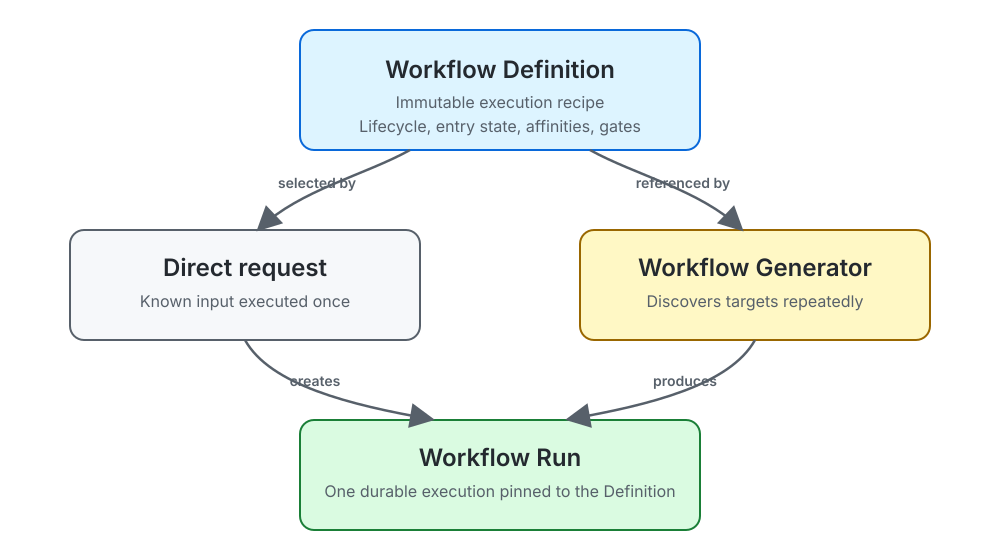

# Workflow Definitions, Runs, and Generators

PilotSwarm separates workflow execution into three resources:



This separation allows an application to reuse the same execution model for
one-off requests and recurring discovery without coupling Run lifecycle state
to a Generator.

## Resource model

### Workflow Definition

A **Workflow Definition** is an immutable, reusable execution recipe. It
contains the configuration that determines how a Run executes, including:

- the lifecycle state graph and entry state;
- repository and compute affinities;
- validation gates;
- guardrails and retry limits.

Publishing a changed recipe creates another Definition. Existing Runs remain
pinned to the Definition from which they were created.

### Workflow Run

A **Workflow Run** is one durable execution of a Definition. A direct Run
request supplies only:

- `workflowDefinitionId`, selecting the immutable recipe;
- `workflowRunKey`, identifying the logical unit of work;
- `input`, containing the target-specific data used by the workflow.

The Run cannot override its Definition's entry state or affinities. This makes
the referenced Definition a complete and auditable description of execution.

Runs retain durable lifecycle state, state attempts, Sessions, waits, external
operations, and an append-only transition journal. A Run exists independently
of whichever producer requested it.

### Workflow Generator

A **Workflow Generator** is an optional recurring producer of Runs. It combines:

- a required `workflowDefinitionId`;
- a discovery source, such as an ADO WIQL provider;
- a cadence;
- owner-scoped mutable registration state.

Each evaluation asks the source for targets. Every discovered target has a
stable source key and input payload. PilotSwarm reconciles that key into a
durable Run rather than creating duplicate executions on every evaluation.

A Generator may be switched to a newer Definition for future discoveries.
Runs already created by the Generator remain pinned to their original
Definition.

## Worked example: triage and fix bugs

Suppose a repository team wants PilotSwarm to find active bugs, investigate
them, prepare fixes, validate the changes, and wait for human approval when
needed.

### The Definition describes how any bug is handled

The team first publishes a `bug-remediation` Workflow Definition:

```text
Workflow type: bug-remediation
Entry state:   Triage
State flow:    Triage -> Reproduce -> ImplementFix -> Validate -> Resolved
                                           |             |
                                           +------> NeedsHuman
Affinity:      repo = sample-service
Guardrails:    bounded state attempts and total steps
```

This Definition does not identify a particular bug. It is the reusable,
immutable recipe for handling any compatible bug in `sample-service`.

### The Generator describes which bugs should start Runs

The team then registers a Workflow Generator that references the Definition:

```text
Name:          Active sample-service bugs
Definition:    <bug-remediation-definition-id>
Cadence:       every 5 minutes
Source:        ADO WIQL
```

For example:

```sql
SELECT
    [System.Id],
    [System.Title],
    [System.State],
    [System.AreaPath],
    [Microsoft.VSTS.Common.Priority],
    [System.ChangedDate]
FROM WorkItems
WHERE
    [System.TeamProject] = @project
    AND [System.WorkItemType] = 'Bug'
    AND [System.State] = 'Active'
    AND [System.AreaPath] UNDER 'Sample Service'
ORDER BY
    [Microsoft.VSTS.Common.Priority] ASC,
    [System.ChangedDate] DESC
```

The project containing the Generator supplies `@project`. The application
should replace `Sample Service` with its actual ADO area path and add any
ownership, severity, or tag filters needed to define eligible work.

On one evaluation, the source might return several eligible bugs:

```json
[
  {
    "key": "ado-bug:8472",
    "input": {
      "workItemId": 8472,
      "title": "Retry loop stops after a transient timeout",
      "repository": "sample-service"
    }
  },
  {
    "key": "ado-bug:8531",
    "input": {
      "workItemId": 8531,
      "title": "Validation status is lost during failover",
      "repository": "sample-service"
    }
  },
  {
    "key": "ado-bug:8610",
    "input": {
      "workItemId": 8610,
      "title": "Cleanup job leaves an expired lease",
      "repository": "sample-service"
    }
  }
]
```

The Generator does not contain the triage or repair process. It only determines
which targets should have Runs and supplies target-specific input.

### Each discovered bug becomes its own Run

The discovery above creates or reconciles three independent Workflow Runs:

```text
bug-remediation + ado-bug:8472 -> Run for retry-loop failure
bug-remediation + ado-bug:8531 -> Run for failover validation
bug-remediation + ado-bug:8610 -> Run for expired-lease cleanup
```

Each Run starts in `Triage` and advances independently through reproduction,
implementation, validation, waits, and terminal completion. One bug can wait
for human input while another is already resolved. If the Generator sees any
of these bugs again five minutes later, its canonical identity resolves to the
same Run instead of starting another repair.

An urgent bug can bypass discovery and use the same Definition through a
direct Run request:

```json
{
  "workflowDefinitionId": "<bug-remediation-definition-id>",
  "workflowRunKey": "ado-bug:9105",
  "input": {
    "workItemId": 9105,
    "title": "Service fails to recover after restart",
    "repository": "sample-service"
  }
}
```

The direct and generated Runs execute identically because both are pinned to
the same Definition. The only difference is who requested the Run.

## Choosing the appropriate resource

| Need | Resource |
| --- | --- |
| Publish or version how work executes | Workflow Definition |
| Execute known input once | Direct Workflow Run |
| Repeatedly discover targets and create one Run per target | Workflow Generator |
| Wake the same continuing Session on a timer | Durable Session schedule |

A Generator is unnecessary when the caller already knows the work to execute.
Create a direct Run instead. Conversely, use a Generator when target discovery
must be repeated and reconciled durably.

## Identity and deduplication

The canonical logical identity of a Run is:

```text
workflowType + workflowRunKey
```

`workflowType` comes from the selected Definition. The caller or Generator
provides `workflowRunKey`.

Examples of useful Run keys include:

```text
request:123
repository:sample-service:change:456
incident:2026-09-23-01
```

Reusing the same canonical identity returns the existing logical Run rather
than producing a duplicate. Producer observations are tracked separately, so
the Run is not owned by a singular Generator.

## Reconciliation semantics

A Generator evaluation is a reconciliation pass, not a command to start every
discovered target again.

For each source result, PilotSwarm:

1. reads the provider's stable source key and input;
2. combines the selected Definition's `workflowType` with that key;
3. finds or creates the Run with that canonical identity;
4. records that the Generator observed the Run during the evaluation;
5. induces work only when the durable Run still requires it.

This provides the following guarantees:

- returning the same target in later evaluations does not create another Run;
- retries and controller restarts reconcile to the same Run;
- duplicate keys within one provider response collapse to one logical target;
- a rediscovered Run does not restart or reset completed lifecycle state;
- changing a Generator's Definition affects newly created Runs, not existing
  Runs already pinned to an earlier Definition;
- a Run remains independently addressable even if its Generator is deleted.

The Generator is therefore a producer and observer of Runs, not their owner.
Run identity and lifecycle remain stable independently of evaluation cycles.

## Basic REST flow

All routes below are relative to `/api/v1`.

### 1. Publish a Definition

```http
POST /workflow-definitions
Content-Type: application/json

{
  "workflowType": "delivery-review",
  "name": "Delivery review",
  "definition": {
    "workflowDefinition": {
      "lifecycle": {
        "initialState": "WorkPrepared"
      }
    },
    "affinities": {
      "repo": "sample-service"
    },
    "validationGates": [],
    "guardrails": {}
  }
}
```

Save the returned `workflowDefinitionId`.

### 2a. Create one direct Run

```http
POST /workflow-runs
Content-Type: application/json

{
  "workflowDefinitionId": "<definition-id>",
  "workflowRunKey": "request:123",
  "input": {
    "requestId": 123
  }
}
```

The Run inherits its lifecycle and placement configuration from the
Definition.

### 2b. Or register a Generator

```http
POST /workflow-generators
Content-Type: application/json

{
  "name": "Delivery requests",
  "workflowDefinitionId": "<definition-id>",
  "cadenceSeconds": 300,
  "source": {
    "type": "ado_wiql",
    "config": {
      "wiql": "SELECT [System.Id] FROM WorkItems WHERE [System.State] = 'Active'"
    }
  }
}
```

The Generator creates Runs using the same Definition contract as direct
creation.

### 3. Find Runs

List recent shared Runs:

```http
GET /workflow-runs
```

Look up a Run by canonical identity:

```http
GET /workflow-runs?workflowType=delivery-review&workflowRunKey=request%3A123
```

Get one Run and its durable history:

```http
GET /workflow-runs/{workflowRunId}
GET /workflow-runs/{workflowRunId}/sessions
GET /workflow-runs/{workflowRunId}/state-runs
GET /workflow-runs/{workflowRunId}/waits
GET /workflow-runs/{workflowRunId}/journal
```

List Runs observed from one Generator:

```http
GET /workflow-generators/{workflowGeneratorId}/workflow-runs
```

## Lifecycle and completion

A Run normally progresses through these durable phases:

1. The Run is created and pinned to a Definition.
2. The initial state attempt and Session association are reserved.
3. A worker executes the state-specific Session.
4. The state completes, waits, retries, or transitions to another state.
5. Terminal workflow state is persisted.
6. The Run lifecycle becomes `completed`.

Consumers must require both the expected terminal state and persisted lifecycle
completion:

```text
currentState == expected terminal state
AND lifecycleState == completed
```

Observing only the terminal state can return before the final Session,
journal, and completion records are durably committed.

## Ownership and visibility

- Workflow Generators are owner-scoped because they contain mutable discovery
  configuration and recurring behavior.
- Workflow Definitions are shared with authenticated callers.
- Workflow Runs remain service-owned, but their catalog, details, history, and
  mutations are scoped to the durable execution-affinity requester: the direct
  requester or the originating Generator owner. Resource administrators may
  inspect and manage Runs across requesters.
- Cluster-routed induced execution Sessions are service-owned so they can use
  the shared worker fleet.
- A devbox Definition separately persists a private execution-affinity
  principal (direct requester or Generator owner) for Session routing; this
  does not change the service-owned Workflow Run resource.

Deleting a Generator stops future discovery but does not delete its existing
Runs. Deleting a Run terminates that Run without affecting other Runs
created from the same Definition or Generator.

## Updating an application

To change execution behavior:

1. publish a new immutable Definition;
2. validate it with a direct Run;
3. point the Generator at the new Definition;
4. leave existing Runs pinned to their original Definition.

This provides a clear rollout boundary and preserves the configuration needed
to understand every historical Run.
