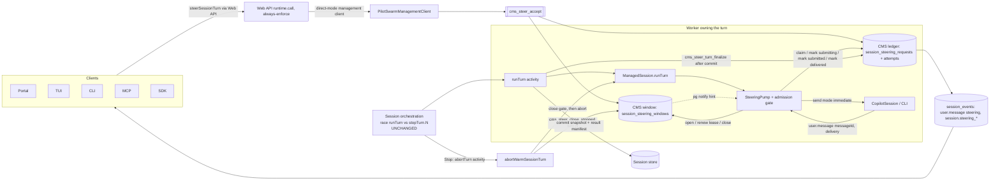

# Proposal: Session steering

**Status:** Proposed (design for review)

**Date:** 2026-10-06

**Tracking issue:** #17 (related: #21 collaborative sessions, #23 message audience, #25 durable signals)

**Baseline:** main ebc8ddf8 (v0.8.2, orchestration 1.0.80)

Steering lets an authorized user send new guidance to a session while its agent is still working on a
turn. The agent receives it at the next safe point, adjusts, and continues; the turn is not stopped.
Code citations are repository paths with line numbers at the baseline commit. Experimental evidence is
cited as "Spike S-x" and summarized in Appendix B. Text marked `[OD-x pending]` follows the team
recommendation for an owner decision listed in §14.3.

## 1. Summary

**Problem.** When a user types while an agent is working, PilotSwarm queues the text for the *next*
turn. The session orchestration cannot see input during a turn: it waits on
`ctx.race(turnTask, stopTask)` for the whole turn (`packages/sdk/src/orchestration/turn.ts:493-494`),
and any other race winner would cancel the turn. The only mid-turn control is Stop, which interrupts the
turn; what the agent keeps from a stopped turn depends on whether its snapshot was saved. Users need to redirect a long turn without stopping it.

**Key fact.** The Copilot CLI already steers. A `send({ mode: "immediate" })` during a run is folded
into the same run at the next model-call boundary, reported as `user.message` with
`delivery: "steering"` and the id that `send()` returned. It cannot interrupt a running tool or a
streaming model call; then it waits, or it is answered after the current reply in the same run
(Spike S-1, S-4, Appendix B). What is missing is a durable path from the user to the worker that owns
the turn.

**Decision.** Deliver steering from inside the running `runTurn` activity (Option C, §5):

1. A new **CMS steering ledger** is the only acceptance authority. One stored-procedure transaction
   records the steer, its author, its target turn and its order. No queued copy is written.
2. A **steering pump** in the running turn, woken by a notification or a nominal 1 s fallback scan (final value from measurement E-1), claims the steer,
   writes a durable "submitting" marker, and hands it to the live session with an immediate send.
3. A steer is **delivered** only when the matching `user.message` arrives. It is **included** in the
   saved conversation only if the turn result that lists it was actually saved (published, or adopted
   from the winning attempt).
4. One **admission gate** in `ManagedSession` closes at the end of the run, at a control-tool turn boundary
   and before every `abort()`. The settlement algorithm that keeps every late send owned is a candidate
   that must pass deterministic integration tests before the feature is enabled.
5. **Version 1 changes no orchestration code.** The Stop race, every yield and every activity name stay
   as they are; frozen histories replay unchanged. If an implementation step must change a replayed
   action, the current handler is frozen and a new version registered first.

**User-facing behaviour.** An explicit **Steer** action appears beside Send and Stop while a steerable
turn runs; Send keeps queuing for the next turn `[OD-A pending]`. Each steer is one transcript row with
honest states: Accepted, Waiting for a safe point, Delivered to current turn, Delivered after the
earlier response, Not delivered — turn ended (with "Send as new message") `[OD-B pending]`, Not
delivered — turn stopped, Delivery uncertain, Withdrawn. Stop still requests prompt interruption and never
waits for the agent to read a steer `[OD-C pending]`. No state claims that the agent understood or obeyed.

**Scope.** Version 1: steering one session's running turn from the portal, TUI, CLI, MCP, Web API and
SDK; durable receipts; Stop interplay; recovery after worker loss with visible redelivery; rollout
behind the flag `sessions.steering`, enabled only when every eligible worker runs the steering build.
**Not in scope:** steering child sessions or native tasks, interrupting a running tool, recalling
delivered text, automatic next-turn delivery of a missed steer, withdrawal after hand-off, and the
issue #17 asynchronous-turn redesign.

**Main risks.** The CLI steering lane is typed experimental and was tested on one provider family
only; the end-of-run settlement algorithm and snapshot-restore behaviour must pass deterministic
integration gates before release (§14).

## 2. Requirements

Every requirement is testable. "Verified by" lists the test IDs: `ST-*` rows in §12a (U unit, I
integration, M multi-worker, C chaos and fault cuts, A Web API/MCP/security, L live model and provider,
P performance) and `UX-*` rows in §12b (real browser). Text marked `[OD-x pending]`
follows the team recommendation until the owner decides (§14).

Terms, states, labels and names are defined once in Appendix C.

### 2.1 Functional requirements

| ID | Requirement | Acceptance condition | Verified by |
|---|---|---|---|
| FR-1 | An authorized caller can submit a steer to the running turn of a session through one contract, exposed by `PilotSwarmManagementClient`, `PilotSwarmSession`, the Web API, MCP, the CLI, the portal and the TUI. | Every surface returns the same receipt shape and the same typed outcomes for the same input. | ST-A01, ST-A05, ST-A06, ST-A07; UX-01, UX-03, UX-17, UX-18 |
| FR-2 | Acceptance is one CMS transaction. It records request id, idempotency key, server-stamped actor, target token, server sequence and bounded text before the call returns. No second, runnable copy of the steer is written anywhere. | A repeated call with the same key and body returns the same receipt. The same key with a different body returns `idempotency_conflict`. No `messages`-queue entry is created by a steer. | ST-A01, ST-A04, ST-C01, ST-C02, ST-I01, ST-I02, ST-L04, ST-U02; UX-01, UX-09, UX-11, UX-24 |
| FR-3 | Each submission carries the target token the caller observed. A token that does not match the open window is refused with `stale_target`. The server never retargets a steer. | A delayed request for turn N cannot reach turn N+1. | ST-A02, ST-C10, ST-I11, ST-M01, ST-M03, ST-M04, ST-U01; UX-08, UX-16 |
| FR-4 | A steer is accepted only while a window for its target is open and its lease is fresh. Otherwise the call returns a typed outcome: `no_active_turn`, `unsupported`, `stale_target`, `rate_limited`, `too_large` or `forbidden`. It never falls back to an ordinary send. | Each outcome is reachable in a test; no outcome creates a queued message. | ST-A01, ST-A02, ST-A07, ST-C10, ST-M04, ST-P02, ST-P03, ST-U01; UX-08, UX-12, UX-13, UX-19, UX-24, UX-25 |
| FR-5 | The worker that runs the turn hands each **eligible** steer, in server order, to the live Copilot session with `send({ mode: "immediate" })`. A steer that is not eligible (withdrawn, turn closed, Stop, revoked access) is closed or retained with the disposition in FR-11 instead. A steer is *delivered* only when the SDK emits `user.message` with the same `messageId`. Delivery kinds: `steering` (next model-call boundary) → "Delivered to current turn"; `queued` (after the current answer, same run) and `idle` (a late send started a run that the same turn owns) → "Delivered after the earlier response". The turn is not aborted. | One PilotSwarm turn, one `runTurn` activity; delivery recorded only from the correlated event, never from `send()` returning. | ST-C02, ST-C04, ST-C05, ST-I05, ST-I06, ST-I07, ST-L01, ST-L03, ST-U05; UX-01, UX-02, UX-22 |
| FR-6 | Steers to one turn reach the model in server-sequence order, as separate user messages. The pump serializes `send()` calls. | Two steers accepted A then B fold A then B; authors stay distinct. | ST-A04, ST-I02, ST-I05, ST-I06, ST-L01, ST-U05; UX-03, UX-09, UX-11 |
| FR-7 | When `ManagedSession.runTurn()` returns, no registered steer `send()` can start or continue SDK work that the turn does not own, and no steer is left inside the Copilot runtime queue. A run started by a late send (`delivery: "idle"`) is owned by the same turn until its `session.idle`, or the warm session is invalidated per session. | Fault tests hold a send unresolved, omit an idle, and discover an `idle` delivery only through history: no registered send starts or continues unowned work after return; late duplicate events are classified without creating ownership or a new turn. | ST-C03, ST-I04, ST-I07, ST-L01, ST-L03, ST-U04, ST-U06, ST-I18; UX-23 |
| FR-8 | A steer that was not handed off before its turn closed is retained as "Not delivered — turn ended". It never runs by itself. The user may press "Send as new message", which performs an ordinary send with a new id. `[OD-B pending]` | No automatic turn follows a closed window; the explicit action creates one ordinary message. | ST-A06, ST-I10, ST-I13, ST-P03, ST-U07; UX-04, UX-05, UX-15 |
| FR-9 | Stop discards all future delivery of the stopped turn's steers. It keeps their delivery history. It never waits for a steer to be read. `[OD-C pending]` | After Stop no steer of that turn is sent or re-sent; delivered rows keep their delivery record; Stop latency is unchanged (NFR-9). | ST-C03, ST-C06, ST-I04, ST-I08, ST-I09, ST-P02, ST-U04; UX-06, UX-07, UX-23, UX-24 |
| FR-10 | A steer can be withdrawn only before the pump claims it, and only by its author or a session manager (owner, or an admin within admin scope). The ledger makes the transition atomic. After claim the result is `not_withdrawable`; another writer gets `forbidden`. | A withdraw that wins prevents any hand-off; a withdraw that loses returns `not_withdrawable` and changes nothing; a different writer is refused. | ST-A03, ST-A07, ST-I03, ST-U03; UX-14, UX-18 |
| FR-11 | Every accepted steer has one current authoritative disposition (D-17 labels). Future eligibility becomes terminal only when the row is closed: withdrawn, Stop, or its target finalized (or a terminal session state). Until then a delivered row of an unfinalized target may still be re-delivered by legitimate same-target recovery (FR-12). Delivery history is append-only; Stop and recovery add facts and never rewrite it. A later positive receipt may correct the historical display (for example unconfirmed → delivered before Stop) without reopening eligibility. | Every accepted id in a fault test has one current disposition and unchanged history; a late positive receipt updates the display but never re-sends a closed row. | ST-A05, ST-A07, ST-C01, ST-C02, ST-C04, ST-C05, ST-C06, ST-C08, ST-C10, ST-C11, ST-I05, ST-I13, ST-M01, ST-M02, ST-U03, ST-U05; UX-02, UX-04, UX-06, UX-07, UX-10, UX-14, UX-20, UX-23, UX-26 |
| FR-12 | When the same logical turn is retried after a worker loss, the new attempt re-claims steers that were orphaned or delivered but not included, and delivers them again, labelled as redelivery. It never re-delivers across turns, after Stop, or after withdraw. A turn that ended with an error result closes its steers; an orchestration retry that reuses the turn index does not reopen them. | Kill-after-delivery-before-commit test shows "Delivered again after recovery"; error-result-then-retry test shows the earlier steers stay "Not delivered — turn ended"; both respect target validation and the Stop and authorization fences. | ST-A04, ST-C04, ST-C07, ST-C08, ST-C10, ST-C11, ST-C12, ST-I11, ST-I12, ST-I13, ST-L03, ST-L04, ST-M01, ST-M02, ST-M03; UX-20 |
| FR-13 | A steer is marked included only from one of two oracles: (a) the manifest of a turn result whose commit published or was adopted from the stored winner, finalized by the current window owner; (b) during same-target recovery, a successful, complete read of the restored conversation (`getEvents()` after `runTurnPreamble`) that shows its SDK id — an integration gate (ST-I12). Warm local state or a raw-CLI resume is never an oracle. A published or adopted result without a manifest means "inclusion unconfirmed"; an unpublished result means "not included". | Superseded, stopped and cancelled-without-publish results never mark inclusion; a stale owner cannot overwrite a winner's inclusion. | ST-C06, ST-C07, ST-C08, ST-C09, ST-I12, ST-L04, ST-M01, ST-M03; UX-07, UX-20 |
| FR-14 | Each steer has one stable transcript row from submission to its final state. Delivery adds a `user.message` event with `data.steering`. A receipt read API returns the same state after reconnect and backward paging. | Live stream, reconnect and paging all show one row with the same state. | ST-A05, ST-A06, ST-A07, ST-C05, ST-U07; UX-04, UX-05, UX-09, UX-10, UX-11, UX-16, UX-20, UX-21, UX-26 |
| FR-15 | Steering is refused when no model turn is running, including during a `wait` or a pending `ask_user` question (answers keep `sendAnswer`). Steering never reaches child sessions or native tasks. | Refusal is `no_active_turn`; children and native tasks receive nothing. | ST-A02, ST-A06, ST-I10, ST-I15, ST-L02, ST-U01; UX-15, UX-22, UX-25 |
| FR-16 | A steer is user-role text. It cannot change the session envelope or configuration (tools, permissions, approvals, model, agent, system prompt, workspace) and cannot escalate any permission. Tools the agent is already allowed to use may be called in response to the guidance, under their normal approval rules. `<system_context>` markers in the text are neutralised. | Adversarial-content tests show no configuration or prompt-layer change and no permission escalation. | ST-A01, ST-A02, ST-A04, ST-C11, ST-L02, ST-U08; UX-12, UX-13, UX-26 |
| FR-17 | The composer offers an explicit Steer action while a steerable turn runs. Send, newline and Stop keys keep today's behaviour. `[OD-A pending]` | Busy-session Send still queues for the next turn. | ST-U07, ST-U10, ST-I01, ST-I16; UX-01, UX-03, UX-16, UX-17, UX-18, UX-25 |
| FR-18 | Every code path that calls the SDK `abort()` first closes the session's steering admission gate. No `send()` happens after that. A wedged session is recovered only by the existing per-session escalation, never by stopping the whole client. | Fault test issues abort and steer in both orders; no wedge, no post-abort send. | ST-C03, ST-C06, ST-I04, ST-I08, ST-I09, ST-I10, ST-L03, ST-M03, ST-U04, ST-U06, ST-I18; UX-06, UX-15, UX-23 |
| FR-19 | Existing `sendMessage`, `cancelPendingMessage` and `stopSessionTurn` behaviour and results are unchanged. | Existing suites pass unmodified. | Existing suites; ST-I01, ST-I09, ST-I10, ST-L04; UX-03, UX-05, UX-17, UX-19, UX-21, UX-25 |

### 2.2 Non-functional requirements

| ID | Requirement | Measurement | Verified by |
|---|---|---|---|
| NFR-1 | Durable acceptance latency is ≤ 500 ms p95 at a named nominal profile. 2 s is a slow-accept diagnostic threshold only. | The test states store and auth path, concurrency, payload size and sample count. | ST-P01, ST-P02 |
| NFR-2 | Hand-off latency (accepted → submitted) is ≤ 2 s p95 on a healthy owning worker. This value is provisional; measurement E-1 sets the final value and the near-end "too late" rate. | Same profile as NFR-1, plus 100 active turns and saturation. | ST-P01, ST-P02, ST-P03 |
| NFR-3 | Latency from hand-off to model uptake is measured and shown, never promised. It equals the time until the current tool batch or model call ends (Spike S-1 D, S-4 C7). | Long-tool and parallel-tool tests show "Waiting for a safe point" until delivery. | ST-I06, ST-L01, ST-P02; UX-01, UX-02, UX-22 |
| NFR-4 | An accepted steer is never silently lost, across worker crash, CLI death, worker restart and continue-as-new. | Fault tests account for every accepted id. | ST-C01, ST-C02, ST-C03, ST-C04, ST-C05, ST-C06, ST-C07, ST-C08, ST-C09, ST-C10, ST-C12, ST-L04, ST-M01, ST-M02, ST-M03, ST-M04, ST-P03; UX-09, UX-10, UX-20 |
| NFR-5 | A steer can reach the model twice only in the windows listed in §9, each shown as redelivery and counted by a metric. | Chaos tests assert the label and the counter. | ST-C04, ST-C07, ST-C08, ST-C09, ST-C12, ST-L02, ST-M01, ST-M02, ST-M03; UX-09, UX-20 |
| NFR-6 | Steering adds no model call solely for pickup, acknowledgement or status. The model's own next call, or a same-run follow-up answer that consumes the steer, is the intended effect, not overhead. Polling and lease renewal run only while a window is `open` or `quiesced`; bounded closure, finalize and receipt reads may run afterwards. Each worker holds at most one notification listener. Cost is measured at idle, 100 active turns and saturation before enablement. | Query counts, connections, CPU and Stop latency are published with the profile. | ST-A05, ST-P01, ST-P02, ST-P03 |
| NFR-7 | Version 1 changes no orchestration yield, action descriptor, activity name, activity tag, activity input shape or replayed control flow; frozen histories replay unchanged. If an implementation step must change any of these, the current handler is frozen and a new version is registered first. | Replay suites for every registered orchestration version pass. | ST-I14, ST-M04 |
| NFR-8 | Steering does not extend the turn wall-clock cap or re-run the provider budget gate mid-turn. The pump's own scans and ledger writes never count as CLI activity for the inactivity watchdog; real CLI events caused by a folded steer may. | A steered turn still ends at the original cap; a turn whose CLI is silent still trips the watchdog while the pump keeps scanning. | ST-I06, ST-I09, ST-I10, ST-I11, ST-I17 |
| NFR-9 | Stop latency and Stop outcomes are unchanged under steering load. | Steer flood plus Stop test against today's baseline. | ST-C03, ST-C06, ST-I09, ST-P02, ST-U06; UX-06, UX-23, UX-24 |
| NFR-10 | Authorization is `session:write` for submission, author-or-manager for withdrawal and `session:read` for receipts. The steering operations always enforce, even when the deployment's ownership authorization runs in audit-only mode; denials are audited. Because existing event and history reads carry steering text and projections, steering is unavailable (`unsupported`, reason `authz_not_enforced`) wherever ownership authorization runs in audit-only mode; generic reads are not changed. The worker re-checks `session:write` before hand-off. The actor is stamped by the server. Size and rate limits apply before acceptance `[OD-G pending]`. Metrics carry no message content and no user or session identifiers. | Denied, revoked, other-writer-withdraw, audit-only-mode and over-limit cases; metric label inspection. | ST-A01, ST-A02, ST-A03, ST-A04, ST-A05, ST-A06, ST-A07, ST-C11, ST-L02, ST-U02, ST-U09; UX-05, UX-11, UX-12, UX-13, UX-24, UX-26 |
| NFR-11 | Core stays provider-neutral. PostgreSQL is the only storage dependency. The feature works in the local instance (`scripts/local-pilotswarm.sh`). | Local-instance walk-through with two dev personas. | ST-A01, ST-L03, ST-L04 (HorizonDB provider); UX-27 (local instance, two personas) |
| NFR-12 | All new data access uses stored procedures, added by a new migration with its `NNNN_diff.md` file. | No inline SQL in the CMS provider for steering. | ST-I02, ST-L04, ST-U09; migration and `NNNN_diff.md` review |
| NFR-13 | Old clients behave as today. Old servers, old workers and disabled flags return `unsupported`. The flag `sessions.steering` is off by default and is enabled only when every eligible worker runs the steering build. | Mixed-version tests. | ST-A02, ST-C10, ST-M04; UX-19 |

### 2.3 Non-goals

- Steering child sessions, native tasks, or other sessions; agents steering other sessions.
- Interrupting a running tool or a streaming model call. Stop remains the way to do that.
- Recalling text the model already received, or undoing an external action.
- Exactly-once delivery to the model. The contract is at-least-once with visible redelivery.
- Withdrawing a steer after hand-off. The SDK gives steering items no stable id (Spike S-2 S2c).
- Automatic next-turn delivery of a missed steer in version 1 `[OD-B pending]`.
- Attachments on steers in version 1.
- Collaborative roles (issue #21), message audience (issue #23) and durable signals (issue #25). The
  request envelope keeps room for them.
- Inferring that the agent understood or obeyed a steer. No "acted on" state exists.

## 3. User experience

Steering sends new guidance to the selected session's current logical turn.
It does not stop that turn, recall an external action, or guarantee that the agent obeys.
The user sees a durable acceptance receipt, then an evidence-based delivery disposition.
This section defines proposed behavior; verified baseline references use `ebc8ddf8`.

### 3.1 Send, Steer, and Stop are different actions

| Action | User intent | Effect |
|---|---|---|
| Send | Add the next input | Preserve the existing PilotSwarm message queue. Busy input waits for a later PilotSwarm turn. |
| Steer current turn | Change the work already underway | Accept guidance for the observed target and deliver at a supported SDK boundary. |
| Stop current turn | Interrupt current work | Use the existing Stop mechanism; do not wait for the agent to read steering text. |
| Withdraw guidance | Prevent handoff of this request | Succeeds only before the worker claims it. It does not recall submitted input. |
| Send as new message | Deliberately reuse retained guidance | Create a new ordinary message; preserve the old receipt and normal queue order. |

Keep ordinary Send and existing newline gestures unchanged.
Add an explicit Steer action beside Send and Stop while the selected session supports it.
Do not make Enter silently switch to steering when a session becomes busy.
Do not make steering a sticky global composer mode. [OD-A pending]

The Steer accessible name is `Steer current turn`.
Its help text is:
`Send guidance at the next supported input boundary. Running actions may still finish.`
While busy, ordinary Send help says `Queue for the next turn`.
That means a PilotSwarm turn, not the CLI's internal queued follow-up within a run.

Verified: ordinary sends use the shared outbox and coalesce synchronous input
(`packages/app/ui/core/src/controller.js:2170-2246,9358-9368`).
The new steering path does not inherit that coalescing.
Each steering request keeps its own identity, author, and server order.

### 3.2 Eligibility, draft ownership, and feedback

Enable Steer only when the server reports a supported, open target window and the viewer
has the required write capability.
The server still validates the captured target at submission time.
A stale enabled button cannot authorize delivery to a newer turn.
The shared controller reads `getSessionSteeringState` on initial load and reconnect.
During the session it consumes `session.steering_window_changed` to update the open/closed
state and `expectedTarget` without a reload or per-row polling loop.
An open-window event does not grant write permission; enablement also requires the viewer's
current effective access. Order window updates by their durable event sequence and target
identity so a delayed old open event cannot re-enable a closed or newer target.
A previously received open event is not proof that its lease is still fresh.
If an authoritative read or submission reports lost freshness, show recovering/unavailable.
Do not fabricate a close event or add per-row polling; acceptance remains server-authoritative.

| Context | Required control behavior |
|---|---|
| Supported active turn with write access | Enable Steer for nonempty supported text; retain Stop. |
| No active input window | Explain No active turn to steer; normal Send stays available where permitted. |
| Pending question | Explain Answer the question; use the existing observed-question answer path. |
| Parked wait | Do not present it as an active model turn; ordinary Send keeps existing wait semantics. |
| Group/container or terminal session | No enabled Steer; do not create a session implicitly. |
| Read-only viewer | No enabled Steer; server rejects a forced write as well. |
| Old server, unsupported worker/provider, or disabled flag | Explain Steering unavailable; do not silently call normal Send. |
| Staged attachments | Explain that steering supports text only; keep text and attachments intact. |

Capture the session and opaque target token when the user invokes Steer.
The request remains bound to that capture across session, dashboard, or panel changes.
An acceptance response for session A must not clear a new draft in session B.
A rejected request restores or retains its text without overwriting newer typing.
Do not send steering text through `sendAnswer`, slash-command interpretation, or system-role framing.

Disable duplicate submission for the same in-flight request, not Stop or unrelated sessions.
If acknowledgement is lost, preserve the client request identity and reconcile it.
A slow response is not proof that acceptance failed.
Do not generate a new identity merely because two seconds elapsed.

### 3.3 Visible states

Internal pump states are not all separate user-facing badges.
In particular, SDK `send()` acknowledgement does not mean delivered or durably saved.
The main label follows the strongest available evidence and future disposition.

| Evidence | Main label | Detail or action |
|---|---|---|
| Local submission, no durable receipt | Sending guidance... | Keep the original identity during retry/reconciliation. |
| Durable acceptance; no handoff evidence | Accepted | Waiting for delivery; offer Withdraw only while permitted. |
| Registered/submitted to SDK; no delivery event | Waiting for a safe point | Current model call or tool batch may need to finish. |
| Correlated SDK delivery is steering | Delivered to current turn | This is delivery, not compliance. |
| Correlated delivery is queued or an owned idle continuation | Delivered after the earlier response | Earlier output was not interrupted. |
| Target ended before invocation | Not delivered — turn ended | Retain text; offer Send as new message and Copy to draft. |
| Stop closed a never-invoked request | Not delivered — turn stopped | Nothing will be resent automatically. |
| Atomic pre-claim withdrawal won | Withdrawn | Retain audit and copy; no delivery occurs through this request. |
| Submission may have happened; no positive delivery evidence | Delivery uncertain | Explain the recovery or terminal reason; do not show success. |
| Stop with uncertain submission | Delivery unconfirmed — turn stopped | Future delivery is suppressed; historical outcome is unresolved. |
| Positive delivery before Stop | Delivered before Stop | Snapshot inclusion is a separate detail, not a recall claim. |

Spike S-1 A-E (Appendix B) demonstrates safe-point delay and queued follow-up.
Spike S-2 S3 (Appendix B) demonstrates abort dropping pending input.
Spike S-4 C1-C8 (Appendix B) demonstrates ID correlation, lost pending input on CLI death,
and whole-batch delay.
These observations do not prove that any model understood or followed an instruction.
The shared selector maps canonical dispositions to these labels:
`accepted`, `delivered_current_turn`, `delivered_after_response`, `delivered_before_stop`,
`not_delivered_turn_ended`, `not_delivered_turn_stopped`, `withdrawn`,
`delivery_unconfirmed`, and `rejected`.
Waiting for a safe point is a display derived from accepted-but-submitting/submitted state,
not a second conflicting durable disposition.
Recovery flags `redelivery_pending`, `delivered_again`, and `recovery_unconfirmed`
modify the display without erasing immutable historical evidence.

Do not derive Answered or Acted on from the next assistant message.
The agent can explain its adjustment in ordinary assistant text.
If guidance arrived too late for an external action, preserve the action evidence and the explanation.
Never display Recalled or imply that Stop undid external effects.

### 3.4 Recovery and historical truth

One steering request has one stable transcript row.
Keep delivery attempts in its details rather than duplicating the original human-authored message.
Historical delivery is immutable; inclusion in the restored conversation is separate evidence.

| Recovery evidence | Main label |
|---|---|
| Earlier delivery exists; same-turn recovery requires redelivery | Delivered earlier — pending redelivery |
| Recovery attempt folds the guidance again | Delivered again after recovery |
| Earlier delivery exists; restored inclusion is not established | Delivered earlier — recovery unconfirmed |
| Stop followed earlier delivery | Delivered before Stop |

Show `Not included in the restored conversation` only when publication/restoration evidence
supports it. Otherwise show `Inclusion unconfirmed`.
Show `Not scheduled for resend` when Stop or terminal retention prevents future delivery.
A cancelled unwind can publish a snapshot; do not infer rollback solely from Stop intent.
An absent delivery event is not proof of non-delivery.

Reconnection, stale detail refreshes, and backward paging must reconstruct the same row,
author, order, and current receipt revision.
Never regress Delivered to Accepted because an older response arrives late.
If a discarded request later gains positive historical delivery evidence, retain its
no-resend disposition while correcting the historical display.

### 3.5 Late guidance and explicit reuse

Default to retaining guidance that never reached the SDK before its target closed.
Do not start another PilotSwarm turn automatically. [OD-B pending]
Explain: `The turn ended before this guidance could be sent.`

The retained row offers `Send as new message`.
This is an explicit ordinary `sendMessage` operation with a new identity.
Pin it to the row's session, reauthorize it, attribute it to the actual resender, and link
its provenance to the old receipt.
Do not overwrite the current draft or rewrite the old receipt as delivered.
Disable that action while its submission is in flight.
Explain: `Adds this text to the message queue; earlier messages stay ahead.`
Do not use `sendAnswer`, even if a question appeared since the steer was accepted.

Also offer `Copy to draft`.
If the draft is nonempty, ask before replacing it or offer an explicit append action.
Cancelling that choice leaves both draft and retained guidance unchanged.
A failed new send keeps the retained text and original disposition visible.

An already-submitted message can cross the CLI's final response boundary and become an owned
follow-up. That case is labelled Delivered after the earlier response.
This difference is real and explained in help; the UI cannot promise an atomic SDK boundary
that the SDK does not provide.

### 3.6 Stop and withdrawal

Stop remains a separate, immediately available action.
It closes admission before abort and uses bounded per-session quiescence; it does not wait
for model uptake. No confirmation modal delays ordinary Stop.
Known never-invoked, uncertain, and historically delivered requests receive different labels.
All target-turn requests lose future automatic delivery after Stop. [OD-C pending]

Stop still affects only the current session turn.
It does not drain ordinary queued prompts, end the session, or recursively stop durable children.
An already-queued ordinary message or existing schedule can run later.
Include that limitation in help; do not describe Stop as pause-all-future-work.

Withdraw is pre-claim only and requires the original author or effective session-management
authority. Another session writer cannot withdraw it. The server is authoritative.
If claim wins, show `This guidance can no longer be withdrawn. Delivery may still be pending.`
Keep the row and delivery evidence.
Do not call positional SDK queue removal or disguise a failed withdrawal as local deletion.
Submitted-message recall is outside v1. [OD-I pending]

### 3.7 Control-tool boundaries are not Stop

At the baseline, durable `wait`, `wait_on_worker`, and `ask_user` record a terminal turn
boundary and let the SDK run finish naturally. They do not call `abort()`.
Verified: `packages/sdk/src/managed-session.ts:1572-1597,1679-1684,1848-1867`.
The steering pump closes new handoff when that boundary is recorded.
Guidance already submitted may still fold and must remain labelled delivered if it does.
Never-invoked guidance is retained as Not delivered — turn ended.
An explicit Send as new message then uses ordinary input/wait-interruption behavior.
Do not convert retained guidance to an answer or silently interrupt the scheduled wait.
This rule concerns an actual recorded boundary, not every short in-turn wait.

### 3.8 Keyboard, accessibility, and host parity

The portal and native TUI share intent, labels, receipt state, and permission checks.
The portal uses focusable controls and accessible descriptions.
Both hosts invoke the same shared command with Ctrl+S only while the prompt is focused.
The portal prevents browser Save only for that focused-prompt gesture, never globally.
The native shortcut ships only after raw-mode tests pass in supported terminal hosts,
including tmux, screen, and Windows terminal paths. [OD-A pending]
Always provide a new focusable Steer action in the prompt action row, with help/status hints.
If a terminal cannot deliver Ctrl+S reliably, the action remains available and its help must
not advertise an unsupported chord. Do not repurpose Enter or Stop as the fallback.
Keep existing pane traversal available; the focused prompt action row must be keyboard
reachable without a mouse and expose Send, Steer, and Stop as distinct actions.
For the native TUI, Tab from the prompt first accepts reference autocomplete when applicable;
otherwise it focuses the action row. Left/Right select its available action and Enter activates.
Tab from that row continues the existing next-pane traversal; Shift+Tab or Escape returns
to the prompt without submitting. Document the extra focus stop with the shortcut change.
The portal uses its native button tab order and preserves textarea autocomplete.

| Existing gesture | Preserved behavior |
|---|---|
| Portal desktop Enter / Send | Ordinary Send; existing modifier/newline behavior stays. |
| Mobile Enter | Newline; explicit touch actions submit. |
| TUI Enter | Ordinary Send or existing queued-batch behavior. |
| TUI Meta/Alt+Enter and Ctrl+J | Newline. |
| TUI Ctrl+X / supported Ctrl+Esc | Stop current turn. |
| Ctrl+S with prompt focus | New explicit Steer; outside the prompt it has no steering behavior. |
| Escape and pending-item navigation | Existing modal/edit/queued-message behavior; no global withdraw-all. |

Verified: native Stop is wired in `packages/app/tui/src/app.js:272-280`; prompt send/newline
handling is at `:837-884,918-924`.
Portal controls are in `packages/app/ui/react/src/web-app.js:9682-9710,9810-9832,9875-9900`.
Update actual host bindings, shared hints, placeholders, modal/help text, startup hints,
`docs/user-guide/keybindings.md`, `.github/copilot-instructions.md`, and the TUI skill together.
This includes the contributor instructions' "Current overlap to preserve" keybinding list.
All labels come from one shared table, including punctuation, across both hosts.

Use text plus icons, not color alone.
Announce disposition changes politely without repeating the full message or stealing focus.
Retain at least 44px touch targets for compact Steer/Send/Stop controls.
Keep Stop visible in mobile, Zen, and MoA while the focused session is running.
Respect paused transcript scroll; follow updates only when the reader is already at the bottom.

### 3.9 Programmatic surfaces

SDK, Web API, MCP, and CLI use the same request and receipt contract in section 6b.
Submission completes at durable acceptance, not at model response.
Readers can inspect the request after reconnect without resubmitting it.
Machine output distinguishes accepted, rejected, uncertain, and terminal disposition.
Human CLI/MCP text gives the same short label as the UI.

Provide explicit expected-target and idempotency fields.
A stale target is refused rather than silently changed.
Unsupported is not permission to invoke Stop or ordinary Send automatically.
No programmatic steering operation upgrades permissions, chooses another model, answers a
question, or steers a child session implicitly.

## 4. High-level design

### 4.1 The idea in one paragraph

The Copilot CLI already supports steering. A `send({ mode: "immediate" })` during a run is folded into
the same run at the next model-call boundary, and the CLI reports it as `user.message` with
`delivery: "steering"` and the same `messageId` that `send()` returned (Spike S-1 A, D; S-4 C1). The
only missing piece is a durable path from the user to the worker that owns the running turn. The
session orchestration cannot be that path: it is parked on `ctx.race(turnTask, stopTask)` for the whole
turn (`packages/sdk/src/orchestration/turn.ts:493-494`), and any race winner cancels the turn. So the
design adds a **CMS steering ledger**. The client writes to the ledger. A **steering pump** inside the
running `runTurn` activity reads the ledger, hands steers to the live session, and records delivery.
The orchestration, the Stop race and every yield stay as they are.

### 4.2 Architecture



The diagram shows the public path. Trusted direct-mode callers (the worker, the Web API server itself)
use the same management client without the Web API hop.

### 4.3 Main data flow

| Step | Actor | What happens | Evidence for the step |
|---|---|---|---|
| 1 | Client | The UI shows Steer only while the session reports a steerable turn. It sends `steerSessionTurn(sessionId, { text, clientRequestId, expectedTarget })`; `expectedTarget` is the opaque target token from `getSessionSteeringState`. | §3 |
| 2 | Web API (`runtime.call()`, always-enforced authorization) → management client in direct mode → `cms_steer_accept` | One transaction: check limits; a matching retry returns its receipt; otherwise check that the window for the token's `(epoch, turnIndex, incarnation)` is `open` with a fresh lease, insert the ledger row with the next server sequence, and record `session.steering_accepted`. Returns a receipt. | D-02, D-13, D-23, D-33 |
| 3 | Pump (worker) | Woken by a `pg_notify` hint or a 1 s scan while the window is open. Claims the next eligible rows of its own target in sequence order. A separate 2 s timer renews the lease. | D-14, D-15, D-23 |
| 4 | Pump | Re-checks the gate after the claim, writes the `submitting` attempt (awaited), re-checks the gate, then calls `send({ mode: "immediate" })` with no await in between. Records the returned `messageId`. | D-11, D-29; Spike S-4 C5b |
| 5 | CLI | Folds the steer at the next model-call boundary (`steering`), or answers it after the current reply in the same run (`queued`). | Spike S-1 A, D, E; S-4 C3, C7 |
| 6 | `cms_steer_mark_delivered` | On the correlated `user.message`, one transaction records the delivery evidence, `session.steering_updated`, and the single `user.message` projection with `data.steering`. | D-03, D-16 |
| 7 | `ManagedSession` | On `session.idle`, closes the gate first. If a late `send()` started a new run (`delivery: "idle"`), owns that run until its idle, or invalidates the warm session at the settle deadline. A registered send with no event is checked by id in `getEvents()`; still absent ⇒ "Delivery uncertain". The window becomes `quiesced`. | D-11; Spike S-4 C4a–C4c |
| 8 | `runTurn` activity | Commits the snapshot as today, then calls `cms_steer_turn_finalize` as the current window owner with the actual outcome: published or adopted manifest ⇒ included; unpublished ⇒ not included. Finalize closes the target: rows never handed off become "Not delivered — turn ended". During same-target recovery, inclusion can also come from a successful, complete read of the restored conversation (gate ST-I12). | D-04, D-21, D-28, D-29 |
| 9 | CMS backstops | If the activity never finalizes, the target is closed by the next turn's window open, by Stop's target-scoped close, or by a terminal session state. A `quiesced` window or a stale lease alone is **not** terminal: the turn may still be commit-pending or redelivered, and a redelivered attempt of the same target re-opens the window and recovers its rows. | D-28, D-29 |

### 4.4 Stop, recovery and failure paths in one view

| Path | What closes admission | What the user sees |
|---|---|---|
| Normal end of run | `session.idle` handler (gate); `runTurn` finalize after the commit (target) | Delivered rows stay; unsent rows: "Not delivered — turn ended", with "Send as new message" `[OD-B pending]` |
| Stop | `abortWarmSessionTurn` closes the gate **before** `abort()`; `abortTurn` calls the target-scoped `cms_steer_close_stopped` | "Delivered before Stop" / "Not delivered — turn stopped" / "Delivery unconfirmed — turn stopped" `[OD-C pending]` |
| `wait`, `wait_on_worker`, `ask_user` | The recorded terminal turn boundary closes the gate for new hand-offs; the run ends naturally (no `abort()`) | Steers already submitted may still fold and stay delivered; never-handed-off rows: "Not delivered — turn ended"; the wait or question is unchanged |
| Worker or CLI dies mid-turn | The lease goes stale; acceptance and claims stop | Rows keep their last state with "recovering". If the same target is re-run, rows are recovered: a steer delivered earlier and missing from the restored conversation shows "Delivered earlier — pending redelivery", then "Delivered again after recovery"; one never delivered is simply sent. If the turn is not re-run, the backstop closes it with the terminal labels. |
| Old worker runs the turn | No window is opened | Steer refused with `unsupported` |

### 4.5 What does not change

| Area | Unchanged behaviour |
|---|---|
| Orchestration | No new yield, activity, activity name, tag or input shape. The `ctx.race(turnTask, stopTask)` Stop design is untouched (D-12). |
| Ordinary input | `sendMessage` still queues for the next turn; `cancelPendingMessage` and outbox semantics stay. |
| Stop | Same API, same outcomes, same fast path and backstop. It gains only the gate-before-abort rule. |
| Turn limits | Wall-clock cap, inactivity watchdog and the provider budget gate apply as today. |

## 5. Options and trade-offs

### 5.1 What the options must solve

The transport must reach the worker that owns a running turn without cancelling useful work
(FR-5). It must persist accepted intent before acknowledgement (FR-2, NFR-4), preserve order
and authorship (FR-6), and distinguish historical delivery from recoverable memory (FR-13).
Stop must remain independent of model uptake (FR-9, FR-18).
Every option still needs a supported model-input boundary.
Moving orchestration control does not create a new SDK delivery capability.

**Verified:** `processPrompt` waits on `ctx.race(turnTask, stopTask)`
(`packages/sdk/src/orchestration/turn.ts:493-499`). Ordinary commands are not drained during
that activity. Dropping the losing turn cancels it.
The current Node binding has no reusable handle for keeping that loser alive.
See Spike S-3 (Appendix B).
**Verified:** immediate input can steer at the next model-call boundary, after the running
tool batch; it cannot interrupt the batch or an ongoing model call.
See Spike S-1 A/D/E (Appendix B) and Spike S-4 C7 (Appendix B).

### 5.2 The five options

| Option | Design | Principal benefit | Principal cost or risk | Decision |
|---|---|---|---|---|
| A. Issue #17 sketch: application-managed asynchronous turns | A short `startTurn` activity launches manager-owned background execution. The orchestration receives control messages, completion notifications, and supervision deadlines. | A general responsive turn-control plane for steering and future signals. | New execution ownership, draining, health expiry, completion outbox, and stale-result reconciliation. Model work outlives the starting activity. Native input and SDK settlement remain necessary. | Viable broader redesign; not required for steering v1. |
| B. Stop then redirect | Abort the active turn using Stop, then submit revised guidance as another turn. A distinct redirect variant might attempt to publish partial state. | Reuses a known interruption path and can stop current model work promptly. | Intentionally discards work and may lose uncommitted model memory. A tool's external action can continue after abort. Publishing partial redirect state needs a separate lifecycle proof. | Not steering. It fails FR-5 and must not be a silent fallback. |
| C. In-activity delivery with a durable ledger | One CMS transaction accepts the steer. The owning `runTurn` activity drains it and sends native immediate input. The same activity owns delivery, settlement, and snapshot inclusion. | Keeps existing durable turn ownership and Stop. No spare control-activity slot or worker-addressed endpoint is required. | New ledger/procedures, admission leases, bounded input pump, write-ahead handoff, and an integration-gated idle/abort state machine. | Selected for v1, subject to implementation gates. |
| D. Retained durable activity handles | Add an upstream duroxide-node handle API. The orchestration receives steering while retaining the original turn activity, then dispatches control to its owner. | Central durable control flow without moving model execution into manager-owned background work. | Not available in the pinned binding. Requires upstream API/replay tests and release. A same-affinity delivery activity still needs worker capacity. | Separate upstream work, not a v1 dependency. `[OD-F pending]` |
| E. In-run follow-up only | Deliver through SDK enqueue mode or an end-of-run hook rather than immediate steering. | Adds guidance after the current answer without a new PilotSwarm turn index. | The original plan runs to completion before guidance is considered. It needs the same worker-reaching channel and durable intent. Hooks add a second input path and do not run on every abort. | A narrower behavior, not the steering requirement. No hook fallback in v1. |

Option A is the strongest alternative when many control features require a responsive
orchestration. It must not recreate distributed ownership with a `running` label alone.
Affinity routes work; it does not establish execution authority.

Option B has a valid explicit user action: Stop, then Send.
It does not undo completed requests or tools.
The existing Stop lifecycle skips snapshot publication for a `stopped` result, while
`cancelled` paths can publish (`packages/sdk/src/session-lifecycle.ts:363-386`).
Those outcomes are not interchangeable.

Option D requires a change in duroxide-node itself.
Re-yielding today's race descriptor schedules new work and drops its loser.
A detached child-orchestration workaround would introduce another turn owner and recovery protocol;
it is not a free replacement for retained activity handles. See Spike S-3 (Appendix B).

Option E demonstrably fails to redirect a multi-step task.
The raw SDK enqueue case ran every planned step before considering the new input.
See Spike S-1 B/C (Appendix B).
An agent-stop hook is capped and does not run on abort.
Tool-result `additionalContext` was not a user message and did not redirect the tested plan.
See Spike S-2 S4a-S4c (Appendix B).

### 5.3 Comparison against the requirements

These are design assessments, not claims that unimplemented options passed tests.
All "can satisfy" entries assume the same authorization and durable-intent requirements.

| Requirement | A: asynchronous | B: Stop/redirect | C: ledger/pump | D: retained handles | E: follow-up |
|---|---|---|---|---|---|
| Preserve active work, FR-5 | Can satisfy. | Fails by design. | Can satisfy using immediate mode. | Can satisfy after upstream support. | Preserves work but does not redirect it. |
| Interrupt the SDK model run, FR-18 | Needs its separate cancel path. | Yes, through Stop. | No, steering itself does not abort. | No, steering itself does not abort. | No. |
| Durable atomic acceptance, FR-2 / NFR-4 | Needs a durable control ledger/outbox. | Ordinary queue helps, but redirect identity is still required. | One authoritative CMS transaction. | Needs durable accepted request state. | Needs durable accepted request state. |
| Ordered distinct authors, FR-6 | Must define one server order. | New-turn queue order only. | Ledger sequence; serialized sends. | Must order controls and acknowledgements. | Ordered follow-up, not active-plan revision. |
| No unowned SDK run, FR-7 / FR-18 | Still needs the SDK settlement fence. | Abort/next-turn sequencing must be proved. | Shared admission/send/abort state machine, integration-gated. | Handles do not remove the SDK idle race. | Hook/queue cleanup still needs settlement. |
| Stop remains independent, FR-9 | Separate cancel protocol and supervision. | Reuses Stop but conflates two user intents. | Existing Stop race and backstop retained. | Separate retained-turn Stop transition required. | Abort bypasses some hooks. |
| Honest memory inclusion, FR-13 | Must tie saved outcome to conversation lineage. | Partial-state commit is additional design work. | Actual published/adopted winner manifest. | Same winning-manifest requirement. | Same winning-manifest requirement. |
| No replay-shape change in v1, NFR-7 | Turn-loop redesign changes replayed actions. | Redirect race/branch changes replayed actions. | Conditional: no changed descriptors, inputs, names, tags, or yields. | New handle/race actions change replayed history. | Delivery itself could stay activity-local; hooks add lifecycle risks. |
| Bounded transport cost, NFR-6 | Notification plus supervision/outbox work. | Additional cancelled/restarted model work. | Optional hint, nominal 1 s scan, bounded shared listeners. | Extra durable control activities and upstream machinery. | Same transport; model considers input only after its answer. |
| Mixed-version safety, NFR-13 | New ownership contract must coexist with old turns. | New redirect handler/version needed. | All eligible workers capable before enablement; lease-fenced window. | Requires binding and handler rollout. | Does not provide a safe immediate-steering downgrade. |
| Available pinned dependencies | No new duroxide primitive, but extensive PilotSwarm work. | Existing Stop exists. | Immediate SDK path verified for the tested provider. | Not available in duroxide-node 0.2.0. | Enqueue/hook behavior exists but is insufficient. |

### 5.4 Why C is selected

The verified SDK boundary fits the existing durable activity lifetime.
The activity already owns the warm `ManagedSession`, turn lock, result, and snapshot commit
(`packages/sdk/src/session-proxy.ts:1583,4496-4577`).
The ledger adds an input channel, not a second executor.
It records a single request identity, order, actor, target, and disposition.

The earlier dual-copy variant is rejected.
Writing an ordinary runnable copy first and then an inbox hint gives concurrent callers two
orders and permits duplicate fallback input after retries.
A bounded "already delivered" cache cannot make that handoff durable.
Default retention makes an automatic next-turn copy both unnecessary and contrary to intent.
Late guidance is retained; only an explicit "Send as new message" performs a new ordinary send.
`[OD-B pending]`

C preserves the current Stop race and requires no orchestration version change **only while**
the replayed action sequence, descriptors, names/tags, input shape, and control flow stay unchanged.
If routing or fencing requires such a change, freeze the current handler and register a new version.
Directory locality is not a substitute for replay compatibility.

The selected transport makes no exactly-once claim about model reasoning or external effects.
Snapshot reconciliation can require visible redelivery to the same recovery-eligible turn.
Unknown outcomes of consequential external tools still require their ordinary idempotency or
reconciliation policy. `[OD-D pending]`

### 5.5 Gates, not optimistic fallbacks

| Gate | Required evidence before enablement |
|---|---|
| Native steering dependency | Exact SDK/CLI pin and real-CLI upgrade regression. `[OD-E pending]` |
| SDK idle/abort settlement | Deterministic real-CLI tests prove that no registered send outlives its owning activity and every abort path fences new sends. |
| Abort ordering | Every actual abort site closes shared admission before SDK `abort()`. Spike S-4 C5b (Appendix B) demonstrates the unsafe reverse order. Running external tools still have separate cancellation semantics. |
| Recoverable inclusion | PilotSwarm-level restore tests prove that `getEvents()` reflects the restored winning conversation, not discarded local state. |
| Input-pump cadence | AC-1 measures acceptance; E-1 separately measures handoff/cadence, storage queries/connections, Stop latency, and near-end too-late rate. Neither proves the other. The nominal 1 s fallback is not measured evidence. |
| Worker/provider capability | Every eligible worker runs the capable build; enable only validated provider combinations. `[OD-J pending]` |

If a gate fails, the feature stays disabled or reports typed unsupported.
Do not silently replace steering with Stop, ordinary Send, hook context, or a new target turn.

## 6. Component design

Section 6a covers the runtime and storage; section 6b covers the clients and user surfaces.

### 6a. Component design: runtime and storage

This section covers the orchestration, the `runTurn` and `abortTurn` activities, `SessionManager`,
`ManagedSession`, the new steering pump and admission gate, the CMS ledger, stored procedures and the
migration. Client surfaces are in §6b. Line numbers refer to the baseline commit of this design
(`ebc8ddf8`).

#### 6a.1 Orchestration — no change in version 1

| Item | Decision |
|---|---|
| Yields, activities, activity names, tags, activity input shape | Unchanged. No new orchestration version is registered (D-12). |
| Stop race | `processPrompt` keeps `ctx.race(turnTask, stopTask)` on `stopTurn.<iteration>` (`packages/sdk/src/orchestration/turn.ts:493-494`). `handleTurnStopped` (`turn.ts:707-779`) is unchanged. |
| Turn result | `runTurn` may return an optional `steering` field. Existing handlers ignore unknown fields: `handleTurnResult` switches on `result.type` only. A replay test for every registered version proves this (NFR-7). |
| Versioning rule | Freeze the current handler and register a new version **only** if a later change alters yields, action descriptors, activity names or tags, activity input shape or replayed control flow. Capability routing of `runTurn` (the D-23 fallback) or an automatic next-turn policy (`[OD-B pending]`) would trigger this rule. |

Why no change is needed: the orchestration consumes nothing about steering. Acceptance, hand-off,
delivery, settlement, inclusion and closure all happen in the activity and in CMS procedures. Stop
already runs the `abortTurn` activity and then `updateCmsState(idle)` (`turn.ts:731-759`); both are
used as steering closure points without touching orchestration code.

#### 6a.2 CMS ledger and window (storage)

Three new tables in the CMS schema, created by the next unused CMS migration (0082 at the baseline),
with a companion `packages/sdk/src/migrations/0082_diff.md`. No earlier migration is edited.

**Target identity.** A steer targets one *window incarnation*: `(session_id, transcript_epoch,
turn_index, incarnation)`, where `incarnation` is the `runTurn` input's `snapshot.turnKey` — a fresh
`ctx.newGuid()` per `processPrompt` dispatch (`orchestration/turn.ts:446`, minted only when `state.blobEnabled`), so a fresh orchestration retry
of the same index gets a new value, while a duroxide redelivery of the same activity keeps it. All of
these are already in the `runTurn` input (`session-proxy.ts:1399-1416`); no orchestration change is
needed. The opaque `expectedTarget` token encodes all four. **A turn without a `snapshot.turnKey` is not
steerable:** the activity opens no window and acceptance returns `unsupported` (reason
`no_turn_identity`). The orchestration mints the key whenever `state.blobEnabled` is set, which ordinary
client-created sessions do (`client.ts:871`), and every worker has a versioned session store by default
(`FilesystemSessionStore` in local mode, `worker.ts:381-385`). A retry-count fallback was rejected: the
connection-closed retry path resets `retryCount` (`orchestration/turn.ts:182-193`), so such a token could
repeat and a stale request could match a different attempt.

**`session_steering_requests`** — one row per accepted steer; the only acceptance authority (D-02).

| Column | Type | Notes |
|---|---|---|
| `request_id` | `TEXT PRIMARY KEY` | Server-generated. |
| `session_id` | `TEXT NOT NULL` | Foreign key to `sessions`, `ON DELETE CASCADE`. |
| `seq` | `BIGINT NOT NULL` | From a dedicated sequence; delivery order (FR-6). |
| `idempotency_key` | `TEXT NOT NULL` | `UNIQUE (session_id, idempotency_key)`. |
| `actor` | `JSONB NOT NULL` | Server-stamped canonical actor; part of the idempotency comparison. |
| `content`, `content_hash` | `TEXT NOT NULL` | Bounded text `[OD-G pending]`; hash used for the idempotency comparison. |
| `transcript_epoch`, `turn_index`, `incarnation` | `NOT NULL` | The target; part of the idempotency comparison. |
| `status` | `TEXT NOT NULL` | Row state (table below). |
| `owner_token` | `TEXT` | Attempt token that currently holds the claim (internal fence). |
| `recovery_check` | `TEXT` | `null`, `pending`, `present`, `absent`, `failed` (D-28). |
| `included`, `included_snapshot_version` | `TEXT`, `INT` | `included`, `not_included`, `unconfirmed` or null (FR-13). |
| `closure_reason` | `TEXT` | `turn_ended`, `stopped`, `withdrawn`. |
| `disposition` | `TEXT NOT NULL` | Current user-facing disposition (D-17). |
| `revision` | `INT NOT NULL` | +1 on every change; clients ignore older revisions. |
| `accepted_at`, `claimed_at`, `settled_at` | `TIMESTAMPTZ` | Metrics (§11). |

**`session_steering_attempts`** — append-only hand-off history (FR-11). One row per `send()` attempt.

| Column | Notes |
|---|---|
| `attempt_id` | Primary key. |
| `request_id` | Foreign key, `ON DELETE CASCADE`. |
| `owner_token`, `turn_key` | The attempt that wrote it. |
| `submitting_at` | Committed **before** `send()` (write-ahead marker, D-29). |
| `sdk_message_id`, `acknowledged_at` | Set when `send()` returns. `UNIQUE (request_id, sdk_message_id)`; repeated SDK events are idempotent. |
| `delivered_at`, `delivery_kind` | From the correlated `user.message`: `steering`, `queued` or `idle`. |
| `outcome` | NULL while the attempt is `submitting` (write-ahead marker written, result unknown; counts as "may have been sent"), then `released` (live process knew it never called `send()`), `acknowledged`, `delivered`, `unconfirmed`. Only the attempt's own outcome cells are filled in later; rows are never deleted or rewritten. |

**`session_steering_windows`** — one row per target; a partial unique index allows at most one non-`closed`
row per session. Closed rows are kept as tombstones, so a closed target can never be reopened.

| Column | Notes |
|---|---|
| `session_id`, `transcript_epoch`, `turn_index`, `incarnation` | Primary key: the target. |
| `owner_token`, `lease_expires_at` | The pump renews the lease every 2 s on its own timer; acceptance and claims require a fresh lease (D-23). |
| `state` | `open` (accepts and claims), `quiesced` (pump settled; no acceptance or claims; rows untouched until the turn's outcome is known), `closed` (terminal tombstone). |
| `closed_reason`, `closed_at` | Diagnostics. |

**Row states and transitions** (D-29). `submitting` is committed **before** the SDK call.

| From | Event | To | Writer |
|---|---|---|---|
| — | Accepted | `pending` | `cms_steer_accept` |
| `pending` | Withdrawn by author or manager | `withdrawn` (terminal) | `cms_steer_withdraw` |
| `pending`, eligible `orphaned` | Claimed by the window owner | `claimed` | `cms_steer_claim` |
| `claimed` | Awaited write-ahead (attempt row inserted) | `submitting` | `cms_steer_mark_submitting` |
| `submitting` | Live pump decides not to call `send()` (gate closed) | `pending` (attempt `released`) | `cms_steer_mark_released` |
| `submitting` | `send()` returned an id | `submitted` | `cms_steer_mark_submitted` |
| `submitting`, `submitted` | Correlated `user.message` | `delivered` | `cms_steer_mark_delivered` |
| `claimed`, `submitting`, `submitted`, `delivered` not included | Same incarnation re-opened by a redelivered activity | `orphaned` | `cms_steer_window_open` |
| non-terminal | Turn outcome known, or Stop | `closed` (terminal) | `cms_steer_turn_finalize`, `cms_steer_close_stopped`, backstops |

`orphaned` rows with an SDK id are re-claimable only after the recovery check records `absent`
(D-28); `present` makes them included without a resend; `failed` keeps them unclaimable.

**Lease expiry has no timer.** It is evaluated where it matters: `cms_steer_accept` and
`cms_steer_claim` refuse a stale lease; `cms_steer_window_open` turns the same incarnation into
recovery or finalizes an older target; a terminal session state (`failed`, `cancelled`, `completed`,
deleted) finalizes whatever is left; receipt reads project a stale window as "recovering". A stale lease
alone is never terminal: the turn may still be commit-pending or about to be redelivered. Until one of
these runs, the UI shows the row's last state with "recovering".

**Terminal disposition** (`cms_steer_turn_finalize` with reason `turn_ended`, or `cms_steer_close_stopped`):

| Row evidence at finalize | `turn_ended` | `stopped` |
|---|---|---|
| No attempt, or only `released` attempts | `not_delivered_turn_ended` | `not_delivered_turn_stopped` |
| An attempt without delivery evidence (`submitting`, `acknowledged`, `unconfirmed`) | `delivery_unconfirmed` | `delivery_unconfirmed` ("Delivery unconfirmed — turn stopped") |
| A delivered attempt | Keeps `delivered_current_turn` / `delivered_after_response` | `delivered_before_stop` |

**Recovery flags are derived, not stored** (the shared SDK mapping module computes them):

| Flag | Derived when |
|---|---|
| `redelivery_pending` | A delivered attempt from an earlier owner exists, `included` is not `included`, `recovery_check = absent`, row not terminal. |
| `delivered_again` | Two or more delivered attempts. |
| `recovery_unconfirmed` | `recovery_check = failed`, or finalized with a delivered attempt and `included` null. |

The write-ahead cut (what is known after a loss):

| Durable state at loss | What is known |
|---|---|
| `pending` or `claimed`, no attempt row | Known never invoked. |
| Attempt with `submitting_at` only | Delivery unconfirmed (the call may have happened). |
| Attempt with an SDK id, no delivery evidence | Delivery unconfirmed; SDK acceptance is not durable (Spike S-4 C8). |
| Delivered attempt, or the id found in restored history | Delivery known; inclusion is a separate fact. |
| Id in a published or adopted manifest | Inclusion known. |

#### 6a.3 Stored procedures

All access goes through these procedures (NFR-12). Each is `CREATE OR REPLACE FUNCTION` in the new
migration and is listed in `0082_diff.md`. Every procedure that changes a request writes the matching
session event in the same transaction through `cms_steer_record_event`: `session.steering_accepted`,
`session.steering_updated` (revision, attempts, eligibility, inclusion; no repeated body) and, from the
window procedures, `session.steering_window_changed { state, expectedTarget | null, reason }` (D-34).
`PgSessionCatalog` (`packages/sdk/src/cms.ts`) gains one method per procedure, mapped next to
`cms_update_session` (`cms.ts:1468`).

| Procedure | Caller | Behaviour |
|---|---|---|
| `cms_steer_accept(p_session_id, p_request_id, p_idem, p_actor, p_content, p_hash, p_epoch, p_turn, p_incarnation, p_limits)` | Management client | Existing key: same actor, hash and target ⇒ return that receipt (even if its window has closed); otherwise `idempotency_conflict`, revealing nothing about another actor's row. New key: take a transaction advisory lock on the canonical actor (so the per-actor rate counts across sessions), then lock the window (fixed lock order: actor, then window); **re-check the key** (a raced retry returns its receipt without being charged); `no_active_turn` if not `open` or lease stale; `stale_target` on any target mismatch; limits ⇒ `rate_limited` / `too_large`; then `INSERT … ON CONFLICT (session_id, idempotency_key) DO NOTHING` and re-read. |
| `cms_steer_window_open(p_session_id, p_epoch, p_turn, p_incarnation, p_owner, p_lease_ms)` | Pump | Refuses if this target's row is `closed` (finalized, stopped or abandoned — tombstones are never reopened) or if the session already has a target with a greater `(epoch, turn_index)` (a late, stale open). Same target non-closed ⇒ recovery: new owner, `open`, non-terminal rows → `orphaned`, rows with an SDK id get `recovery_check = pending`; returns them. Otherwise finalize any other non-closed target (`turn_ended`), then insert this one as `open`. |
| `cms_steer_window_abandon(p_session_id, p_epoch, p_turn, p_incarnation, p_owner)` | Pump settle, when the startup join timed out | Writes this target's row as a `closed` tombstone (reason `abandoned`) if it is absent or still owned by `p_owner`, so a late `openWindow` transaction for it can never commit an open window. |
| `cms_steer_window_renew(p_session_id, p_owner, p_lease_ms)` | Pump lease timer | Extends the lease if the owner matches and the window is `open` or `quiesced`; else `false`. |
| `cms_steer_window_quiesce(p_session_id, p_owner)` | Pump settle | `open` → `quiesced`. Rows untouched. |
| `cms_steer_claim(p_session_id, p_owner, p_limit)` | Pump | Only for the owner of an `open`, lease-fresh window: `pending` rows and `orphaned` rows with `recovery_check` null or `absent` → `claimed`, in `seq` order, `FOR UPDATE SKIP LOCKED`. |
| `cms_steer_record_recovery_check(p_request_id, p_owner, p_result)` | Pump | `present` ⇒ delivered evidence and `included` from restored history; `absent` ⇒ eligible for re-claim; `failed` ⇒ stays unclaimable. |
| `cms_steer_mark_submitting(p_request_id, p_owner)` | Pump | Window `open` and owner match required. Inserts the attempt row with `submitting_at`; returns `attempt_id`. |
| `cms_steer_mark_released(p_attempt_id, p_owner)` | Pump | Attempt `released`; row back to `pending`. |
| `cms_steer_mark_submitted(p_attempt_id, p_owner, p_sdk_message_id)` | Pump | Records the SDK id. |
| `cms_steer_mark_delivered(p_attempt_id, p_sdk_message_id, p_kind)` | Pump | Idempotent on `(request_id, sdk_message_id)`. Writes the delivery evidence **and** the `user.message` projection with `data.steering` in the same transaction (the single projection writer, D-16). A stale owner's evidence is recorded as history only; it never changes eligibility or inclusion. It may still correct the derived historical label of a closed row (for example "Delivery unconfirmed — turn stopped" → "Delivered before Stop"), as FR-11 requires; that correction never reopens the row. |
| `cms_steer_mark_unconfirmed(p_attempt_id, p_owner)` | Pump | Attempt outcome `unconfirmed`. |
| `cms_steer_turn_finalize(p_session_id, p_epoch, p_turn, p_incarnation, p_owner, p_outcome, p_manifest, p_snapshot_version)` | `runTurn` activity, after the commit outcome is known | Fenced: acts only if `p_owner` is the window's current owner (atomic compare under the window lock). `published` / `adopted` ⇒ manifest ids `included`; a published or adopted result without a manifest ⇒ `unconfirmed`; `unpublished` ⇒ `not_included` for this owner's own attempts only. Then terminal close of that target with reason `turn_ended`; window `closed`. A stale owner's call records attempt evidence only: it never closes rows, never changes eligibility and never overwrites a winner's inclusion. Already-closed rows are never reopened. |
| `cms_steer_window_adopt(p_session_id, p_epoch, p_turn, p_incarnation, p_owner)` | `runTurn`, already-committed path only | The commit outcome is known, so the caller may finalize its own target. If this target's window exists, is not `closed`, and no newer target exists: set `owner_token = p_owner`, state `quiesced`, lease expired; return true. Otherwise return false. Never opens admission or claims. |
| `cms_steer_close_stopped(p_session_id, p_turn)` | `abortTurn` | Target-scoped: acts only on rows and a window whose `turn_index = p_turn`; finalizes **all** their non-terminal rows (including `orphaned`, whatever the window state) with reason `stopped`. Never touches another turn's window. |
| `cms_steer_withdraw(p_session_id, p_request_id, p_actor, p_is_manager)` | Management client | Author (same canonical actor) or manager only (D-32): `pending` → `withdrawn`; claimed or later ⇒ `not_withdrawable`. |
| `cms_steer_get`, `cms_steer_list`, `cms_steer_state` | Management client | Receipt reads (FR-14) and steering state with the current `expectedTarget` (`getSessionSteeringState`); stale leases projected as recovering. |
| `cms_steer_stats(…)` | Management client | Aggregates for §11; no content. |
| `cms_steer_record_event(p_session_id, p_event_type, p_ref)` | Other steering procedures only | Inserts the event into `session_events` in the caller's transaction. |

**Durable Stop authority.** The orchestration records `session.turn_stopped { turnIndex }` unconditionally in
`handleTurnStopped`, through a durable activity, after `abortTurn` (`orchestration/turn.ts:740-755`). The
migration extends `cms_record_events` so that inserting that event type also runs
`cms_steer_close_stopped(session_id, turnIndex)` in the same transaction. Stop's terminal closure therefore
rides on the orchestration's own durable write: `abortTurn`'s earlier call is only the fast path, and a
failed fast path no longer leaves suppression to local state.

Backstop on an existing procedure (new `CREATE OR REPLACE` in the same migration): `cms_update_session`
finalizes the current target with reason `turn_ended` **only when the session enters a terminal state**
(`failed`, `cancelled`, `completed`). It does **not** act on `idle`, `waiting`, `input_required` or
`error`: those writes can arrive while the turn is still commit-pending — the mid-turn `waiting` update is
asynchronous (`session-proxy.ts:3866-3872`) — and closing then would strand guidance that a same-activity
recovery must re-deliver. `cms_complete_turn_writeback` is not extended either: it runs before the
snapshot commit (`session-proxy.ts:4405-4440`). Normal progress is closed by finalize, Stop, or the next
turn's `cms_steer_window_open`.

The migration publishes the feature flag `sessions.steering` the way migration 0081 publishes its flag
(`packages/sdk/src/migrations/model-event-logging-flag-0081.ts`) and adds the code-owned definition to
`packages/sdk/src/feature-flags.ts`: `defaultEnabled: false`, `defaultAllowUserOverride: false`, so
users cannot self-enable before every eligible worker runs the steering build (D-23). The optional
wake-up uses `pg_notify` on a channel such as `pilotswarm_steering` with the session id only, raised by
`cms_steer_accept` and `cms_steer_withdraw` (no content, D-14).

#### 6a.4 `ManagedSession` (`packages/sdk/src/managed-session.ts`)

| Change | Detail |
|---|---|
| One state machine | New `SteeringGate` (in `packages/sdk/src/steering-pump.ts`) is the single owner of "may we call `send()`": states `closed` → `open` → `closing` → `closed`. Hand-offs, idle, Stop, every abort and cleanup go through it (D-11, D-27). |
| Pump before the main send | The pump is created and its `user.message` / `session.idle` observers are attached **before** the main `send()` (`:3641`), so the main prompt's own `user.message` (delivery `idle`) cannot be missed even if it arrives before `send()` resolves. The gate opens only after that event, the window open and a re-check that no idle, Stop or terminal boundary happened during those awaits. |
| Idle | The `session.idle` handler (`:3555`) closes the gate synchronously before `resolve()`. |
| Abort funnel (FR-18) | `ManagedSession.abort()` (`:3889-3891`) closes the gate first. The direct `copilotSession.abort()` calls in the inactivity and timeout paths (`:3778`, `:3788`) use the same funnel. `forceSettleTurn` (`:1518`) and `requestStop` (`:1505`) close the gate before anything else. |
| Turn-boundary close | When a control tool records a terminal boundary (`hasTerminalTurnBoundary`, `:640`; actions `:571`) the gate closes for new hand-offs; the pump re-checks this after every await and immediately before `send()`. At the baseline `wait`, `wait_on_worker` and `ask_user` end the run naturally (`acknowledgeTurnBoundary`, `:552-555`), not with `abort()`; steers already submitted may still fold and count as delivered. |
| Reconcile after idle | After `await Promise.race([turnComplete, ...guards])` (`:3659-3663`), before the correction loops: `await pump.reconcileAfterIdle({ guards })`. It waits until every registered send has its correlated event and every run a late send started (`delivery: "idle"`) has ended, raced against the turn guards and a 30 s settle deadline (D-11). Skipped when `stopRequest` is set. |
| Settle and quiescence | In `runTurn()` (`:1458`), after the try/catch around `_runTurnInner` (`:1466-1472`) and before the stop classification (`:1479`): `await pump.settle({ stopping })`. Every registered attempt without positive evidence — including a `send()` that timed out without returning an id (the timeout does not cancel the RPC) — counts as unresolved. If any unresolved attempt could still start or continue a run, the pump quiesces the session before releasing ownership through `SessionManager.quiesceForSteering(sessionId)` on the **lock-held** path (the ordinary `invalidateWarmSession` would wait for the turn lock we hold, `session-manager.ts:3353-3365`). It cancels workspace shells, disconnects only this session's handle and forgets it; it never stops the shared `CopilotClient`. **Whether a successful `disconnect()` actually stops an already-issued send or a running SDK run is not proven** — `disconnect()` is known to leave background tasks running (`managed-session.ts:4000-4006`). That cessation is an enablement gate (ST-I18): delayed send resolution after disconnect, main-run cessation, late events, and an unaffected second session on the same client. If the gate fails, steering stays disabled until an isolated per-session cessation primitive exists upstream (§14 Q-4). Any quiescence failure or timeout throws a connection-closed-class error before the snapshot commit, so the existing connection-closed retry recovers from the stored base (`orchestration/turn.ts:116-222`). Under Stop the failure is counted (`steering_quiesce_failed`) and Stop's own escalation applies. The result gains `steering: { delivered: [...] }` when non-empty; stopped results carry nothing. |
| Corrective sends | The text-tool-call and required-tool re-sends (`:3691`, `:3737`) keep their mode-less `send()`; their ids are never in the pump's map. |
| Framing | `buildSteeringPrompt(row)` in `packages/sdk/src/steering-prompt.ts` adds a fixed user-role preface naming the author and passes the raw text as `displayPrompt`. It never calls `extractPromptSystemContext` and neutralises `<system_context>` markers (FR-16). |

#### 6a.5 Steering pump (`packages/sdk/src/steering-pump.ts`, new)

`ManagedSession` stays storage-agnostic. The pump talks to a `SteeringChannel` that
`session-proxy.ts` implements with the procedures in §6a.3:

```ts
interface SteeringChannel {
  openWindow(): Promise<{ ok: boolean; recovered: SteerRow[] }>;        // cms_steer_window_open
  recordRecoveryCheck(requestId: string, r: "present" | "absent" | "failed"): Promise<void>;
  renew(): Promise<boolean>;                                            // cms_steer_window_renew
  quiesce(): Promise<void>;                                             // cms_steer_window_quiesce
  abandonWindow(): Promise<void>;                                       // cms_steer_window_abandon (startup join timed out)
  claim(limit: number): Promise<SteerRow[]>;                            // cms_steer_claim
  markSubmitting(requestId: string): Promise<{ attemptId: string } | null>;  // must succeed before send()
  markReleased(attemptId: string): Promise<void>;
  markSubmitted(attemptId: string, sdkMessageId: string): Promise<void>;
  markDelivered(attemptId: string, sdkMessageId: string, kind: DeliveryKind): Promise<void>; // also writes the user.message projection
  markUnconfirmed(attemptId: string): Promise<void>;
  onWake(cb: () => void): () => void;                                   // notification hint, optional
}
```

| Parameter | Value | Source |
|---|---|---|
| Scan interval while open | 1 s fallback; a notification wakes it earlier | D-14; final value from E-1 |
| Lease | 10 s, renewed every 2 s on its **own** timer, independent of scans, sends and receipt writes | D-23 |
| Claim batch | ≤ 5 per scan | NFR-6 |
| Unconfirmed sends | ≤ 5; at the cap the pump stops **claiming**, but lease renewal, receipt writes and Stop are unaffected | Bounded CLI queue |
| `send()` | Serialized; each call raced against a 5 s timeout (normal return ≈ 10 ms, Spike S-1). A timeout records the attempt `unconfirmed` and closes the gate | D-15; Spike S-2 S1f |
| Settle deadline | 30 s after the first idle, then per-session invalidation | D-11 |

Rules:

1. Re-check the gate after every awaited call (claim, `markSubmitting`); no `await` between the final
   check and `send()`.
2. Register the attempt locally before the call; bind the returned `sdkMessageId` to it; buffer
   `user.message` events with an unknown id until the binding exists (Spike S-4 C2).
3. Ignore native-child events (`isNativeChildEvent`) in every observer.
4. Deduplicate delivery evidence by `(attemptId, sdkMessageId)`; count a run started by a late send
   once.
5. If the gate closes after `markSubmitting` committed and before `send()`, the live pump calls
   `markReleased`; if the process dies first, the attempt stays `submitting` and closes as unconfirmed.
6. Delivery writes are serialized and awaited with bounded retry; a failure is surfaced (attempt stays
   `acknowledged`, row shows "Delivery uncertain"), never swallowed.

#### 6a.6 `runTurn` activity (`packages/sdk/src/session-proxy.ts`)

| Change | Detail |
|---|---|
| Channel construction | In `runTurnHandler`, supply `opts.steering` only when the catalog is present, the flag `sessions.steering` is on for the session owner (feature-flag cache, as `modelEventLoggingEnabled` near `:3797`), the session is not a service session, and the turn is a real model turn. Mint the attempt (owner) token with `crypto.randomUUID()`; the target is `(transcriptEpoch, turnIndex, incarnation)` from the input (§6a.2). |
| Transcript projection | Single writer: `cms_steer_mark_delivered` writes the `user.message` with `data.steering` in the same transaction as the delivery evidence. The generic `onEvent` writer keeps dropping every SDK `user.message` (`EPHEMERAL_TYPES`, `:3810`); no exception is added. |
| Finalize after commit | After `runTurnCommit` (`:4517`): `cms_steer_turn_finalize`, fenced by this activity's owner token, with `published` (own manifest), `adopted` (the **winner's** manifest on the CAS-loser path, `:4558-4572`) or `unpublished`. No commit layout (the `:4516` guard) or no store ⇒ outcome `unknown` ⇒ inclusion `unconfirmed`. |
| Already-committed early return | Before returning `pre.result` (`:1636-1646`), take authority over this target with `cms_steer_window_adopt` (no window was opened on this path, so the owner-fenced finalize needs it), then finalize with `adopted` and the stored manifest; a stored result without a manifest ⇒ `unconfirmed`. A false adopt means the target is closed or absent and nothing is left to finalize. This also repairs a prior finalize failure. |
| `cancelled` early return | `if (cancelled) return { type: "cancelled" }` (`:4364`) carries `steering` from the pump settle, because cancelled unwinds can publish (`session-lifecycle.ts:371-373`); finalize then follows the actual commit outcome. |
| Drop-cancellation poll | The 2 s `isCancelled()` poll (`:3775-3782`) calls the `ManagedSession.abort()` funnel. |
| Recovery check | When `openWindow` returns recovered rows with an SDK id, the pump reads `getEvents()` once after the preamble. Id present ⇒ `present` (delivered + included, no resend). Id absent in a **complete, successful** read ⇒ `absent` (re-claimable). Read failure ⇒ `failed`: no resend; the row finalizes as "Delivered earlier — recovery unconfirmed". Implementation gate (ST-I12): `getEvents()` after `runTurnPreamble` reflects the restored snapshot. |

#### 6a.7 `SessionManager` and `abortTurn` (`packages/sdk/src/session-manager.ts`)

| Change | Detail |
|---|---|
| `abortWarmSessionTurn` (`:1727-1782`) | Order: `managed.requestStop(reason)` (closes the gate) → `managed.abort()` → existing grace and `forceSettleTurn` escalation. Unchanged outcomes. |
| `abortTurn` activity (`session-proxy.ts:4660`) | After `abortWarmSessionTurn`, call `cms_steer_close_stopped(sessionId, expectedTurnIndex)` with bounded retry, even when the warm result is `no_active_turn`. It is the **fast path** and is target-scoped by the turn index the orchestration already passes (`session-proxy.ts:824-831`), so a stale Stop cannot close a newer turn's window. The **authoritative** closure is the `session.turn_stopped` event the orchestration writes durably right after (`cms_record_events` runs the same close in that transaction, §6a.3). Between the two, the gate is closed, a stopped turn's `turnKey` is never re-run (`session-lifecycle.ts:363-366`), and the dropped activity is cancelled rather than redelivered, so no window for that incarnation can reopen. A failed fast path is counted (`steering_stop_close_failed`) and tested (ST-C06). |
| Notification listener | One bounded `LISTEN` per worker, owned by `SessionManager`, waking the pump of the named session if it is warm here. Reconnect re-scans; a missed notification costs at most one scan interval. |
| Eviction, drain, shutdown | Close every gate before releasing a warm session (NFR-6); `sweepIdleSessions` never evicts a session with an open gate (it already skips locked sessions). |

#### 6a.8 Types (`packages/sdk/src/types.ts`)

Add `SteeringCarrier = { steering?: { delivered: Array<{ requestId: string; attemptId: string; sdkMessageId: string; kind: "steering" | "queued" | "idle" }> } }` to the `TurnResult` intersection (`types.ts:69`), and `TurnOptions.steering?: SteeringChannel`. `keepOrchestrationTurnEvents` (`turn-result-events.ts:83-90`) keeps non-event fields, so the manifest reaches the commit file and history unchanged.

#### 6a.9 Late writes after a bounded wait

A bounded wait does not cancel the database call behind it. The design is fail-safe for every late write:

| Late write | Why it cannot cause wrong delivery |
|---|---|
| `openWindow` after settle timed out on it | Settle wrote the target's tombstone (`cms_steer_window_abandon`); the late open finds `closed` and refuses. If the tombstone write also timed out, the pump quiesces the session before returning, and a late window, if it commits, has no renewer, because the pump's release flag stops a late startup from arming a lease timer, opening the gate or starting a sender, even after an error unwind without idle (§7, INV-P13): so its lease expires within 10 s, no claim can run (claims require the current owner, which is dead), and any row accepted meanwhile closes as "Not delivered — turn ended" at the next window open. A stale open of an older `(epoch, turn_index)` is refused outright. |
| A newer target's window replaced by a stale open of the same turn index (tombstone write failed) | The newer pump's next lease renewal fails on the owner check, its gate closes, and steering stops for the rest of that turn. Nothing is delivered into the wrong target; the cost is availability. |
| `claim`, `markSubmitting` after quiesce or finalize | Both require an `open` window owned by the caller; they fail. The gate is already closed, so no `send()` follows. Rows claimed late close as never invoked. |
| `markDelivered` / `markSubmitted` from a stale owner | Recorded as attempt history only (§6a.3). |

### 6b. Component design: clients and user surfaces

The names in this section are proposed public additions.
They do not describe already-shipped APIs.
Implement one contract from the management client outward; no surface reaches a live SDK
session, a worker endpoint, or a datastore on its own.
Verified baseline references use `ebc8ddf8`.

#### 6b.1 Public SDK operations

Define and export typed inputs, receipts, read results, and errors in the SDK.
Reuse existing session/actor/identifier types and validation helpers.
Do not return an untyped success boolean for acceptance, withdrawal, or uncertainty.

| Management method | Input | Result |
|---|---|---|
| `getSessionSteeringState(sessionId)` | Readable session | Effective capability, current target token or null, unavailable reason, and applicable limits; no worker address. |
| `steerSessionTurn(sessionId, options)` | `text`, `clientRequestId`, `expectedTarget` | Durable request receipt, returned without waiting for model uptake. |
| `getSteeringRequest(sessionId, requestId)` | Session-scoped request identity | Current authoritative receipt with bounded attempt evidence. |
| `listSteeringRequests(sessionId, options)` | Bounded cursor page and optional disposition/target filter | Server-ordered receipts and next cursor. |
| `withdrawSteeringRequest(sessionId, requestId)` | Existing request | Atomic withdrawn/not-withdrawable/already-settled outcome plus current receipt. |
| `getSessionSteeringStats(sessionId, options)` | Optional bounded time window | Counts and latency samples/distributions defined in section 11. |

The submission input type is:

```ts
interface SteerSessionTurnOptions {
    text: string;
    clientRequestId: string;
    expectedTarget: string;
}
```

The steering-state read returns `steerable`, `expectedTarget` (or null),
a bounded reason code, and effective size/rate/unresolved limits.
The caller passes the observed `expectedTarget` unchanged on submission.
Receipt results expose `requestId`, `clientRequestId`, `revision`, `disposition`,
and the semantic groups below.
List reads default to 50 rows and cap at 200, with an opaque next cursor in server-sequence order.
Return an explicit truncation/page indicator for bounded attempt evidence; do not imply a
partial attempt list is the complete history.

`clientRequestId` is required for submission.
The caller creates it before any network call and reuses it on an ambiguous retry.
It maps to the ledger's `idempotency_key` within the session.
The server verifies the recorded actor as part of idempotent replay; another writer cannot
adopt the request by reusing its key.
Reusing it with a different body or target returns a conflict.
Submitting identical text with a new identity is a separate request.
Do not derive idempotency from message text or wall-clock timestamps.

`expectedTarget` is the opaque server-issued token described in section 6a.
It is not permission; authorization is checked independently.
A stale token cannot steer a new turn.
For an already-accepted matching retry, return its existing receipt after reauthorization,
even if the original window has since closed. Do not incorrectly rerun new-request admission.

The receipt exposes these semantic groups through one exported typed contract:

| Group | Required meaning |
|---|---|
| Identity | Server request ID, caller idempotency identity, session, original author, accepted order/time, immutable content or bounded reference |
| Target | Original opaque target and safe display metadata; never silently retargeted |
| Projection version | Monotonically increasing revision used to reject stale client updates |
| Submission evidence | Never-invoked versus may-have-submitted versus SDK-acknowledged |
| Delivery attempts | Immutable positive delivery records with kind and timestamp; absence may be uncertain |
| Future eligibility | Pending/recovery-eligible versus retained, stopped, withdrawn, or otherwise terminal |
| Memory inclusion | Included/not-included/unconfirmed plus authorized lineage evidence |
| Actions | Server-derived can-withdraw/can-resend/read permissions, not client role-name guesses |

Keep the storage state machine in section 6a and the public type mapping in one SDK module.
Do not duplicate a different enum in each host.
Canonical row states are `pending`, `claimed`, `submitting`, `submitted`, `delivered`,
`orphaned`, `withdrawn`, and `closed`.
Canonical receipt dispositions are `accepted`, `delivered_current_turn`,
`delivered_after_response`, `delivered_before_stop`, `not_delivered_turn_ended`, `not_delivered_turn_stopped`,
`withdrawn`, `delivery_unconfirmed`, and `rejected`.
Recovery flags are `redelivery_pending`, `delivered_again`, and `recovery_unconfirmed`.
Historical delivery and snapshot inclusion remain separate from these workflow states.
The shared SDK mapping derives recovery flags from ledger status, delivery attempts, inclusion,
and recovery eligibility; they are not an independently mutable source of truth.
Attempt fences and raw SDK IDs are authorized diagnostic details, not necessary composer fields.
Receipt list pages must not expose another actor's private session through a guessed identity.
Bind the opaque list cursor to the session, target/filter set, and ordering direction.
Reject a cursor from another session or incompatible filter; never silently mix pages.

##### Authoritative receipt and event DTOs

Export one versioned read/projection DTO from the SDK; hosts do not create parallel shapes.
All timestamps below are server ISO-8601 UTC strings; absent evidence is null, not zero.
The enums named in this sketch are exactly the canonical enums above.

```ts
interface SteeringReceiptV1 {
    schemaVersion: 1;
    sessionId: string;
    requestId: string;
    clientRequestId: string;
    expectedTarget: string;
    sequence: number;
    acceptedAt: string;
    actor: { provider: string; subject: string; displayName?: string };
    text: string;
    revision: number;
    status: SteeringRowStatus;
    disposition: SteeringDisposition;
    eligibility: {
        state: "pending" | "recovery_eligible" | "terminal";
        reason: string | null;
    };
    inclusion: {
        state: "included" | "not_included" | "unconfirmed";
        snapshotVersion: number | null;
    };
    recoveryFlags: SteeringRecoveryFlag[];
    attempts: {
        items: Array<{
            attemptId: string;
            submittingAt: string;
            acknowledgedAt: string | null;
            deliveredAt: string | null;
            deliveryKind: "steering" | "queued" | "idle" | null;
            outcome: "released" | "acknowledged" | "delivered" | "unconfirmed" | null;
        }>;
        nextCursor: string | null;
    };
    actions: { canWithdraw: boolean; canSendAsNewMessage: boolean };
}
type SteeringProjectionV1 = Omit<SteeringReceiptV1, "text" | "actions">;
```

The read response's `actions` are viewer-derived; never store them in a broadcast event.
Attempt and request sequence values must remain exactly representable by the public type;
validate safe integers or use the SDK's existing lossless sequence representation consistently.
The read accepts the attempt-page cursor as a bounded diagnostic option.

| Event | Exact additional payload |
|---|---|
| `session.steering_accepted` | `{ receipt: Omit<SteeringReceiptV1, "actions"> }` |
| `session.steering_updated` | `{ requestId, revision, projection: SteeringProjectionV1 }`; no repeated authored text |
| `session.steering_window_changed` | `{ schemaVersion: 1, state: "open" \| "quiesced" \| "closed", expectedTarget: string \| null, reason: string \| null }` |
| `user.message` | Existing content/sender/client-message-ID fields plus `steering: { requestId, revision, attemptId, deliveryKind }`; all correlate to the original request |

Durable event sequence is the outer transport order; request revision is the receipt merge order.
A later historical delivery from a stale owner increments revision and appends evidence for
that exact original attempt. It cannot reset terminal eligibility, make a new attempt current,
erase recovery flags, or mark snapshot inclusion. The transaction recomputes the projection
from all evidence and current eligibility. A stale lower revision is ignored.
If an update arrives before acceptance/body, render a loading shell keyed by request ID and
read the receipt; do not borrow another message's text or append a second row.

Add a `PilotSwarmClient` convenience operation and `PilotSwarmSession.steer(text, options)`
facade that use the same SDK implementation.
Both accept the same `expectedTarget` and `clientRequestId`; neither discovers a newer target
or invents an independent retry identity behind the caller's back.
Mirror them in `packages/sdk/src/web/web-client.ts`.
Expose the management operations in `packages/sdk/src/management-client.ts` and
`packages/sdk/src/web/web-management-client.ts`.
Do not construct independent stores from UI, CLI, or MCP code.
Unsupported backends throw the normal typed unsupported error rather than silently succeeding.

Verified: client/session cancellation convenience methods already exist
(`packages/sdk/src/client.ts:596-610,1490-1510`).
Direct and web management methods are separate implementations today
(`packages/sdk/src/management-client.ts:2498-2559`;
`packages/sdk/src/web/web-management-client.ts:108-109,307-318`).
Both paths must be updated in the same slice.

#### 6b.2 Web API, dispatcher, and reference

Add operations to `packages/sdk/api/src/protocol.js`, not bespoke portal-only routes.
Use the existing `/api/v1` prefix and `{ok,result}` / `{ok:false,error}` envelope.
The table below gives paths relative to that prefix.

| Operation | Method and path | Access |
|---|---|---|
| `getSessionSteeringState` | `GET /management/sessions/:sessionId/steering-state` | `session:read`; action capability reflects write access |
| `steerSessionTurn` | `POST /management/sessions/:sessionId/steering` | `session:write` |
| `getSteeringRequest` | `GET /management/sessions/:sessionId/steering/:requestId` | `session:read` |
| `listSteeringRequests` | `GET /management/sessions/:sessionId/steering` | `session:read` |
| `withdrawSteeringRequest` | `POST /management/sessions/:sessionId/steering/:requestId/withdraw` | `session:read` plus original-author or `session:manage` rule |
| `getSessionSteeringStats` | `GET /management/sessions/:sessionId/steering-stats` | `session:read` |

Map submission through the existing named `options` body-field convention:
`{ options: { text, clientRequestId, expectedTarget } }`.
Map paging/filter options through declared query parameters; do not accept arbitrary SQL filters.
Add matching cases in `packages/app/web/runtime.js`.
Wire the public transport methods in `packages/app/tui/src/node-sdk-transport.js`
and `packages/sdk/api/src/http-api-transport.js`.
Keep actor stamping and access checks at the trusted server/client boundary.
Do not accept a request-supplied sender as authority.
Steering operations use a per-operation always-enforce attribute in the protocol table,
honored by the existing `runtime.call()` enforcement point.
When `authz.enforce` is false, `runtime.call()` refuses steering operations as unsupported
with reason `authz_not_enforced`; `getSessionSteeringState` reports `steerable:false` and
that reason. No enabled Steer control appears in audit-only deployments.
This generalizes the existing `_gateSession` `effectiveEnforce` exceptions
(`packages/app/web/runtime.js:375`) rather than adding a second permission path.
Do not introduce a second owner/share predicate or change global authorization defaults.
Withdrawal additionally requires the original author or effective `session:manage`.
A caller without session read access must not learn whether the request identity exists.
The worker reauthorizes the original actor before handoff through the existing SDK access policy.
Generic history, backward paging, session/detail projections, and live subscriptions remain
unchanged. Steering is enabled only in a deployment whose ownership authorization enforces;
there those paths already apply the existing read predicate through `_gateSession`.
`getSessionEvents` and `getSessionEventsBefore` use the normal dispatcher.
`authorizeSessionSubscribe` feeds both event and live subscriptions through
`_gateBespokeRead` into that same gate; do not invent a separate live permission predicate.
Verified: `packages/app/web/runtime.js:1284-1287,1606-1619` and
`packages/app/web/api/ws.js:200-201,284-285`.

Keep existing not-found and stream-revocation behavior in enforcing deployments.
ST-A05/UX-12 prove audit-only steering refusal and authorized history/live access while
enforcement is active. This feature does not add a second generic-reader permission rule.
Residual: content accepted while enforcing follows ordinary transcript access behavior if an
operator later switches the deployment to audit-only. The admission refusal does not protect
previously stored content under that later configuration; document this limit in rollout.

Verified: the ops table drives routes, `ApiClient`, and documentation
(`packages/sdk/api/src/protocol.js:1-33`).
The portal generates its operation routes and response envelope from that table
(`packages/app/web/api/router.js:198-224`).
Stop is dispatched through the transport today
(`packages/app/web/runtime.js:1245-1246`;
`packages/app/tui/src/node-sdk-transport.js:1559-1565`).

Update `docs/api/reference.md` with method/path, access, request/receipt schema, pagination,
idempotency, target mismatch, withdrawal, and uncertainty examples.
Update `docs/api/clients.md` and SDK usage docs with direct and Web API examples.
Do not document only HTTP while omitting the typed clients.

#### 6b.3 Outcomes and error handling

| Condition | Contract |
|---|---|
| Accepted or matching duplicate | Return the same durable receipt; no `delivered:true` shortcut. |
| Target changed/closed | Typed target-mismatch/no-active-turn outcome; preserve text; never retarget. |
| Unsupported server/window/provider | Typed unsupported; explicit normal Send is a separate caller action. |
| Unauthorized | Existing authorization error shape; no receipt/body disclosure. |
| Invalid/oversized text | Existing validation/payload error envelope before acceptance. |
| Rate/unresolved cap | Explicit rate/cap error, with retry guidance where applicable; no hidden retry. |
| Idempotency mismatch | Conflict; do not replace the original request. |
| Withdrawal loses to claim | Return not-withdrawable and current receipt, not silent success. |
| Lost HTTP response | Outcome unknown to this client; reconcile original identity. |
| Backend persistence failure | No durable-acceptance claim; surface the actual failure. |

Use existing error-envelope conventions and stable typed reason codes.
Retrying a failed read is not permission to retry SDK submission.
An unavailable summary is not a zero count.
A missing response body is not a stopped or delivered outcome.

#### 6b.4 MCP

Extend `registerTurnControlTools` in `packages/app/mcp/src/tools/turn-control.ts`.
Add `steer_turn`, `get_steering_state`, `get_steering_request`, `list_steering_requests`, and
`withdraw_steering_request` wrappers over the management methods.
`get_steering_state` wraps `getSessionSteeringState` and returns the current `expectedTarget`
needed by `steer_turn`, plus steerability, reason, and limits.
Each tool validates the session and uses the same authorization as the Web API.

The `steer_turn` schema requires session, text, caller request identity, and expected target.
Descriptions distinguish user guidance from Stop, ordinary Send, question answers, and
permissions. Describe safe-point delay and possible retained input.
Return structured receipt fields plus concise human wording.
Do not emit an unconditional success-shaped property alongside an uncertain outcome.
Read tools are bounded and paginated.

Verified: Stop and queued-message cancellation currently wrap management calls in
`packages/app/mcp/src/tools/turn-control.ts:16-40,66-83`.
Keep the new tools within that pattern without copying the unconditional Stop success flag.
Update registration, dispatch, auth, and direct/web parity tests.
The tuner diagnostic tool is separate from ordinary MCP controls; see section 11.

#### 6b.5 Command-line surface

The baseline executable dispatches only `auth` and `agents` subcommands before starting the TUI
(`packages/app/tui/bin/tui.js:7-20`).
Therefore add a new noninteractive `sessions` command family; do not claim it already exists.
Keep the interactive TUI startup path unchanged.

Proposed commands:

```text
pilotswarm sessions steering-state <session-id> --json
pilotswarm sessions steer <session-id> --text <text> --client-request-id <id> --expected-target <token> --json
pilotswarm sessions steering-status <session-id> <request-id> --json
pilotswarm sessions steering-list <session-id> --json
pilotswarm sessions withdraw-steering <session-id> <request-id> --json
```

Support exactly one of `--text <text>`, `--text-file <path>`, or `--stdin`.
File/stdin input avoids putting guidance text in process arguments and handles multiline text.
`--client-request-id` is the caller's retry key; receipt/status arguments use the
server-returned request ID. Help and JSON names keep those identities distinct.
Accept the same `--api-url` / configured API origin and existing authentication bootstrap as
other Web API commands. Do not require database credentials for ordinary CLI use.
Place the command implementation under `packages/app/tui/src/` and test its parsing and
management-client calls without starting Ink.
Use `PilotSwarmManagementClient({apiUrl,...})`; do not call raw HTTP or construct stores.

The steering command exits after acceptance, not after the agent responds.
Exit zero means the requested control operation succeeded, not that guidance was delivered.
JSON contains the typed result; concise text prints identity, target summary, and disposition.
Failures use nonzero exit status and the structured error, without printing credentials.
Do not implicitly fetch the latest target and retry after mismatch.
Do not auto-run ordinary Send when a server lacks steering.
Receipt observation is a separate command; no new indefinite watcher is required for v1.

#### 6b.6 Shared UI, portal, and TUI

Add one shared steering command plus withdraw/resend/receipt-detail actions in
`packages/app/ui/core/src/commands.js`.
Implement submission and draft ownership in `controller.js`.
Keep steering state distinct from the ordinary outbox's merge/cancel machinery.
Use a per-session map keyed by authoritative request identity plus the optimistic caller identity.
Reconcile those identities once; revision-monotonic updates drive selectors.

Update `reducer.js`, `history.js`, and `selectors.js` so live append, initial history,
backward paging, and receipt refresh produce the same row.
Use server order and authorship; never infer identity from equal text.
A dedicated receipt projection can repair a missing transcript event without resending input.
Loading another session cancels or ignores stale view updates, not the accepted server request.
Initial load and reconnect use `getSessionSteeringState`.
Live `session.steering_window_changed` events from the window procedures update steerability
and the current target immediately. The event contains state, target or null, and reason;
use its durable event sequence to ignore stale open/close updates.
It is a state hint, not a permission grant: combine it with current viewer access before
enabling controls. No per-session-row polling loop is introduced.

`packages/app/ui/react/src/web-app.js` renders the explicit composer controls and compact
receipt details across desktop, mobile, Zen, and MoA.
`packages/app/tui/src/app.js` supplies terminal invocation and help wiring.
Shared state decides labels/capabilities; hosts own presentation only.
Preserve existing Stop, draft editing, pending question, attachment, scroll, and dashboard behavior.
The keybinding contract is specified in section 3; every help/placeholder surface changes with it.

#### 6b.7 Documentation, templates, and samples

| Surface | Required update |
|---|---|
| Canonical API/client docs | New typed operations, HTTP parity, error/receipt meanings, and explicit idempotency/target examples |
| User guide and keybinding reference | Send versus Steer versus Stop; retained resend; supported boundaries; recovery/uncertainty labels |
| TUI contributor guide and skill | Shared state ownership, stable row identity, host parity, keyboard/action behavior, responsive controls |
| Builder SDK/CLI/portal templates | Use public clients; wait only for acceptance; preserve request identity; do not infer delivery/compliance or call internal stores |
| Builder-agent README and canonical builder docs | Teach the new input mode and capability/error contract consistently |
| DevOps sample | Demonstrate explicit steering and receipt inspection without changing ordinary Send defaults |
| Horizon Harvester sample | Update any affected user/agent-interaction examples; do not change crawl, embed, or graph semantics for steering |
| Local startup script | Add required local settings/services only if implementation introduces them; no cloud dependency |
| Contributor instructions | Update any changed input/help/observability maintenance expectation, not unrelated policy |

Relevant template paths are `templates/builder-agents/agents/` and
`templates/builder-agents/skills/`; canonical builder guidance is
`docs/developer/building/builder-agents.md`.
When authored `.agent.md` content changes, follow agent-versioning and update its version.
Do not republish installed packages or modify downstream applications as a side effect.
All examples use placeholders and public contract names; none contain private endpoints or credentials.

## 7. Pseudocode

TypeScript-like pseudocode with real file and function names from the baseline. New names are marked
`// NEW`. The code shows order and invariants; the implementation may differ in detail but must keep
every invariant written in a comment as `INV`.

### 7.1 Orchestration

No orchestration code changes in version 1 (D-12). The existing race stays as it is:

```ts
// packages/sdk/src/orchestration/turn.ts — processPrompt (unchanged, :449-499)
const turnTask = runtime.session.runTurn(prompt, promptIsBootstrap, state.iteration, { /* unchanged */ });
const stopTask = ctx.dequeueEvent(stopTurnQueueName(state.iteration));
const race: any = yield ctx.race(turnTask, stopTask);
if (race.index === 1) { yield* handleTurnStopped(runtime, race.value, clientMessageIds); return; }
// handleTurnResult ignores result.steering (switch on result.type only).
```

INV-O1: no new `yield`, activity, activity name, tag or input field. A replay test runs every
registered orchestration version against histories that contain `steering` in a `runTurn` result.

### 7.2 Management client: acceptance

```ts
// packages/sdk/src/management-client.ts — NEW, next to sendMessage (:3805) and stopSessionTurn (:2498)
async steerSessionTurn(sessionId: string,
    req: { text: string; clientRequestId: string; expectedTarget: string },
    edge?: { sender?: MessageSender }): Promise<SteerReceipt> {    // sender is stamped by the Web API edge
  this._ensureStarted();
  const target = decodeTargetToken(req.expectedTarget);  // NEW: { sessionId, epoch, turnIndex, incarnation }; opaque to callers
  if (!target || target.sessionId !== sessionId) return refused("stale_target");
  const session = await this.getSession(sessionId);
  if (!session) return refused("not_found");
  if ((session as any).serviceKind || isTerminal(session)) return refused("unsupported");   // same admission as sendMessage
  const content = normalizeSteerText(req.text);           // NEW: trims; UTF-8 byte limit [OD-G pending]
  if (!content.ok) return refused("too_large");
  const actor = normalizeMessageSender(edge?.sender);     // never taken from the request body
  const res = await this._catalog!.steerAccept({          // cms_steer_accept, one transaction (FR-2)
    sessionId, requestId: newRequestId(), idempotencyKey: req.clientRequestId, actor,
    content: content.text, contentHash: sha256(content.text),
    epoch: target.epoch, turnIndex: target.turnIndex, incarnation: target.incarnation,
    limits: this._steeringLimits(),                       // enforced again inside the procedure
  });
  return toReceipt(res);  // { requestId, expectedTarget, seq, revision, disposition } or a typed refusal (FR-4)
}
// INV-A1: never calls sendMessage or enqueueEvent. A refusal never creates a queued message.
```

`getSessionSteeringState`, `getSteeringRequest`, `listSteeringRequests`, `withdrawSteeringRequest` and
`getSessionSteeringStats` wrap `cms_steer_state`, `cms_steer_get`, `cms_steer_list`,
`cms_steer_withdraw` and `cms_steer_stats` the same way. `getSessionSteeringState` returns whether the
session is steerable now, the reason if not, and the current `expectedTarget` (§6b).

### 7.3 Stored procedures (PL/pgSQL sketches)

```sql
-- cms_steer_accept: FR-2, FR-3, FR-4, D-23. Same-key races resolve through the unique constraint.
CREATE OR REPLACE FUNCTION ${s}.cms_steer_accept(p_session_id TEXT, p_request_id TEXT, p_idem TEXT, p_actor JSONB,
    p_content TEXT, p_hash TEXT, p_epoch INT, p_turn INT, p_incarnation TEXT, p_limits JSONB)
RETURNS JSONB AS $$
DECLARE w RECORD; r RECORD; inserted BOOLEAN := false; key_exists BOOLEAN; has_window BOOLEAN;
BEGIN
  -- Each lookup's FOUND is captured immediately into its own flag; no test reads FOUND from a later statement.
  -- 1. Existing key: a matching retry gets its receipt even after the window closed.
  SELECT * INTO r FROM ${s}.session_steering_requests WHERE session_id = p_session_id AND idempotency_key = p_idem;
  key_exists := FOUND;
  IF key_exists THEN RETURN ${s}.cms_steer_match_or_conflict(r, p_actor, p_hash, p_epoch, p_turn, p_incarnation); END IF;
  -- 2. New key. Lock order: actor (per-actor rate spans sessions), then window.
  PERFORM pg_advisory_xact_lock(hashtextextended('steer-actor:' || (p_actor->>'provider') || ':' || (p_actor->>'subject'), 0));
  SELECT * INTO w FROM ${s}.session_steering_windows WHERE session_id = p_session_id AND state <> 'closed' FOR UPDATE;
  has_window := FOUND;
  SELECT * INTO r FROM ${s}.session_steering_requests WHERE session_id = p_session_id AND idempotency_key = p_idem;
  key_exists := FOUND;                     -- a same-key retry that raced in while we waited for the locks
  IF key_exists THEN RETURN ${s}.cms_steer_match_or_conflict(r, p_actor, p_hash, p_epoch, p_turn, p_incarnation); END IF;  -- not charged
  -- A genuinely new key continues here.
  IF NOT has_window OR w.state <> 'open' OR w.lease_expires_at <= now() THEN
    RETURN jsonb_build_object('outcome','no_active_turn'); END IF;
  IF (w.transcript_epoch, w.turn_index, w.incarnation) IS DISTINCT FROM (p_epoch, p_turn, p_incarnation) THEN
    RETURN jsonb_build_object('outcome','stale_target'); END IF;
  IF ${s}.cms_steer_limits_exceeded(p_session_id, p_actor, p_content, p_limits) THEN   -- bytes, unresolved, per-actor rate
    RETURN jsonb_build_object('outcome','rate_limited'); END IF;                         -- or 'too_large'
  INSERT INTO ${s}.session_steering_requests(request_id, session_id, seq, idempotency_key, actor, content, content_hash,
      transcript_epoch, turn_index, incarnation, status, disposition, revision, accepted_at)
  VALUES (p_request_id, p_session_id, nextval('${s}.session_steering_seq'), p_idem, p_actor, p_content, p_hash,
      p_epoch, p_turn, p_incarnation, 'pending', 'accepted', 1, now())
  ON CONFLICT (session_id, idempotency_key) DO NOTHING
  RETURNING true INTO inserted;
  SELECT * INTO r FROM ${s}.session_steering_requests WHERE session_id = p_session_id AND idempotency_key = p_idem;
  IF NOT COALESCE(inserted, false) THEN    -- lost a same-key race: compare like step 1
    RETURN ${s}.cms_steer_match_or_conflict(r, p_actor, p_hash, p_epoch, p_turn, p_incarnation); END IF;
  PERFORM ${s}.cms_steer_record_event(p_session_id, 'session.steering_accepted', r.request_id);
  PERFORM pg_notify('pilotswarm_steering', p_session_id);       -- hint only, no content (D-14)
  RETURN jsonb_build_object('outcome','accepted','request', to_jsonb(r));
END $$ LANGUAGE plpgsql;
-- cms_steer_match_or_conflict: same canonical actor (provider + subject), same hash, same target ⇒ 'accepted' + receipt;
-- anything else ⇒ 'idempotency_conflict' with no fields of the existing row.

-- cms_steer_turn_finalize: called by runTurn after the commit outcome is known (D-04, D-21, D-29).
CREATE OR REPLACE FUNCTION ${s}.cms_steer_turn_finalize(p_session_id TEXT, p_epoch INT, p_turn INT, p_incarnation TEXT,
    p_owner TEXT, p_outcome TEXT, p_manifest TEXT[], p_snapshot_version INT) RETURNS VOID AS $$
DECLARE w RECORD;
BEGIN
  SELECT * INTO w FROM ${s}.session_steering_windows
   WHERE (session_id, transcript_epoch, turn_index, incarnation) = (p_session_id, p_epoch, p_turn, p_incarnation) FOR UPDATE;
  IF NOT FOUND OR w.owner_token IS DISTINCT FROM p_owner THEN
    RETURN;   -- stale or foreign owner: its attempt evidence is already recorded; it may not close or re-stamp
  END IF;
  UPDATE ${s}.session_steering_requests SET
      included = CASE
        WHEN p_outcome IN ('published','adopted') AND p_manifest IS NULL THEN 'unconfirmed'
        WHEN p_outcome IN ('published','adopted') AND request_id = ANY(p_manifest) THEN 'included'
        WHEN p_outcome = 'unpublished' AND request_id = ANY(COALESCE(p_manifest, '{}')) THEN 'not_included'
        WHEN p_outcome = 'unknown' THEN COALESCE(included, 'unconfirmed')
        ELSE included END,
      included_snapshot_version = CASE WHEN p_outcome IN ('published','adopted') THEN p_snapshot_version
                                       ELSE included_snapshot_version END,
      revision = revision + 1
   WHERE session_id = p_session_id AND (transcript_epoch, turn_index, incarnation) = (p_epoch, p_turn, p_incarnation)
     AND included IS DISTINCT FROM 'included';      -- a winner's inclusion is never overwritten
  PERFORM ${s}.cms_steer_close_target(p_session_id, p_epoch, p_turn, p_incarnation, 'turn_ended');
END $$ LANGUAGE plpgsql;

-- cms_steer_window_adopt: already-committed recovery only (§7.4). The commit outcome is already known, so this
-- activity may take authority over ITS OWN target in order to finalize it. It never opens admission or claims,
-- and never touches a closed target or a target older than the session's newest one.
CREATE OR REPLACE FUNCTION ${s}.cms_steer_window_adopt(p_session_id TEXT, p_epoch INT, p_turn INT, p_incarnation TEXT,
    p_owner TEXT) RETURNS BOOLEAN AS $$
DECLARE w RECORD; has_window BOOLEAN;
BEGIN
  SELECT * INTO w FROM ${s}.session_steering_windows
   WHERE (session_id, transcript_epoch, turn_index, incarnation) = (p_session_id, p_epoch, p_turn, p_incarnation) FOR UPDATE;
  has_window := FOUND;
  IF NOT has_window THEN RETURN false; END IF;      -- no window ever opened for this target, so no request exists for it
  IF w.state = 'closed' THEN RETURN false; END IF;  -- Stop, a terminal state or a newer open already closed it
  IF EXISTS (SELECT 1 FROM ${s}.session_steering_windows
              WHERE session_id = p_session_id AND (transcript_epoch, turn_index) > (p_epoch, p_turn)) THEN
    RETURN false; END IF;
  UPDATE ${s}.session_steering_windows SET owner_token = p_owner, state = 'quiesced', lease_expires_at = now()
   WHERE (session_id, transcript_epoch, turn_index, incarnation) = (p_session_id, p_epoch, p_turn, p_incarnation);
  RETURN true;                                      -- an older owner's next renewal fails the owner check; its gate closes
END $$ LANGUAGE plpgsql;

-- cms_steer_close_stopped: target-scoped by turn index; finalizes ALL non-terminal rows, orphaned included,
-- whatever the window state. Never closes another turn's window.
CREATE OR REPLACE FUNCTION ${s}.cms_steer_close_stopped(p_session_id TEXT, p_turn INT) RETURNS VOID AS $$
DECLARE t RECORD;
BEGIN
  FOR t IN SELECT DISTINCT transcript_epoch, turn_index, incarnation FROM ${s}.session_steering_requests
            WHERE session_id = p_session_id AND turn_index = p_turn
              AND status NOT IN ('closed','withdrawn') LOOP
    PERFORM ${s}.cms_steer_close_target(p_session_id, t.transcript_epoch, t.turn_index, t.incarnation, 'stopped');
  END LOOP;
  UPDATE ${s}.session_steering_windows SET state = 'closed', closed_reason = 'stopped', closed_at = now()
   WHERE session_id = p_session_id AND turn_index = p_turn AND state <> 'closed';
END $$ LANGUAGE plpgsql;

-- cms_steer_close_target: shared terminal closure (the table in §6a.2).
CREATE OR REPLACE FUNCTION ${s}.cms_steer_close_target(p_session_id TEXT, p_epoch INT, p_turn INT, p_incarnation TEXT,
    p_reason TEXT) RETURNS VOID AS $$
BEGIN
  UPDATE ${s}.session_steering_requests r SET
      status = 'closed', closure_reason = p_reason, settled_at = now(), revision = revision + 1,
      disposition = CASE
        WHEN EXISTS (SELECT 1 FROM ${s}.session_steering_attempts a WHERE a.request_id = r.request_id AND a.delivered_at IS NOT NULL)
          THEN CASE WHEN p_reason = 'stopped' THEN 'delivered_before_stop' ELSE r.disposition END   -- history kept (FR-11)
        WHEN EXISTS (SELECT 1 FROM ${s}.session_steering_attempts a WHERE a.request_id = r.request_id
                       AND (a.outcome IS NULL OR a.outcome <> 'released'))   -- NULL = still `submitting` (crash after the marker)
          THEN 'delivery_unconfirmed'                                                               -- write-ahead cut (D-29)
        WHEN p_reason = 'stopped' THEN 'not_delivered_turn_stopped'
        ELSE 'not_delivered_turn_ended' END                                                         -- never invoked: known
   WHERE r.session_id = p_session_id AND (r.transcript_epoch, r.turn_index, r.incarnation) = (p_epoch, p_turn, p_incarnation)
     AND r.status NOT IN ('closed','withdrawn');
  UPDATE ${s}.session_steering_windows SET state = 'closed', closed_reason = p_reason, closed_at = now()
   WHERE session_id = p_session_id AND (transcript_epoch, turn_index, incarnation) = (p_epoch, p_turn, p_incarnation)
     AND state <> 'closed';
  -- each changed row and the window emit session.steering_updated / session.steering_window_changed (omitted)
END $$ LANGUAGE plpgsql;
```

`cms_record_events` (existing, extended): for each inserted event with `event_type = 'session.turn_stopped'`,
`PERFORM ${s}.cms_steer_close_stopped(p_session_id, (data->>'turnIndex')::INT)` in the same transaction — the
durable Stop authority written by `handleTurnStopped` (`orchestration/turn.ts:744-755`).

`cms_update_session` calls `cms_steer_close_target(…, 'turn_ended')` for the current window target only
when the session enters a terminal state (`failed`, `cancelled`, `completed`); never on `idle`, `waiting`,
`input_required` or `error`, which can arrive while the turn is commit-pending (§6a.3). Every procedure
that changes rows or the window also writes `session.steering_updated` / `session.steering_window_changed`
through `cms_steer_record_event` in the same transaction; those calls are omitted from the sketches.

### 7.4 `runTurn` activity

```ts
// packages/sdk/src/session-proxy.ts — runTurnHandler, inside withRunTurnLock (:1583)
const target = { epoch: input.transcriptEpoch ?? 0, turnIndex: input.turnIndex ?? 0,
                 incarnation: input.snapshot?.turnKey ?? "" };                   // §6a.2
const steering = target.incarnation                                               // no turn key ⇒ not steerable
    && steeringEnabledFor(runConfig, catalogSessionRow, sessionManager.getFeatureFlagCache?.())
  ? createSteeringChannel(catalog!, { sessionId: input.sessionId, target,           // NEW: wraps cms_steer_* procedures
        ownerToken: crypto.randomUUID(), listener: sessionManager.steeringListener() })
  : undefined;

// Already-committed recovery (:1636-1646): finalize with the stored manifest BEFORE returning.
// This path opens no window, so its fresh owner token first takes authority over its own target (cms_steer_window_adopt);
// without that, the owner-fenced finalize would be a no-op.
if (pre.kind === "already-committed") {
  if (steering && await adoptSteeringWindow(catalog!, input.sessionId, target, steering.ownerToken))   // NEW
    await finalizeSteering(catalog!, input.sessionId, target, steering.ownerToken, "adopted", pre.result, pre.version); // NEW
  return { ...(pre.result as TurnResult), snapshotVersion: pre.version, /* unchanged */ };
}

// ... ManagedSession.runTurn(prompt, { ...existingOpts, steering }) ...
// The generic EPHEMERAL_TYPES filter (:3810) is unchanged: cms_steer_mark_delivered writes the only projection.

// cancelled early return (:4364): carry the manifest; finalize follows the actual commit outcome below.
if (cancelled) return { type: "cancelled", ...(result.steering ? { steering: result.steering } : {}) };

// After runTurnCommit (:4517), using the actual outcome:
const committed = await runTurnCommit(lifecycle, lifecycleBaseVersion, bodyResult);
if (steering) {
  if (committed.alreadyCommitted && committed.storedResult !== undefined)
    await finalizeSteering(catalog!, input.sessionId, target, steering.ownerToken, "adopted", committed.storedResult, committed.version);
  else if (committed.published)
    await finalizeSteering(catalog!, input.sessionId, target, steering.ownerToken, "published", bodyResult, committed.version);
  else
    await finalizeSteering(catalog!, input.sessionId, target, steering.ownerToken, "unpublished", bodyResult, committed.version);
}
// No lifecycle / no commit layout (:4516): finalizeSteering(..., "unknown", bodyResult, null).
// INV-R1: inclusion is never stamped from an unpublished or losing result.
// INV-R2: a published/adopted result without a manifest ⇒ 'unconfirmed'.
// INV-R3: terminal closure happens only here (or Stop / backstop), never before the commit outcome.
// INV-R4: every finalize call is made by the target's current owner: the pump's own token, or a token that
// cms_steer_window_adopt installed on the already-committed path. A false adopt means nothing is left to finalize.
```

### 7.5 `abortTurn` and Stop

```ts
// packages/sdk/src/session-manager.ts — abortWarmSessionTurn (:1727): order only changes
managed.requestStop(opts.reason);   // INV-S1: closes the steering gate synchronously FIRST (Spike S-4 C5b)
try { managed.abort(); } catch {}   // fenced funnel: gate already closed
// ... existing grace wait, forceSettleTurn, invalidateWarmSession (:1761-1782) ...

// packages/sdk/src/session-proxy.ts — abortTurn activity (:4660)
const result = await sessionManager.abortWarmSessionTurn(input.sessionId, { reason, expectedTurnIndex });
if (catalog && input.expectedTurnIndex != null) {
  const ok = await cmsRetryBestEffort("abortTurn.steerCloseStopped",                 // bounded retry
    () => catalog.steerCloseStopped(input.sessionId, input.expectedTurnIndex!), trace);
  if (!ok) metrics.inc("steering_stop_close_failed");  // INV-S2: fast path only; the authoritative close runs when
}                                                        // handleTurnStopped records session.turn_stopped (cms_record_events)
return result;
```

### 7.6 `ManagedSession` delivery, settlement and fence

```ts
// packages/sdk/src/steering-pump.ts — NEW
export class SteeringGate {                      // the ONLY answer to "may we call send()?"
  private state: "closed" | "open" | "closing" = "closed";
  open() { if (this.state === "closed") this.state = "open"; }
  close() { this.state = "closing"; }            // synchronous; never reopens within a turn
  get isOpen() { return this.state === "open"; }
}

interface Attempt { row: SteerRow; attemptId: string; sdkMessageId?: string; event?: UserMessageEvent; }

export class SteeringPump {
  readonly gate = new SteeringGate();
  private attempts = new Map<string, Attempt>();                 // attemptId → attempt
  private byMessageId = new Map<string, string>();               // sdkMessageId → attemptId
  private earlyEvents = new Map<string, UserMessageEvent>();     // events seen before send() resolved
  private seen = new Set<string>();                              // dedupe: sdkMessageId already recorded
  private idleCount = 0; private runsStartedBySteer = 0;
  private mainPromptId?: string; private mainPromptSeen = false;
  private loop?: Promise<void>; private leaseTimer?: Timer; private writes = new SerialQueue(); private unsubs: Array<() => void> = [];
  private needsQuiesce = false; private quiesced = false;
  private released = false;                                      // INV-P13: set once by settle()/dispose(); never cleared
  private startup?: Promise<void>; private startupError?: unknown; private windowOpened = false;

  constructor(private session: CopilotSession, private ch: SteeringChannel, private o: PumpOptions) {
    // Attached BEFORE the main send (§6a.4): nothing the CLI emits can be missed.
    this.unsubs.push(session.on("user.message", (e) => { if (!isNativeChildEvent(e)) this.onUserMessage(e); }));
    this.unsubs.push(session.on("session.idle", (e) => { if (!isNativeChildEvent(e)) { this.idleCount++; this.gate.close(); } }));
  }

  noteMainPrompt(sdkMessageId: string) {                         // called with the main send()'s returned id
    this.mainPromptId = sdkMessageId;
    if (this.earlyEvents.delete(sdkMessageId)) this.mainPromptSeen = true;
    if (this.mainPromptSeen) this.beginStartup();
  }

  private beginStartup() {                                       // INV-P10: exactly one tracked startup
    if (this.startup) return;
    this.startup = this.start().catch((e) => { this.startupError = e; this.gate.close(); });
  }

  private async start() {
    if (this.loop || !this.stillEligible()) return;
    const opened = await this.ch.openWindow();
    this.windowOpened = opened.ok;
    if (!opened.ok || !this.stillEligible()) return;             // re-check after the await; settle quiesces it
    if (opened.recovered.some((r) => r.sdkMessageId)) await this.recoveryCheck(opened.recovered);
    if (!this.stillEligible()) return;                           // INV-P13: checked after EVERY startup await
    this.leaseTimer = setInterval(() => void this.renewLease(), 2_000);   // independent of scans and sends
    this.gate.open();
    this.loop = this.run();
  }

  private stillEligible() {                                      // INV-P0: no idle, Stop, boundary or release yet
    return !this.released && this.idleCount === 0 && !this.o.stopping() && !this.o.turnBoundaryScheduled();
  }

  private async recoveryCheck(rows: SteerRow[]) {                // D-28
    let history: SessionEvent[] | null = null;
    try { history = await this.session.getEvents(); } catch { history = null; }
    for (const row of rows.filter((r) => r.sdkMessageId)) {
      if (history === null) { await this.ch.recordRecoveryCheck(row.requestId, "failed"); continue; } // INV-P7: no blind resend
      const seen = history.some((h) => h.type === "user.message" && h.data?.messageId === row.sdkMessageId);
      await this.ch.recordRecoveryCheck(row.requestId, seen ? "present" : "absent");
    }
  }

  private async renewLease() {
    if (this.released) { clearInterval(this.leaseTimer); return; }   // INV-P13: a late timer never renews
    if (!(await this.ch.renew().catch(() => false))) this.gate.close();   // lost ownership (D-23)
  }

  private async run() {
    while (this.gate.isOpen) {
      if (this.unconfirmed() < this.o.maxUnconfirmed) {
        const rows = await this.ch.claim(Math.min(this.o.claimBatch, this.o.maxUnconfirmed - this.unconfirmed()));
        for (const row of rows) {
          if (!this.canSend()) break;                             // rows stay claimed; finalize closes them as never invoked
          const ws = await this.ch.markSubmitting(row.requestId); // INV-P2: durable write-ahead BEFORE send
          if (!ws) continue;
          if (!this.canSend()) { await this.ch.markReleased(ws.attemptId); break; }  // INV-P1: re-check after the await
          const a: Attempt = { row, attemptId: ws.attemptId };
          this.attempts.set(a.attemptId, a);                      // INV-P3: register before the SDK call
          // INV-P4: no await between canSend() above and this call.
          const call = this.session.send({ prompt: buildSteeringPrompt(row), displayPrompt: row.content, mode: "immediate" });
          call.then((id) => this.bind(a, id), () => {});         // late-id handler: a timed-out call can still return
          let sdkMessageId: string;
          try {
            sdkMessageId = await withTimeout(call, this.o.sendTimeoutMs);   // the timeout does NOT cancel the RPC
          } catch {
            await this.writes.push(() => this.ch.markUnconfirmed(a.attemptId));
            this.needsQuiesce = true;                             // the call may still start a run
            this.gate.close(); break;
          }
          await this.writes.push(() => this.ch.markSubmitted(a.attemptId, sdkMessageId));
        }
      }
      await this.sleepOrWake(this.o.scanMs);                     // 1 s fallback, notification wakes early (D-14)
    }
  }

  private canSend() { return this.gate.isOpen && this.stillEligible(); }
  private unconfirmed() { return [...this.attempts.values()].filter((a) => !a.event).length; }

  private onUserMessage(e: UserMessageEvent) {
    const id = e.data?.messageId; if (!id) return;
    if (!this.mainPromptSeen && id === this.mainPromptId) { this.mainPromptSeen = true; this.beginStartup(); return; }
    const attemptId = this.byMessageId.get(id);
    if (!attemptId) { this.earlyEvents.set(id, e); return; }    // event before send() resolved (or the main prompt)
    this.recordDelivery(this.attempts.get(attemptId)!, e);
  }

  private bind(a: Attempt, sdkMessageId: string) {
    if (a.sdkMessageId) return;                                  // bound once (normal path or late-id handler)
    a.sdkMessageId = sdkMessageId;                               // used by the manifest and settle
    this.byMessageId.set(sdkMessageId, a.attemptId);
    const early = this.earlyEvents.get(sdkMessageId);
    if (early) { this.earlyEvents.delete(sdkMessageId); this.recordDelivery(a, early); }
  }

  private recordDelivery(a: Attempt, e: UserMessageEvent) {
    if (this.seen.has(a.sdkMessageId!)) return;                  // INV-P5: idempotent evidence and idle accounting
    this.seen.add(a.sdkMessageId!); a.event = e;
    const kind = e.data.delivery as "steering" | "queued" | "idle";
    if (kind === "idle") this.runsStartedBySteer++;              // a late send started a new run (Spike S-4 C4c)
    void this.writes.push(() => this.ch.markDelivered(a.attemptId, a.sdkMessageId!, kind)); // awaited at settle
  }

  // After the turn's first session.idle, before the correction loops. Not called when stopping.
  async reconcileAfterIdle(o: { guards: Promise<void>[] }) {
    this.gate.close();
    const deadline = sleep(this.o.settleMs);                     // a real timer, not a loop condition
    const done = async () => {
      while (this.unresolved().length > 0 || this.idleCount < 1 + this.runsStartedBySteer) await this.nextEventOrIdle();
    };
    let guardError: unknown;
    const outcome = await Promise.race([done().then(() => "settled"), deadline.then(() => "deadline"),
                                        ...o.guards.map((g) => g.then(() => "guard", (e) => { guardError = e; return "guard"; }))]);
    if (outcome !== "settled") await this.quiesceSession();      // INV-P6: never return with live registered work
    if (outcome === "guard") throw guardError;                   // INV-P11: a cap or watchdog stays a failure
  }

  async settle(o: { stopping: boolean }): Promise<SteeringManifest | undefined> {
    this.released = true; this.gate.close(); clearInterval(this.leaseTimer);   // INV-P13: before any await
    if ((await bounded(this.startup, this.o.ioTimeoutMs)) === TIMEOUT) {      // openWindow is NOT cancelled
      // Tombstone the target so a late open transaction can never commit an open window (§6a.9).
      if ((await bounded(this.ch.abandonWindow(), this.o.ioTimeoutMs)) === TIMEOUT) this.needsQuiesce = true;
    }
    if ((await bounded(this.loop, this.o.sendTimeoutMs)) === TIMEOUT) this.needsQuiesce = true;  // late writes fail-safe (§6a.9)
    for (const a of this.unresolved()) {                         // registered but no correlated event
      const read = a.sdkMessageId ? await bounded(this.findInHistory(a.sdkMessageId), this.o.ioTimeoutMs) : TIMEOUT;
      const hit = read === TIMEOUT || read === null ? null : read;   // INV-P12: TIMEOUT means "unavailable", never a hit
      if (hit) this.recordDelivery(a, hit);
      else void this.writes.push(() => this.ch.markUnconfirmed(a.attemptId));  // INV-P8: absence ⇒ unconfirmed
      // An attempt without an id, without evidence, or found only as an `idle` delivery may still start or
      // continue a run: ownership cannot be released without quiescence.
      if (!hit || hit.data.delivery === "idle") this.needsQuiesce = true;   // includes unavailable history and id-less attempts
    }
    if (this.needsQuiesce && !this.quiesced) {
      if (o.stopping) await this.quiesceSession().catch(() => metrics.inc("steering_quiesce_failed")); // Stop keeps its own escalation
      else await this.quiesceSession();                          // throws on failure (INV-P9)
    }
    const drained = await bounded(this.writes.drain(), this.o.ioTimeoutMs);   // unknown evidence stays durable as unconfirmed
    if (drained === TIMEOUT) metrics.inc("steering_receipt_write_timeout");
    if (!o.stopping && this.windowOpened) await bounded(this.ch.quiesce(), this.o.ioTimeoutMs); // finalize closes after the commit
    const delivered = [...this.attempts.values()].filter((a) => a.event)
      .map((a) => ({ requestId: a.row.requestId, attemptId: a.attemptId, sdkMessageId: a.sdkMessageId!, kind: a.event!.data.delivery }));
    return delivered.length > 0 && !o.stopping ? { delivered } : undefined;
  }

  // Every registered attempt without positive evidence, whether or not send() returned its id.
  private unresolved() { return [...this.attempts.values()].filter((a) => !a.event); }
  private async quiesceSession() {                               // INV-P9: bounded, positively confirmed, per session
    const ok = await Promise.race([this.o.quiesceWarmSession(), sleep(this.o.quiesceMs).then(() => false)]);
    if (!ok) throw new SteeringQuiesceFailedError();             // treated like a lost CLI connection (see below)
    this.quiesced = true;                                        // only after disconnect resolved; cessation itself is gate ST-I18
  }
  dispose() { this.released = true; for (const u of this.unsubs) u(); clearInterval(this.leaseTimer); }
}
```

```ts
// packages/sdk/src/managed-session.ts — integration points
abort(): void {                                   // :3889 — the ONLY abort path (FR-18)
  this.steeringPump?.gate.close();                // INV-F1: fence before abort (Spike S-4 C5b)
  void Promise.resolve(this.copilotSession.abort()).catch(() => {});
}
requestStop(reason: string) {                     // :1505
  if (!this.activeTurn) return null;
  this.steeringPump?.gate.close();                // INV-F2: before abortWarmSessionTurn calls abort()
  this.stopRequest = { reason, requestedAt: Date.now() };
  return { turnIndex: this.activeTurn.turnIndex };
}
// :3778 and :3788 (inactivity / timeout): replace `await this.copilotSession.abort()` with `this.abort()`.
// forceSettleTurn (:1518): close the gate before resolving the settle hook.

// _runTurnInner, BEFORE `await this.copilotSession.send({ prompt: effectivePrompt, ... })` (:3641):
this.steeringPump = opts?.steering ? new SteeringPump(this.copilotSession, opts.steering, {
    stopping: () => Boolean(this.stopRequest), turnBoundaryScheduled: () => hasTerminalTurnBoundary(turnState),
    // The turn lock is HELD here, so quiescence must use the lock-held path (session-manager.ts:3353-3365);
    // the ordinary invalidateWarmSession() would wait for the lock we hold and deadlock.
    quiesceWarmSession: () => this.config.steeringQuiesce!(),   // → SessionManager.quiesceForSteering(id): Promise<boolean>
    scanMs: 1_000, claimBatch: 5, maxUnconfirmed: 5, sendTimeoutMs: 5_000, settleMs: 30_000, quiesceMs: 10_000, ioTimeoutMs: 5_000 }) : null;
const mainId = await this.copilotSession.send({ prompt: effectivePrompt, /* unchanged */ });
this.steeringPump?.noteMainPrompt(mainId);
// session.idle handler (:3555): `this.steeringPump?.gate.close();` before resolve(). Handler order is not relied on;
// the pump's own idle observer closes it too and counts idles.
// after `await Promise.race([turnComplete, ...guards])` (:3659-3663):
if (this.steeringPump && !this.stopRequest) await this.steeringPump.reconcileAfterIdle({ guards });

// runTurn() (:1458), after the try/catch around _runTurnInner (:1466-1472), before :1479:
const manifest = await this.steeringPump?.settle({ stopping: Boolean(this.stopRequest) });
this.steeringPump?.dispose(); this.steeringPump = null;
if (result && manifest && !this.stopRequest) result = { ...result, steering: manifest };
```

```ts
// packages/sdk/src/session-manager.ts — NEW, used only from inside the held runTurn lock
async quiesceForSteering(sessionId: string): Promise<boolean> {
  const session = this.sessions.get(sessionId);
  if (!session) return true;
  try {
    await this._cancelWorkspaceShells(sessionId, session, "steering quiescence");
    await session.destroy();                 // CopilotSession.disconnect(): the per-session handle ends
    return true;                             // disconnect resolved; whether SDK work stopped is gate ST-I18
  } catch {
    return false;                            // NOT swallowed: unproven quiescence
  } finally {
    this._forgetWarmSession(sessionId);      // never reuse this handle either way
  }
}
// It never stops the shared CopilotClient (clients are keyed per credential and serve other sessions).
```

`SteeringQuiesceFailedError` carries a message that `isCopilotConnectionClosedError` recognises, so
`ManagedSession.runTurn()` throws it **before** the snapshot commit and the orchestration takes its existing
connection-closed retry path (`turn.ts:116-222`): the turn is retried from the stored base on a fresh
session, the untrusted local state is not committed, and the steering target changes incarnation, so the
old rows close as `turn_ended` with their history intact.

`bounded(p, ms)` races a promise against a timer and returns `TIMEOUT` instead of hanging; every settlement
I/O (startup join, loop join, history read, receipt drain, quiesce write) goes through it, so the turn lock
is never held indefinitely.

INV-P13: `released` is set synchronously at the start of `settle()` and in `dispose()`, including after an
error unwind that saw no `session.idle`. Startup checks it after every await and immediately before it
arms the lease timer or opens the gate, and the lease callback checks it before renewing. A startup that
completes late therefore cannot rearm a lease, reopen admission, or start a sender, so a late window it
opened has no renewer and expires (§6a.9). The gate also never reopens once closed.

INV-F3: after `settle()` returns, no `send()` can run for this turn; every registered attempt is delivered,
unconfirmed, or released; any run that a registered send may have started has ended or the session handle
was positively disconnected (otherwise `settle()` threw);
the window is `quiesced` (finalize closes it after the commit) or left to Stop's target-scoped closure.

## 8. Versioning, compatibility, migration, and rollout

This section defines proposed behavior. Verified source references use `ebc8ddf8`.
The feature is additive and disabled by default.
No data reset, downstream deployment, or release publication is part of its activation.

### 8.1 Replay compatibility

Keep the existing orchestration version if implementation changes only activity bodies,
CMS procedures, and additive result fields that existing handlers ignore.
Do not change the current `runTurn` versus Stop race.
Do not introduce a new orchestration yield for each steering message or mailbox scan.

This is conditional, not an exemption from versioning.
If implementation changes a yield, action descriptor, activity name/tag, activity input
shape, or replayed control flow, freeze the current handler and register a new version.
Run existing-history replay coverage before enabling the feature.
In-flight sessions remain on their recorded handler; do not rewrite their histories.
Do not reserve a new version number before the implementation establishes that one is needed.

Verified: the Stop race is in `packages/sdk/src/orchestration/turn.ts:493-499`.
The current activity already receives turn index, optional snapshot turn key, and transcript
epoch (`packages/sdk/src/session-proxy.ts:1399-1416`).
These inputs may support an activity-only design; their existence does not prove replay safety.

### 8.2 Schema and feature definition

Add `sessions.steering` to the code-owned feature definitions and publish it through an
additive CMS migration. Its effective default is disabled.
Use the next unused migration number at implementation time, with its `NNNN_diff.md`.
Never edit an already-shipped migration.
The migration creates the ledger, admission-window state, indexes, and stored procedures
defined in section 6a. All reads and writes go through those procedures.

Verified: feature definitions are code-owned and migration-published
(`packages/sdk/src/feature-flags.ts:1-24`).
Migration rules are in `.github/copilot-instructions.md:676-689`.
Set `defaultAllowUserOverride: false` in the flag definition.
Deployment-wide disablement prevents a user override from reopening admission during
rollout or rollback; an administrator controls cohort activation through the existing
feature-setting policy, not an unrelated environment flag.

An absent schema, unresolved required capability, or incompatible worker must not return
success-shaped in-memory acceptance. Report an explicit unavailable/unsupported outcome.
Do not silently fall back to ordinary `sendMessage`.
Existing Send, Stop, answer, and queued-message cancellation remain usable.

Steering is unavailable when `AUTHZ_ENFORCE_OWNERSHIP` leaves operations in audit-only mode.
The new operations' always-enforce attribute remains at the existing `runtime.call()`
enforcement point; global configuration and generic-reader behavior are unchanged.
Tests prove typed `unsupported`/`authz_not_enforced` in audit-only mode and correct write/read
denials while enforcing.
Withdrawal requires the original author or a session manager, with no identity-existence
disclosure to callers lacking session read access. Audit denials through the existing path.
Workers reauthorize the recorded actor before handoff; direct clients remain trusted subsystems.
In enforcing deployments, generic session/history/backward-page/detail readers and live
subscriptions use their existing read checks. ST-A05 and UX-12 cover those paths.
Enable `sessions.steering` only when deployment ownership authorization enforces:
`AUTHZ_ENFORCE_OWNERSHIP` must be true. Audit-only mode reports unsupported with reason
`authz_not_enforced` for new steering and does not expose an enabled Steer control.
Switching a deployment back to audit-only exposes all retained transcript content, including
steering text, to every signed-in user, exactly as it does for ordinary messages.
Treat that as a data-exposure change, not a safe rollback.
Refusing new steering does not protect historical transcript content under that configuration.

### 8.3 Worker and provider compatibility

Before enabling the flag, every worker eligible to execute steering-capable sessions must
run the steering build. Record the exact source/image versions and eligibility evidence.
A portal asset version is not evidence about the worker serving a session.

Admission also requires an open, fresh, lease-fenced window for the actual target.
The window carries the owning attempt's token. The pump renews it.
A replacement attempt must reopen it under valid runtime ownership.
An expired window closes admission; owner-loss rows remain recoverable for the same eligible
logical turn, rather than being falsely classified as completed.
A Stop or terminal turn boundary has the different disposition defined in section 6a.

The window is not a worker-health or replacement-authority oracle.
A fresh lease cannot guarantee that a process will remain alive after acceptance.
Accepted intent remains durable and receives a recovery or terminal disposition if it dies.
Never start a competing model executor because a lease expired.

If deployment cannot enforce the eligible-worker condition, use capability-aware activity
routing. If that changes an action name or tag, apply the orchestration version rule above.
Read-only inspection of runtime worker eligibility is not itself a generator/action change.
Do not enable steering merely because one capable worker opened a window earlier.

Enable only provider combinations that passed the real-CLI contract cells and integrated
steering tests. Raw experiments currently cover one OpenAI Responses configuration.
They do not prove native GitHub Copilot or Anthropic coverage.
The implementation remains provider-neutral; select through configured capability evidence,
not cloud names, hostnames, or provider-class checks. [OD-J pending]

### 8.4 Compatibility matrix

| Combination | Required behavior |
|---|---|
| Old client, new server | Existing Send/Stop semantics remain unchanged; no implicit steering. |
| New client, old server | Typed unsupported or normalized unknown-operation error; retain the draft and offer normal Send explicitly. |
| New portal, flag disabled | No enabled Steer; ordinary Send and Stop continue. |
| Ownership authorization is audit-only | Do not enable steering; report unsupported/authz_not_enforced. Generic reads remain unchanged; previously accepted content follows the documented downgrade residual. |
| Supported server, no active input window | Return no active turn or unsupported with a specific reason; never select another turn. |
| New activity implementation, old recorded handler | Steering may be enabled only if the unchanged action contract and existing-history replay tests pass. |
| Mixed eligible worker versions | Keep admission disabled until convergence, or use proven versioned capability routing. |
| Old worker receives previously accepted work after rollback | Prohibited rollout state; it opens no steering window and runs no pump. New CMS closure procedures retain known-never-invoked rows at terminal turn end; previously submitting rows remain unconfirmed and positive delivery history remains. A missing manifest is inclusion unconfirmed. Restore a capable reconciliation path; do not claim every row was never delivered. |
| Notification unavailable | Durable ledger plus bounded fallback scan remains correct; measure discovery delay. |
| Store without required receipt/recovery capability | Explicit unsupported; no weaker durability advertised as equivalent. |
| Turn without `snapshot.turnKey` | Open no input window; return unsupported with reason `no_turn_identity`. A retry-count fallback is not safe. |
| Missing manifest in a published old result | Inclusion unconfirmed, not unpublished and not proof of non-delivery. |

### 8.5 Activation sequence

1. Merge and apply the additive migration with steering disabled.
2. Confirm enforcing ownership authorization and the existing historical/live read checks,
   then deploy compatible worker and server builds through the authorized workflow.
3. Confirm every eligible worker is compatible and that normal Send/Stop remain available.
4. Run the deterministic settlement, snapshot restoration, authorization, and recovery gates,
   including ST-I07, ST-I08, ST-I12, ST-I18, ST-A05, and ST-M04.
5. Run the real-browser cases and a native-TUI parity pass.
6. Measure acceptance, pump cost, safe-point delay, and near-end retained requests.
7. Obtain the owner's rollout decision; enable a limited validated cohort.
8. Expand only while receipt accounting, Stop behavior, and uncertainty diagnostics remain sound.

Use the repository's existing configuration mechanism for the cohort.
Do not add a cloud-specific deployment dependency to core.
The chosen experimental SDK path requires the exact dependency pin and a real-CLI upgrade
gate; a type-compatible dependency update does not prove unchanged behavior. [OD-E pending]

### 8.6 Rollback and draining

Disable new acceptance first.
Do not delete the ledger, reset the database, or rewrite accepted requests as rejected.
Keep capable activity handlers and receipt readers available while accepted work settles,
is stopped, or is retained with a clear disposition.
Close input windows durably during drain; preserve the existing per-session Stop path.

A client with a lost acceptance response retries its original identity or reads its receipt.
Disablement does not authorize a new request identity or a silent normal-send retry.
Do not roll back to workers unable to reconcile accepted work until the eligible workload
is drained or a tested compatibility path exists.
Keep additive tables and evidence readable for retention and investigation.

The managed deployment path is defined in `.github/DEPLOYMENT.md:19-78`.
Ordinary merges do not deploy. Release publication and destructive resets require separate
authorization. The local PostgreSQL instance remains a supported development path.

## 9. Failure modes and edge cases

### 9.1 Evidence and recovery rules

**Verified:** a send from the final answer or `assistant.turn_end` can become a queued
follow-up before one idle. A send from `session.idle` starts another SDK run and produces
another idle. See Spike S-4 C4a-C4c (Appendix B).
The proposed settlement state machine has not been exercised by those raw-SDK cells.
It must pass the PilotSwarm integration gate before enablement.

**Verified:** send-then-abort dropped the pending steer in the tested cell.
Abort-then-send produced no idle or delivery event for 120 s and timed out.
See Spike S-4 C5a (Appendix B) and Spike S-4 C5b (Appendix B).
This establishes a dangerous order, not a universal proof that an absent receipt means
the model never received input.
Every abort path closes shared local admission first.

**Verified:** SDK acknowledgement did not preserve pending guidance across CLI death.
Cold resume had neither the pending item nor its delivery history.
See Spike S-4 C8 (Appendix B).
PilotSwarm's accepted ledger row, not the SDK queue, is the durable copy.

**Verified:** durable `wait`, `wait_on_worker`, and `ask_user` record a pending action
and return `acknowledgeTurnBoundary`; they do not call SDK abort at this baseline.
`hasTerminalTurnBoundary` identifies the recorded terminal action.
Stop new handoffs when that predicate becomes true, but continue accounting for already-submitted
steers that may fold before the run naturally reaches idle.
A short wait within the configured inline threshold does not record that terminal action
(`packages/sdk/src/managed-session.ts:552-555,640-642,1570-1597,1652-1684,1859-1867`).
The raw spike's tool-handler-abort cell is not the current product wait/question implementation.

Canonical ledger statuses are `pending`, `claimed`, `submitting`, `submitted`, `delivered`,
`orphaned`, `withdrawn`, and `closed`, as defined in section 6a.
The attempt's `submitting_at` is the durable pre-invocation marker.
Status, user-facing disposition, and historical attempt evidence are separate fields.

The following rules govern every case in the table:

1. `claimed -> submitting` must commit before SDK invocation.
   A `pending` or `claimed` row is known not invoked only because this ordering is mandatory.
2. `submitting` or `submitted` without positive correlated evidence means delivery unconfirmed.
   A timeout or empty pending queue does not establish non-delivery.
3. Historical delivery and snapshot inclusion are separate.
   Inclusion uses the actual published/adopted winning manifest, including a cancelled result
   that published. Missing manifest means inclusion unconfirmed until the tested
   restored-history oracle can resolve the prior SDK ID. Warm or raw-resumed history is
   not automatically proof about PilotSwarm's restored snapshot.
4. Stop suppresses future delivery. It does not erase past delivery or undo external actions.
   Receipt/window persistence cannot delay the local gate closure and SDK abort behind
   unbounded storage work. Durable close and receipt reconciliation remain bounded.
5. Lease expiry is an admission/recovery signal, not authority to start a competing executor.
   Recovery requires the legitimate same-turn attempt and current authorization.
6. A normal end/error boundary retains earlier input. An ordinary orchestration error retry
   does not automatically revive it merely because the displayed index is reused.
   Runtime redelivery of an orphaned, recovery-eligible turn is a separate path.

The current snapshot code skips `stopped` publication but permits cancelled paths to commit.
A superseded commit returns `published:false` while the activity can return its own body
(`packages/sdk/src/session-lifecycle.ts:363-386,443-464`;
`packages/sdk/src/session-proxy.ts:4517-4577`).
Neither a result type nor a CMS delivered flag is a sufficient inclusion oracle.

### 9.2 Case and fault-cut matrix

Test IDs refer to section 12a. "Fault cut" means a controlled interruption at the named boundary,
not an arbitrary sleep followed by hope.
All expected handling below is normative for the selected design.

| Case or fault cut | Expected handling | Test IDs |
|---|---|---|
| Ordinary Send during work | Preserve the existing next-turn queue. It is not consumed by the steering pump. | ST-I01, ST-A01 |
| Steer to idle, parked wait, or pending question | Return `no_active_turn`; preserve text. Do not create a window, answer a question, or wake a timer. | ST-U01, ST-I10, ST-A02 |
| Unsupported/disabled handler or provider | Return typed unsupported. Do not fall back to Send, Stop, hooks, or a new target. | ST-U01, ST-M04, ST-A02 |
| Stale target from a browser or CLI | Refuse the observed-token mismatch. A newer running turn does not make it valid. | ST-U01, ST-I11, ST-A02 |
| Two writers accept concurrently | One durable server order and separate actors/messages. No arrival-time or text-match ordering. | ST-I02, ST-A04 |
| Fault cut: acceptance commits, reply is lost | Retry the same key and body; return the same request, target, sequence, and actor. Do not mint another accepted request. | ST-I02, ST-C01 |
| Same key with changed content or target | Return idempotency conflict. Do not rewrite the accepted row. | ST-U02, ST-I02, ST-A01 |
| Reconnect or backward paging | Reconstruct one receipt row. Older events cannot regress its projection or duplicate authorship. | ST-U07, ST-A05 |
| Withdraw races the claim | Atomic pre-claim withdrawal wins and prevents invocation, or claim wins and returns `not_withdrawable`. No positional SDK removal. | ST-U03, ST-I03, ST-A03 |
| Fault cut: worker dies after acceptance, before claim | Lease closure preserves the row. A legitimate same-turn recovery may claim it; normal terminal closure retains it. | ST-M01, ST-C02 |
| Fault cut: claim commits, worker dies before submitting write | No SDK invocation was authorized. Recover or retain according to the closure reason; never infer that another target may use it. | ST-U03, ST-C02 |
| Stop/idle occurs while claim or ledger write awaits | Re-check shared local admission after every await. If closed, do not invoke SDK send. | ST-U04, ST-I04, ST-C03 |
| Fault cut: submitting commits, invocation has not occurred | After loss, delivery is conservatively unconfirmed. A surviving owner that positively knows it never invoked send may durably mark the attempt released and return the row to pending; a failed release write leaves uncertainty. | ST-U03, ST-C02 |
| Fault cut: SDK invoked, response/ID is lost | Preserve submitting and uncertainty. No blind second send in the same live attempt. Same-turn recovery applies only after authority and memory reconciliation. | ST-I05, ST-C04 |
| SDK delivery event precedes send response | Buffer unmatched events; correlate by the returned SDK ID once known. Do not match content, even for identical text. | ST-U05, ST-I05 |
| Two identical steering texts | Distinct accepted IDs and SDK IDs remain separate user messages in server order. | ST-I02, ST-I05 |
| Fault cut: send acknowledges, mark-submitted write fails | The earlier submitting flag accounts for possible delivery. Preserve the actual ID when recoverable; absence of a stamp is not non-delivery. | ST-I05, ST-C04 |
| Fault cut: folding occurs, receipt persistence fails | Keep observers and bounded strict receipt handling. Report uncertainty if evidence cannot be persisted; never silently succeed. | ST-I05, ST-C05 |
| Long tool or parallel batch | Delivery waits for the next model-call boundary after the batch. A running operation may finish. No fixed model-uptake deadline. | ST-I06, ST-L01 |
| Immediate input becomes SDK queued follow-up, C3/C4a/C4b | Preserve the earlier answer and own the follow-up in the same PilotSwarm activity. Use "Delivered after the earlier response". | ST-I07, ST-L01 |
| SDK already idle before RPC reaches it, C4c | An already-registered send may start a late SDK run. The activity must retain observers/ownership until its idle. A send after observed local closure is prohibited. | ST-U04, ST-I07, ST-C03 |
| First idle races an in-flight send | Do not tear down listeners or return while registered work can start/continue a run. Correlate delivery and applicable idle boundaries. | ST-U06, ST-I07, ST-C03 |
| Missing event at the bounded settlement deadline | Inspect persisted history by SDK ID when available. If still unresolved, expose delivery unconfirmed; absence alone does not prove non-delivery. | ST-U05, ST-I05, ST-C05 |
| Stop wins before any invocation | Close durable/local admission, run the existing abort, and retain text with future delivery disabled. Existing ordinary queued prompts remain unchanged. | ST-I08, ST-C06 |
| Send then abort in one tick, C5a | Pending input may be dropped. Preserve positive delivery history if any; otherwise record unconfirmed handoff unless known never invoked. No automatic resend. | ST-U04, ST-I08, ST-C06 |
| Abort then send in one tick, C5b | Product path prevents the latter send at every abort site. A negative raw-SDK fixture reproduces the wedge; the product test must not wedge. | ST-U04, ST-I08 |
| Forced Stop without idle | Use bounded per-session force-settle and warm-session invalidation. Do not use client-wide forceStop or damage another session. | ST-U06, ST-I09, ST-M03 |
| Stop after observed delivery | Keep "Delivered before Stop". Show memory-loss detail only when actual commit/restore evidence establishes it. | ST-I08, ST-I12, ST-C06 |
| Stop via backstop with no warm abort target | The authoritative durable close accounts for rows even if no pump settles. Cancelled publication and historical delivery are reconciled, not guessed. | ST-I09, ST-C06 |
| A control tool records a terminal turn boundary | Stop new handoffs when `hasTerminalTurnBoundary` becomes true. The SDK run ends naturally, not through a control-tool abort. Already-submitted steers may still fold and remain delivered; unsent rows close as "Not delivered — turn ended". Preserve the original wait/question/action. | ST-U04, ST-I10 |
| Short inline wait or a non-terminal control action | Do not invent a terminal boundary or abort. The active model turn remains steerable until its actual boundary; ordinary tool-batch timing still applies. | ST-U04, ST-I06, ST-I10 |
| Timeout, inactivity, correction, cleanup, or shutdown path | Audit every abort site. Preserve internal correction sends but prevent a new external steer after closure. Dispose pump/listeners before release. | ST-U04, ST-U06, ST-I09 |
| Fault cut: CLI dies after SDK acknowledgement, before fold, C8 | SDK queue may be empty after resume. Recover from the ledger only for the eligible same logical turn; label any redelivery. | ST-M02, ST-C04 |
| Fault cut: delivery persists, snapshot not committed | Dirty local state is not authoritative. Restore the winning base; reconcile IDs and manifest; redeliver only if eligible and absent from restored memory. | ST-I12, ST-M01, ST-C07 |
| Fault cut: input is quiesced, then activity dies before snapshot publication | Quiescence stops acceptance, not same-activity recovery eligibility. Do not terminally close requests before the actual commit/result outcome. A legitimate same-target redelivery restores/reconciles them; a finalized ordinary error-result boundary remains terminal. | ST-I12, ST-I13, ST-C07, ST-C08 |
| Fault cut: snapshot commits, inclusion stamp fails | Already-committed recovery reconciles the stored winner before returning. It does not rerun completed work or invent a missing manifest. | ST-I12, ST-C08 |
| Fault cut: committed snapshot, activity acknowledgement lost | Restore the same-key winner and its manifest; finish ledger reconciliation without resending included guidance. | ST-I12, ST-C08 |
| CAS loser of the same snapshot turn | Adopt the winning snapshot/result/manifest, never this attempt's divergent list. Reject stale attempt stamps. | ST-I12, ST-C09 |
| Foreign supersede / unpublished snapshot | Do not stamp inclusion from returned body fields. Report not included only from actual unpublished outcome; retain historical delivery. | ST-I12, ST-C09 |
| Cancelled result publishes | Carry its winning manifest and mark actual inclusion. A cancelled type alone does not mean memory was discarded. | ST-I12, ST-C06 |
| Published result lacks its manifest | Inclusion unconfirmed. Do not label publication false or suppress necessary reconciliation. | ST-I12, ST-C08 |
| SDK history after PilotSwarm restore | It must reflect the restored conversation. Raw cold CLI resume is insufficient proof; failure blocks enablement. | ST-I12, ST-M01 |
| Normal error return, then orchestration retry of same index | Old rows remain terminally retained. Fresh admission must not turn an old browser token or retained steer into current input. | ST-I11, ST-I13 |
| Runtime redelivery after lease loss | Reopen the same recovery-eligible logical target with a new internal attempt fence. Stop/withdrawal and access revocation still block resend. | ST-M01, ST-C10 |
| Partitioned old executor returns | Reject stale authoritative workflow/inclusion writes. Legitimate, authenticated, deduplicated delivery evidence may append to its original attempt history only; it cannot reopen eligibility or stamp inclusion. Lease expiry does not prove external work stopped. | ST-M03, ST-C10 |
| Steer flood plus Stop / saturated worker capacity | Bound each batch. Stop keeps its existing race/backstop and bounded quiescence; no unbounded wait for steering or model uptake. | ST-I09, ST-P02 |
| Storage or notification failure | Do not interpret failure as an empty inbox. Strict durable acceptance fails visibly. Missed notifications fall back to bounded scans; stale leases refuse new acceptance. | ST-C01, ST-C05, ST-P03 |
| Old worker takes retry / flag disabled on rollout | Do not accept into a stale capable predecessor's window. Require the enablement gate and fresh fenced lease; accepted rows remain accounted for. | ST-M04, ST-C10 |
| Regeneration, continue-as-new, or deleted session | Full target identity prevents cross-epoch/turn delivery. Preserve replay shape; closed/deleted targets cannot be revived by steering. | ST-I11, ST-I14, ST-M04 |
| Actor revoked before handoff | Reauthorize and refuse further invocation. Already-observed delivery remains history and cannot be recalled. | ST-A04, ST-C11 |
| Native task or durable child active | Steer only the selected parent conversation. Native-task boundary is unverified until its test; do not imply child cancellation or steering. | ST-I15, ST-L02 |
| Irreversible external tool outcome unknown | Use the tool's normal idempotency/outcome reconciliation or pause policy before repeating it. Model-input redelivery does not make external effects safe. | ST-C12, ST-L02 |
| User explicitly sends retained text | New ordinary-message ID, resender attribution, provenance, original session, ordinary FIFO; no draft clearing or sendAnswer substitution. | ST-U07, ST-A06 |

### 9.3 Duplication and accepted loss boundaries

The atomic idempotency key prevents duplicate accepted requests.
It does not prevent every repeated model input or external action.
Permitted redelivery is restricted to a recovery-eligible same logical turn and remains visible.
`[OD-D pending]`

Duplicate windows include an SDK call whose acknowledgement/receipt is lost, an unpublished
delivered turn restored to an earlier conversation, and recovery without a usable inclusion
manifest.
Tests must distinguish replay into missing memory from duplication into memory that survived.
For v1, a turn lacking `snapshot.turnKey` has no steering window and returns unsupported.
Do not advertise weaker no-store or retry-count identity as equivalent steering support.

Stop can leave historical delivery unconfirmed while future eligibility is definitively disabled.
That is an honest terminal outcome, not a reason to poll forever or silently resend.
Retained text remains available for an explicit ordinary send. `[OD-B pending] [OD-C pending]`

Every fault run produces an account of all accepted request identities: delivery attempts,
current future disposition, observed inclusion lineage, and any unconfirmed evidence.
Test reports use synthetic identities and redacted environment references.

## 10. Security and authorization

### 10.1 Trust boundary and effective permission

Steering is new user input, not a privileged execution command.
An authenticated actor must have effective `session:write` for the selected session tree
at acceptance and again before handoff.
The target token and a fresh admission lease establish applicability, not authorization.
Read access, an open browser, a receipt ID, or a guessed turn index grants no write permission.

Reuse `evaluateSessionAccess` and the current access snapshot, including the configured
administrator scope. Do not implement a second owner/share predicate.
The existing predicate permits writers through ownership, shared-write visibility,
targeted write grants, or applicable administrator authority.
Unreadable targets use the existing not-found behavior instead of revealing their existence
(`packages/sdk/api/src/session-authz.js:73-153`;
`packages/sdk/api/src/protocol.js:21-27,70-73,105`).

| Operation | Required authority | Additional invariant |
|---|---|---|
| Submit guidance | Effective `session:write`. | Exact open target; fresh lease; supported worker/provider; limits pass. |
| Read/list receipts or subscribe to events | Effective `session:read`. | Same scope as the conversation; no unauthenticated receipt lookup by ID. |
| Claim/handoff/recover | Trusted runtime acting for the original recorded actor. | Reauthorize the actor; legitimate same-target attempt; current fence; no Stop/withdrawal. |
| Stop | Existing `stopSessionTurn` write policy. | Close local admission before SDK abort; no model acknowledgement required. |
| Send retained text as a new message | Current effective `session:write` of the resender. | New identity and actual resender attribution; original receipt/provenance preserved. |
| Withdraw a pending request | Original author, or an existing session manager with effective `session:manage`. | Atomic pre-claim transition only. Another writer cannot withdraw it by knowing its ID. |
| Read authorization audit | Existing audit policy: session owner for that session or applicable admin. | Steering does not broaden fleet-audit access. |

Withdrawal authority is the original server-stamped author or a session manager:
the owner, or an administrator within the current admin scope.
Another writer receives forbidden. A caller without read access cannot learn whether the
request exists. Pre-claim timing does not itself grant withdrawal authority.
The trusted gate establishes read access and computes effective manage permission;
`cms_steer_withdraw` compares the server-stamped canonical caller to the row's author or
accepts that trusted manage flag. The client never performs the author authorization check.

The Web API and MCP/CLI public paths go through the management client contract.
Direct-store clients are trusted subsystem components, not a public database-access escape hatch.
They carry authenticated/validated actor context and enforce the same observable rules.
Do not expose the warm SDK session, raw worker address, or a direct inbox-write endpoint.

The new operations always enforce authorization, not merely log a would-deny.
The current portal has an ownership dark-launch path that can audit without denying;
new capabilities already have exceptions for hard enforcement
(`packages/app/web/runtime.js:368-438`).
Add the per-operation always-enforce attribute to the protocol ops table and honor it at
`runtime.call()`, the existing single enforcement point.
Submission, withdrawal, and receipt reads all use it.
The worker also enforces the current write predicate before handoff.
If a supplied target cannot resolve to a current session access snapshot, fail closed.
The pure predicate's permissive null convenience path is not authority for a supplied ID.
Do not change the global authentication/authorization configuration.
A passing audit-only test is not security evidence.
Existing generic history/live-subscription paths carry steering content but follow the
deployment's ownership enforcement mode. Their behavior is not silently changed by this feature.
Therefore steering enablement additionally requires enforcing ownership authorization.
Where ownership checks are audit-only, steering is unsupported with `authz_not_enforced`;
state discovery reports unavailable and the UI does not enable Steer.
This rollout precondition is separate from the new operations' hard-enforcement attribute.
Do not change the global configuration automatically.
Switching a deployment back to audit-only exposes all retained transcript content, including steering text, to every signed-in user, exactly as it does for ordinary messages. Treat that as a data-exposure change, not a safe rollback.
Keep enforcing read authorization throughout receipt/event retention; any deliberate change
in global security posture requires a separately reviewed decision, not a feature toggle.

### 10.2 Actor, target, and attempt integrity

The server stamps the canonical actor identity from validated authentication context.
Compare canonical provider/subject identity, not display name, email text, or prompt headers.
Reject or overwrite caller-supplied actor, owner, role, relation, and trusted-system fields
at the established API boundary; they cannot establish authority.
Client origin is display/diagnostic metadata only.
The normal sender path already overwrites caller `sender` and derives relation server-side
(`packages/app/web/runtime.js:1105-1114,1546-1565`).

Keep the accepted actor immutable across retry and recovery.
A second writer cannot adopt another actor's idempotency key.
An administrator's action is attributed to the administrator, not relabelled as the owner.
"Send as new message" attributes the new request to the actual resender.

The persisted opaque target binds the session incarnation, transcript epoch, and logical turn.
Reject a stale token rather than selecting the latest running turn.
The claim generation is separate and internal.
It fences claim, delivery, and inclusion writes after legitimate activity replacement.
Reject stale authoritative workflow/inclusion writes. Authenticated, deduplicated positive
delivery evidence may still append to the original attempt's history without reopening
eligibility or asserting that the restored conversation includes it.
Admission lease expiry does not authorize a new model executor or prove that remote effects stopped.

Sharing revocation must block subsequent receipt access and new handoff/recovery.
If authorization lookup fails, do not treat that as permission or as an empty inbox.
Keep accepted intent accounted for and expose an appropriate failed/unconfirmed disposition.
Already-delivered input cannot be recalled by revocation.
Existing stream revocation rules remain in force.

### 10.3 User-role input and prompt-injection boundary

The steering DTO accepts bounded text, idempotency identity, and the observed target.
It does not accept raw SDK `agentMode`, request headers, model/provider overrides, tools,
credentials, system prompts, namespace, workspace configuration, or child-dispatch options.
Do not spread an arbitrary options object into `CopilotSession.send`.

Treat content as user-role text with server-derived attribution.
Do not call the normal system-context extraction path on this body.
Neutralize reserved `<system_context>` markers so they cannot become trusted prompt layers.
Keep the original authored text for display and provenance.
A body that imitates a system message, tool call, administrator, or session protocol remains
body text; it cannot create platform events or grant privileges.

This boundary does not claim that a model will ignore instructions from an authorized writer.
The writer is deliberately giving guidance.
Normal tool authorization, approval, budget, resource scope, and creation policy remain
independent of that text.
Guidance may request an action, but only its ordinary authorized tool path may perform it.
Receipt delivery proves no compliance, approval, or successful external effect.

The feature does not implement human-only audiences or collaborative membership.
It accepts agent-visible guidance only.
Do not infer audience, authorship, or permissions from hashtags, mentions, Markdown,
or quoted protocol markers.
A future human-only audience cannot silently fall through to this path.
No request propagates to native tasks, child sessions, or another session.

Render content and errors through the existing safe text/Markdown path.
Never insert receipt arguments/results as executable HTML.
Bound previews and preserve escaping on live append, history paging, and reconnect.
Do not automatically fetch a URL or execute a command found in guidance or receipt metadata.

### 10.4 Limits and denial behavior

Use the team recommendation until the owner decides: `[OD-G pending]`.

| Limit | Provisional value | Enforcement and evidence |
|---|---|---|
| Text | 8 KiB of UTF-8 bytes. | Count encoded bytes, not characters; reject before accepting. Test ASCII and multibyte boundary cases. |
| Unresolved requests | 16 per session. | Check in the acceptance transaction; concurrent writers cannot exceed it. |
| Accepted-request rate | 30 per actor per minute. | Count by canonical actor, not origin, browser, or display name; reject before accepting. |
| Pump work | Bounded sequence-ordered batches and unconfirmed sends. | Stop remains independent; the final runtime bound is explicit and load-tested. |
| Notification resources | At most one bounded listener per worker/catalog. | Notifications carry no message content; periodic fallback remains available. |

The byte limit is also checked inside `cms_steer_accept` for direct-mode callers.
Serialize the actor-rate counter atomically across all sessions in the acceptance transaction,
using a transactional actor bucket or equivalent CMS primitive keyed by canonical identity.
Locking only one session window does not enforce a cross-session actor rate limit.
Concurrent cross-session requests at the limit have one authoritative admission result.
Acquire rate/window locks in one documented order to avoid deadlocks.

An idempotent retry of an already-accepted request returns its existing receipt.
It does not consume another pending slot or accepted-request rate unit.
The same key with different body/target is a conflict.
Malformed, oversized, denied, stale, or rate-limited input creates no runnable prompt copy.
Return a typed outcome and retain the local draft where the client can do so.
Do not use a slow-accept diagnostic or network timeout to tell a client to mint a new key.

### 10.5 System sessions and service traces

Apply the existing effective write/admin-scope rules to system sessions.
Being readable in the session list does not make them writable.
Do not grant every admitted user steering authority simply because Stop is exposed.
The existing access predicate separates system read visibility from administrator interaction
(`packages/sdk/api/src/session-authz.js:99-125`). `[OD-H pending]`

Service sessions remain read-only runtime traces.
The normal send path explicitly rejects `serviceKind`
(`packages/sdk/src/management-client.ts:3805-3825`).
Steering must not become a new way to inject input into that machinery.
The system-session policy does not imply permission to restart, delete, change a model,
or alter worker configuration.

### 10.6 Audit, privacy, and isolation

Record actor, request/target identity, server sequence, client origin, acceptance/denial,
claim generation, handoff stage, observed delivery kind, closure reason, and inclusion lineage.
Keep delivery attempts immutable; workflow projections may add recovery facts.
Do not fabricate another user's authorship or erase a delivered attempt when Stop follows it.

Keep bodies in the access-controlled conversation/ledger according to its retention policy.
Transition events should reference the request rather than repeat its body unnecessarily.
Operational metrics use bounded outcome/provider-capability labels.
They contain no guidance text, user/session/request IDs, resource names, or credentials.
Audit access does not grant access to raw SDK archives; those use the separate archive policy.

Do not store bearer tokens, model keys, or resource credentials in receipts.
A shared writer does not lend their credentials to the session or gain another person's credentials.
The session retains its configured execution identity and ordinary approval rules.

Production escalation is per-session force-settle and warm-session invalidation.
The raw spike's client-wide `forceStop()` is not a production control mechanism.
Tests must prove that abort/cleanup leaves an unrelated session on the same client usable.
Security tests are ST-U08/ST-U09 and ST-A02/ST-A03/ST-A04/ST-A05 in section 12a.

## 11. Observability

Observability must explain what was accepted, what may have been submitted, what the SDK
delivered, what survived restoration, and what can still run.
It must not claim that delivery proves compliance.
The ledger is authoritative; transcript and statistics are projections of durable evidence.
The contracts below are proposed additions, not existing telemetry.

### 11.1 Durable evidence and event projection

Every transition records request identity, target token, server sequence, receipt revision,
timestamp, reason, and originating attempt where applicable.
Stamp actor identity at acceptance and retain it through recovery.
Record retry attempts separately; do not change the original human author's identity.
SDK submission IDs and execution fences belong in authorized diagnostics, not badge text.
Use the canonical ledger states, disposition names, and recovery flags from section 6b.
Do not invent a different telemetry enum for the same transition.

| Evidence | Required durable record | Human interpretation |
|---|---|---|
| Acceptance transaction commits | Original request, authenticated actor, target, immutable content, accepted order/time | Accepted, not delivered |
| Worker claims request | Owning attempt and claim time | May no longer be withdrawable |
| Before SDK invocation | Awaited write-ahead submitting state | Submission may occur; a later crash must not imply never invoked |
| Late evidence from a superseded attempt | Append to that attempt's immutable history and advance receipt revision; current eligibility/inclusion remain separately fenced | Historical delivery can become known without authorizing a resend or claiming it is in restored memory |
| SDK acknowledges | Returned SDK message ID and acknowledgement time | Submitted only; not durable in the CLI by itself |
| Correlated SDK user-message | ID, delivery kind, observed time, attempt, immutable delivery history | Delivered to current turn or after earlier response |
| Snapshot publishes/adopts | Winning snapshot lineage and request inclusion | Recoverable memory includes the guidance |
| Snapshot result lacks evidence | Explicit inclusion-unconfirmed state | Do not infer included or unpublished |
| Stop/withdraw/turn end | Future eligibility and reason, independent of delivery history | No automatic resend; historical delivery remains |
| Owner loss/recovery | Fenced attempt transition, restored-history finding, redelivery disposition | Recovery or uncertainty is visible |

Acceptance and ledger state changes must be durable before success is returned.
Receipt events must not rely solely on the existing best-effort generic callback.
Write the authoritative transition and its event projection transactionally where the CMS
provides that boundary: the new steering procedures insert accepted/updated events in the
same transaction as their ledger change. On a missing client projection, bounded receipt reads repair the UI.
Never retry the SDK submission merely because a transcript projection write failed.

Verified: generic event handling filters SDK `user.message` and catches write failures
(`packages/sdk/src/session-proxy.ts:3784-3810,3918-3930`).
The new path therefore needs its dedicated awaited ledger persistence.

Proposed public projection events:

| Event | Purpose | Payload discipline |
|---|---|---|
| `session.steering_accepted` | Introduce the accepted request and stable transcript identity | Include receipt identity, revision, actor projection, order, target, and content/reference once. |
| `session.steering_updated` | Advance delivery, eligibility, inclusion, or recovery projection | Include changed evidence and reason; do not repeat the full message body. |
| `session.steering_window_changed` | Drive live open/closed target discovery and Steer enablement | Window procedures write state, `expectedTarget` or null, and reason in the same transaction; durable event sequence orders updates; no message content or permission grant. |
| `user.message` with steering metadata | Represent actual agent-visible delivery | Correlate to the same request row and original author; do not append a second human message. |

Bulk history, live append, and backward paging consume the same projection logic.
A duplicate event is idempotent; an older revision cannot overwrite a newer receipt.
The original SDK prompt and internal correction sends cannot acknowledge a steering request.
Diagnostic event text is not a substitute for typed identity and delivery fields.
Steering is unavailable in audit-only authorization mode.
In supported enforcing deployments, generic history/detail/live paths apply their existing
read predicate to correlated user.message and derived assistant content.
ST-A05/UX-12 cover refusal in audit-only mode and read enforcement in supported deployments.
Generic readers are unchanged; a later downgrade to audit-only has the historical-content
exposure described in section 8, which these metrics must not disguise.

### 11.2 Counters and latency definitions

| Signal | Definition |
|---|---|
| Accepted requests | Unique committed request identities, not HTTP attempts |
| Duplicate submissions | Idempotent submissions that returned the existing request |
| Rejected requests | Pre-acceptance denials, classified by bounded reason |
| Current unresolved | Accepted requests without terminal future eligibility, including quiesced commit-pending requests; exclude terminal retained items |
| Historical delivery attempts | Positive correlated deliveries; redelivery can make this exceed accepted requests |
| Delivered-current / follow-up | SDK steering versus queued/owned-idle delivery kinds |
| Retained late / Stop / withdrawn | Terminal future disposition, independent of historical delivery |
| Submission/delivery uncertainty | Requests and oldest age for unknown outcomes |
| Inclusion unconfirmed / not included | Snapshot evidence states, not inferred model memory |
| Recovery redeliveries | New attempts after restoring a conversation without the guidance |
| Stale-fence denials | Rejected stale attempt claims/writes and stale-target submissions |
| Pump work | Scans, batches, empty scans, notify wake-ups, fallback scans, and scan errors |
| Window-open duration | Time admission stayed open for a target, using authoritative open/quiesce/close records; not model execution time |
| Capacity effects | Pending depth, lease expiries, database-call duration/pool wait, and Stop latency during steering load |

Report claimable queue depth separately from unresolved count.
A quiesced window accepts no new handoff but may still await snapshot/finalization and remain
recovery-eligible. It is not terminal retention. Lease freshness is determined by authoritative
reads/claims; an old open event alone does not prove current availability.

Use distributions for latency, not only averages:

| Duration | Start and end | Interpretation |
|---|---|---|
| Acceptance | API request enters authorization to committed acceptance response | Server latency, independent of model ingestion |
| Hand-off | Accepted commit to durable `submitted` state with the SDK ID recorded | End-to-end pump discovery and SDK acknowledgement; accepted-to-`submitting` is a separate optional sub-stage |
| SDK acknowledgement | Invocation to send-promise result | Not delivery latency |
| Safe-point delivery | Registered invocation to positive SDK delivery event | Includes current model/tool-batch delay |
| Receipt persistence | Positive observed delivery to durable receipt commit | Storage lag; failure leaves explicit uncertainty |
| Browser rendering | Browser receives the durable receipt update to committed visible label | UI responsiveness, not network or SDK delay |
| Recovery reconciliation | Recovery begins to confirmed inclusion/redelivery/terminal uncertainty | Includes evidence collection |

Report latency with workload parameters and coverage.
Do not subtract arbitrary timestamps from different unsynchronized processes.
Measure local durations with monotonic clocks; durable timestamps are for ordering and audit.
A slow model/tool boundary is not automatically a pump fault.
No metric called acted-on rate, compliance rate, or exactly-once success is derived from transport.

Acceptance target is p95 at most 500 ms under AC-1, the NFR-1 profile run by ST-P01.
Two seconds is a slow-accept diagnostic threshold, not proof that acceptance failed.
Define profile AC-1 as the nominal acceptance run in the dev workspace: PostgreSQL 16,
one API process, two worker processes, ten active synthetic sessions across the five test
actors (two sessions per actor), 1 KiB UTF-8 guidance, and one request per session every five seconds for five minutes
(600 attempted requests). Use the actual authenticated Web API path.
During fixture setup explicitly establish and verify each actor's effective write authority
on its two synthetic sessions under the real access predicate and configured admin scope.
Do not assume the Ada persona's role overrides its scope, or that any persona has default
cross-owner access. Report failed fixture grants/admission as an unmet profile, not an excluded sample.
The scripted model/tool boundary must drain requests fast enough not to hit the unresolved cap.
Record the live orchestration/activity concurrency and database-pool settings; do not silently
change them or committed test parallelism to obtain the result.
All attempted requests count: timeouts and rejection are failures, not excluded latency samples.
Separate setup/warm-up from the recorded window, and report the achieved active-session count.
If the available test topology cannot realize AC-1, report that limitation and revise the
profile explicitly before claiming the SLO was met.
Pump cadence and hand-off targets are finalized from the cost experiment, not inferred from
the proposed one-second fallback scan. Call that measurement E-1 (Appendix B).

### 11.3 Management and tuner surface

Expose a typed `getSessionSteeringStats(sessionId, options)` management read.
It returns bounded counts, latency distributions/sample counts, oldest unresolved age,
reason breakdowns, and current capability/target state.
Give the same operation a Web API entry and direct/web implementation.
Receipt inspection remains separately paginated; the summary does not return message bodies.

Add tuner inspect tool `read_session_steering`.
It returns that summary and optional bounded request/attempt diagnostics through the same
SDK read implementation. Apply the current viewer visibility checks on every call.
Do not grant broader access merely because an agent is named a tuner.
Place the tool in the existing diagnostic bundle; ordinary sessions do not receive it.
Keep detailed message text out of default diagnostic responses.
Read content only through an explicitly authorized receipt/history operation.

Verified: `createInspectTools` derives `diagnosticBundle` and resolves viewers per invocation
(`packages/sdk/src/inspect-tools.ts:234-268`).
The existing diagnostic readers use `ensureVisible`, not a name-based authorization bypass
(`:370-377,775-793`).
Follow that implementation, not an obsolete prompt example of an unrestricted tuner.

Expose meaningful tree/fleet aggregate steering fields through the existing typed management
statistics readers and authorized aggregate views.
Do not add raw SQL-only dashboards or a tuner-only database side channel.
Test the management method and the actual inspect-tool handler with seeded durable records,
including denied visibility, duplicate events, recovery, and unknown outcomes.

### 11.4 Shared stats and operational actions

Add a compact Steering card to the shared session stats projection.
Show accepted, delivered, retained, uncertain, current pending depth, and oldest unresolved age.
Label historical deliveries separately from unique requests so redelivery cannot inflate success.
Expose latency details with sample counts and a link/action to permitted request history.
Show unavailable rather than zero when the backend does not support the summary.

Wire data through transport, controller, reducer, and shared selectors.
Both portal and native TUI use the same aggregate definitions.
Refresh only the visible/selected scope according to the existing stats lifecycle;
do not start a per-row browser polling loop.
Stale responses cannot replace the active session's card after a selection change.

Investigate a nonzero unresolved count using receipt state, attempt lineage, and snapshot evidence.
Never offer automatic resend as an operational repair.
Provide an explicit read of retained guidance and the normal-send action from section 3.
A fleet alert may identify count/age by bounded reason; authorized detail lookup supplies context.

### 11.5 Privacy and cardinality

Use bounded metric labels such as source surface, delivery kind, reason class, and outcome.
Never label metrics with session/request/attempt IDs, user names, message content, hostnames,
resource identifiers, or arbitrary model-returned text.
Keep correlation identifiers in access-controlled durable records and traces.
Follow transcript retention and deletion rules; aggregate retention must not preserve hidden
message content or provide a cross-session existence oracle.
Sample or truncate diagnostic payloads only with an explicit truncation marker.
An empty or failed diagnostic read must not be reported as a healthy zero.

## 12. Test plan

Section 12a covers unit, integration, multi-worker, chaos, model-dependent, Web API and MCP tests; section 12b covers user-experience tests in a real browser.

### 12a. Test plan: runtime, API, and recovery

#### 12a.1 Evidence and execution rules

The tests below are required implementation evidence, not results already obtained.
The raw-SDK spikes establish behavior only for their pinned SDK/CLI and tested provider.
They do not prove the PilotSwarm settlement state machine, snapshot restore, or rollout.
Browser scenarios are in section 12b.

| Site | Meaning |
|---|---|
| Dev workspace | The engineering agent's isolated workspace, stock PostgreSQL, and repository-native runners. Deterministic endpoint fixtures need no live model credentials. Ordinary live-model cases use the configured dev provider under the documented test override. |
| Test environment | The deployed candidate worker and portal, actual management/Web API/MCP surfaces, ownership enforcement, and configured test provider. Use synthetic sessions and personas. |
| CI only | Credential/provider coverage unavailable in the dev workspace: the existing GitHub-Copilot-pinned cases, real HorizonDB storage coverage, and credentialed additional-provider checks. Missing credentials are an unmet gate, not a passing skip. |

Every row names its execution site. Dev-workspace cases also enter the applicable CI suite;
"CI only" means they cannot be qualified by a dev-workspace substitute.
Use the current Linux/Windows build/unit PR checks and existing test runners.
Do not add a new test framework.

Use `describe`/`it` from Vitest for SDK local suites and the existing local-env/assertion helpers.
Use the maintained app/UI/MCP runners for their tests.
The real-CLI deterministic harness already exists:
`packages/sdk/test/helpers/scripted-model.mjs:1-10` and
`packages/sdk/test/local/scripted-harness.test.js:1-18,27-82`.
Its response is request-derived, not a hidden repeat-until-green counter.

Use barriers at claim, durable submitting, SDK invocation, response, folding, idle, abort,
receipt write, snapshot CAS, and activity acknowledgement.
Capture actual model request contents and SDK events.
Do not infer successful delivery from an answer containing a marker.
Fake SDKs exhaust event-order permutations; the real CLI proves the boundary contract.
Neither replaces the other.
Keep raw request bodies in private fixture evidence. Public reports use sanitized marker/role
observations, not copied system prompts, credential headers, or deployment configuration.

Preserve committed test concurrency and the configured default model.
The scripted fixture deliberately selects its synthetic endpoint; ordinary behavior tests
do not pin a favored live model.
Do not add custom system prompts to force tool use.
Do not weaken assertions, add arbitrary sleeps, or add hidden retries.
Existing explicit CI qualification applies only after complete initial coverage:
zero failures is passed; the permitted one-time verification of 1-5 failed cases is qualified,
not passed; six or more failures fail without that verification stage.

#### 12a.2 Suite placement and registration

New filenames below are proposed, not claims that these suites already exist.
Register SDK files in the canonical runner's suite-discovery/registration path and
`packages/sdk/package.json` `test:local` surface.
Wire app/MCP additions into their existing package scripts.
No test may be runnable only by an undocumented manual command.

| Suite surface | Proposed placement or existing coverage | Level |
|---|---|---|
| SDK pure state machine | New `packages/sdk/test/local/session-steering-unit.test.js`. | Unit; no live model or database required. |
| CMS and management contract | New `packages/sdk/test/local/session-steering.test.js`; extend existing management/CMS assertions where shared. | L1, L4b, L7, L8. |
| Real-CLI deterministic integration | New `packages/sdk/test/local/session-steering-runtime.test.js`, using scripted workers. | L1/L2/L4. |
| Multiple workers | New `packages/sdk/test/local/session-steering-multi-worker.test.js`. | L3. |
| Causal faults | New `packages/sdk/test/local/session-steering-chaos.test.js`. | L9. |
| Live model compatibility | New `packages/sdk/test/local/session-steering-live.test.js`; extend the existing credentialed provider gate. | Model-dependent. |
| Tuner/metric summaries | New `packages/sdk/test/local/session-steering-stats.test.js`; follow inspect-tool tests. | Management/observability. |
| Shared UI and transport | New `packages/app/ui/core/test/session-steering.test.mjs`; extend portal/TUI transport tests. | Existing app unit runner. |
| Web authorization and protocol | Extend `packages/sdk/test/local/webapi-auth.test.js`, `portal-authz.test.js`, and `webapi-e2e.test.js`. | API and authorization. |
| MCP registration/dispatch | Extend `packages/app/mcp/test/unit/registration.unit.mjs`, `dispatch.unit.mjs`, `auth.unit.mjs`; live steering coverage in the existing integration runner. | Existing MCP runner. |
| Existing regression suites | `stop-turn.test.js`, `stop-turn-live.test.js`, `turn-lifecycle.test.js`, `scripted-harness.test.js`, durability/multi-worker/management/CMS/contract suites. | Unchanged baseline assertions. |

The maintained MCP runner is declared in `packages/app/package.json:66-69`.
Its unit and live-integration scripts are separate.
MCP mocks establish wrapper contracts; a real server test establishes that a registered tool
reaches the management/Web API implementation.

#### 12a.3 Unit cases

| ID | Case and required assertion | Verifies | Site |
|---|---|---|---|
| ST-U01 | Validate target, lease, supported capability, closed state, body shape, and typed refusals. No rejected request becomes an ordinary message. | FR-3, FR-4, FR-15 | Dev workspace |
| ST-U02 | Idempotency comparison and UTF-8 byte limits. Same key/body reuses identity; changed body/target conflicts; limit checks do not charge a retry twice. | FR-2, NFR-10 | Dev workspace |
| ST-U03 | Exercise pending/claimed/submitting/submitted/delivered/orphaned/withdrawn/closed statuses and the attempt submitting_at marker. SDK invocation is impossible before the write-ahead commit; a positively known non-invocation can be durably released. Withdraw CAS has exactly one winner. | FR-10, FR-11 | Dev workspace |
| ST-U04 | Table-drive actual abort sites, delayed claim/write return, idle closure, Stop, and terminal-action recording. Stop/inactivity/timeout aborts close admission first; hasTerminalTurnBoundary separately stops new handoffs without aborting wait/question turns. No post-close external send. | FR-7, FR-9, FR-18 | Dev workspace |
| ST-U05 | Delivery before/after response, unknown-ID buffering, duplicate events, identical texts, missing response, and persisted-history correlation. No text matching or absent-event inference. | FR-5, FR-6, FR-11 | Dev workspace |
| ST-U06 | First idle with in-flight sends, owned late runs, settlement timeout, force-settle, cleanup, and disposal. Preserve registration until bounded ownership resolution; isolate unrelated sessions. | FR-7, FR-18, NFR-9 | Dev workspace |
| ST-U07 | One stable row under optimistic send, paging, reconnect, stale event, and dashboard switch. Explicit retained-text send creates a new ID, correct resender/provenance, same session, and preserves the current draft. | FR-8, FR-14, FR-17 | Dev workspace |
| ST-U08 | Reserved markers, forged system/actor fields, SDK option injection, unsafe display text, and unknown audience. User content is never promoted to config, trusted events, or permissions. | FR-16 | Dev workspace |
| ST-U09 | Seed authorization/receipt/metric fixtures. Tuner management method and actual inspect handler agree; metrics have bounded labels and no content/identity leakage. | NFR-10, NFR-12 | Dev workspace |
| ST-U10 | Prompt-focused steering shortcut and focusable action row, including autocomplete, pane/modal focus, Tab/Shift+Tab/Escape, and browser Save outside the prompt. Existing Send/newline/Stop gestures stay unchanged. | FR-17 | Dev workspace |

Use the existing shared access predicate in authorization fixtures.
Do not test a second fake predicate that silently differs from production.

#### 12a.4 Integration and replay cases

| ID | Case and required assertion | Verifies | Site |
|---|---|---|---|
| ST-I01 | Feature off/on; ordinary busy Send stays on PilotSwarm's next-turn path. Steer writes no runnable copy to `messages`; existing cancellation/Stop results are unchanged. | FR-2, FR-17, FR-19 | Dev workspace |
| ST-I02 | Real CMS acceptance transaction, additive/idempotent migration, stored-procedure-only steering calls, parallel writers, same-key retry, changed-key conflict, and identical text. Count one accepted row/key and a single authoritative sequence. | FR-2, FR-6, NFR-12 | Dev workspace |
| ST-I03 | Real stored-procedure withdraw/claim race. The winner prevents handoff or the loser gets `not_withdrawable`; no positional SDK queue RPC is called. | FR-10 | Dev workspace |
| ST-I04 | Close the window/gate while claim or submitting write is blocked. Releasing the write never invokes SDK after closure. | FR-7, FR-9, FR-18 | Dev workspace |
| ST-I05 | Real CLI ID correlation, queued-kind identity, event-before-response injection, lost response, and failed mark-submitted/delivery writes. Every cut yields known evidence or explicit uncertainty. | FR-5, FR-6, FR-11 | Dev workspace |
| ST-I06 | Hold one long tool and a two-tool parallel batch. Steering folds before the next model call, after all in-flight results, and remains separate user-role input. | FR-5, FR-6, NFR-3 | Dev workspace |
| ST-I07 | Reproduce C3/C4a/C4b/C4c with product observers. Release delayed startup/window-open after normal idle and after an error unwind/dispose: no window resurrection, lease rearm, or orphan SDK work. Own queued/idle continuations. Disconnect acknowledgement alone is not cessation proof. | FR-5, FR-7 | Dev workspace |
| ST-I08 | Reproduce both C5 orders under product fences. Send-before-abort stays accounted for; abort-before-send never invokes send. History remains immutable and future delivery stops. | FR-9, FR-18 | Dev workspace |
| ST-I09 | Existing fast/backstop Stop, blocked receipt storage, missing idle, flood, and busy slots. Original wall-clock/inactivity guards remain in force. Bounded per-session escalation; unrelated same-client session remains usable. | FR-9, FR-18, FR-19, NFR-8, NFR-9 | Dev workspace |
| ST-I10 | Durable wait/wait_on_worker/ask_user record a pending action and end naturally: no new handoff after hasTerminalTurnBoundary, no SDK abort by those tools, already-submitted input may still fold as delivered, and unsent input is retained at closure. Short inline waits/non-terminal schedule actions remain active. Preserve question, timer, and cron behavior; no answer substitution or automatic retained-input wake. | FR-5, FR-8, FR-15, FR-18, FR-19 | Dev workspace |
| ST-I11 | Opaque snapshot-turn-key target across ordinary retry, durable redelivery, budget refusal, regeneration, continue-as-new, and Stop. A blobEnabled:false/no-turn-key session opens no window and returns unsupported/no_turn_identity. Retained requests and stale targets never become fresh input; no budget bypass. | FR-3, FR-4, FR-12, NFR-8 | Dev workspace |
| ST-I12 | Committed/stopped/cancelled/superseded/missing-manifest restore with real CLI and session store. Test actual winner and complete successful getEvents after runTurnPreamble; a failed/truncated history read never permits resend. Already-committed return first takes authority over its own target (`cms_steer_window_adopt`) and then repairs inclusion and closure; with a closed or absent target it changes nothing. A stale losing finalizer cannot close or overwrite the replacement/winner. | FR-12, FR-13 | Dev workspace |
| ST-I13 | Separate a normal error-result terminal closure from orphaned same-turn activity recovery. Error retry does not auto-revive retained input; eligible recovery does not lose it. | FR-8, FR-11, FR-12 | Dev workspace |
| ST-I14 | Replay frozen handlers using supported current activity implementations. No altered yielded descriptors, activity names/tags/inputs, or replay branches; extra result metadata remains compatible. | NFR-7 | Dev workspace |
| ST-I15 | Selected-parent steering during synchronous native delegation and a durable-child wait. Observe the parent's boundary; no child input/cancellation. Native-task behavior remains gated until this passes. | FR-15 | Dev workspace |
| ST-I16 | Native terminal steering gesture under raw mode, ordinary terminal, tmux, and screen; verify no IXON suspension and an accessible focusable-action fallback. The Windows terminal case is required before that binding is enabled there; failure keeps the shortcut unresolved rather than changing Enter. | FR-17 | Dev workspace; CI only for Windows terminal coverage |
| ST-I17 | Steer a long scripted turn repeatedly. The original wall-clock cap still fires; pump scans/ledger writes are not CLI activity and do not reset inactivity detection; real CLI events may. The provider budget gate is not rerun mid-turn, and settlement charges steered tokens once. | NFR-8 | Dev workspace |
| ST-I18 | Hold an already-issued send past per-session disconnect, then release it. Prove main-run cessation and account for late SDK events without new unowned work; an unrelated second session on the same client remains usable. Disconnect acknowledgement alone is not the oracle. Failure keeps steering disabled until an isolated upstream cessation primitive exists. | FR-7, FR-18, NFR-9 | Dev workspace; test environment |

ST-I07 and ST-I08 are enablement gates, not optional smoke tests.
Actual SDK abort sites are the shared `ManagedSession.abort` path used by Stop/cancellation
and the inactivity/timeout paths. Durable wait/question handlers instead acknowledge a natural
terminal boundary (`packages/sdk/src/managed-session.ts:552-555,1590-1597,1678-1684,1859-1867`).
The tests must not introduce abort calls to simulate the product's natural boundary.
The existing correction loops remain covered: ordinary internal SDK sends are never mistaken
for external steering, and their required-tool/time guards are not reset.
ST-I12 must distinguish raw CLI cold resume from PilotSwarm's stored-snapshot restore.
`packages/sdk/test/local/turn-lifecycle.test.js:1-9` provides the existing named-fault pattern,
but a fake events file alone cannot establish the real SDK restore oracle.

#### 12a.5 Multiple workers and causal faults

| ID | Case and required assertion | Verifies | Site |
|---|---|---|---|
| ST-M01 | Kill the owning worker before claim, during handoff, after delivery, and after commit. Legitimate redelivery uses a new internal fence and the same eligible target; included guidance is not resent. | FR-3, FR-11, FR-12, FR-13, NFR-4, NFR-5 | Dev workspace; test environment |
| ST-M02 | Kill only the fixture-owned CLI after send acknowledgement, before fold (C8). Resumed SDK pending state can be empty; the ledger still accounts for the request. | FR-11, FR-12, NFR-4, NFR-5 | Dev workspace |
| ST-M03 | Partition/stall the old owner, then legitimate runtime recovery. Stale writes/results are rejected; lease expiry alone does not start a competing executor. Per-session escalation leaves another session running. | FR-3, FR-12, FR-13, FR-18, NFR-4, NFR-5 | Dev workspace; test environment |
| ST-M04 | Mixed old/capable workers, old handlers/clients, enable/disable gate, and stale windows. Enablement is refused when any eligible worker is incapable; a stale predecessor lease cannot accept input nobody serves. | FR-3, FR-4, NFR-4, NFR-7, NFR-13 | Dev workspace; test environment |
| ST-C01 | Acceptance commit versus failed/lost reply and storage outage. Same key recovers the receipt; no success-shaped fallback or extra runnable copy. | FR-2, FR-11, NFR-4 | Dev workspace |
| ST-C02 | Interrupt at accepted, claimed, submitting-before-call, and after-call cuts. Assert the normative write-ahead state table and one accountable request. Include a crash after the submitting marker and before acknowledgement: the attempt's null outcome closes with disposition `delivery_unconfirmed` ("Delivery uncertain" at turn end, "Delivery unconfirmed — turn stopped" after Stop), never "Not delivered". | FR-2, FR-5, FR-11, NFR-4 | Dev workspace |
| ST-C03 | Interrupt every end-of-run transition while startup/claim/send is outstanding. Delay startup beyond its timeout and disposal, including error-without-idle; no timer/admission rearm or late sender after ownership release. Persistent abandoned-target fencing blocks late DB mutation. | FR-7, FR-9, FR-18, NFR-4, NFR-9 | Dev workspace; test environment |
| ST-C04 | Lose send response/ID stamp or kill CLI before folding. No blind live-attempt resend; eligible restored recovery exposes uncertainty/redelivery. | FR-5, FR-11, FR-12, NFR-4, NFR-5 | Dev workspace |
| ST-C05 | Drop/delay delivery receipt persistence and its event projection. Positive history can reconcile; absent evidence cannot mean not delivered. | FR-5, FR-11, FR-14, NFR-4 | Dev workspace |
| ST-C06 | Stop wins at every handoff/snapshot cut, including backstop cancellation with no surviving pump and failed durable Stop-close. A later recovery cannot re-enable stopped requests. Deliver stale old-target Stop after a newer window opens: it cannot suppress the new window. Cancelled published manifests remain valid evidence. | FR-3, FR-9, FR-11, FR-13, FR-18, NFR-4, NFR-9 | Dev workspace; test environment |
| ST-C07 | Persist delivery, quiesce input, then crash before snapshot CAS. Quiescence is not terminal closure; same-activity recovery restores and reconciles eligible guidance. Derive redelivery_pending/delivered_again from ledger facts, not a stored display enum. | FR-12, FR-13, NFR-4, NFR-5 | Dev workspace |
| ST-C08 | Snapshot publish succeeds, inclusion write or activity acknowledgement fails. Adopt the stored winner, repair inclusion, and do not rerun included input. Missing manifest stays unconfirmed. | FR-11, FR-12, FR-13, NFR-4, NFR-5 | Dev workspace |
| ST-C09 | Same-key CAS winner/loser, foreign supersede, and delayed stale finalization/release. Inclusion follows the adopted/published winner; a stale operation cannot overwrite winner evidence, regress closed status, or close replacement work. | FR-13, NFR-4, NFR-5 | Dev workspace |
| ST-C10 | Lease loss, stale generation, late receipt, rollback/disabled admission, and old worker takeover. Accepted rows remain accounted for without unsafe takeover or retargeting. | FR-3, FR-4, FR-11, FR-12, NFR-4, NFR-13 | Dev workspace; test environment |
| ST-C11 | Revoke actor access after acceptance but before claim/redo. Current authorization blocks new handoff; delivered history remains immutable. | FR-11, FR-12, FR-16, NFR-10 | Dev workspace; test environment |
| ST-C12 | Controlled non-repeatable tool reports an unknown outcome during recovery. Do not repeat its effect until its ordinary outcome/idempotency policy resolves it. | FR-12, NFR-5 | Dev workspace |

Fault fixtures own their worker, SDK client/process, schemas, and synthetic external-tool state.
Never kill the shared production model client or use the spike's client-wide forceStop as
the product recovery path.
Record every accepted identity's future disposition, delivery attempts, and inclusion evidence.
Count repeat input separately from a request newly appearing in restored memory.
Preserve the initial fault evidence instead of rerunning until green.

#### 12a.6 Management, Web API, MCP, and security

| ID | Case and required assertion | Verifies | Site |
|---|---|---|---|
| ST-A01 | Management direct/Web API parity, input limits, idempotency conflicts, body allowlist, and exact receipt/error shape. SDK facade, CLI, and MCP use the same operation rather than raw store/worker access. | FR-1, FR-2, FR-4, FR-16, NFR-10, NFR-11 | Dev workspace |
| ST-A02 | Unauthenticated, read-only, unshared, stale, deleted, service, system, unsupported, and disabled targets. Audit-only ownership mode refuses steering as unsupported/authz_not_enforced; supported enforcing mode applies correct denial/not-found policy. No ordinary-send fallback. | FR-3, FR-4, FR-15, FR-16, NFR-10, NFR-13 | Dev workspace; test environment |
| ST-A03 | Author-or-session-manager withdrawal; another writer is forbidden and an unreadable ID stays undisclosed. Test pre-claim atomicity and honest post-claim refusal. | FR-10, NFR-10 | Dev workspace; test environment |
| ST-A04 | Two writers, another actor reusing an accepted key, forged sender/role/origin, actor revocation, administrator scope, and recovered original-actor checks. Concurrent same-key calls that both miss the initial lookup still produce one receipt. At the rate limit, concurrent same-actor requests across different sessions do not exceed the global actor cap. | FR-2, FR-6, FR-12, FR-16, NFR-10 | Dev workspace; test environment |
| ST-A05 | In supported enforcing mode, receipt/history/live paths deny unauthorized steering projections and revoke access as defined. Audit-only mode cannot enable/accept steering; reverting to it is not a safe rollback for retained data. Test reconnect/paging, audit, tuner visibility, no status-model calls, and metric privacy. | FR-1, FR-11, FR-14, NFR-6, NFR-10 | Dev workspace; test environment |
| ST-A06 | Explicit retained-text resend through actual API/MCP/CLI controller. New ID/provenance and real resender, correct session/FIFO, unchanged draft, never sendAnswer. | FR-1, FR-8, FR-14, FR-15, NFR-10 | Dev workspace; test environment |
| ST-A07 | Actual registered MCP steering/status/withdraw tools against the deployed candidate. Results preserve accepted/unconfirmed/too-late/refused outcomes rather than unconditional success booleans. | FR-1, FR-4, FR-10, FR-11, FR-14, NFR-10 | Test environment |

Use at least owner and non-owner dev personas; add write-shared, read-shared, revoked,
unshared, and administrator cases.
Exercise the actual enforcing path, not only a mocked audit decision.
Mocks never establish production authentication-provider or credential federation behavior.
Browser DOM/accessibility/screenshot assertions remain in section 12b; API evidence must agree.

#### 12a.7 Model-dependent and provider coverage

| ID | Case and oracle | Verifies | Site |
|---|---|---|---|
| ST-L01 | Real default-provider sequential tools, no-tool response, multiple ordered steers, and parallel tools. Confirm request inclusion/SDK ID first; separately assess plan changes. Model refusal is not transport failure. | FR-5, FR-6, FR-7, NFR-3 | Dev workspace; test environment |
| ST-L02 | Real default-provider native task, parent/child separation, and consequential-action approvals. No task-specific steering, permission escalation, or duplicate external effect is implied. | FR-15, FR-16, NFR-5, NFR-10 | Dev workspace; test environment |
| ST-L03 | Real GitHub Copilot and Anthropic steering/queued/idle, abort, resume, and identity cells under credentialed coverage. Synthetic endpoints do not substitute for unavailable real identities. | FR-5, FR-7, FR-12, FR-18, NFR-11 | CI only |
| ST-L04 | Real HorizonDB CMS/steering procedures and storage-provider coverage, plus the existing Copilot-pinned regression cases. Do not treat a PostgreSQL-only pass as all-provider qualification. | FR-2, FR-12, FR-13, FR-19, NFR-4, NFR-11, NFR-12 | CI only |

Provider-family selection is intentional only in these compatibility cases.
Ordinary behavior tests keep the repository's default-model policy.
Enable only tested model-provider combinations until their gate passes. `[OD-J pending]`
Keep the exact SDK/CLI pin and run the steering transport regression when either changes.
`[OD-E pending]`

#### 12a.8 Capacity and latency profile

Transport receipt/scan measurements do not require an extra real-model acknowledgement.
Model calls needed to reason about new guidance are legitimate work, not status polling.
Measure them separately from transport overhead.
ST-P01-ST-P03 implement measurement E-1, the pending pump-cost and latency probe.

| ID | Fixed profile and required evidence | Verifies | Site |
|---|---|---|---|
| ST-P01 | Run canonical profile AC-1 in section 11.2 unchanged; no alternative nominal profile is defined here. Count every attempt, timeout, and rejection rather than reporting successful-only p95. Record achieved active sessions, source, auth/store/capacity, and samples. Target acceptance p95 <= 500 ms; handoff p95 <= 2,000 ms remains provisional. | NFR-1, NFR-2, NFR-6 | Dev workspace; repeat API path in test environment |
| ST-P02 | Idle, 1/10/100 admitted active turns, then declared saturation. Measure scans/receipt writes separately, connection/listener count, pool wait, CPU, acceptance/handoff distributions, model calls by cause, unresolved depth, and Stop outcome/latency versus baseline. Report admitted versus queued turns. Do not lower committed test parallelism. | FR-4, FR-9, NFR-1, NFR-2, NFR-6, NFR-9 | Dev workspace; test environment |
| ST-P03 | Drop notifications, disconnect/reconnect the shared listener, delay storage, and issue near-final-boundary submissions. Verify fallback discovery, fresh-lease acceptance, bounded listener count, and too-late rate. Use the same declared sizes/rates/capacity as the comparison run. | FR-4, FR-8, NFR-2, NFR-4, NFR-6 | Dev workspace; test environment |

The nominal 1 s scan is provisional until these measurements establish the final handoff budget.
Compare baseline and candidate at the same parameters; do not compare unlike model latency or load.
A profile exceeding configured capacity or admission limits reports that fact, not a false p95.
Do not tune away a failed case by serializing tests or raising timeouts without diagnosis.

#### 12a.9 Requirement coverage and completion gates

| Requirement group | Mandatory tests |
|---|---|
| FR-1/2/3/4/6 | ST-U01/U02/U03, ST-I01/I02/I11, ST-A01/A02/A04/A07. |
| FR-5/7/18 | ST-U04/U05/U06, ST-I04/I05/I06/I07/I08/I09, ST-C03/C04/C05. |
| FR-8/9/10/11 | ST-I03/I08/I10/I13, ST-C01/C02/C06, ST-A03/A06. |
| FR-12/13 | ST-I12, ST-M01/M02/M03, ST-C07/C08/C09/C10. |
| FR-14/15/16/17/19 | ST-U07/U08/U10, ST-I01/I10/I15/I16, ST-A02/A05/A06, existing unchanged suites, and section 12b. |
| NFR-1/2/3/6/8/9 | ST-I06/I09/I17/I18, ST-P01/P02/P03; explicit under-steering cap/watchdog/budget assertions are mandatory. |
| NFR-4/5/7/13 | ST-I14, ST-M01/M02/M03/M04, every causal fault case. |
| NFR-10/11/12 | ST-U08/U09, ST-A01-A07, stored-procedure/migration review, local-instance pass in section 12b. |

Enablement requires all accepted identities to be accounted for, the SDK settlement, isolated
cessation (ST-I18), and restored-snapshot oracles proved, and no unexplained Send/Stop regression.
The engineering agent runs targeted cases first, then required PR checks and the complete
stock-PostgreSQL baseline. CI supplies unavailable provider/Copilot coverage.
Owner review receives the initial results, any permitted qualification result, actual source
commit, unresolved gates, and the separate browser evidence report.

### 12b. UX test plan in a real browser

The engineering agent runs these cases against the deployed test portal in Chromium.
Use the existing Playwright runner in the test environment, with the actual Web API and worker.
Do not substitute mocked controller receipts for the integrated acceptance/delivery cases.
Each case compares the visible state with durable API receipts and saves screenshots.

#### 12b.1 Harness and evidence

Use the prepared dev-auth personas: Alice owns the test session; Bob is granted write access
only where stated; Carol has read-only access where stated; Dave has no access; Ada exercises
the deployment's actual administrator scope.
Use separate browser contexts for different personas.
Resolve the target URL and credentials from private test configuration.
Do not put them into the public specification, source, screenshots, or HTML report.

Create new sessions through the real three-step chooser: model, reasoning effort, then agent.
Record the source commit, image digests, browser version, viewport, persona, scenario, and model.
Use synthetic task text and a controlled tool/request boundary.
The real CLI with a scripted model endpoint provides deterministic ordering cases.
Run a separate live-model demonstration; its prose is not the transport oracle.

Read events through `GET /api/v1/management/sessions/:id/events` and receipt state through
the management operations in section 6b.
Join by the returned steering request identity, not by matching text.
Keep the accepted request, its attempt evidence, and the original logical target in the test record.
Use scoped locators with accessible labels and stable request-row identity.
Do not make tests depend on generated CSS class names or transcript timestamps.

Wait on actual events, API state, tool barriers, and DOM assertions.
Do not add arbitrary sleeps, hidden retries, or model-output polling until a marker happens to appear.
One failed case stays failed; preserve its trace, screenshot, and sanitized receipt record.
No test relies on delivery before a long model call or tool batch finishes.

Verified: the repository already uses Playwright with fully parallel execution and zero retries
(`packages/app/web/playwright.config.mjs:1-17`).
Existing browser coverage resides in `packages/app/web/test/e2e/`.
Add steering coverage there for local layout/state cases and a separately configured integrated
run against the test environment; do not weaken existing parallelism to conceal races.
The environment's prepared runner version and the repository's Playwright version are distinct.
Record the actual version used; do not imply they are identical.

#### 12b.2 Shared assertions

Every successful submission case asserts all of the following:

1. Before durable acknowledgement the row says sending, not accepted or delivered.
2. Acceptance supplies one identity and target; its DOM row survives later transitions.
3. SDK acknowledgement alone does not produce a delivered label.
4. The correlated durable delivery evidence determines current-turn versus follow-up copy.
5. No response-timing heuristic creates an Answered or Acted-on badge.
6. Existing queued input, draft text, selection, and unrelated sessions are preserved.
7. Reload and backward paging reconstruct the same author, order, and disposition.
8. Visible text does not expose internal attempt tokens, credentials, or raw diagnostic identifiers.

Use the screenshot stages `before`, `accepted`, `disposition`, and `after`.
For recovery cases also save `recovering` and `reconciled`.
Screenshots support the assertions; they do not replace API evidence.

#### 12b.3 Scenario matrix

| ID | Setup and browser actions | DOM and API assertions | Screenshots | Verifies |
|---|---|---|---|---|
| UX-01 | Alice starts a multi-step task without reloading. Hold a tool boundary. Enter guidance and click Steer. Release the tool. | Window event enables Steer at turn start and disables it at closure without reload; accepted precedes delivery; Stop and Working remain; delivery is correlated; one logical turn finishes without steering-induced abort. | before, accepted, disposition, after | FR-1, FR-2, FR-4, FR-5, FR-7, FR-17; NFR-3 |
| UX-02 | Alice steers during a no-tool final response. Let the original response finish. | Earlier answer remains visible; guidance is labelled Delivered after the earlier response when SDK delivery is queued; no claim that prior output changed. | accepted, disposition, after | FR-5, FR-7, FR-11; NFR-3 |
| UX-03 | Alice sends an ordinary queued prompt, then explicit guidance during the same turn. | Different input classes and identities; ordinary Send retains next-turn behavior; steering does not consume or relabel the queued item. | accepted, disposition, after | FR-1, FR-6, FR-17, FR-19 |
| UX-04 | Hold worker handoff after acceptance; complete the target turn before claim. | Retained row says Not delivered — turn ended; no automatic extra turn; text remains available. | accepted, disposition | FR-8, FR-11, FR-14 |
| UX-05 | On UX-04's row click Send as new message while a separate new draft exists. | New normal-send identity and provenance link; actual resender attribution; original row unchanged; earlier queued messages stay ahead; draft is untouched. | before, accepted, after | FR-8, FR-14, FR-19; NFR-10 |
| UX-06 | Submit guidance, then Stop before delivery. Exercise known-never-invoked and unknown-submission variants. | Stop remains prompt; known input says Not delivered — turn stopped; ambiguous input says Delivery unconfirmed — turn stopped; neither auto-runs. | accepted, stopping, disposition | FR-9, FR-11, FR-18; NFR-9 |
| UX-07 | Deliver guidance, then Stop before a committed snapshot. | Delivered before Stop remains historical fact; inclusion detail appears only from evidence; no Recalled badge and no automatic resend. | disposition, stopping, after | FR-9, FR-11, FR-13 |
| UX-08 | Alice holds a stale page for turn A while turn B begins, then clicks Steer. | `stale_target` or no-active-target outcome; B receives no guidance; draft survives; client does not retarget automatically. | before, rejection, after | FR-3, FR-4 |
| UX-09 | Drop the acceptance HTTP response after commit, then retry the same request. | Same identity, author, target, order, and content; one row and no duplicate intended send. | sending, reconciled | FR-2, FR-6, FR-14; NFR-4, NFR-5 |
| UX-10 | Disconnect the live stream after acceptance; deliver, reload, then replay a stale accepted update. | Durable read restores one delivered row; revision never regresses; absence of a stream event is not treated as non-delivery. | accepted, disconnected, reconciled | FR-11, FR-14; NFR-4 |
| UX-11 | Alice and write-shared Bob submit identical text concurrently. | Distinct identities/authors; authoritative server order; identical content is not deduplicated; both viewers converge. | both accepted, both reconciled | FR-2, FR-6, FR-14; NFR-10 |
| UX-12 | In enforcing mode, Carol is read-only, Dave is unshared, and Bob loses access before handoff; exercise generic history/events-before/detail and event/live streams before/after revocation. Separately use audit-only mode. | Enforcing-mode readers/streams deny unauthorized content and revoked handoff. Audit-only steering operations return unsupported/authz_not_enforced and Steer is unavailable. Generic-reader behavior is unchanged; the documented historical-content downgrade residual is not claimed fixed. | denied controls, denial, revoked, stream denied, unsupported | FR-4, FR-16; NFR-10 |
| UX-13 | Ada inspects an authorized session and a session outside the actual admin scope. | Capability follows server policy, not an admin-name shortcut; allowed audit attributes Ada; denied reads/writes disclose no content. | authorized, denied | FR-4, FR-16; NFR-10 |
| UX-14 | Hold pre-claim acceptance; request withdrawal. Repeat with claim winning first. | Withdrawal winner yields Withdrawn and no SDK send; claim winner returns not-withdrawable and retains visible evidence; no positional queue removal. | accepted, withdraw pending, disposition | FR-10, FR-11 |
| UX-15 | Record a durable wait/question boundary while guidance is pending; separately test already-submitted guidance. | New handoffs stop without an SDK abort; already-submitted input may fold and stays delivered; never-invoked input is retained; original wait/question persists; no implicit wake or answer. | accepted, boundary, waiting/question, disposition | FR-5, FR-8, FR-15, FR-18, FR-19 |
| UX-16 | Submit in session A, change session/dashboard to B, type text, then complete A's request. | Only A changes; B's draft/selection/scroll remain; delayed work cannot redirect the send to B or overwrite its draft. | A accepted, B draft, A reconciled | FR-3, FR-14, FR-17 |
| UX-17 | Repeat the main flow on mobile, Zen, MoA, and narrow desktop layouts. | Steer, Send, and Stop remain reachable with at least 44px touch targets; no overlap; Stop remains visible while running; mobile Enter stays newline. | each layout before/accepted/after | FR-1, FR-17, FR-19 |
| UX-18 | Use keyboard-only interaction and the accessibility tree; withdraw a pre-claim request using its keyboard-reachable action. | Ctrl+S steers only in prompt focus; browser Save outside it is untouched; focusable action fallback and withdrawal work; exact accessible names and one polite announcement; newline/Stop gestures remain. | focused controls, withdrawn, disposition | FR-1, FR-10, FR-17, FR-19 |
| UX-19 | Use a disabled feature, unsupported server/worker window, and unvalidated provider. | Clear unsupported reason; no silent `sendMessage`; draft remains; ordinary Send/Stop continue. | each unsupported state | FR-4, FR-19; NFR-13 |
| UX-20 | Inject worker loss before submission, after submission, and after delivery but before snapshot inclusion. | Acceptance survives; uncertainty is honest; same-turn recovery is visible; historical delivery is not erased; redelivery updates the same request row. | accepted, recovering, reconciled | FR-11, FR-12, FR-13, FR-14; NFR-4, NFR-5 |
| UX-21 | Page history across acceptance/delivery; scroll upward while new output arrives. | One row, stable disclosure and scroll anchor; no forced bottom scroll; bottom-follow readers see rows unobscured by Working/outbox. | page boundary, scrolled, bottom-follow | FR-14, FR-19 |
| UX-22 | Send while two tools run in parallel; finish the first only, then the second. | Accepted remains waiting after the first tool; delivery occurs after the batch; no false promise of delivery after one tool. | first running, first finished, delivered | FR-5, FR-15; NFR-3 |
| UX-23 | Delay a registered send across idle/Stop and hold its SDK response until after attempted per-session disconnect. Keep another session active on the same client. | API/worker evidence proves late send cannot start/continue unowned work and records cessation/quiescence outcome; a vanished spinner alone does not pass. Unknown outcomes stay uncertain; unrelated session completes. | registered, boundary, disconnected, late-response, reconciled | FR-7, FR-9, FR-11, FR-18; NFR-9 |
| UX-24 | Reach text/unresolved limits; submit simultaneously at one actor's rate boundary from two different sessions. Attempt one excess submission and Stop. | Atomic actor cap across sessions rejects excess before acceptance; draft/identity retained; Stop usable; no hidden retry loop or per-session rate bypass. | limit, concurrent submissions, rejection, Stop | FR-2, FR-4, FR-9; NFR-9, NFR-10 |
| UX-25 | Stage an attachment, select a group, then inspect a pending question and a closed session. | Text-only steering rejects/explains attachments without dropping them; group/closed/question contexts cannot steer; Answer/Send remain distinct. | each disabled context | FR-4, FR-15, FR-17, FR-19 |
| UX-26 | Trigger client errors with a hostile-looking message body and duplicate/out-of-order receipt events. | Content renders as text/normal sanitized message content, never executable markup; error appears without false delivery; authoritative revision/order wins. | error, content, reconciled | FR-11, FR-14, FR-16; NFR-10 |

Native-task timing remains unverified.
After its integration probe passes, extend UX-22 with an actual native task and prove that no
child receives an implicit steering request. Do not relabel parallel-tool evidence as native-task evidence.

#### 12b.4 Places these cases run

| Place | Scope | Does not prove |
|---|---|---|
| Dev workspace | Controller/reducer, API/MCP/CLI tests; existing local browser harness; real-CLI deterministic ordering; local instance flow with two personas. | Deployed browser/API/worker connectivity or live provider behavior. |
| Test environment | All integrated browser scenarios, independent worker failures, receipt/DOM comparison, screenshots, and live-model demonstration. | Unavailable provider credentials or provider storage paths not configured there. |
| CI | Required platform checks, complete baseline, provider-specific/HorizonDB coverage, and credentialed SDK provider cells unavailable in dev. | Browser behavior unless the relevant browser job actually ran. |

**UX-27: local-instance two-persona pass (Verifies NFR-11, FR-1, FR-17, NFR-10).**
In the dev workspace, start the repository's local instance through its supported script.
Use Alice for the accepted/delivered/retained flow and Bob first as an unshared reader,
then as an explicitly granted writer. Confirm denial before grant, server-attributed input
after grant, and identical receipt/Stop behavior without cloud credentials or infrastructure
assumptions. Save DOM plus API evidence and screenshots as for the deployed cases.

Run the native TUI separately for command reachability, keybindings, terminal wrapping,
receipt copy, and selection behavior. A browser screenshot cannot prove terminal parity.
Keep live-model behavior assertions separate from deterministic transport assertions.

#### 12b.5 Report and owner review

Produce an HTML report with a scenario/result table, screenshots for each state transition,
redacted API receipt/event excerpts, measured latency stages, and exact limitations.
Link each screenshot to its test assertion and the corresponding request record.
Include initial failures, not only the final passing state.
Do not expose model request bodies, access tokens, private hostnames, or real resource identifiers.

The owner reviews the explicit Steer action, retained-message resend, Stop/uncertainty copy,
recovery display, and mobile/TUI parity before approving the PR or rollout.
An optional owner access window uses the existing authorized, time-boxed test access process.
It is not required to make the automated report reproducible.

## 13. Execution plan

The engineering agent owns implementation and evidence collection.
An independent reviewer on a different model reviews each consequential change.
The owner decides product policy, reviews the PR, and approves merges and releases.
Preserve authorization already given; do not repeatedly ask for the same approval.
Do not interpret feature work as permission to reset data or update downstream consumers.

### 13.1 Working model

Work on an engineering topic branch in the engineering agent's session clone.
Publish through the branch-publishing tool; plain pushes to protected main are refused.
Build and run repository code in the persistent dev workspace, not a shared read-only design clone.
Record the exact source commit for every result.

The reference dev workspace has Node 24, four vCPUs, and 10 GiB of memory.
It uses a disposable PostgreSQL 16 instance with ICU en-US collation and an appropriate
connection budget, plus the configured development model pool.
These are test-environment inputs, not core runtime requirements.
At design time its stock-PG baseline was 242 files and 2,269 cases, about 26 minutes at three
parallel files. Discover current suite membership at execution time; do not treat those
historical counts as a permanent acceptance threshold.

Use the repository's normal default-model policy.
Where the prepared dev runner requires `PS_TEST_FORCE_MODEL`, record that as a runner
configuration and keep the committed tests unchanged.
The 13 GitHub-Copilot-pinned cases and HorizonDB provider coverage are CI-only in this setup.
Do not report them as exercised by a development-pool model.

### 13.2 Reviewable implementation slices

| Slice | Engineering deliverable | Required evidence before review |
|---|---|---|
| P0: close the contract | Final public receipt types, target identity, limits, state mapping, and owner choices; controlled raw-SDK or explicitly labelled prototype probes. | Establish the observations/oracles needed to build ST-I07, ST-I08, and ST-I12. Prototype results do not count as passing product tests; stop if the required ownership contract is impossible. |
| P1: durable acceptance | Additive ledger/window migration and diff, stored procedures, management methods, direct/web parity, disabled feature definition, and bounded receipt reads. | Atomic acceptance, idempotency conflict, authorization, server order, caps, stale target, pre-claim withdrawal, and closure tests. |
| P2: owned delivery and recovery | Activity-scoped pump, serialized SDK input/abort gate, durable pre-invocation marker, ID correlation, awaited receipt persistence, snapshot manifest, and recovery reconciliation. | Actual product ST-I07/ST-I08/ST-I12/ST-I18 plus fault-cut table, Stop escalation, no orphan run, same-turn recovery, winner adoption, cancelled-result manifest, and lost-notification tests. |
| P3: complete user surfaces | CLI/MCP wrappers, shared UI state and commands, portal/TUI controls, author/order reconciliation, all keyboard/help copy, and receipt/stats views. | Direct/web/MCP/CLI parity; deterministic controller/reducer tests; native-TUI pass; integrated browser scenarios with DOM plus API receipts. |
| P4: operational readiness | Tuner tools, load measurements, rollout guard, lease-loss reconciliation, capability matrix, and rollback procedure. | Measured load results; Stop under pressure; mixed-version refusal; disable/drain rehearsal; ST-A05/UX-12 prove audit-only steering refusal and generic history/live/detail read enforcement in supported enforcing deployments. |
| P5: documentation and owner review | Canonical API/user/builder docs, maintained templates, affected samples, redacted HTML UX report, and PR explanation. | Independent review of the actual final diff; requirement-to-test matrix; owner decisions marked resolved or blocking. |

These slices may be separate PRs, but no slice may enable a partial feature.
P1 can merge while disabled; it does not establish a working user feature.
Do not expose Steer before P2 proves ownership and P3 supports honest receipts.
Keep docs and tests with their behavior-changing slice rather than leaving them to an
unbounded cleanup PR.

If a slice changes an authored agent or template, use the agent-versioning workflow and
bump its version appropriately. Installed agent packages follow their existing management
workflow; editing a template is not permission to republish an unrelated live package.

### 13.3 Gates in dependency order

1. Resolve the owner's composer, late-input, Stop, SDK-dependency, limit, and coverage choices.
2. Prove the durable transaction and write-ahead submission cut with deterministic tests.
3. Prove the real SDK input/idle/abort settlement path, including failure and timeout states.
   ST-I18 must prove cessation after per-session disconnect; a resolved disconnect alone is insufficient.
4. Prove snapshot inclusion using the actual PilotSwarm restoration path, not raw CLI resume.
5. Prove target/fence behavior across retry, worker replacement, Stop, and regeneration.
6. Prove authorization, direct/web parity, receipt reads, and tuner observability.
7. Complete the real-browser matrix and native-TUI parity pass.
8. Run the full available baseline, then the separate CI-only provider/model coverage.
9. Obtain independent review and owner PR approval.
10. Merge and deploy only through the authorized repository workflow; enable the feature only
    after compatible-worker and rollout evidence is complete.

Do not work around an unmet runtime or SDK contract by weakening a test or displaying
success-shaped fallback. If an upstream change is necessary, document it and keep activation off.
The proposed duroxide handle registry is separate future work, not a v1 dependency. [OD-F pending]

### 13.4 Build and local validation

Run the existing privacy check on the actual staged files before commit.
Run required Linux and Windows PR checks and the smallest targeted tests during development.
Register every new local SDK suite through the maintained discovery/filtering path in
`scripts/run-tests.sh` and `packages/sdk/package.json` (`test:local`).
The baseline discovers matching suite files; do not assume a literal `SUITES` array exists.
Prove that no new suite is orphaned from the normal runner.
Escalate to the full stock-PostgreSQL baseline after targeted behavior is sound.
Do not reduce committed test parallelism, weaken assertions, or add retry-until-green loops.

Exercise `scripts/local-pilotswarm.sh` with the changed flow before review.
Use at least two dev personas for ownership/sharing changes.
No new cloud CLI, Kubernetes object, NFS mount, or managed service may be required to start
the local path. Add a required local setting/startup step in that script if implementation
introduces one; otherwise leave the script unchanged.

Build deployable images from the reviewed source using the repository Dockerfiles.
The build compiles `dist/`; record the resulting image digests.
Do not treat a local TypeScript build as proof that deployed assets contain the change.

### 13.5 Test-environment and browser execution

Deploy to the designated test environment by the repository's authorized path.
The portal and worker run separately with ownership enforcement, shared snapshot storage,
dev authentication, and the configured test model pool.
Use private configuration for all endpoints and identities.
Never discover or mutate a likely target by naming convention.

The internal Playwright/Chromium runner drives the portal and saves per-step screenshots.
It reads durable events through the Web API alongside DOM assertions.
Produce the HTML report described in section 12b.
A cluster-ready status alone is insufficient: confirm that the intended portal assets
and worker version actually serve the tested flow.

If implementation changes the duroxide schema, follow the coordinated worker/portal rollout
and record the existing database restore point before changing it.
Do not require a schema reset for an additive steering ledger.
Treat a requested public review window as separate, time-boxed, authorized test access.

### 13.6 CI qualification and delivery

The managed repository uses GitHub Actions for environment mutations and deployment.
Ordinary PR merges do not deploy.
Use the Tests workflow for approved full baseline plus additive provider coverage.
Use the existing deployment workflow for an authorized environment update.
Release publication remains a separate owner-approved operation.
The exact routes are documented in `.github/DEPLOYMENT.md:19-78`.

Preserve the initial result and the approved qualification rule:
zero failed cases is PASSED; one to five failed cases can become QUALIFIED only after
one successful sequential verification of those exact cases on unchanged source/provider;
six or more fails without that stage.
Missing coverage, setup failures, unhandled errors, and ambiguous case selection remain failures.
Never present QUALIFIED as a clean initial pass.

Deliver a PR that states behavior changes, supported combinations, remaining limits,
requirement/test evidence, migration/rollback implications, and the owner's required decisions.
Keep production identifiers and credentials out of the public branch and reports.
Keep downstream repositories and deployments out of scope unless explicitly authorized.

### 13.7 Owner review points

| Point | Owner receives | Decision unlocked |
|---|---|---|
| Before behavior is fixed | Explicit Steer versus Send, retained-message behavior, Stop copy, limits, and SDK-risk choices. | Confirm product defaults. |
| After integrated evidence | Browser report, terminal parity, exact failures/limitations, receipt and recovery examples. | Review the user contract and implementation. |
| PR ready | Independently reviewed final diff and complete required checks. | Approve merge. |
| Rollout ready | Eligible-worker convergence, provider coverage, measured latency/cost, and disable/drain rehearsal. | Approve enablement scope. |
| Release requested | Exact qualified source and normal release evidence. | Approve publication and its explicitly scoped deployment. |

Everything not blocked by those decisions proceeds autonomously.
A pending owner choice does not justify stopping unrelated contract, test, or documentation work.

## 14. Risks, open questions and owner decisions

### 14.1 Risks

| ID | Risk | Likelihood / impact | Mitigation | Gate |
|---|---|---|---|---|
| R-1 | The CLI steering lane is typed `@experimental` (`SendMode` in the SDK's generated RPC types). A future SDK may change it. | Medium / high | Exact pin of `@github/copilot-sdk` and `@github/copilot`; an SDK-upgrade gate test with the real CLI and the scripted endpoint asserts `delivery: "steering"` during a tool call. A failing gate **blocks the upgrade and enablement**. Requests already accepted stay accounted for as delivered, retained or explicitly unconfirmed from evidence; there is no silent fallback. | SDK-upgrade gate (ST-L01 cells with the real CLI) |
| R-2 | Raw-SDK evidence exists for one OpenAI Responses provider configuration only (Spike S-1, S-2, S-4). GitHub Copilot and Anthropic providers are untested, and no integrated PilotSwarm steering test has run yet on any provider. | Medium / medium | Enable steering per validated provider family only `[OD-J pending]`; run the steering cells in CI where those credentials exist. | ST-L03 (CI only) |
| R-3 | The settlement algorithm (gate, owned late run, idle counting) is a candidate. Spike S-4 C4c shows a late send starts a new run; it does not prove the PilotSwarm barrier. | Medium / high | Deterministic integration tests with the real CLI and scripted endpoint at every end-of-run cut; ship only if they pass. | ST-I07, ST-I08 (enablement gates), ST-C03 |
| R-4 | abort-then-send wedges the CLI session with no `session.idle` (Spike S-4 C5b). A missed fence site would hang a turn. Separately, it is not proven that disconnecting a session handle stops an already-issued send or a running SDK run; `disconnect()` is known to leave background tasks running. | Low / high | One abort funnel in `ManagedSession`; every call site audited; per-session escalation stays; fault test in both orders. Isolated cessation after disconnect is an enablement gate (ST-I18); if it fails, steering stays off until an upstream per-session cessation primitive exists (Q-4). | ST-I08, ST-I09, ST-I18 |
| R-5 | `getEvents()` after `runTurnPreamble` is assumed to show exactly the restored conversation. The raw-CLI cold resume (Spike S-4 C6) is not PilotSwarm snapshot restore. | Medium / medium | Integration test: committed turn includes the steer; stopped turn does not; until it passes, recovery reports "Delivered earlier — recovery unconfirmed" instead of re-sending. | ST-I12 |
| R-6 | Pump cost at scale is unmeasured (E-1). | Low / medium | Scan only while a window is open; one listener per worker; measure at idle, 100 active turns and saturation before enablement. | ST-P01–ST-P03 (E-1) |
| R-7 | Hand-off is fast but not instant. A steer that arrives just before the turn ends is "Not delivered — turn ended", while one a moment earlier is answered after the reply. Users may find this asymmetric. | High / low | Explain it in Steer help; one-click "Send as new message"; publish the near-end "too late" rate from E-1. | §3 copy |
| R-8 | A steered turn can produce several assistant messages. `finalContent` keeps the last one (`packages/sdk/src/managed-session.ts:3408`), so a parent reading a child's latest response sees only the post-steer answer. | Medium / low | Document it; the transcript keeps every message. | Docs |
| R-9 | Mixed worker versions: a capable worker opens a window, dies, and an old worker takes the retried turn. | Low / medium | Lease-fenced window; enablement only when every eligible worker runs the steering build; capability routing as a fallback (would require a new orchestration version). | Rollout runbook |
| R-10 | Delivery and inclusion states add UI complexity (one row, several facts). | Medium / low | Fixed label set (§3); one stable row; details panel for attempts. | §12b |
| R-11 | An operator switches a deployment back to audit-only after steering was used. All retained transcript content, including steering text and the replies it shaped, becomes readable by every signed-in user, as for ordinary messages. | Low / high | Steering is enabled only while ownership authorization enforces; rollout documents the switch as a data-exposure change, not a safe rollback (§8, §10). | ST-A02, ST-A05, UX-12 |

### 14.2 Open questions

"Blocks enablement" means the design stands, but the feature stays off until the item is closed.

| ID | Question | Current answer | Blocks enablement? | Closed by |
|---|---|---|---|---|
| Q-1 | Final pump interval and hand-off SLO | 1 s fallback scan + notification hint; NFR-2 provisional at 2 s p95 | Yes (NFR-2 value) | E-1 (ST-P01–ST-P03) |
| Q-2 | Does a steer during a native task wait for the task, and can it leak into the task? | Expected to wait and not leak (inference) | Yes, for sessions that use native tasks | ST-I15 |
| Q-3 | Does disconnecting one session handle stop its already-issued sends and running SDK run, without affecting other sessions on the same client? | Unproven: `disconnect()` leaves background tasks running; the pump also throws a connection-closed error so the turn retries from the stored base | **Yes** (FR-7, FR-18, NFR-9) | ST-I08, ST-I09, ST-I18, ST-M03 |
| Q-4 | Ask the SDK team for (a) stable ids on steering-lane items, (b) an active-run-only send, (c) an isolated per-session cessation primitive? | (a) optional; (b) and (c) optional only while the selected implementation proves the ownership and cessation contracts — prerequisites if ST-I07, ST-I08 or ST-I18 fail | Conditionally | Owner (OD-I); ST-I07, ST-I08, ST-I18 |
| Q-5 | Retention of closed ledger, attempt and window rows | Rows cascade with the session; the existing session-retention and deletion path must also cover all three tables — verified in implementation review | Yes (privacy) | Implementation review; ST-A05 |
| Q-6 | Version 2 option for the owner: should a session that has accepted a steer keep read enforcement for its whole transcript if the deployment later returns to audit-only (a durable per-session marker honoured by the existing session gate)? | Not in version 1 (D-33). Steering text keeps the same read protection as the rest of the transcript; §8 and §10 warn that returning to audit-only is a data-exposure change, not a safe rollback. | No | Owner decision for version 2 |

### 14.3 Owner decisions

The owner has the team recommendations. Until an answer is recorded in this table, the spec proceeds on
the recommendation and marks dependent text `[OD-x pending]`. The full decision history is Appendix A.

| ID | Decision | Options | Team recommendation | Where it applies |
|---|---|---|---|---|
| OD-A | Composer while a turn runs | (a) Enter steers; (b) explicit Steer action, Send unchanged | **(b)** — unanimous | FR-17, §3 |
| OD-B | Steer that missed its turn | (a) retain + "Send as new message"; (b) also offer automatic next-turn delivery (needs a durable hand-off; versioned only if yielded actions change) | **(a)** for version 1 | FR-8, §3, §6a |
| OD-C | Stop with pending steers | (a) keep every request's evidence and disable future automatic delivery: labels "Not delivered — turn stopped", "Delivered before Stop" or "Delivery unconfirmed — turn stopped"; (b) run never-delivered ones after Stop | **(a)** — unanimous | FR-9, §3 |
| OD-D | Recovery duplication | (a) visible at-least-once redelivery; (b) at-most-once with possible loss | **(a)** | FR-12, NFR-5 |
| OD-E | Experimental SDK dependency | (a) ship with the exact pin and the upgrade gate; (b) wait for a stable API | **(a)** | R-1 |
| OD-F | duroxide-node handle registry (a race that keeps the loser alive) | (a) request now as a later enabler; (b) not now | **(a)**; not a version 1 dependency | §5 Option D |
| OD-G | Limits | text size, unresolved steers per session, accepted steers per actor per minute | **8 KiB text, 16 unresolved per session, 30 per actor per minute**, provisional until stress evidence | NFR-10, §10 |
| OD-H | System sessions | (a) same rules as `sendMessage` and Stop; (b) admins only; (c) never | **(a)** | §10 |
| OD-I | Withdraw after hand-off | (a) not in version 1; ask the SDK team for steering-item ids; (b) experimental positional removal | **(a)** — unanimous | FR-10 |
| OD-J | Provider coverage at enablement | (a) only validated provider families; (b) all | **(a)**: the tested OpenAI Responses provider configuration now; GitHub Copilot and Anthropic after CI runs the steering cells | R-2, §8 |

## 15. Appendices

### Appendix A. Decision log with dissent

Three designers wrote independent proposals and reviewed each other's. In the table, **O** is the editor
and runtime lead, **S** the lead for options, failure modes and the runtime test plan, and **A** the lead
for user experience, client surfaces, rollout and browser tests. All three accepted the log, and no dissent
is active. Acceptance is design agreement only; the implementation gates in §14 still apply. The dissent
column records each disagreement and how it was resolved; it is kept as history. The owner decisions are
in §14.3.

| ID | Decision | Choice | Main reasons | Agreed | Dissent |
|---|---|---|---|---|---|
| D-01 | Architecture | In-activity delivery (Option C): the running `runTurn` activity hands steers to the live CLI with `send({ mode: "immediate" })`; the Stop race is unchanged. | The CLI folds immediate input into the same run (Spike S-1); the other options rebuild ownership, discard work, need a duroxide change, or do not redirect (§5). | O S A | — |
| D-02 | Acceptance authority | One CMS ledger transaction; no runnable copy in the `messages` queue. | Two writes give two orders and duplicate copies on retry; bounded dedupe caches can expire. | O S A | Resolved: O first proposed a queued copy plus an inbox; changed after S and A showed the ordering and retry flaws. |
| D-03 | Meaning of "delivered" | Only a correlated SDK `user.message` with the same `messageId`; `send()` returning means "submitted" and is not durable. | Id equality in every spike cell, including identical texts (S-4 C1); a pending steer is lost on CLI death (S-4 C8). | O S A | — |
| D-04 | Inclusion receipt | Inclusion comes from the actual commit outcome (a published or adopted manifest, finalized by the current window owner) or, during same-target recovery, from a successful complete read of the restored conversation (gated). `published:false` ⇒ not included; published or adopted without a manifest ⇒ unconfirmed. CMS "delivered" is history only. | A superseded commit still returns its own body; a `stopped` result is never published, but a backstop-cancelled unwind can publish. | O S A | Resolved: S showed that "delivered in the result" did not imply publication; wording refined twice. |
| D-05 | Missed steer | Retained as "Not delivered — turn ended"; explicit "Send as new message" only. | A correction to task A can harm task B; the user chose Steer, not Send. | O S A | Resolved: O and S first proposed automatic next-turn delivery; changed after A's targeting argument. `[OD-B pending]` |
| D-06 | Stop | Future delivery discarded; history kept; labels only from evidence; Stop never waits for steering. | Stop discards the turn's unpublished memory, but a backstop-cancelled unwind can publish. | O S A | Resolved: O first discarded every steer; S and A required separate history, eligibility and inclusion. |
| D-07 | Withdraw | Only before claim, atomically in the ledger. | Steering items have no id in the SDK; inspect-then-remove is a race (S-2 S2c). | O S A | Resolved: O first proposed single-item removal after hand-off. |
| D-08 | Composer | Explicit Steer action; Send unchanged. | Changing busy Send changes what users ask of running work. | O S A | Resolved: O first proposed Enter-to-steer. `[OD-A pending]` |
| D-09 | Unsupported paths | Typed `unsupported`; never a silent ordinary send. | No silent change of intent or target. | O S A | Resolved: O first proposed a fallback to `sendMessage`. |
| D-10 | SDK hooks | Not used for delivery. | Tool-result context was ignored and invisible; the agent-stop hook does not fire on abort and is capped (S-2 S4a–S4c). | O S A | — |
| D-11 | End-of-run crossing | Candidate algorithm: one serialized admission/send/abort state machine; owned late run; absence of evidence ⇒ `delivery_unconfirmed` ("Delivery uncertain"). Ships only after the deterministic integration gate. | A send at or after idle starts a new run (S-4 C4c); no SDK precondition exists. | O S A | Resolved: S and A rejected "after abort = not delivered" and "proven"; reworded. |
| D-12 | Orchestration change | None in version 1, **conditionally**: if an implementation step must change yields, action descriptors, activity names or tags, activity input shape or replayed control flow, freeze the current handler and register a new version first. | Nothing in the orchestration consumes steering once there is no runnable copy and missed steers are retained. | O S A | Resolved: S first proposed an orchestration-minted key and a per-turn reconcile activity; withdrew them. |
| D-13 | Target identity | Opaque server token over session, transcript epoch, turn index and incarnation (`snapshot.turnKey`); a turn without a turn key is not steerable; internal attempt fence; uniqueness test required. | A stale client must not steer a newer turn, nor a fresh retry of the same index; a duroxide redelivery keeps the incarnation, so recovery never makes the client retarget. | O S A | Resolved: A showed `(epoch, index)` alone matched a fresh retry of the same index. |
| D-14 | Pump wake-up | Notification hint plus a 1 s fallback scan; one listener per worker; no content in notifications; final cadence from measurement E-1. | Hand-off latency decides how often a steer misses its turn. | O S A | Resolved: S first proposed a 250 ms scan. |
| D-15 | Send order | Serialized `send()` calls in ledger order. | Two immediate sends fold in send order (S-2 S1f). | O S A | — |
| D-16 | Receipt persistence | Awaited ledger writes plus a `user.message` event with `data.steering`. | The generic event path is best-effort and drops SDK `user.message`. | O S A | — |
| D-17 | Labels | Evidence-only labels, including recovery labels; no "answered" or "acted on". | Transport evidence is not compliance. | O S A | — |
| D-18 | Authorization | `session:write`, checked at acceptance and before hand-off; server-stamped actor; a separate steering capability is reserved. | Same permission as sending and Stop today. | O S A | — |
| D-19 | No running turn | Refuse with `no_active_turn`, including during a wait or a pending question. | There is no model turn to steer. | O S A | — |
| D-20 | Children, native tasks, parallel tools | Parent only; a steer folds after the whole parallel tool batch (S-4 C7); native-task timing is inference. | — | O S A | — |
| D-21 | Cancelled early return | Carries the manifest on every commit-capable cancelled path; no manifest ⇒ inclusion unconfirmed. | Cancelled unwinds can commit. | O S A | — |
| D-22 | SDK dependency | Depend on the experimental steering lane with the exact pin and an upgrade gate test. `[OD-E pending]` | No stable alternative exists. | O S A | — |
| D-23 | Rollout and stale windows | Migration, then workers, then the flag; enable only when every eligible worker runs the steering build; lease-fenced window; capability routing as fallback. | A window can outlive the worker that opened it. | O S A | Resolved: A showed window presence alone was insufficient. |
| D-24 | duroxide | Request a duroxide-node handle registry as separate upstream work. `[OD-F pending]` | Needed only for orchestration-mediated steering (Option D, S-3). | O S A | — |
| D-25 | Acceptance latency | ≤ 500 ms p95 at a named profile; 2 s is a diagnostic threshold. | One transaction; a 2 s target hides regressions. | O S A | Resolved: A first proposed 2 s. |
| D-26 | Fault tests | The causal fault-cut table is mandatory (§9, §12a). | Each row maps to a decision. | O S A | — |
| D-27 | Abort fence | One admission gate in `ManagedSession`, closed before every `abort()` and when a control tool schedules a turn boundary; per-session escalation only. | abort-then-send wedges the session (S-4 C5b). Control tools end the run naturally at the baseline; they do not abort. | O S A | — |
| D-28 | Recovery | Normal path: D-04. Retried attempt of the same target: after a **successful, complete** read of the restored history, id present ⇒ included, absent ⇒ re-send; read failure ⇒ no re-send, "recovery unconfirmed". Only while the target is recovery-eligible, the actor is still authorized, and the row is not stopped or withdrawn. | A folded steer survives a cold resume (S-2 S5, S-4 C6); a pending one does not (S-4 C8). | O S A (gate: PilotSwarm restore test) | Resolved: A required that a failed read never triggers a resend. |
| D-29 | Closure without a pump | Durable closure in CMS procedures; awaited write-ahead `submitting` attempt before `send()`; terminal closure only after the commit outcome (`cms_steer_turn_finalize`, fenced by the current owner), at Stop (target-scoped; authoritatively when the orchestration durably records `session.turn_stopped`), at the next turn's window open, or on a terminal session state — never from quiescence or a stale lease alone; owner loss keeps same-target recovery eligibility. Required tests: an error-result closure stays closed even when an orchestration retry reuses the turn index; a durable redelivery of an orphaned same target stays recovery-eligible, subject to target validation and the Stop and authorization fences. | Backstop cancellation or worker death may skip in-process settlement; `send()` can succeed while a later write is lost; closing before the commit would block same-turn recovery. | O S A | Resolved: A and S required the write-ahead marker; A required that closure wait for the commit outcome; S required owner-fenced finalize and no quiescence backstop. |
| D-30 | Steer shortcut | Ctrl+S submits as Steer only while the prompt is focused, in both hosts; TUI gated by a raw-mode terminal test, with a focusable Steer action always available; the portal never intercepts browser Save outside the prompt. `[OD-A pending]` | No action picker exists; browser Save must not be hijacked. | O A  | — |
| D-31 | Contract names | `steerSessionTurn(sessionId, { text, clientRequestId, expectedTarget })` and the read, withdraw and stats operations; MCP and CLI names; events `session.steering_accepted` and `session.steering_updated` (§6b). | One vocabulary across all surfaces. | O A  | — |
| D-32 | Withdraw authority | Author or session manager only. | A writer must not cancel another writer's guidance. | O S A  | — |
| D-33 | Enforcement | Steering operations always enforce authorization, even when the deployment's ownership checks run in audit-only mode, through a per-operation attribute at the existing single enforcement point. Because existing event and history reads carry steering content, steering is unavailable (`authz_not_enforced`) where ownership authorization is audit-only; generic reads are unchanged. Switching back to audit-only exposes all retained transcript content, including steering, and is a data-exposure change, not a safe rollback. | New capability; no legacy audit-only need. Steering text is ordinary transcript content and gets the same read protection as every other message. Under audit-only mode every prompt and reply is already readable by any signed-in user, and a steering-only read gate would still leak the steer through the agent's replies. | O S A | Resolved: A dissented, asking that stored steering stay read-protected after a downgrade to audit-only, through always-enforced reads of steering content or a durable per-session marker. Resolution: steering keeps the same read protection as the rest of the transcript. A steering-only gate would leave quoting and derived replies visible and give false assurance. Writes still always enforce, and steering creation is refused under audit-only. A accepted the resolution; the dissent is kept as history. |
| D-34 | Steerable-turn discovery | Event `session.steering_window_changed` from the window procedures drives Steer enablement; `getSessionSteeringState` serves initial load and reconnect. | A read on selection lags turn start and end. | O S A | — |
| D-35 | NFR-1 profile | Profile AC-1 (§11) is the single nominal acceptance profile; ST-P01 runs it. | Fits the five dev personas and the per-actor rate limit. | O S A | — |

### Appendix B. Spike digest

Spikes S-1, S-2 and S-4 ran the pinned `@github/copilot-sdk` 1.0.13 with its bundled CLI 1.0.83 as the raw
SDK (no PilotSwarm code), against one OpenAI Responses provider configuration, in the dev workspace.
GitHub Copilot and Anthropic providers were not tested. Spike S-3 is a source reading, not a run. Raw
logs are kept with the design work.

**Spike S-1 — mid-run delivery (cells A–E).** One external tool that sleeps.

| Cell | Setup | Result |
|---|---|---|
| A | Immediate send during the 2nd of six sequential 4 s tool calls | `user.message` `delivery: "steering"` right after tool 2 and before the next model call; the model stopped after step 2. One `session.idle`. |
| B | Enqueue mode, same job | `delivery: "queued"` after the final answer; all six steps ran, then the queued text was answered. One idle. |
| C | Mode omitted | Same as B: omitted mode is `enqueue`. |
| D | Immediate send 3 s into one 20 s tool call | Delivered only after the tool completed. One idle. |
| E | Immediate send during a no-tool essay | Delivered as `queued` after the essay; answered in the same run. One idle. |

`send()` returned an id in about 10 ms in every cell; the returned id equalled `user.message.data.messageId`.

**Spike S-2 — edge cells.**

| Cell | Result |
|---|---|
| S1d | Immediate send to an idle session is a normal turn (`delivery: "idle"`). |
| S1f | Two immediate sends during one tool call fold at the same boundary, in send order, as two user messages. |
| S2b | An enqueued item can be removed by id (`rpc.queue.removeAt`) before delivery. |
| S2c | An unfolded steering item has no id; only `removeMostRecent` removes it. All queue RPCs are `@experimental`. |
| S3 | `abort()` with an unfolded steer: idle fires at once; the steer is dropped and never reaches a later run. |
| S4a / S4a2 | `onAgentStop` block injects a `queued` user message in the same run; consecutive blocks are capped at 8. |
| S4b | `onPostToolUse.additionalContext` lands inside the tool output, emits no user message, and was ignored. |
| S4c | `onAgentStop` is not called when a tool handler aborts the session. |
| S5 | A folded steer survives a cold resume as its own user message. |

**Spike S-3 — duroxide race losers (source analysis only; nothing was run).** duroxide-node 0.2.0 always
cancels a race loser; race descriptors have no identity, so re-yielding schedules new work. Rust core
could support re-racing a future by reference (inference, untested). A handle registry in duroxide-node
is *estimated* (not validated) at 150–300 lines of Rust plus 50–100 lines of JavaScript, plus tests and a
release.

**Spike S-4 — identity, end-of-run and abort races, persistence (cells C1–C8).**

| Cell | Result |
|---|---|
| C1 | Two immediate sends with identical text get distinct ids; each delivery carries its own id. |
| C2 | The `send()` promise resolved before the delivery event in every sample (one sample per case; order not guaranteed). |
| C3 | Immediate that falls through to `queued` keeps the same id. |
| C4a / C4b | A send in the handler of the final `assistant.message` or `assistant.turn_end` is `queued`, same run, one idle. |
| C4c | A send in the `session.idle` handler is `delivery: "idle"`: a new run and a second idle. |
| C5a | `send` then `abort` in the same tick: the steer is dropped; no orphan run. |
| C5b | `abort` then `send` in the same tick: no `session.idle` and no `user.message` for 120 s — a wedge. |
| C6 | After a cold resume, `getEvents()` shows the folded steer with its original id. |
| C7 | With two parallel tool calls running, the steer folds only after both complete. |
| C8 | A steer accepted by the SDK but not yet folded is lost when the CLI process dies. |

**Behaviour not yet proven (enablement gates).** The PilotSwarm settlement state machine (ST-I07, ST-I08);
PilotSwarm snapshot restore with a folded steer, committed and stopped (ST-I12); a steer during a native
task (ST-I15); GitHub Copilot and Anthropic providers (ST-L03).

**Not yet measured.** E-1: pump cost (scan latency, query rate, connections, CPU, Stop latency) at idle,
100 active turns and saturation, plus the near-end "too late" rate (ST-P01–ST-P03).

### Appendix C. Glossary of states, labels and names

**Terms**

| Term | Meaning |
|---|---|
| Steer | One steering request: bounded user text aimed at one running turn of one session. |
| Target | `(session, transcript epoch, turn index, incarnation)`; the incarnation is the turn's `snapshot.turnKey`. Encoded in the opaque `expectedTarget` token. |
| Window | Per-target admission row: `open` (accepts and claims), `quiesced` (pump settled, turn outcome pending), `closed` (terminal tombstone). |
| Pump | The steering loop inside the running `runTurn` activity (`packages/sdk/src/steering-pump.ts`). |
| Gate | The single in-process admission state in `ManagedSession` that decides whether `send()` may be called. |
| Hand-off | The pump's `send({ mode: "immediate" })` into the live Copilot session. |
| Delivered | A correlated SDK `user.message` whose `messageId` equals the id `send()` returned. |
| Included | In the recoverable conversation: in a published or adopted manifest, or found by a successful restored-history read during same-target recovery. |
| Finalize | `cms_steer_turn_finalize`, run by the window owner after the snapshot commit outcome is known. |

**Ledger row states** (`session_steering_requests.status`): `pending`, `claimed`, `submitting`,
`submitted`, `delivered`, `orphaned`, `withdrawn`, `closed`. Attempt outcomes
(`session_steering_attempts.outcome`): `released`, `acknowledged`, `delivered`, `unconfirmed`.

**Dispositions and labels** (one shared table for every surface)

| Disposition | Main label |
|---|---|
| (local, before acceptance) | Sending guidance... |
| `accepted` | Accepted; "Waiting for a safe point" once handed to the SDK |
| `delivered_current_turn` | Delivered to current turn |
| `delivered_after_response` | Delivered after the earlier response |
| `delivered_before_stop` | Delivered before Stop |
| `not_delivered_turn_ended` | Not delivered — turn ended |
| `not_delivered_turn_stopped` | Not delivered — turn stopped |
| `withdrawn` | Withdrawn |
| `delivery_unconfirmed` | Delivery uncertain (after Stop: Delivery unconfirmed — turn stopped) |
| `rejected` | The typed refusal reason |

Derived recovery flags: `redelivery_pending` → "Delivered earlier — pending redelivery";
`delivered_again` → "Delivered again after recovery"; `recovery_unconfirmed` → "Delivered earlier —
recovery unconfirmed". Detail lines: "Not included in the restored conversation" (only with evidence),
"Inclusion unconfirmed", "Not scheduled for resend".

**Typed refusals:** `no_active_turn`, `stale_target`, `unsupported` (reasons include
`no_turn_identity`, `authz_not_enforced`), `rate_limited`, `too_large`, `forbidden`,
`idempotency_conflict`, `not_withdrawable`.

**Names**

| Kind | Names |
|---|---|
| Management client | `steerSessionTurn(sessionId, { text, clientRequestId, expectedTarget })`, `getSessionSteeringState`, `getSteeringRequest`, `listSteeringRequests`, `withdrawSteeringRequest`, `getSessionSteeringStats` |
| Session facade | `PilotSwarmSession.steer(text, { clientRequestId, expectedTarget })` |
| MCP tools | `steer_turn`, `get_steering_state`, `get_steering_request`, `list_steering_requests`, `withdraw_steering_request` |
| CLI | `pilotswarm sessions steering-state | steer | steering-status | steering-list | withdraw-steering` |
| Tuner tool | `read_session_steering` |
| Events | `session.steering_accepted`, `session.steering_updated`, `session.steering_window_changed`, `user.message` with `data.steering` |
| Feature flag | `sessions.steering` (default off, no user override) |
| Tables | `session_steering_requests`, `session_steering_attempts`, `session_steering_windows` |
| Procedures | `cms_steer_accept`, `cms_steer_window_open`, `cms_steer_window_renew`, `cms_steer_window_quiesce`, `cms_steer_window_abandon`, `cms_steer_claim`, `cms_steer_record_recovery_check`, `cms_steer_mark_submitting`, `cms_steer_mark_released`, `cms_steer_mark_submitted`, `cms_steer_mark_delivered`, `cms_steer_mark_unconfirmed`, `cms_steer_turn_finalize`, `cms_steer_close_stopped`, `cms_steer_withdraw`, `cms_steer_get`, `cms_steer_list`, `cms_steer_state`, `cms_steer_stats`, `cms_steer_record_event` |
