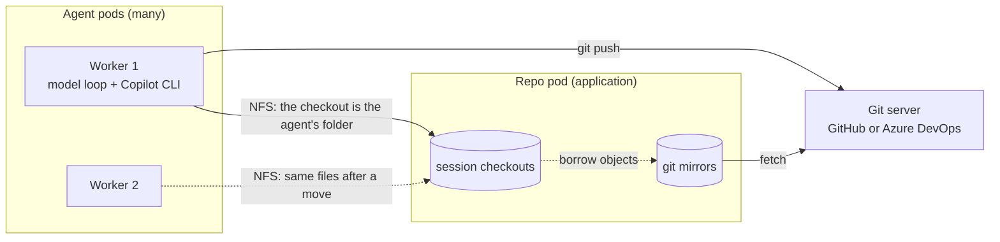
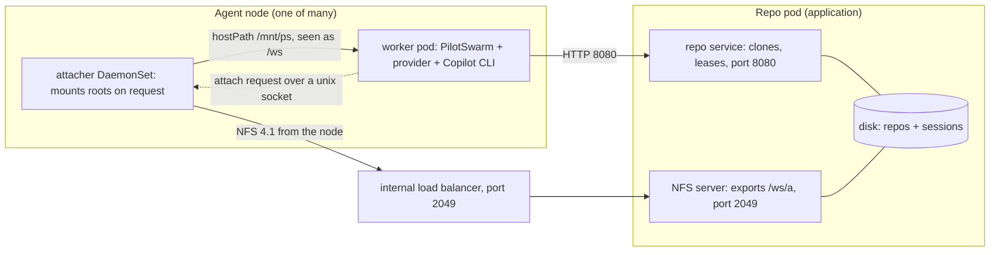
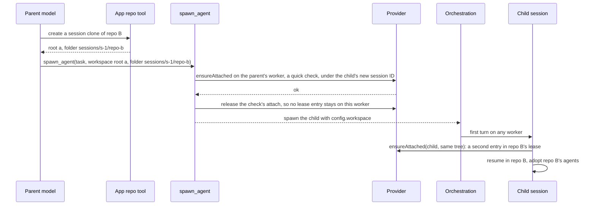

# Session workspaces

**Status:** Phases 1 and 2 implemented on a feature branch; phase 3 (the
reference deployment in the release environment) built and deployed to the
release test stamp from the branch. **Date:** 2026-09-29, revision 8. Revision 3 folded in
review feedback and live checks against the real Copilot CLI. Revision 4
records the fixes from the adversarial reviews of phase 2. Revision 5 adds
extra folders: folders a session can use next to its working folder
(section 4.10). Revision 6 records phase 3 as built: the sample repo is
github.com/microsoft/duroxide, the sample plain root is a folder all sessions
share, and a run on a real kernel with two uids changed five details
(sections 5.1, 5.2, 5.3 and 12.1). Revision 7 adds idle cleanup to the
reference deployment: a clone no session used for a set time is removed and
made again when its session comes back, and the provider hook gains
`purpose` and `notice` (sections 4.2 and 5.3). Revision 8 adds default
folders: each person's own folder and folders every session gets (section
4.11), and loading an agent or a skill by path (section 4.12).

An agent works in a real git checkout that lives on a separate repo pod. It
uses its native tools and native git as if it were on a developer's machine.
The session can move between workers and keep both its conversation and its
files. Sub-agents can work in the same checkout or in another repo. A session
can also use a few extra folders next to its checkout, such as a log share
or a shared notes folder.

## High-level design

**The problem.** A PilotSwarm session does not stay on one machine. Each
turn runs on a worker: the PilotSwarm process in one agent pod. A later turn
may run on a different worker. PilotSwarm carries the conversation from
worker to worker, but not a working folder, and workers share no disk. So an
agent cannot keep a git checkout and work in it with its native tools, the
way a developer does on a dev box.

**The solution.** Keep each session's checkout on a repo pod. Every worker
reaches it over NFS, a network file system. Just before each turn, the
worker that runs the turn makes sure the folder is mounted.



The main ideas:

- **A workspace** is a session's folder on the NFS export: a root (one
  exported directory, such as `/ws/a`) plus a folder inside it.
- **One checkout per session tree.** A session tree is a root session and
  its children. The repo pod keeps a mirror of each repo and makes one
  `git clone --shared` per tree. The clone has its own branches, index and
  stash. It borrows git objects from the mirror, so it uses little disk.
- **Mount on demand.** Before each turn, PilotSwarm calls the application's
  workspace provider, a module loaded into the worker, and asks it to make
  the folder ready on this worker (`ensureAttached`).
- **One copy of the files.** The files live only on the repo pod. A session
  that moves to another worker, and back, always sees the latest files.
- **Dev-box git.** The agent uses its native tools and real git. It pushes
  with the deployment's git identity. The git servers enforce the rules,
  such as protected branches.
- **Repo agents.** If the provider allows it, the session also uses the
  agents, skills and instructions the repo ships. Repo hooks and repo MCP
  servers never run.
- **Scale.** One repo pod serves many repos and sessions. The target is
  about 100 sessions at once. A deployment may run several repo pods.

**One turn**

```text
On the worker that runs the turn:
1. Load the newest conversation from the database (as today).
2. Call ensureAttached. The provider makes sure the export is mounted on
   this node, checks the folder, and records that this worker now holds the
   session.
3. Check the path: it exists, it is a folder, and it stays inside the export.
4. If the provider allows it, add the repo's agents, skills and
   instructions to the session.
5. Start or resume the Copilot CLI with the folder as its working directory.
6. The model runs the turn.

If step 2 or 3 fails, the model is not called. The prompt is held, the
session shows "waiting", and PilotSwarm retries later. After two failures
on one worker, the retry may go to another worker.
```

**A move to another worker, and back**

```text
The session is pinned to worker 1: its turns run there while it stays warm.
PilotSwarm pins a session with an affinity key (section 2). The pin ends,
for example, after 30 minutes with no turn, or when a long wait starts.
1. Worker 1 stops the session's background shells and tasks, drops the
   session from memory, and tells the provider it left (release).
2. PilotSwarm removes the pin. Any worker may run the next turn.
3. Worker 2 runs the next turn with the steps above. It sees the same
   files, because there is only one copy.
4. A later turn back on worker 1 works the same way. Its mount is still
   there, and it sees every change made on worker 2.
```

Step 1 matters. Without it, a shell left running on worker 1 would keep
writing to the checkout after the session moved.

**Setting a workspace**

| Who | How |
|---|---|
| Whoever creates the session | `createSession({ workspace })` |
| The agent | The tool `set_session_workspace`. The new folder takes effect in a new turn that starts at once. Every other tool call in the current turn is refused, so nothing runs in the old folder by mistake. |
| The owner, an admin or the app | `setSessionWorkspace`, through the client, the Web API or MCP |
| A parent agent | `spawn_agent({ workspace })`. Leave it out to share the parent's checkout. Pass another folder to work in another repo. Pass `null` for no workspace. |

**Who owns what**

| Owner | Owns |
|---|---|
| PilotSwarm core | The session's workspace. The turn steps above. The release when a session leaves a worker. Held prompts. Merging repo agents and skills into the session. The tools, APIs, portal and TUI. It has no git, NFS, Kubernetes or cloud code. |
| The application | The repo service on the repo pod: mirrors, fetches, session checkouts, cleanup, and leases (which session and worker hold each checkout). The provider module: mount requests, checks, and which repo content to adopt. |
| The deployment | The repo pod's NFS server and internal load balancer. The attacher, a helper on each agent node that mounts the export. Git and a git credential helper in the worker image. The rules on the git servers. |

Section 3 has the full split, concern by concern, and how the two sides
work together in the git scenario.

**What does not change**

- A session without a workspace gets the same tools and prompt, and runs
  the same orchestration steps, as today. Only sessions that have a
  workspace, or whose agent asks for the workspace tool, see anything new.
  Tests C1 to C6 prove this, so there is no feature flag.
- Existing repo tools and repo caches keep working as they are. Workspaces
  use their own repo pod.

**Main choices**

| Chosen | Instead of | Why |
|---|---|---|
| Mount on demand, through the provider | Mounts at pod start, plus routing each session to a worker that has its mount | Any worker can run any session. The application keeps its own mount and lease logic. |
| A clone per session tree | Git worktrees of one shared repo | Worktrees share branches and stash. Two sessions could not both check out `main`, and one could pop the other's stash. |
| Rules on the git servers | A guard in the agent's tools | Real git in a shell goes around any tool-level guard. |

The work ships in four phases (section 12): test tools, PilotSwarm core, a
reference deployment in the release environment that uses the public
duroxide repo and a shared folder, and adoption by a downstream deployment.

For details, see section 3 (the parts), 4 (PilotSwarm), 5 (the repo pod,
NFS, leases and git credentials), 6 (step-by-step diagrams) and 7 (what
still differs from a dev box).

## Contents

1. [Goal and scenarios](#1-goal-and-scenarios)
2. [Terms](#2-terms)
3. [Architecture](#3-architecture)
4. [PilotSwarm design](#4-pilotswarm-design)
5. [Reference deployment](#5-reference-deployment)
6. [Walkthroughs](#6-walkthroughs)
7. [Dev-box parity](#7-dev-box-parity)
8. [Corner cases](#8-corner-cases)
9. [Test plan](#9-test-plan)
10. [Decisions, verified facts and open items](#10-decisions-verified-facts-and-open-items)
11. [Implementation map](#11-implementation-map)
12. [Delivery plan](#12-delivery-plan)

## 1. Goal and scenarios

| # | Scenario |
|---|---|
| S1 | An agent works in one repo checkout, as on a dev box. It reads, edits, searches, runs small builds, and uses local and remote git. Section 7 lists the git commands. |
| S2 | About 100 sessions work at the same time, each in its own checkout. |
| S3 | A session moves between workers, and may move back. After any move it sees every change made elsewhere. |
| S4 | A child session works in the parent's checkout, or in a checkout of another repo (multi-repo work). |
| S5 | One repo pod holds many repos. A deployment may run several repo pods. |
| S6 | The session adopts the agents, skills and instructions the repo ships. |
| S7 | Anything the deployment's git identity may do is allowed. The git servers enforce the rules. |
| S8 | Existing sessions and existing repo tools keep working unchanged. |

Not in scope: sandboxing, per-user isolation between session checkouts, high
availability for the repo pod, and provisioning inside PilotSwarm core.

Accepted, and stated here so nobody expects otherwise:

- Every session on an agent pod can read and write every session checkout on
  the export. Only the shared mirrors are protected (section 5.1).
- The agent's shell can print the deployment's git token, and that output
  lands in the transcript. The server-side rules are the guard.
- The agent shell already runs with the worker pod's environment: its
  database URL, provider keys and workload-identity settings. Workspaces add
  the git identity to this; they do not narrow it.
- Repo-native agents and instructions are untrusted text in the prompt. The
  application decides per repo whether to adopt them.

## 2. Terms

| Term | Meaning |
|---|---|
| Agent pod | A pod that runs the PilotSwarm worker: the model loop, the Copilot CLI, and native tools (`bash`, `view`, `edit`, `create`, `grep`, `glob`). Also called a worker pod. |
| Worker | The PilotSwarm process in one agent pod, W1 in the diagrams. Its ID is `workerNodeId` (the pod name, the existing worker option set from `POD_NAME`). It is not the Kubernetes node, N1 in the diagrams. |
| Repo pod | An application pod that keeps git mirrors and session checkouts on its own disk, and exports them over NFS. The reference deployment names it `repo-cache`. |
| Repo service | The HTTP service inside the repo pod. It creates and removes session clones and holds their leases. |
| Existing repo cache | An application's current pod for its repo tools, reached through exec. It does not export NFS, and this proposal does not touch it. |
| Root | One exported directory, mounted at the same path on the repo pod and the agent pods. Example: `/ws/a`. |
| Workspace | The folder a session uses as its working directory (cwd): `{ root, folder }`. Also called the working folder. |
| Extra folder | Another folder a session can use next to its working folder, by name, for example a log share. Attached like the working folder, passed to the CLI as an additional directory, never its cwd. Section 4.10. |
| Session clone | One `git clone --shared` of a mirror per session tree, shared by parent and children unless a child is given its own folder. It has its own branches, index, stash, config and hooks, and borrows objects from the mirror. Also called the checkout. |
| Session tree | A root session and all of its child sessions. `rootSessionId` names the tree. |
| Workspace provider | Application code that PilotSwarm calls to make a workspace ready on a worker: `listRoots`, `ensureAttached`, `release`. Called "the provider" below. |
| Turn | One model run: prompt in, tool calls, answer out. It ends when the model stops calling tools and the CLI reports `session.idle`. |
| System-only turn | A turn PilotSwarm starts itself, with a `[SYSTEM: ...]` prompt instead of a user message. |
| `<system_context>` note | Text PilotSwarm appends to a prompt to tell the model what changed. It is not in the system message, so the prompt cache is kept. This document names five: the changed-cwd note (4.3), the partial-changes note (4.7), the agents-changed note (4.6), the extra-folders-changed note and the extra-folder availability note (4.10). |
| Native tasks | The CLI's `task` tool, which runs custom agents inside the CLI process. Gated per user by the `copilot.native_tasks` feature flag. |
| Folder-text check | The text rules in 4.1. Every caller runs them in process. |
| Attach | The `provider.ensureAttached` call, with a 30 s deadline. It includes the provider's own steps in 5.3. |
| Path check | PilotSwarm's own out-of-process check of the attach path, with a 5 s deadline. Its timeout error is `WORKSPACE_CHECK_TIMEOUT`. |
| Duroxide | The durable orchestration engine PilotSwarm runs on. It owns the per-session work-item lock and the affinity key. |
| Affinity key | The ID Duroxide uses to keep a session on one worker. A new key lets any worker take the session. |
| Hold window | The 30 minutes a session stays pinned to its worker after its last turn (`idleTimeout`). A wait or cron longer than that releases the worker when the timer is armed. |
| Lossy handoff | A move where the worker's local conversation copy was not saved before the session left it. |
| Eviction sweep | A worker-side clock that drops a session's local copy. It runs every 5 minutes and evicts sessions idle for 35 minutes (the default of `PILOTSWARM_SESSION_EVICT_MS`), so a copy can live up to about 40 minutes. |
| Snapshot store | The database copy of a session's conversation, written after each turn. Store-wins reads it. |
| Store-wins | Before each turn, the worker compares its local copy of the conversation with the snapshot store. If the store is newer, the store copy wins. |
| CMS | The session catalog database (`packages/sdk/src/cms.ts`): sessions, events, `creation_config`. The portal and the list APIs read it. |
| Continue-as-new | The orchestration restarts itself with a fresh history and a carried input. Anything not in that input is lost. |
| Session fingerprint | The key PilotSwarm compares to decide whether a warm CLI session can be reused. A change drops the warm session and resumes the conversation from disk. |
| Warm / cold | Warm: the CLI process still holds the session in memory. Cold: the session is resumed from disk, possibly in a new CLI process. |
| Revision | A counter on the session's workspace. It goes up by one on every set or clear. |
| Budget gate | The existing code path that holds a prompt when a model provider's token budget is exhausted (`budgetStash` in `orchestration/turn.ts`) and replays it later. |

## 3. Architecture



PilotSwarm core has no git, NFS, Kubernetes or cloud code. In the table
below, "the deployment" is everything else: the application's code (its
provider, its agent tools and its repo service, which
`examples/repo-workspaces/` supplies as a reference) and its infrastructure
(the repo pod, NFS, the attacher and the worker image).

| Concern | Core supplies | The deployment supplies | Where they meet |
|---|---|---|---|
| Where folders live | Named roots. The root list is asked for again before every turn. A built-in provider for fixed roots (the `workspaceRoots` worker option). | The storage: a repo pod exporting `/ws/a` over NFS, mounted on each node; the list of roots | `provider.listRoots()` |
| Making a folder ready on this worker | A call to the provider before every turn, with a 30 s deadline | Mounts the root if needed, checks the export marker, takes a lease, says what to adopt | `provider.ensureAttached(req)`, which returns `{ ok, path, adopt }` or an error code with `retryAfterMs` |
| Checking the folder | A check in a child process, 5 s, one at a time per root: inside the root, a directory, links followed | Optional stricter rules inside `ensureAttached` (the reference serves session clones only) | None |
| Running the turn | The CLI's working directory, repo hooks off, one CLI process per credential and root, the partial-changes note after a lost attempt | Git 2.46 or later and the credential helper in the worker image; `gh` and `az` wrappers | None |
| Folder unavailable | The prompt held with no model call, the retry schedule, status `waiting`, "retry now", a move to another worker after two failures on one | Error codes, an optional `retryAfterMs`, a remount after `ESTALE` | The error result of `ensureAttached` |
| Leaving a worker | Shells stopped (never a process that reused a pid), a disconnect, then the provider told why (`req.reason`). At every affinity release, on complete, cancel and delete, on a workspace change, on shutdown and on eviction. | The worker's own lease entry dropped; a session that `ended` can be marked for cleanup | `provider.release(req)` |
| Who holds a clone | Only the calls above, each with the session, the tree, the worker and the turn index | Lease entries, the dead-entry rules (worker registry, age), stale git lock removal, `WORKSPACE_IN_USE` for another tree | `ensureAttached` and `release` |
| Making clones and mirrors | Nothing | The repo service: mirrors, `clone --shared` with relative alternates, the real origin, a credential helper per clone; agent tools to create, list and remove clones | The tools return a `{ root, folder }` record |
| Choosing a session's workspace | The record and its revision; set at creation, by the agent (`set_session_workspace`), from outside (client, Web API, MCP, portal, TUI) and for children (`spawn_agent`); the acknowledgement and the refusals after it | Which folder to use (its tools return the record), and which agents list `set_session_workspace` | The `{ root, folder }` record |
| Repo agents, skills and instructions | The clone root found, the files read and filtered, merged into the session, the model told, changes tracked in the fingerprint | Per-repo `adopt` flags | The `adopt` field of the `ensureAttached` result |
| Git credentials and branch rules | Nothing | The credential helper, token minting, the rules on the git servers | None |
| Cleanup | Never deletes files; releases only. Delivers a provider's `notice` with a turn | Deletes clones: the remove tool, and idle cleanup (a clone no session used for a set time; section 5.3); makes a removed clone again when its session comes back; maintains the mirrors | The lease activity the service already has; `purpose` and `notice` on the attach |
| Loading the deployment's code | `worker.setWorkspaceProvider()`, `worker.registerTools()`, `PILOTSWARM_EXTENSION_MODULES` | A module that exports `register(worker)` | The module hook |
| Worker liveness | The worker registry | The lease rules read it (`isWorkerAlive`) | The registry lookup |

How the two sides work together in the git scenario:

```text
Setup
 1. [deployment]  The repo pod exports /ws/a. Workers load the module: the
                  provider and the clone tools.
Start working
 2. [agent -> deployment]  create_session_clone({ repo: "app" }): the repo
                  service makes the mirror if needed, then the clone, and
                  returns { root: "a", folder: "sessions/<tree>/app" }
 3. [agent -> core]  set_session_workspace(that record): core asks the
                  provider to attach (the node mounts the root if needed; the
                  service adds a lease entry), checks the path, and
                  acknowledges. The turn ends; core stores the record.
 4. [core]        The next turn runs in the clone and adopts the repo's agents
                  and skills, as the provider's adopt flags allow.
Every turn
 5. [core -> deployment]  ensureAttached again (the lease entry is refreshed),
                  the path check, then the turn.
 6. [deployment]  git push: the clone's credential helper asks the repo
                  service for a short-lived token; the git server's rules
                  decide.
Moves and changes
 7. [core -> deployment]  The session leaves a worker: shells stopped,
                  disconnected, then release (the service drops that entry).
 8. [core -> deployment]  The next turn on another worker: ensureAttached (a
                  new entry); the same files over NFS.
 9. [core]        The folder is unavailable: the prompt is held, retried, and
                  run once when the folder is back.
End
10. [core -> deployment]  The session ends: release. The files stay.
11. [deployment]  Idle cleanup deletes the clone once no session has used it
                  for a set time (7 days by default). A session that comes
                  back gets a fresh clone and one note about what was lost.
```

What `examples/repo-workspaces/` already supplies: the provider, the three
clone tools, the repo service with its leases, the credential helper, and
the `register(worker)` module. What every deployment still builds: the NFS
export and the attacher, token minting, the worker-registry wiring, the
cleanup, and the rules on its git servers.

## 4. PilotSwarm design

### 4.1 Roots and the workspace record

```ts
interface SessionWorkspace {
    schema: 1;         // record version
    root: string;      // a root name
    folder?: string;   // relative to the root; omitted = the root itself
    extra?: Record<string, { root: string; folder?: string; required?: boolean }>;
                       // extra folders by name (section 4.10); omitted = none
}
```

- **Where roots come from.** A registered provider supplies the root list
  (`listRoots`). PilotSwarm calls it on every set, create and spawn, and
  before each `ensureAttached`. It does not cache the list across turns. A
  deployment without a provider may set `workspaceRoots` on the worker, and
  the built-in provider serves them with `path = root path + folder` and
  adopts nothing.
- **Where the workspace is stored.** `config.workspace` in the session config,
  so continue-as-new and child sessions carry it. The revision, status, retry
  state and pending note are orchestration state (section 4.7).
- **Relation to `config.workingDirectory`.** That field exists today, is
  passed to the CLI for every session, and children inherit it. The workspace
  does not touch it. The attach path is per-turn data: it is handed to the
  CLI as `workingDirectory` for that turn and never written to config.
  Precedence: attach path, else `config.workingDirectory`, else the worker
  process cwd. Clearing the workspace, or a child spawned with
  `workspace: null`, returns to the last two.
- **Folder rules.** The folder-text check runs in every caller (client, Web
  API, MCP, the agent tool): relative only, no leading `/`, no NUL, no `..`
  after normalizing. The filesystem rules run only on a worker, because only
  workers see the roots: `realpath` stays inside the root
  (`WORKSPACE_PATH_INVALID` otherwise), and the target is a directory
  (`WORKSPACE_FOLDER_MISSING` for an absent path, a file, a FIFO or a symlink
  to a file). Only workers know the root list, so `WORKSPACE_ROOT_UNKNOWN` is
  raised only by the worker. The client, Web API and MCP do not validate
  root names. The agent tool and `spawn_agent` do, because they run on a
  worker. A session created with an unknown root is held with
  `WORKSPACE_ROOT_UNKNOWN` on its first turn.
- **One working folder, up to four extra folders.** The working folder is
  the cwd. Extra folders are named folders next to it (section 4.10). The
  `schema` field stays 1: extra folders shipped with the first version.

### 4.2 The provider hook

```ts
interface WorkspaceProvider {
    listRoots(): Promise<Array<{ name: string; path: string }>>;
    ensureAttached(req: WorkspaceAttachRequest): Promise<WorkspaceAttachResult>;
    release?(req: WorkspaceReleaseRequest): Promise<void>;         // best effort
    defaultFolders?(ctx: WorkspaceDefaultsContext): WorkspaceDefaults | null | Promise<WorkspaceDefaults | null>;  // 4.11
}

interface WorkspaceAttachRequest {
    sessionId: string;
    rootSessionId: string;      // the session tree, for leases
    workspace: SessionWorkspace; // ONE folder: { schema, root, folder }, never with extra
    revision: number;
    workerNodeId: string;       // the worker's own ID (its pod name), not the Kubernetes node
    turnIndex: number;          // rises every turn
    attachment?: string;        // an extra folder's name (section 4.10); absent for the working folder
    purpose?: "turn" | "check"; // turn: a turn runs next; check: a change or a spawn is checked
}

type WorkspaceAttachResult =
    | { ok: true; path: string;
        adopt?: { agents: boolean; skills: boolean; instructions: boolean;
                  folder?: boolean };  // ignored for an extra folder, except the person's own (4.11)
        readOnly?: boolean;     // the model is told; the mount enforces it
        notice?: string }       // a note for the model; delivered with a turn attach only
    | { ok: false; code: string; message: string; retryAfterMs?: number };

interface WorkspaceReleaseRequest extends WorkspaceAttachRequest {
    reason: "ended" | "moved" | "changed" | "evicted" | "shutdown" | "spawn_check" | "set_check";
}
```

Why a release happens, so a provider can tell a session that ended from one
that only left the worker:

| Reason | When |
|---|---|
| `ended` | The session completed, was cancelled or was deleted |
| `moved` | The session left this worker and stays open: its hold window ended, a long wait or cron timer started, a failed turn is retried, or the folder failed twice on this worker |
| `changed` | The session's workspace was changed or cleared; the request names the old folder |
| `evicted` | This worker dropped the idle session from memory; the session stays open |
| `shutdown` | This worker is shutting down; the session stays open |
| `spawn_check` | The quick check before `spawn_agent` creates a child; the child attaches for real at its first turn |
| `set_check` | The check behind a change from outside the session, run on a worker the session is not on; the session attaches for real at its next turn (4.10) |

Rules for provider implementations:

- **Stable paths.** The same workspace must get the same path on every
  worker. A changed cwd misses the prompt cache and changes the session
  fingerprint (section 4.4).
- **No synchronous file calls on the mount inside the hook.** PilotSwarm
  enforces a deadline (30 s), but it cannot stop a blocked event loop. Use
  child processes.
- **An empty mount point is not proof of a mount.** Check the real mount,
  for example with a marker file on the export.
- **`adopt` omitted means adopt nothing.**
- **`purpose` says why PilotSwarm attaches.** `turn`: the turn preamble
  (section 4.4); a turn runs in the folder next. `check`: the check behind
  `set_session_workspace`, a change from outside, or `spawn_agent`; the
  folder may be released right after, and no turn follows yet. Leave
  one-time work to `turn`. The reference provider restores a removed clone
  only for a turn (section 5.3).
- **`notice` is a note for the model about the folder,** for example that the
  folder was made again and earlier changes are gone. PilotSwarm delivers it
  only from a `turn` attach: it is added to that turn's prompt, after the
  changed-cwd note, and recorded once as `system.message` with
  `source: "provider"`. PilotSwarm keeps no memory of it: give it once, and
  again only when the same turn is retried (same `turnIndex`). Trimmed, and
  cut at 4,000 characters.

### 4.3 Setting a workspace

| Who | How |
|---|---|
| Whoever creates the session | `createSession({ workspace })` |
| The agent | `set_session_workspace({ root, folder })`, `({ extra: { <name>: {…} or null } })` or `({ clear: true })`. What the call does not name stays (section 4.10). |
| Owner, admin or app controller | `setSessionWorkspace(sessionId, { expectedRevision, workspace })` |
| A parent spawning a child | `spawn_agent({ task, workspace })`. `workspace` is a full `{ root, folder }` record. Omitted: the child inherits the parent's workspace. A record: the child gets that workspace. `null`: the child gets none. A record is checked on the parent's worker at spawn time: a bad folder fails the `spawn_agent` call and no child is created. The tool description tells the model: give the child its own folder when it will switch branches, stash, reset or commit while you keep working; two sessions in one clone share one HEAD, index and stash (K15). |

The rest of this section is about a change of the working folder. A call
that changes extra folders only does not end the turn; section 4.10 has its
flow.

**Which sessions get the tools.** The two workspace tools and the
`spawn_agent` `workspace` parameter are declared in a session when it has a
workspace, or when its agent definition lists `set_session_workspace` in
`tools`. Every other session keeps its current tool list and prompt, byte for
byte. Test C1 uses a session whose agent lists no workspace tool.

The orchestration that runs the turn must also be 1.0.80 or later. An older
one has no case for the tool's result, so it would drop a change the model
was told was accepted. The worker reads the version from the activity
context (`activityCtx.orchestrationVersion`) and declares no workspace tools
for an older one. The next turn after the session continues as new on 1.0.80
gets them.

**Agent tool flow**

```text
1. The handler runs the folder-text check, the attach on this worker, and the
   path check.
     invalid folder or root            -> error text; the turn goes on
     same workspace as now             -> "no change" text; the turn goes on
     a task or shell is running        -> WORKSPACE_BUSY text; the turn goes on
        (rpc.tasks.list(): any row of type agent or shell, status running or idle,
         with the same liveness test as the release in 4.5: a finished shell
         whose pid is dead, or now runs another process, does not count)
2. Otherwise the handler records the change as a pending action of type
   set_workspace and returns the acknowledgement:
     Workspace change accepted: root "a", folder "sessions/s-1/lib".
     [SYSTEM: set_session_workspace acknowledged. You are still in <old path>.
      The working directory becomes <new path> only after this turn ends.
      Do not edit or run anything now. Stop and end your turn.]
3. From that point, every further tool call in the same turn is refused:
     every tool        -> the session's onPreToolUse hook returns
                          permissionDecision "deny" with the reason
                          "The working directory is changing. This turn is ending.
                           Stop; continue in the next turn."
                          (verified: the hook also sees PilotSwarm tools)
     PilotSwarm tools  -> as a backstop, the existing blockedAfterTurnBoundary text
                          (set_workspace joins TERMINAL_TURN_BOUNDARY_ACTIONS)
   The hook is installed for every session that has the workspace tools, also
   when native tasks are off.
   The CLI runs the pre-tool hooks of every call in one model message before
   any handler. So the hook itself notes a set_session_workspace call when it
   sees one, and refuses the calls after it in the same message with
     "set_session_workspace, called earlier in this message, has not answered
      yet. Wait for its answer; if it refuses the change, call this tool again."
   If the handler refuses the change, the note is dropped and the turn goes on.
   A call listed before set_session_workspace runs, in the old folder, as the
   model asked.
4. The model stops. The CLI fires session.idle. The turn result carries the action.
   If the turn fails after the acknowledgement instead (the wall-clock cap, the
   inactivity watchdog), the failed result still carries the accepted change.
   The orchestration applies it, and the retry runs in the new folder.
5. Orchestration stores the workspace, revision + 1, emits session.workspace_changed,
   and starts one system-only turn at once. That turn resumes the same conversation
   in the new folder, with the changed-cwd note in <system_context>:
     "The working directory changed from root "a", folder "x" to root "a",
      folder "y" (/ws/a/y)."
   Repo agents and skills get their own note, only when the adopted set is new
   or changed (section 4.6).
```

Why step 3 exists: the turn ends only when the model yields. PilotSwarm never
aborts the CLI for a control tool. Live runs (section 10) showed that after
today's acknowledgement text some models keep calling `bash` and `edit`. One
started a background shell after the busy check had passed. The explicit text
fixed one model; the deny fixes the rest.

**External flow**

```text
1. The API layer runs the folder-text check and the access check, then enqueues
   a command on the same channel as set_model.
2. The command handler in the orchestration compares expectedRevision with the
   stored revision. Stale -> WORKSPACE_REVISION_CONFLICT; nothing changes.
3. It runs the attach activity (checkWorkspace: attach plus the path check) on
   runtime.session, the affinity-pinned proxy, so it lands on the worker that
   holds the session. It uses the same code as the turn preamble.
     fails -> the command is rejected; the old workspace stays
     the activity itself fails (a worker without it, during a rolling deploy)
           -> the command is rejected with WORKSPACE_ATTACH_FAILED; the session
              keeps running
4. It stores the new workspace and revision + 1, emits the event, and stores the
   changed-cwd note for the next turn (workspaceNotice, section 4.7).
5. It does NOT continue-as-new with a bootstrap prompt and does NOT clear the idle
   timer. Both are what set_model does, and both would force a model turn.
6. Busy session: the command waits for the running turn, then runs steps 2-5.
7. The external path runs no busy check. If a background shell is still running
   at that boundary, releaseWorkspace (section 4.5) cancels it before the new
   resume. The old folder gets no further writes.
8. A clear leaves the old folder attached on the worker that holds the session.
   The orchestration notes that a release is owed (workspaceReleasePending). The
   next affinity release runs releaseWorkspace there once, even though the
   session now has no workspace. A turn on that worker releases it first anyway.
```

### 4.4 Every turn of a workspace session

```text
1. Store-wins preamble (as today)
2. Attach: provider.ensureAttached, with a 30 s deadline
3. Path check, out of process, 5 s: inside the root, a directory
4. If adopted: read the repo's agents and skills, and stamp its instruction
   files, all from the clone root (section 4.6)
5. Create or resume the Copilot session with:
     workingDirectory       = attach path
     customAgents           = PilotSwarm agents + repo agents
     skillDirectories       = PilotSwarm folders + <clone root>/.github/skills
     skipCustomInstructions = !(adopt && adopt.instructions)
     custom_instructions    = PilotSwarm's base prepended, not replaced,
                              when instructions are adopted (see 4.6)
     enableFileHooks        = false     (repo hooks never run)
   The path, the three adopt flags and the repo hash join the session
   fingerprint. The repo hash covers the adopted agents and skills, and the
   size and time of each instruction file when instructions are adopted. A
   change to any of them drops the warm session and resumes the same
   conversation from disk.
6. Run the turn
```

- **The clone root** is the nearest folder at or above the attach path, and
  inside the root, that contains `.git`. Agents, skills and the skills folder
  all come from it, so a workspace that is a subfolder of a clone adopts the
  clone's agents. If there is none, nothing is adopted, and the adoption
  report says why.
- **After a clear.** A session whose workspace was cleared still sends its
  revision with each turn. The worker then passes an explicit
  `workingDirectory` (its own folder) and `enableFileHooks: false`. A resume
  with no folder would fall back to the checkout the CLI session was created
  in, and run that repo's hooks.
- **Only workers that know workspaces run these turns.** The turn of a session
  that has, or had, a workspace, and the `checkWorkspace` and
  `releaseWorkspace` activities, carry the activity tag
  `pilotswarm.workspaces.v1`. A worker declares the tag next to the handoff
  tag. During a rolling deploy an older worker never takes this work; it would
  run the turn in its own folder, and it lacks the two activities.
- **One CLI process per credential and root.** One CLI process serves every
  workspace session that shares a credential and a root. Sessions on
  different roots get different processes, so a hung mount freezes only its
  own root. The client pool is already keyed by credential; the root becomes
  a second part of the key. With per-user credentials this multiplies
  processes (about 150–300 MB each, to be measured). Alternative: one process
  per root, with the per-user key passed as `SessionConfig.gitHubToken` per
  session. It avoids the multiplication but changes how GitHub-provider
  sessions authenticate today; verify on CLI 1.0.83 before choosing it.
- **One path check per root at a time.** A queued check waits up to 5 s for
  the running one. If the running check has already timed out, the queued
  check fails at once with `WORKSPACE_CHECK_TIMEOUT` and the session is held.
  Sessions on other roots, and sessions with no workspace, are not affected.
- **Wall-clock cap.** If a turn hits the turn timeout, the worker aborts the
  turn, then stops every running shell before it returns the error, so no
  shell outlives the turn (test F10). After an abort the CLI refuses
  `rpc.tasks.cancel` (it answers `cancelled: false`), so the worker kills the
  shell's process tree by the pid the CLI reports (`process-tree.ts`). The
  abort comes first so the model cannot start a new shell after the stop.
  Risk, not tested: the next turn on that warm session may hang; the
  fingerprint-driven cold resume is the fallback.

### 4.5 Leaving a worker: `releaseWorkspace`

What it does, for a session that has a workspace, on the worker that holds
the session:

```text
1. rpc.tasks.list() -> rpc.tasks.cancel({ id }) for every task with status running
   or idle, of type shell (attached or detached) or agent. A shell the CLI will
   not cancel is killed with every process below it, by its pid
2. rpc.tasks.list() again; stop when none remain. A shell whose pid is dead
   counts as done, although the CLI still lists it as running
3. ManagedSession.destroy(), which is the SDK's disconnect(): it releases the
   in-memory handle and never deletes the session directory
4. provider.release(req)
```

- **Which pid is the shell.** CLI 1.0.83 keeps a finished detached shell
  listed as running, with its pid. The host may give that pid to another
  process later. A pid counts as the shell only if its process did not start
  after the task did (`/proc/<pid>/stat` on Linux, `ps -o lstart=`
  elsewhere, with 2 s of slack). Any other process with that pid is never
  killed.
- **One deadline.** Steps 1 to 3 run under one 20 s deadline on the worker. A
  CLI frozen by a hung mount never answers; the handle is dropped anyway, and
  step 4 still runs.

Step 1 is required. Live check on CLI 1.0.83: `disconnect()`, `client.stop()`,
`abort()`, `forceStop()` and `rpc.shutdown()` all left a background shell
running. Only `rpc.tasks.cancel` killed it, within 2 s, for attached and
detached shells alike, and only while the session had not been aborted.
After an abort (a stopped turn, the wall-clock cap, the inactivity
watchdog), `rpc.tasks.cancel` answers `cancelled: false` and the shell keeps
running; the pid kill in step 1 covers that case.

When it runs:

| Trigger | How |
|---|---|
| Every affinity release: the hold window ends, a wait or cron longer than the hold window is armed, a turn error, a lossy handoff, two failed attempts on one worker (4.7) | One call inside `releaseAffinity()`, taken only when `config.workspace` is set or a cleared workspace is still owed a release, so every present and future release site gets it. Sessions that never had a workspace schedule nothing new. |
| Complete, cancel, delete | The existing session-pinned `destroySession` activity, extended to run steps 1–4 when the session has a workspace. No new yield, and no race: the orchestration waits for `destroySession` as before. |
| The workspace changes or is cleared | Steps 1–4 for the old folder, on the worker, before the new resume. This runs before the worker picks the CLI process for the turn, so a new root or a clear releases too. |
| Any other drop of the in-memory copy: a model or agent change, a new epoch, a forced stop, a store-wins hydrate | Step 1, then disconnect. A resumed handle does not see the old handle's shells (CLI 1.0.83: `tasks.list()` is empty after a disconnect and resume), so no later release could stop them. |
| Graceful worker shutdown | Worker-side, after the drain, for idle workspace sessions still in memory. The releases run side by side, each under its own deadline. |

Rules:

- At every affinity release, the orchestration races the activity against a
  timer (`ctx.race(activity, ctx.scheduleTimer(cap))`). The cap is 10 s,
  under the 15 s retry floor. A session-pinned activity has no timeout of its
  own, so this race is the only bound.
- When the timer wins, the orchestration releases affinity anyway. The old
  worker still runs the activity when it recovers. Until then its copy can
  live, and its shells can write. That is why the provider must handle a
  stale holder (section 5.3).
- A release that runs late must not undo a newer attach on the same worker.
  The activity carries the affinity key it was sent under. The worker skips
  an attach recorded under another key by a turn at or after the release's
  turn index.
- If the worker is dead, another worker may run the activity after the 30 s
  lock expires. It has no in-memory copy, so steps 1–3 do nothing and it
  skips step 4. The provider learns about the dead holder at the next
  `ensureAttached`.
- The worker's eviction sweep also runs steps 1–4, as a backstop.

Why this is needed: today PilotSwarm tells the old worker nothing when a
session moves. The old copy lives until that worker's eviction sweep, up to
about 40 minutes. With a shared checkout, a shell left running there would
keep writing.

### 4.6 Repo-native agents, skills and instructions

| Repo files | Adopted when `adopt` allows |
|---|---|
| `.github/agents/*.agent.md` | Merged into `customAgents`. Limits: 30 agents, 64 KB each. Agents past the 30th, and any file over 64 KB, are skipped and listed in `session.workspace_adopted.skipped`. |
| `.github/skills/<name>/SKILL.md` | `.github/skills` is added to `skillDirectories` |
| `AGENTS.md`, `.github/copilot-instructions.md` and similar instruction files | Loaded by the CLI when `skipCustomInstructions` is false. The CLI puts them in its `custom_instructions` section, which PilotSwarm otherwise replaces with its base prompt; for a session that adopts instructions, PilotSwarm prepends its base to that section instead, so the repo's files follow it. |
| `.mcp.json`, `.github/mcp.json`, `.vscode/mcp.json`, an agent's `mcp-servers` | Never. The CLI starts repo MCP servers only with discovery on and a trusted folder; PilotSwarm sets neither. |
| `.github/hooks/*` | Never. `enableFileHooks: false` on every create and resume. Verified: without it the CLI runs repo hook commands on every prompt. |

The out-of-process path check reads these files, inside its deadline, only
when `adopt` asks for them (`workspace-check.ts`). It reads from the clone
root (section 4.4). For instructions it reads only a stamp: each known
file's size and time. A file or folder whose real path leaves the clone root
is never read and is reported as skipped. The CLI reads the skills folder
itself, so one skill that leaves the clone skips every repo skill.

Limits past the table, so a huge folder cannot use up the deadline:

- At most 20 agent files past the 30th are looked at. The rest are counted in
  one skipped entry and never opened.
- Each agent file is read with a bounded read, so a file that grew after its
  size check is still refused.
- A skills folder with more than 200 entries adopts no skill. The CLI would
  read every entry, and the check could not look at each one.

Filters on each repo agent (`workspace-repo-agents.ts`):

- **Tools:** pass the names through as written. The CLI resolves its own
  alias names (`read` → `view`; on 1.0.83 `search` resolves to nothing).
  MCP-qualified names (`server/tool`) are dropped. PilotSwarm tool names are
  dropped too: a native child cannot call a PilotSwarm tool. An agent left
  with no tools is skipped, because the CLI reads `[]` as "no tools". A file
  with no `tools` key passes none, and the CLI gives the agent every tool.
- **MCP servers:** dropped.
- **Model:** the agent runs on the session's model. The native child guard
  (the `onPreToolUse` hook in `native-subagents.ts` that checks every `task`
  call, and every tool a native child calls) pins the model on every `task`
  call anyway. A different model in the file is reported.
- **Name collision:** a PilotSwarm agent with the same name wins (the two
  native profiles, the CLI's built-in agents, and the worker's loaded
  agents), and so does an earlier repo file with the same name. The skipped
  file is reported.
- **Frontmatter:** a byte-order mark and spaces after `---` are allowed. A
  file whose first line opens a frontmatter block that does not parse is
  skipped and reported. It is never read as all prompt: its `tools:` line
  would be lost, and the agent would get every tool.
- Every drop is listed in `session.workspace_adopted.skipped`, with the
  agent's name when it was still adopted.

PilotSwarm reads these files itself instead of turning on CLI discovery. Two
verified reasons: a discovered repo agent cannot launch through `task` in the
SDK runtime PilotSwarm uses (section 10), and an explicit `customAgents` list
replaces the agents the CLI would discover. PilotSwarm passes such a list
whenever native tasks are on, and also whenever the worker has any loaded
agents (from plugins, agent packages, bundled agents or inline config), even
with native tasks off. With discovery on and a trusted folder, the CLI also
starts repo MCP servers.

How agents are used:

- The CLI lists custom agents in its `task` tool, so the model runs a repo
  agent the way it would on a laptop. A user can also ask for one by name.
- The native child guard in `native-subagents.ts` knows the adopted agents.
  Its `onPreToolUse` hook denies every `task` call whose `agent_type` is not
  `swarm-explore`, `swarm-task` or an adopted agent, and denies a child tool
  that is not in `childTools`. The CLI already limits each child to its
  agent's resolved tool list, so for a child of an adopted agent the guard
  allows any CLI tool, and still denies PilotSwarm tools, `task` (no
  nesting) and detached shells. `RepoAgentAccess` maps each child to its
  agent from the runtime's `subagent.started` events, never from model
  arguments, for that session only.
- Sessions that adopt repo agents need native tasks on for the owner
  (`copilot.native_tasks`). If it is off, agents are reported as skipped.
- `get_session_workspace` and the portal inspector name the adopted agents
  and skills, from the `session.workspace_adopted` event. The worker writes
  it when a turn's adopted set is new or differs from the last event. That
  turn's prompt gets a note in its system-context block:

  ```
  First adoption:  Repo agents available through the task tool: <names>.
                   Repo skills available: <names>.
  A later change:  Repo agents changed: added <names>, removed <names>.
                   Repo skills changed: added <names>, removed <names>.
  ```

  A change is a branch switch that edits the agent files, a flip of an
  `adopt` flag, or a new folder. The fingerprint carries a hash of the
  adopted content (`repoAgentHash`), so a changed set resumes the session
  even when the path and `adopt` stay the same. When instructions are
  adopted, the hash also covers each instruction file's size and time: the
  CLI reads those files only when it creates or resumes the session, so an
  edited `AGENTS.md` must resume it.
- The CLI's on-demand instruction discovery stays off (its default).

**Finding and seeing adopted agents** (added after the release-stamp trial,
2026-09-27). The base instructions send the model to `search_capabilities`
for any named capability. The catalog holds deployment and package agents,
not repo agents, so the model first reported "not found" and only then used
the repo agent. Now:

- `search_capabilities` also returns the working folder's adopted repo agents
  and skills that match the query, first, as `source: "workspace"` and
  `ownership: "repo"`, with the repo's name and how to use them (the task
  tool's `agent_type`, or the skill tool). They carry no reference: nothing
  loads or activates them. The tool's declaration is unchanged, so sessions
  without a workspace see the same requests.
- The adoption record names the repo (its clone folder's name), and a native
  task that runs an adopted agent carries `repo`. The portal labels it
  "Repo agent · <name>", with the repo in its tooltip and details line,
  instead of "Native task".

### 4.7 Failures and held prompts

**The wait result.** A failed attach or path check does not call the model.
The worker returns the same `wait` turn result that the budget gate uses
(section 2), with one typed field that names the gate:

```ts
{ type: "wait", gate: "workspace", code: "WORKSPACE_FOLDER_MISSING",
  reason: "workspace unavailable: folder missing",
  workerNodeId: "<this worker>", retryAfterMs?: <from the provider> }
```

The orchestration computes the wait seconds from `workspaceRetry.step` and
`retryAfterMs`; the worker does not pick them. `workerNodeId` feeds
`workspaceRetry.failures`.

The budget gate today keys on a literal `budget: true` flag in the drain
interrupt, the post-turn drop, the continue-as-new carry, the restore and the
model-switch capture. All five read `gate`, and fall back to `budget: true`.
The worker keeps emitting `budget: true` for budget waits, so frozen 1.0.79
still works. Without this, a workspace wait is re-armed after recovery and
the session goes back to sleep.

**Status.** No new session status. The session shows `waiting`, with the
reason and the gate flag, like a budget pause. `getSessionWorkspace` reports
`status: "unavailable"` as a field of the workspace view. Events:
`session.workspace_unavailable` on each failure, `session.workspace_available`
on recovery.

**Held prompts.** The prompt is kept and runs later, the same way a prompt
the budget gate refuses is kept today. The code calls that store the stash
(not git stash). The stash entry is extended with the attachment references
and the sender, both also written on the stash-time `user.message`. On
recovery the held references ride the turn input as `attachments`, so images
reach the model. Attachment blobs must stay until the held prompt runs. That
can be hours or days, not the 30-minute hold window.

**Only a turn past the check counts.** The worker marks every result of a
turn that got past the workspace check with `workspaceAttached: true`. That
includes the result of a committed turn that a redelivered activity returns
again. For a session with a workspace, the orchestration clears the held
prompts and notes, and emits `session.workspace_available`, only on a marked
result. An error the worker returns before the check (a failed budget query,
a lock timeout) keeps the hold, the status and the retry step.

**Held notes.** A refused turn may carry a note in its system-context block:
a child update folded into the prompt, a cron or wait wake-up, a model
notice. Each was taken from state when the turn was built, so dropping the
note would lose it. The orchestration holds it (`workspaceHeldNote`) and
sends it with the next turn that gets past the check, next to the pending
workspace note. The retry and budget wake-ups' own sentences are left out:
they describe the attempt, not the task. If the refused prompt interrupted
the agent's own wait, that wait is kept and resumes after the turn that
runs, as the held note tells the model.

**Retry count.** A refusal by the workspace check does not reset the retry
count, and the count is carried through continue-as-new while the session is
held. So a retried turn that is held still gets the partial-changes note
when it runs. Its prompt, which the first attempt recorded, is not recorded
again when it is held.

**Retry wake.** The retry timer has its own type, `workspace_retry`. When it
fires, the worker runs only the attach and the path check. If they pass, the
held prompts run as one normal turn. If they fail, no model call happens.
Nothing from the retry is stashed as a user message. The budget gate has this
defect today: its wait timer is the generic type and wakes with the plain
text "The N second wait is now complete. Continue with your task."
(`turn.ts:1432`), and the stash filter (`turn.ts:985`) does not skip that
text. 1.0.80 fixes it the same way: the budget wake becomes a `[SYSTEM: ...]`
prompt, and the filter also skips the `^The \d+ second wait is now complete\.`
shape for older histories.

**Schedule and state.** The orchestration owns the schedule: 30 s, 2 min,
5 min, then every 15 min, or the provider's `retryAfterMs` when larger. The
workspace wait does not use the budget clamp (`MIN_BUDGET_WAIT_SECONDS`, 5 s):
`seconds` carries the schedule value as computed, so the test override can
be milliseconds. New orchestration input fields, each carried through
continue-as-new only when set and normalized from absent:

| Field | Holds |
|---|---|
| `workspaceRevision` | The revision |
| `workspaceStatus` | `ready` or `unavailable`, with the last code |
| `workspaceNotice` | The pending changed-cwd note. Consumed by the next turn of any kind that gets past the check, including a system-only turn such as the retry wake or a cron turn. Never stored in `pendingSystemPrompt`, which would force a model turn. |
| `workspaceHeldNote` | The notes of refused turns, sent with `workspaceNotice` and consumed with it |
| `workspaceReleasePending` | A cleared workspace is still owed a release on the worker that held it (4.3, 4.5) |
| `workspaceRetry` | `{ step, failures: { workerNodeId, count } }`. Reset on `workspace_available`. Task progress never resets it early. |

**Two failures on one worker.** Two attempts in a row on one worker where
the attach or the path check fails: the orchestration releases affinity so
another worker can take the next retry. The 30 s retry runs on the same
worker, because a wait inside the hold window keeps affinity. Its failure is
the second one, so affinity is released before the 2-minute retry, and that
retry may run on any worker. Without routing, the new key may land on the
same worker again. The release does not reset the count for that worker;
every further failure there releases affinity again, until a check passes.

**Lost or retried turn.** The next turn of a workspace session gets the
partial-changes note: "An earlier attempt may have changed files. Check
`git status` first." The worker adds it when either signal is true:

```
retryCount > 0                    the orchestration is retrying a failed turn
row.activeTurnIndex == turnIndex  an earlier attempt of this turn reached the
                                  model call and was lost; a worker crash
                                  sends the same input again, retryCount 0
```

The worker reads the session row at the top of the activity, before this
attempt writes `activeTurnIndex`. A gate refusal returns before that write,
so a held prompt does not count as an attempt.

**The owner acts.** Retry now (interrupts the wait, like a message), clear,
or pick another folder. Stop, cancel, complete and delete work as usual.

### 4.8 APIs, events, errors

Add each operation in every one of these places: the management client, the
Web API (the `OPERATIONS` table), `HttpApiTransport`, MCP, then the portal
and TUI. A method missing from `HttpApiTransport` shows in the portal as
"not available on this transport".

| Operation | Client, Web API, MCP | Agent tool |
|---|---|---|
| Read | `getSessionWorkspace` | `get_session_workspace` |
| Set or clear | `setSessionWorkspace` | `set_session_workspace` |
| Retry now | `retrySessionWorkspace` | none |
| At creation, or for a child | `createSession({ workspace })` | `spawn_agent({ workspace })` |

`getSessionWorkspace` returns the workspace, revision, path, status, last
error, held-prompt count, the adopted agents and skills, and `extraPaths`
(each extra folder's path, section 4.10). It reads them from the latest
workspace events, so no CMS migration is needed in v1. A path holds while its
folder stays the same: the working folder's path survives a change of extra
folders only.

`setSessionWorkspace` replaces the record, with one exception for extra
folders: a record that does not name `extra` keeps the session's extra
folders, so a caller that only knows `{ root, folder }` drops none. A record
that names `extra`, even as `{}` or `null`, sets exactly those.

Set and retry wait for the orchestration's answer: 120 s and 60 s by
default. The caller may pass another wait, from 1 s to 5 minutes; the Web
API, MCP and the management client all clamp it, since the wait holds the
caller's request.

**Events**

| Event | Payload |
|---|---|
| `session.workspace_changed` | `{ workspace \| null, revision, path \| null, extraPaths?, source: "create" \| "agent" \| "external" }`. Emitted with revision 1 on the first turn of a session created with a workspace, and on every set and clear. `extraPaths` names the paths of extra folders the change attached. |
| `session.workspace_unavailable` | `{ revision, code, message, workerNodeId, attachment? }`. `attachment` names a required extra folder that held the prompt. |
| `session.workspace_available` | `{ revision }` |
| `session.workspace_adopted` | `{ revision, agents, skills, skipped }` |
| `session.workspace_released` | `{ reason, cancelled, workerNodeId, detail? }`. Written by the worker that ran the release (4.5): `cancelled` counts the tasks it stopped, `detail` names what did not finish. |

**Errors:** `WORKSPACE_ROOT_UNKNOWN`, `WORKSPACE_PATH_INVALID` (also a
symlink that leaves the root, and a folder that fails the text check),
`WORKSPACE_FOLDER_MISSING` (also a file, a FIFO or a symlink to a file),
`WORKSPACE_CHECK_TIMEOUT`, `WORKSPACE_ATTACH_TIMEOUT` (the 30 s attach
deadline passed), `WORKSPACE_ATTACH_FAILED` (the provider threw or returned
no path, or the check activity did not run), `WORKSPACE_REVISION_CONFLICT`,
`WORKSPACE_BUSY`. Provider codes,
such as `WORKSPACE_IN_USE`, pass through unchanged.

### 4.9 Compatibility: additive by construction

There is no feature flag. Every change is triggered by "this session has, or
had, a workspace", or, for the tool declarations and the deny hook only, by
the agent definition listing `set_session_workspace` (section 4.3). Tests
C1–C6 prove that nothing else changes.

| Shared place | Rule |
|---|---|
| Tool declarations | New tools and the `spawn_agent` parameter appear only under the rule in section 4.3, and only when the orchestration running the turn is 1.0.80 or later |
| Session fingerprint (`session-manager.ts`) | Add keys only when a workspace is set |
| `workingDirectory` | Passed for every session today. A workspace session overrides the value for that turn (section 4.1). |
| Child config (`session-proxy.ts`, `orchestration/agents.ts`), `projectSerializableSessionConfig` | Add `workspace` only when it is set |
| CLI client pool, `skipCustomInstructions`, `enableFileHooks`, `customAgents` | Change only for workspace sessions. After a clear, the session keeps an explicit `workingDirectory` and `enableFileHooks: false` (4.4). |
| The workspace deny hook | Installed for every session that has the workspace tools (4.3), with or without a workspace |
| Activity routing | The workspace tag goes only on the turns of a session that has, or had, a workspace, and on the two new activities (4.4). Every other activity keeps its tag. |
| Orchestration | 1.0.80; freeze 1.0.79. Sessions without a workspace schedule the same activities and timers. The orchestration reacts to `config.workspace`, which is recorded data. Frozen 1.0.79 imports the live `session-proxy.ts`, `wait-affinity.ts` and `provider-budgets.ts`, so any change to a shared type must stay backward compatible: new fields on the runTurn input (`turnMeta`), on `TurnResult` (`workspaceAttached`) and on the `spawn_agent` action are optional and omitted when unset. The new activities (`releaseWorkspace`, `checkWorkspace`) are scheduled only from the 1.0.80 folder. C4 checks this. |
| CMS | No migration in v1. The Web API, MCP and the portal read the current workspace from the latest `session.workspace_changed` event. The orchestration reads `config.workspace`. `sessions.creation_config` holds the creation-time workspace only and is never read as current. Session lists do not show or filter by workspace in v1. |

### 4.10 Extra folders

A session has one working folder, its cwd. It may also use up to four extra
folders next to it: a log share, a shared notes folder, or a clone of a
second repo on another repo pod. Each extra folder is attached before every
turn like the working folder, and the CLI gets it as an additional
directory. Nothing is adopted from an extra folder, except from the
person's own folder when it is the default extra folder `home` (4.11).

```ts
extra?: Record<string, {         // name: 1-32 of a-z 0-9 - _, starting with a letter or digit
    root: string;
    folder?: string;
    required?: boolean;          // default true; the stored record leaves true out
}>;
```

Rules on the record, checked by every caller with the folder-text check:

- At most four extra folders (`MAX_WORKSPACE_EXTRAS`).
- Each folder follows the working folder's text rules.
- No two folders of one record overlap in a root: equal, or one inside the
  other. The text check does not follow links. It does not stop two sibling
  folders of one clone, which share the reference provider's lease entry
  for that clone. That is safe because a release carries the turn index the
  folder was attached in, and the repo service keeps an entry that a newer
  turn refreshed (5.3), and because PilotSwarm never releases a check's
  attaches at once while the session is on the worker (below).

**What differs from the working folder**

| Part | Working folder | Extra folder |
|---|---|---|
| The CLI gets it as | `workingDirectory` | `additionalDirectories` |
| A change applies | After the turn ends (4.3) | In the same turn |
| The change ends the turn | Yes: later calls are denied | No |
| Busy check (a running shell or task) | Refuses any change | Refuses a removal or a move; adding is allowed. A removed or moved folder is released only at a turn with no shell or task running |
| Attach fails before a turn | Prompt held (4.7) | `required`: held, and the notice names the folder. Optional: the turn runs without it, and the model gets a note |
| Adopted content | Per `adopt` (4.6) | Nothing, whatever `adopt` says |
| Fingerprint (4.4) | Path, adopt, repo hash | Not included: a new CLI handle would stop the session's running shells (4.5) |
| Release (4.5) | Its own call | One call per folder, same reason, `attachment` = its name. Every folder attached on the worker is released, whoever attached it |

**What the worker holds.** The session manager keeps, per session, every
folder attached on this worker and not released yet: by a turn's preamble,
by the agent's tool, by a turn that was then held, or by a check for a
change from outside. It keeps this list itself, not on the CLI handle, so a
dropped or rebuilt handle loses nothing. A release on leave (4.5) covers the
whole list. At the next turn, a held folder that the turn no longer uses (by
root and folder, whatever its role or name) is released with reason
`changed`, unless a shell or task runs. A check's attaches (the agent's tool,
or a change from outside) are held too while the session is on this worker,
refused or not: releasing at once could drop a lease entry the working folder
shares. On a worker the session is not on, they are released at once, with
reason `set_check`.

**The provider** sees one folder per call. The working folder's request has
no `attachment`; an extra folder's names it. `req.workspace` is always one
`{ schema, root, folder }`, never the record with `extra`. A worker has one
provider; `combineWorkspaceProviders([...])` sends each call to the provider
that lists the request's root, so one worker can serve repo clones and plain
folders. The reference example does this with `PS_PLAIN_ROOTS` (section 5).

**The agent tool merges.** What the call does not name stays:

```text
set_session_workspace({ root, folder })            new working folder; the extra folders stay
set_session_workspace({ extra: { logs: {…} } })    adds or replaces "logs"; ready in this turn
set_session_workspace({ extra: { logs: null } })   removes "logs"; released after the turn
set_session_workspace({ clear: true })             clears the working folder and every extra folder
```

The deny hook (4.3 step 3) decides from the call's arguments: a call with
`root`, `folder` or `clear` changes the working folder; a call with only
`extra` does not. A call that changes both applies when the turn ends, like
a working-folder change, and its extra folders come with it.

```text
A change of extra folders only:
1. Merge into the record as of this turn, including changes accepted earlier in it.
2. Busy check, only when a folder is removed or moved.
3. Attach and path check of each added or moved folder, on this worker. A failure
   refuses the call, whether or not the folder is required.
4. Answer with each new folder's path. The turn goes on.
5. The change rides the turn result as a queued action (set_workspace_extra). The
   orchestration stores it as soon as the turn ends, with the schedule actions:
   revision + 1, the event with the folders' paths, and a note for the next turn:
     "Your extra folders changed: added "logs" (root "logs", folder "svc", at /ws/logs/svc)."
   There is no continuation turn. A turn that fails after the answer still carries
   the change: the wall-clock cap, the inactivity watchdog, a failed model call
   (session.error), a send that throws, and a tool call written as text (review F8).
   A turn the user stops drops it, like a working-folder change.
6. The next turn on this worker releases the removed or moved folders (reason
   "changed"), unless a shell or task runs. The CLI handle and its shells stay. A
   folder the next turn keeps is not released, also when the working folder
   changes or the folder changes role or name.
```

The tool's calls in one turn run one at a time, in order, each on the record
the one before it left, even if the CLI runs the handlers of one model
message side by side.

**The external set** (`setSessionWorkspace`, 4.8) replaces the record, but a
record that does not name `extra` keeps the session's extra folders. Its
check covers only what the change adds or moves: a new working folder, and
new or moved extra folders. A kept folder is attached by every turn, and one
that is down must not block an unrelated change. The portal's dialog edits
the working folder only; its Clear says the extra folders go too. The MCP
tool `set_session_workspace` follows the agent tool's merge rules: it reads
the record, merges, and sends the whole record, `extra` included, with the
expected revision. A note not yet delivered is kept; a new one is added.

**Children.** `spawn_agent` without `workspace`: the child inherits the
working folder and the extra folders as they are at that moment, including
changes accepted earlier in the same turn. A record: the child gets exactly
that record, and the spawn check attaches and releases every folder in it.
`null`: none.

**Notes about availability.** An optional folder that cannot attach gets a
note for that turn. When it is back, the next turn on the same CLI handle
gets "Extra folder "logs" is available again at <path>.", because a warm CLI
lists only the folders it started with.

**Read-only.** When the provider answers `readOnly: true`, PilotSwarm says so
in `get_session_workspace` and in the answer that adds an extra folder. The
mount enforces it.

**What the CLI does with them** (verified, CLI 1.0.83, section 10):

- The environment section of the system prompt lists them: "Additional
  directories available for file access".
- Nothing is loaded from them: no agents, skills, `AGENTS.md`, MCP servers or
  hooks, also with `skipCustomInstructions: false`.
- The list is not kept across a cold resume, so PilotSwarm passes it on every
  create and resume. A warm session keeps the list it started with until its
  next resume; the note tells the model about a change in between.

**Cost.** One more attach and path check per extra folder per turn, run side
by side. A session without extra folders gets no `additionalDirectories` key
and no new calls.

### 4.11 Default folders: the person's own folder, and shared folders

A deployment can give every session folders without the session asking for
them. Two kinds:

- **The person's own folder ("home").** One folder per person, for their
  files, notes, agents, skills and instructions.
- **Default extra folders.** Folders every session gets, for example a
  folder all people share.

The provider names them in an optional hook. PilotSwarm decides nothing
about names, owners or layout; the provider does.

```ts
interface WorkspaceProvider {
    // ...listRoots, ensureAttached, release (4.2)
    defaultFolders?(ctx: WorkspaceDefaultsContext): WorkspaceDefaults | null | Promise<WorkspaceDefaults | null>;
}

interface WorkspaceDefaultsContext {
    sessionId: string;
    rootSessionId: string;
    // null for a system session. A portal without sign-in stamps
    // { provider: "anonymous", subject: "anonymous" }; a system session's
    // sub-agents run as { provider: "system", subject: "system" }.
    owner: { provider: string; subject: string; email?: string | null; displayName?: string | null } | null;
    isSystem: boolean;
}

interface WorkspaceDefaults {
    home?: { name: string; root: string; folder?: string; required?: boolean };
    extra?: Record<string, { root: string; folder?: string; required?: boolean }>;
}
```

**Where the working folder is.** The person's folder is the working folder
only when the session has none of its own:

| The session's record | Working folder (cwd) | Extra folders |
|---|---|---|
| No workspace | The person's folder | `shared` (each default extra folder) |
| A repo clone | The clone | `home` (the person's folder), `shared` |

```
Before every turn (the turn preamble, 4.4):
1. PilotSwarm calls defaultFolders(ctx). Deadline 5 s. A throw or a
   timeout means no defaults for this turn; the turn runs.
2. It merges the answer with the session's record:
   - the record has no working folder -> home is the working folder
   - the record has a working folder   -> home is extra folder "home"
   - each default extra folder is added under its own name
3. It leaves out a default whose name the record uses, or whose folder
   overlaps a folder of the record (equal, or one inside the other).
4. It attaches the working folder, then the extra folders, as for any
   record (4.4, 4.10).
```

Rules:

- **Never saved.** Defaults are not written into the session's record. A
  change to the deployment's defaults reaches every session at its next
  turn.
- **No limit.** Defaults do not count against the four extra folders of a
  record (`MAX_WORKSPACE_EXTRAS`). The limit exists to bound what one
  session can ask for; the deployment's own list is bounded by the
  deployment.
- **Optional by default.** A default folder that cannot attach is left out
  of that turn, and the model is told. `required: true` makes the turn wait
  for it, like a required extra folder. This holds also when the person's
  folder is the working folder because the record has none: an optional one
  that cannot attach leaves the turn with no folders at all (the default
  extra folders need a working folder), in a temporary folder on the
  worker, and the model is told that files written there are not kept. A
  plain chat does not wait for a file server. A record's own working folder
  is always required.
- **Old orchestrations get none.** A session whose orchestration is older
  than 1.0.80 gets no defaults, the same rule as the workspace tools (4.9).
- **Workspace tools.** A session that has only default folders still gets
  `set_session_workspace`, `get_session_workspace` and `load_agent` (4.12).
  `get_session_workspace` lists the defaults under `defaults`, apart from
  the record.

**What is adopted from the person's folder.** The person's folder is the one
extra folder that may adopt: its attach result's `adopt` is used, also when
it is extra folder `home`. `adopt.folder: true` lets a folder that is not a
git repo adopt; without it, agents and skills come only from a clone root.

| The person's folder is | Agents and skills | Instructions (`AGENTS.md`, `.github/copilot-instructions.md`) |
|---|---|---|
| The working folder | From its `.github/agents` and `.github/skills` | The CLI reads them from its working folder |
| Extra folder `home` | The same, after the repo's | PilotSwarm reads them (at most 32 KB) and adds them to the system message as "Your own instructions": after PilotSwarm's base, before the repo's |

**Which one wins a name.** On a name clash, the earlier source wins:

```
1. loaded by path (4.12)
2. the working folder (the repo, or the person's folder when it is the working folder)
3. the person's folder as extra folder "home"
```

A name that lost is left out with the reason, for example "the repo's skill
has this name". `get_session_workspace` lists what was left out under
`skipped`; the `session.workspace_adopted` event records it too.

**How several skill sources reach the CLI.** The CLI takes whole skills
folders, so it cannot take "the repo's skills except one". When skills come
from more than one source, or a skill lost a clash, PilotSwarm makes a
folder with one link per adopted skill, named by the skill, and gives the
CLI that folder. The folder is local to the worker:
`<os.tmpdir()>/pilotswarm-skills/<sessionId>`. It is rebuilt whenever the
set of skills changes.

**Cost.**

| Deployment | Extra work per turn |
|---|---|
| No workspace provider | None |
| A provider without `defaultFolders` | None |
| A provider with defaults | One `defaultFolders` call, and one attach per default folder, run side by side (a plain folder attach took 72 ms on the release stamp, over NFS). When the person's folder is extra folder `home`, one read of its instruction files in the same child process as its path check |

### 4.12 Loading an agent or a skill by path

A person can point the session at an agent or skill file anywhere in its
folders and load it, without moving the session there. For example:
"load the agent in `notes/tools/finder.agent.md`".

```
load_agent({ path })      an .agent.md file. The turn ends; the next turn
                          continues by itself, and the agent runs as a native
                          task (the task tool, agent_type = its name).
load_agent({ unload })    drop an agent loaded by path. The turn ends.
load_skill({ path })      a skill folder, or its SKILL.md. The body comes back
                          at once; the turn goes on. From the next turn the
                          CLI offers the skill too.
load_skill({ unload })    drop a skill loaded by path.
load_skill({ name })      unchanged: a skill of the deployment's catalog, or a
                          skill loaded by path (these are served first).
```

`load_agent`, and `path` and `unload` on `load_skill`, are declared only
for sessions that have the workspace tools. Every other session sees
`load_skill` exactly as before.

**What a load does.**

```
load_agent({ path: "notes/tools/finder.agent.md" })
1. The path must be inside the working folder or an extra folder, defaults
   included. A relative path starts at the working folder. When folders
   nest, the deepest folder that holds the path is used.
2. PilotSwarm reads the file in a child process (deadline 5 s, at most
   64 KB). Its real path must stay inside that folder: a link out of it is
   refused.
3. It parses the file like a repo agent (4.6): name, description, tools.
4. It saves { kind: "agent", name, root, path } with the session. The path
   is relative to the root, so the load works on every worker: every worker
   mounts a root at the same path.
5. The turn ends. The next turn starts a fresh CLI handle that has the
   agent, and continues the task by itself.
```

`load_skill` does steps 1 to 4 the same way. It saves the skill's folder,
also when the model named the SKILL.md.

**Every turn.** Each load is read again, inside this turn's attached
folders, so edits take effect at the next turn. A load is left out of a
turn, with the reason in `skipped` (4.11), when:

- its folder is not attached in this turn;
- the file is gone or cannot be read;
- the file now names another agent or skill ("load it again").

A load is not dropped when it is left out. It comes back when its file or
folder does.

**Which one wins a name.** A load wins over the repo's and the person's own
agent or skill of the same name (4.11). Loading a second file with the same
name replaces the first load.

**Moves.** A load stays valid when the session changes its working folder,
as long as its file is in a folder attached for the turn. Example: a skill
loaded from the person's folder while it was the working folder still works
after the session moves into a repo, because the person's folder is then
extra folder `home`.

**Refused:**

| Case | Answer |
|---|---|
| The path is outside every attached folder | `Error: <path> is not inside the working folder or an extra folder (...)` |
| A background shell or agent task runs | `Error: WORKSPACE_BUSY: ...`. The next turn starts a fresh CLI handle, which would stop the task |
| A service or tuner session | Loading is not available there |
| More than 32 loads | `At most 32 agents and skills may be loaded in one session` |
| Unload of a name that is not loaded | `no skill named "x" is loaded by path in this session` |

**Trust.** Shared folders can be written by other people. A loaded agent
runs with the tools its file names, under the same rules as a repo agent
(4.6): PilotSwarm tools are dropped, and it runs on the session's model. The
tool descriptions tell the model to load only what it trusts. The deployment
decides who can write where (section 5.3).

**Storage.** The loads are part of the session's capability state (the
`session_capabilities` JSON of the session catalog), next to the package
selections of `use_package`: `loads: [{ kind, name, root, path }]`. No
schema change. A change advances the state's revision, with the same
compare-and-set. `list_session_capabilities` shows them under `loaded`.

**Cost.** None for a session without loads. With loads: one child process
per turn reads every load file.

## 5. Reference deployment

This is the application side, for guidance. PilotSwarm does not enforce it.
Phase 3 of the delivery plan (section 12) builds it in the release
environment, so downstream deployments can copy a working example.

### 5.1 Repo pod layout and ownership

```text
/ws/a/                              service   0755   root of the export
  .pilotswarm-export                service   0644   marker; sessions can stat it, not delete it
  repos/<repo>.git                  service   0755   mirror; an object cache; sessions read only
  remotes/<name>.git                service   0755   sandbox remote (reference deployment only);
                                                     sessions reach it over HTTP, never through the mount
  sessions/                         uid 1000  0755
    <rootSessionId>/<repo>/         uid 1000         session clone = the session's cwd
      .git/objects/info/alternates -> ../../../../../repos/<repo>.git/objects
      .git/refs, config, hooks, index, stash   <- the session's own
      origin = the real remote URL
```

```text
Who runs as what:
  repo service (fetch, mirror maintenance)             the service's uid: root in the reference image
  clone creation (git clone --shared into sessions/)   uid 1000, spawned by the repo service
  worker, Copilot CLI, agent bash                      uid 1000
```

The service's uid was planned as 2000. The reference image runs the service
as root, because it makes each clone as uid 1000 through `setpriv`, which
needs root. What matters is that mirrors, sandbox remotes and markers do not
belong to 1000, and the export squashes root, so a client's root cannot
change them either.

- **Why two uids.** Deleting a file needs write permission on its parent
  directory. With `repos/` owned by the service and mode 0755, a session
  cannot delete, rename or add anything under a mirror. A clone only reads
  the mirror; new commits go into the clone's own `.git/objects`. Verified: a
  clone commits normally with a read-only object store. Git's "dubious
  ownership" check looks at the clone's own `.git`, owned by 1000, so it
  passes. `root_squash` alone is not isolation: it only remaps root.
- **Making the clone reads the mirror as uid 1000.** `git clone --shared`
  reads the mirror through `git upload-pack`, and git 2.45.1 to 2.47 refuses
  to read a repository another uid owns ("dubious ownership"). The repo
  pod's git is Debian's 2.47; git 2.50 and 2.55 allow it. A `-c` before
  `clone` does not reach upload-pack, because git clears command-line
  configuration for the process it starts on the source repository. So the
  service passes `--upload-pack="git -c 'safe.directory=<mirror>'
  upload-pack"`: the exception covers one mirror for one command and is
  written nowhere. Found in phase 3: the earlier tests ran as one uid.
- **Clone per session tree, not a git worktree.** Worktrees share branches,
  stash, config and hooks through the mirror. Two sessions cannot both check
  out `main`, and one can pop another's stash. The same holds for a parent
  and a child that share one clone (K15).
- **Mirror maintenance.** Only the repo service runs git on a mirror. Set
  `gc.auto=0`, `maintenance.auto=false`, `gc.pruneExpire=never`. A caller
  names an operation and never passes git arguments. Each operation is one
  fixed argument list, with `-c gc.pruneExpire=never` pinned:

  ```text
  gc                        git gc
  maintenance-run           git maintenance run
  repack-keep-unreachable   git repack -a -d -k
  repack-cruft              git repack --cruft --cruft-expiration=never -d
  ```

  Everything else is refused, because many forms drop unreachable objects
  that a clone may still borrow: `git prune`, `git gc --prune=<time>` (and
  the abbreviation `--prun=`), `git repack -a -d` without `-k`,
  `--cruft-expiration=now`, `--unpack-unreachable=now`,
  `--no-keep-unreachable`. Verified: each such command broke a clone
  (`fsck`: invalid sha1 pointer); each named operation left it clean, loose
  or packed. The maintenance and mirror-fetch endpoints need an admin token
  that workers never get, because an agent's shell can reach the service. To reclaim space, first run `git repack -a -d` (no `-l`; `git gc`
  inside a clone passes `-l` and copies nothing) inside every live clone and
  remove its alternates file, then prune the mirror. This copies the whole
  object store into each clone. Or prune only when the mirror has no live
  clones.
- **Each root has one unique path, the same on the repo pod and the agent
  pods.** `git clone --shared` writes the alternates entry and
  `remote.origin.url` as absolute mirror paths. The repo service rewrites
  both when it creates the clone: alternates to the relative form shown
  above, origin to the real remote URL. Only reflog messages still name the
  mirror path, and git does not use them for object lookup. The same-path
  rule still holds for the prompt cache and the session fingerprint
  (section 4.2).
- **Use a separate repo pod for workspaces.** An existing repo cache reached
  through exec stays untouched. Nothing there changes: no restart, no new
  container, no uid or gc change, no shared CPU or disk.

### 5.2 Export and attach

- **NFS server** in the repo pod: the node kernel's nfsd, in a privileged
  container, NFS 4.1 and 4.2 only (`rpc.nfsd -N 3 -N 4.0 -V 4.1 -V 4.2`; the
  nfs-utils in Debian 13 has no NFSv2, so `-N 2` fails). No rpcbind. Export
  options: `rw,sync,no_subtree_check,root_squash,fsid=1`. The fixed `fsid`
  keeps file handles valid across restarts. Client tracking must survive
  restarts too: run `nfsdcld` in the pod, with `rpc_pipefs` mounted (Debian
  keeps it at `/run/rpc_pipefs`) and its storage directory on the same
  persistent volume as `/ws/a`, so it also follows the pod in K7. Otherwise
  the server ends its grace period early and clients lose their locks (opens
  recover anyway). These export options are kernel-nfsd `exports(5)` syntax.
  NFS-Ganesha uses an `EXPORT` block (`Squash`, `Filesystem_Id`,
  `Protocols`), so the fallback is a config rewrite, not a drop-in. The
  reference: `packages/sdk/examples/repo-workspaces/nfs-server.sh`.
- **The NFSv4 root must be exportable.** Without an `fsid=0` export, the
  server builds its NFSv4 root from the container's own `/`. That is overlayfs,
  which the kernel cannot export, and every mount fails with "No such file or
  directory". So the exports are relative to the nfs-utils `rootdir`
  setting: a small tmpfs (an emptyDir with medium `Memory`) at `/srv/nfs`,
  with the volume mounted under it at `/srv/nfs/ws`. The export lines still
  say `/ws/a`, and clients still mount `/ws/a`. Clients see only the paths
  that lead to exports: the service's state folders on the volume stay
  hidden.
- **Mount source:** with `fsid=1` the attacher mounts `<server>:/ws/a`.
- **Service address.** In one cluster, a ClusterIP Service, port 2049. The
  attacher runs on the host network with cluster DNS
  (`dnsPolicy: ClusterFirstWithHostNet`), and kube-proxy on the node sends the
  mount's traffic to the repo pod. The ClusterIP stays the same when the repo
  pod restarts or moves, so clients reconnect by themselves and reclaim state
  in the grace period (section 6.4). A repo pod in another cluster needs an
  internal load balancer with a static private IP instead (section 12.2),
  with `externalTrafficPolicy: Local` and the annotations
  `service.beta.kubernetes.io/azure-load-balancer-internal: "true"` and
  `service.beta.kubernetes.io/azure-load-balancer-ipv4: <ip>` (add
  `azure-load-balancer-internal-subnet` if the IP is in another subnet).
- **Same uid and gid** for session clones on both sides: 1000. If the uids
  differ, every git command run from the checkout fails with `fatal: detected
  dubious ownership in repository`, and git does not read the clone's
  `.git/config` (credential helper, identity, hooks). Fix the uid. Do not add
  `safe.directory`: with a different uid the agent usually cannot write to the
  clone's files anyway.
- **Attacher DaemonSet** on every agent node:
  - `privileged: true`, `hostNetwork: true`, `dnsPolicy:
    ClusterFirstWithHostNet`. The kernel ties an NFS mount to the mounting
    process's network namespace. A mount made from a pod network hangs
    forever when that pod restarts.
  - `hostPath /mnt/ps` (`DirectoryOrCreate`) mounted with
    `mountPropagation: Bidirectional`, and an image with `mount.nfs4`.
  - Never unmounts, not on SIGTERM either. A restart leaves mounts in place.
  - Listens on a unix socket on a hostPath (`/run/pilotswarm-attacher`),
    mounted into worker pods. Any process in a worker pod can call it,
    including the agent's shell. It accepts only root names from its
    configured list, mounts each at `/mnt/ps/<root>`, and has no unmount call.
  - Remounts a root when the provider reports `ESTALE` (section 5.3).
- **Worker pods** mount `hostPath /mnt/ps` at `/ws` with `HostToContainer`
  propagation, so a mount made later shows up in running pods. Kubelet never
  deletes through a hostPath. Do not mount NFS inside an `emptyDir` from a
  sidecar: when the pod ends, kubelet cleans the emptyDir and could delete
  files on the export.
- **Mount options:**
  `nfsvers=4.1,hard,timeo=600,retrans=2,actimeo=3,lookupcache=positive,nconnect=4,nosharecache`.
  Data is rechecked on every open (close-to-open). Attributes are cached for
  at most 3 s. "Does not exist" is never cached. `nosharecache` makes each
  mount its own kernel instance, so a remount replaces a stale one (section
  5.3); each root is mounted once per node, so nothing else changes.
- **NetworkPolicy.** The 8080 rule is a `podSelector` for worker pods. NFS
  traffic comes from node IPs, never from pod IPs, so a pod selector cannot
  name it; a copy with a known node subnet makes the 2049 rule an `ipBlock`
  for it. The reference leaves 2049 open to any source, because the node
  subnet differs per stamp. A pod that speaks NFS to the server directly gets
  no more than the mount gives every session: root is squashed, and whatever
  a session must not change belongs to root. The `secure` export option is no
  guard against pods: containerd 2 lets pods bind ports below 1024.

### 5.3 Provider behavior

```text
ensureAttached(req):
  1. root not in /proc/self/mountinfo -> ask the attacher over the socket (20 s limit)
  2. child process: stat <root>/.pilotswarm-export      (ESTALE -> remount, below)
  3. child process: stat <root>/<folder>                (must be a directory), and resolve
                                                         its real path inside the root
     the real path's first three parts name the checkout, sessions/<rootSessionId>/<repo>,
     so a folder inside a clone leases that clone. A folder that is not in a session
     clone (the root, sessions, or sessions/<tree>) -> WORKSPACE_PATH_INVALID
     missing, purpose "turn", and the folder names this tree's clone
       -> POST <repo service>/v1/clones/restore; the service makes it again only if
          idle cleanup removed it (below); then stat again
  4. POST <repo service>/v1/leases
       { checkout: "sessions/<rootSessionId>/<repo>", sessionId, rootSessionId, workerNodeId, turnIndex, purpose }
       the checkout's clone record names another tree -> { ok: false, code: "WORKSPACE_IN_USE" },
                                                         whether or not any entry is live
       a dead entry of the same tree, no live entry    -> the service removes stale git lock files,
                                                         then continues
       a dead entry of the same tree, a live entry     -> the service continues; lock files stay
       the checkout is being removed or made           -> WORKSPACE_ATTACH_FAILED, retryAfterMs 30 s
       otherwise                                       -> the service adds or refreshes this
                                                         session's entry, and records the use
  5. return { ok: true, path, adopt, notice? }          (adopt comes from per-repo config; notice
                                                         when the clone was made again, below)
release(req): DELETE the caller's entry, with its workerNodeId and turnIndex. The service
  deletes it only if the entry names that worker and is not from a newer turn: a release
  that arrives late must not delete the entry of the worker that took over. The clone
  stays owned by its tree until it is deleted.
```

The reference provider's own error codes, which PilotSwarm passes through:
`WORKSPACE_NOT_MOUNTED` (no marker), `WORKSPACE_STALE_MOUNT` (`ESTALE`: a
remount is needed), `WORKSPACE_ATTACH_TIMEOUT` (the marker check hung),
`WORKSPACE_ATTACH_FAILED` (the repo service did not answer), and from the
repo service `WORKSPACE_IN_USE` and `WORKSPACE_FOLDER_MISSING` (no clone
record). Every one except the last two carries `retryAfterMs`.

Lease rules, kept by the repo service and not on the export:

- One lease per checkout, keyed by the clone's folder
  (`sessions/<rootSessionId>/<repo>`), with one entry per session
  `{ sessionId, rootSessionId, workerNodeId, turnIndex, time }`. A parent and
  its children hold separate entries in one lease.
- An entry is dead when its worker is absent from the worker registry, or
  its time is older than the hold window plus the eviction margin (about 40
  minutes, or longer if the deployment raises `PILOTSWARM_SESSION_EVICT_MS`).
  Git lock files are removed only when no live entry remains.
- The service acts as a more privileged uid than sessions, and a session can
  plant links in its own clone. So the service refuses to delete a clone, or
  remove lock files, through a folder or a `.git` that is a link. It creates
  the tree folder and runs the clone as the session uid.
- "Released" means "not on a worker". It does not free the checkout for
  another tree. Only cleanup does that.
- The lease is metadata for cleanup and stale-lock removal. PilotSwarm does
  not serialize the sessions of one tree in one checkout; git's `index.lock`
  prevents file corruption only (K15).

**Idle cleanup (revision 7).** The repo service removes a clone that no
session has used for a set time: `REPO_SERVICE_IDLE_CLONE_HOURS`, 168 (7
days) by default, 6 on the test stamp, 0 for never. The service does not read
PilotSwarm's session database; the rule needs only what the service has.

```text
A use:       a lease taken (every turn) or released (the session left the worker)
Idle pass:   every 1 to 15 minutes (a twelfth of the idle time)
  for each clone idle longer than the limit, with no live lease entry:
  1. look inside it, as the session uid (its config is session-written, so
     never as root): branch, commit, uncommitted changes, commits no remote has
  2. delete it; its tree folder too, when it was the last clone there
  3. keep a removal record (tree, repo, reason, times, the facts from step 1)
     and log one JSON line: event "clone.removed"
While a clone is removed or made, a lease for it gets WORKSPACE_ATTACH_FAILED
with retryAfterMs, and a second removal or make gets CLONE_BUSY.
```

Why no session status: an idle session releases its lease when its worker
drops it from memory, and takes a new one on its next message. So "no lease"
cannot tell "idle" from "gone". The idle time decides instead. Work that
matters is expected to be pushed; pushed branches live in the remote and
outlast the clone.

A session that comes back after the removal is not stuck:

```text
1. Its next turn attaches with purpose "turn"; the folder is missing
2. The provider asks POST /v1/clones/restore. The service makes a fresh
   clone at the same path, only when the last removal was an idle one
   ("clone.restored"). A clone removed on request (DELETE /v1/clones)
   stays removed: WORKSPACE_FOLDER_MISSING, as before.
3. Every session that took a lease on the old clone is told once, on its
   next turn attach, and again only on a retry of that same turn: the
   provider turns the removal record into the attach result's `notice`
   (when, why, what was lost, the last branch and commit, and
   `git fetch origin && git switch <branch>`). A check tells no one.
```

Checks never restore. A check that finds the folder missing refuses the
change with `WORKSPACE_FOLDER_MISSING`, and the agent can call
`create_session_clone`: its answer carries the old removal as `previous`,
and the service tells only the other sessions.

Where the history is: `GET /v1/clones` lists the tree's clones (last use,
`removeAfter`) and its removal records (kept one year);
`list_session_clones` shows the same to the agent; the JSON log lines
(`clone.created`, `clone.removed`, `clone.restored`, `clone.remove_failed`)
go to the cluster's log collector; the note the model got is in the
session's history.

Remount of root `a` on one node:

```text
1. Every workspace session on that node that uses root a runs releaseWorkspace
   (section 4.5), which cancels its shells and native tasks.
2. The attacher runs `umount -l /mnt/ps/a`. A plain umount hangs on an
   unreachable server, or returns EBUSY while a process is inside.
3. The attacher mounts root a again at the same path. Processes still inside
   the old mount keep the old instance until they exit. With the default
   `sharecache`, a lingering old mount of the same export makes the new mount
   reuse the stale instance: in a test on a real kernel, the new mount kept
   the old device number. So the reference attacher mounts with
   `nosharecache`, and the new mount is always a new instance.
```

**Plain roots.** A folder with no repo service behind it, such as a log
share or a folder every session may write, is a plain root. The reference
module serves plain roots from `PS_PLAIN_ROOTS` (`name=path`, a comma list)
through PilotSwarm's built-in provider, combined with the repo provider by
`combineWorkspaceProviders`: no leases and nothing adopted. Sessions use them
as extra folders (section 4.10). A plain root that has a repo root's name,
or whose path is, holds or sits inside a repo root's path, stops the worker
at start: it would reach session clones around the lease rules.

**The home root (revision 8).** The reference module serves each person's
own folder (section 4.11) from one root, `PS_HOME_ROOT` (`name=path`, for
example `home=/ws/home`), and adds the plain roots named in
`PS_DEFAULT_EXTRAS` (a comma list, for example `shared`) as default extra
folders. The code is `examples/repo-workspaces/home-provider.mjs`.

```
/ws/home/users/<person>/          the person's folder
  AGENTS.md                       their instructions for every session
  .github/agents/*.agent.md       their agents
  .github/skills/<name>/SKILL.md  their skills
```

Folder names, chosen by the provider:

| The session's owner | Folder |
|---|---|
| A signed-in person | Their email, lowercased, with every character other than `a-z 0-9 . _ -` as `_`: `Ada@Example.com` -> `ada_example.com` |
| A signed-in person with no email | `<provider>-<subject>`, the same way |
| A portal without sign-in | `_anon`: one folder for everyone |
| A system session, and its sub-agents | `_system` |

A name starting with `_` or `.` is never a person's: such a name gets a `u`
in front. A person whose email changes gets a new, empty folder.

```
ensureAttached for the home root:
1. The folder must be the session owner's own folder, or inside it. The
   owner comes from the session catalog (read once per session). Any other
   folder is refused: WORKSPACE_PATH_INVALID.
2. First use: the person's folder does not exist yet. The provider makes it
   and copies the starter files into it (seed/home), without replacing
   anything. A later attach never copies again, so a deleted starter file
   stays deleted.
3. The real path must stay inside the person's folder: a link out of it is
   refused.
4. The answer adopts everything from the folder, with no git needed:
   { agents, skills, instructions, folder: true }.
```

This is a path rule against mistakes, not a security wall. Every session
runs as the same uid (1000), so a session could still reach another
person's folder with its shell. A wall needs one uid per person on the NFS
disk; that is an open item (section 10).

The shared folder is a plain root (`/ws/shared`, mode 1777). Every session
can read it and add files. The starter files there (`README.md`, and an
agent and a skill under `.github/`) are copied from the image at every start
of the repo pod, owned by root, so sessions can read and load them but not
change them. The shared folder adopts nothing by itself: a session loads
what it wants from it with `load_agent` and `load_skill` (section 4.12).

### 5.4 Git credentials and protections

- **A git credential helper**, set in each session clone's own `.git/config`:
  first `credential.helper=` (empty, which clears any global helper,
  including URL-scoped ones a shared `HOME` may hold), then the deployment's
  helper. It mints short-lived tokens (minutes) with the deployment identity
  and caches them until near expiry. It answers only for the hosts and paths
  of the clone's configured remotes (`credential.useHttpPath=true` in the
  clone) and returns nothing for any other host, so a prompt-injected push to
  another host cannot carry the token out. Any session on the pod can still
  invoke the helper; the helper itself limits what it mints. Git sends HTTP
  Basic with the token as the password; git 2.46 or later can send a Bearer
  header if the server needs one. A transcript of a workspace session may
  hold a short-lived token, and every user who can open a shared session can
  read it. PilotSwarm has no output redaction today; adding one is a later
  item.
- **`gh` and `az` wrappers**, on `PATH`, mint tokens the same way. They make
  PR creation work. The wrappers never run `gh auth setup-git` and never
  write `~/.gitconfig`. `HOME` is shared by every session in the pod
  (section 7), so a global helper written there would shadow every clone's
  helper.
- **The worker image** must contain git (2.46 or later), the helper and the
  wrappers. Today it has none of them.
- **The git servers are the guard.** Before a repo is listed for workspaces,
  the deployment must prove on the server that the identity is denied what
  any old tool-level guard denied: a push to a read-only repo fails, a push
  outside the allowed branch namespace fails, and a push to a protected
  branch fails. A tool-level guard does not apply to native git.

| Rule | Azure DevOps | GitHub |
|---|---|---|
| Read-only repos | The identity has Read only | The app has no contents write on these repos |
| Protected branches | Branch policies (a PR and reviewers), plus deny force push and delete | Rulesets: require a PR, block force pushes and deletions |
| Optional branch namespace | Branch folder permissions, for example create only under `agent/` | A ruleset that restricts other branches, with humans on the bypass list |
| Existing agents | The rules must still allow their current pushes and PR operations | Same |

### 5.5 Capacity

These numbers are estimates. The load tests in section 9 must confirm them.

| Item | Guidance |
|---|---|
| Repo pod disk | Premium SSD class. About 500 IOPS is far too low for 100 sessions. |
| Repo pod node | Dedicated, with a lot of RAM. The NFS server caches files in node memory. Mark the pod `cluster-autoscaler.kubernetes.io/safe-to-evict: "false"`. |
| Large repos (100k+ files) | `git status` takes seconds over NFS. Use sparse checkout and `feature.manyFiles=true`. That setting also turns on the untracked cache, index version 4 and `index.skipHash`. Git 2.13 to 2.39 can still use such a clone, but its `git fsck` reports a bad index, so install git 2.40 or later in the repo-cache image and 2.46 or later in the worker image (Debian bookworm ships 2.39; build both on trixie or newer). fsmonitor does not work over NFS. |
| Several repo pods | Each one is a root, at its own path (`/ws/<name>`). The application maps each repo to a root. Spread repos across pods to split load and limit outages. Every agent node must reach every repo pod on 2049. |

## 6. Walkthroughs

### 6.1 Set a workspace, then the first turn in the checkout

The session has no workspace yet. Its agent (`repo-coder`, section 12.1)
lists `set_session_workspace` in `tools`, so the tool is declared.

```mermaid
sequenceDiagram
  participant M as Model
  participant T as set_session_workspace
  participant P as Provider
  participant A as Attacher on node N1
  participant O as Orchestration
  participant C as Copilot CLI on W1
  M->>T: set_session_workspace(root a, folder sessions/s-1/app)
  T->>P: ensureAttached(s-1, W1, turn 1)
  P->>A: mount root a (first use on N1)
  A-->>P: mounted
  P-->>T: ok, path, adopt agents and skills
  T->>T: path check in a child process; tasks.list shows nothing running
  T-->>M: acknowledgement: still in <old>, <new> after this turn, stop now
  M->>C: bash "npm test"
  C-->>M: denied: the working directory is changing; this turn is ending
  M-->>C: stops; session.idle
  C-->>O: turn result with the set_workspace action
  O->>O: store workspace and revision 1, emit workspace_changed
  O->>C: system-only turn 2 with the changed-cwd note
  C->>C: resume with cwd, repo agents, repo skills, hooks off
  C->>C: grep, edit, git commit, git push through the credential helper
```

### 6.2 Move to another worker, then back

```mermaid
sequenceDiagram
  participant O as Orchestration
  participant W1 as Worker W1 on N1
  participant W5 as Worker W5 on N3
  participant P as Provider
  participant S as Snapshot store
  O->>O: hold window ends
  O->>W1: releaseWorkspace on key K1, raced with a 10 s timer
  W1->>W1: tasks.list, cancel each, list again, disconnect
  W1->>P: release
  O->>O: releaseAffinity, new key K2
  Note over O: the user sends a message
  O->>W5: runTurn on K2
  W5->>S: store-wins: load the conversation
  W5->>P: ensureAttached(W5, turn 3); N3 mounts root a; lease entry moves to W5
  W5->>W5: resume with cwd, sees every file through NFS
  Note over O,W1: later the session lands on W1 again
  O->>W1: runTurn; store-wins loads the newer conversation
  W1->>P: ensureAttached; N1 is already mounted
  Note over W1: NFS caches last at most 3 s, so W1 sees all changes made on W5
```

### 6.3 A child works in another repo



### 6.4 The repo pod restarts

```text
NFS server gone -> file calls on the root hang on every node (hard mount)
  running turn: the tool blocks; a stop still returns at once, the process is reaped later
  next turn:    attach or the path check times out -> wait result, prompt held, retry timer
Repo pod back -> NFS 4 grace period (~90 s), clients reconnect by themselves
  the next retry passes -> held prompts run once
```

## 7. Dev-box parity

| Works like a dev box | Works differently |
|---|---|
| Files: view, edit, grep, find, symlinks, file modes | `HOME` is shared by the sessions in one pod. The CLI process, and so `bash`, gets the worker's environment. It is per pod, not per session. Keep identity in each clone's config. |
| Local git: status, diff, log, blame, commit, amend, reset, rebase, merge, cherry-pick, bisect, stash, branches, `git checkout main` | No `sudo` or `apt`. Toolchains must be in the worker image. |
| Remote git: fetch, pull, push, as the identity allows | Heavy builds share agent-pod CPU and read over NFS. Run them in application work pods that mount the same root. |
| PRs through `gh` or `az` wrappers | No Docker daemon |
| Parent and children in different repos, or in one clone with care (K15) | Background processes are cancelled when the session releases its worker: at a move, when it ends or changes folder, and when a wait, cron or `cron_at` longer than the hold window is armed. Ports are shared within a pod. The `bash` tool description says shells are terminated at session shutdown. On CLI 1.0.83 they are not; only `rpc.tasks.cancel` kills them. Do not rely on that text. |
| Nothing is lost when the session moves | NFS is slower than local disk. `inotify` misses changes made from other nodes. Keep SQLite files under `/tmp`. |

## 8. Corner cases

| # | Case | Handling |
|---|---|---|
| K1 | Worker crashes mid-turn | The turn is redelivered and store-wins replays it. The partial-changes note warns about half-written files. The repo service clears stale git locks once no live lease entry remains. |
| K2 | Worker rollout or drain | The drain waits up to the drain budget (`PILOTSWARM_WORKER_SHUTDOWN_TIMEOUT_MS`, 60 s by default) for running turns. Turns still running are cut and take K1. Then the worker-side release runs for workspace sessions that are idle on this worker. Sessions whose turn was cut are skipped; the provider sees the dead holder at the next attach. The pod's termination grace period (90 s, section 12.1) must exceed the drain budget; the Kubernetes default of 30 s would kill the pod mid-drain. |
| K3 | Agent node dies | Its pods move. Unflushed buffered writes are lost. Closed files are already on the repo pod. |
| K4 | Attacher restarts | The kernel mount stays, because the attacher uses the host network and never unmounts. |
| K5 | One node's mount goes bad | Attach or the path check fails for every session on that root on that node. After two failures the session releases affinity, and the attacher remounts on report (section 5.3). |
| K6 | Repo pod restarts | Section 6.4 |
| K7 | Repo pod node dies, or the autoscaler removes it | Disk detach and reattach takes minutes. Sessions on that root wait. No HA in v1. The `safe-to-evict` annotation stops the autoscaler case. |
| K8 | Zombie turn: a worker cut off from the database but still reaching NFS | PilotSwarm aborts the turn when it sees the Duroxide work-item lock was taken. A fully cut-off worker can write until it is killed. Accepted in v1. |
| K9 | A task or shell is running when the agent changes the workspace | `WORKSPACE_BUSY`, from `rpc.tasks.list()` |
| K10 | Another session tree sets its workspace to the same checkout | `WORKSPACE_IN_USE` from the repo service lease |
| K11 | Checkout deleted while the session exists | `WORKSPACE_FOLDER_MISSING` and held. Cleanup must refuse a checkout with a live lease entry. Revision 7: after an idle removal (section 5.3) the reference provider makes the clone again on the next turn and the model gets one note; a checkout deleted any other way is still held. |
| K12 | Many clones created at once | Per-repo fetch lock on the repo pod; sparse checkout for big repos |
| K13 | Branch switch changes the repo agents | The next turn resumes with the new set and gets the agents-changed note |
| K14 | A command walks the whole root, such as `find /` | Pulls a lot of data over NFS. Advise against it in the agent prompt. A live run showed a model doing exactly this. |
| K15 | Parent and child run git in one clone at the same time | One `.git`: one branch, one index, one stash. The second writer fails at once with `index.lock: File exists`. For parallel git work, give the child its own clone. |
| K16 | The model keeps calling tools after `set_session_workspace` | Refused, section 4.3 step 3 |

## 9. Test plan

Levels:

| Level | What runs |
|---|---|
| U | Unit tests, no CLI |
| L | Local integration: the real Copilot CLI with a fake model endpoint, local folders, PostgreSQL |
| W | Two local worker runtimes sharing one local folder that stands in for NFS |
| Q | Qualification in the release environment (section 12, phase 3) |
| P | Performance and load, in Q |
| D | A downstream deployment, phase 4 (section 12.2) |

Every test must be able to fail. Break the behavior on purpose once, and
check that the test turns red. For C1, declaring the `spawn_agent`
`workspace` parameter for every session on purpose must make C1 fail. Do
this once before merging, not in the suite. The two fixture checks (G1, G5)
are kept but marked as such.

**Coverage.** Levels U, L and W run locally, with no credentials and no
tokens, except C5, which runs the existing suite and needs its usual model
credential. They cover C, B, F, M, A, R, G2, G6 and G7, plus the two
fixture checks G1 and G5. The release environment runs Q1–Q5, Q8, G3, G4
and P. Q6 and Q7 run downstream. F8 covers the worker side of
S2 (one CLI process per root, one path check per root at a time). The repo
pod and NFS side of S2 is P3. G1 is git-only; it does not test runtime cwd
isolation.

### Test infrastructure (built first)

Today's full-stack local tests (`withClient`, multi-worker, the kill harness)
call a real model. The scripted fake endpoint
(`packages/sdk/test/helpers/native-copilot-provider.mjs`) is used only in
tests that drive `SessionManager` directly. These helpers close that gap:

| Helper | What it does | File (under `packages/sdk/`) |
|---|---|---|
| Scripted-model harness | Registers the fake endpoint as the model provider for one or two full workers with PostgreSQL. Details below. | `test/helpers/scripted-model.mjs`, `test/helpers/scripted-workers.js` |
| Request normalizer | For C1. Compares the system message and the tools array only, after masking the CLI-owned lines. | `test/helpers/request-normalizer.mjs` |
| Differential capture | For C1 and C3. Captures at the merge-base and on the branch in one run, then diffs. Details below. | `scripts/differential-capture.mjs` (`npm run test:differential`), `test/local/request-capture.test.js`, `test/helpers/fingerprint-capture.mjs` |
| C1 mutation patch | Proves that C1 and C3 can fail. `npm run test:differential:mutate` compares the merge-base with a copy of it where `spawn_agent` declares a `workspace` parameter for every session, and passes only if every capture differs. The patch lives only in the script. | `scripts/differential-capture.mjs --mutate` |
| Pinned-version start | For C4. Wraps the raw Duroxide client's `startOrchestrationVersioned` so the next session starts at a given frozen version, because PilotSwarm's client hard-codes the latest version. The frozen handler is still registered by `worker.ts`, so no recorded history is needed and nothing goes stale. | `test/helpers/pinned-start.mjs` |
| `createGitFixture()` | Builds a small git setup in a temp folder. Details below. | `test/helpers/git-fixture.mjs` |
| Token-protected git server | A small Node HTTP server in front of `git http-backend`. It answers 401 with `WWW-Authenticate: Basic` and accepts only the fake minter's token as the password. | `test/helpers/git-token-server.mjs` |
| Fake `WorkspaceProvider` | Records every call with its order. Plays back scripted outcomes: ok, fail N times, hang, or a given error code. | `test/helpers/fake-workspace-provider.mjs` |
| Hung-check hook | A test-only switch that makes PilotSwarm's path-check process sleep. A local `stat` never hangs, so this is the only way to test F3 and F5. The hook runs when a check starts, so a test can wait for that start instead of sleeping. | `setWorkspaceCheckTestHook` in `workspace-check.ts` |
| Schedule override | A test-only orchestration input that shortens the retry schedule, so F2 and F4 run in seconds. | `workspaceRetryScheduleMs` in orchestration 1.0.80 |

The last two were built in phase 2, with the code they switch.

**Scripted-model harness**

- Each test supplies the tool calls the fake model returns, per turn.
- The real Copilot CLI runs the real tools.
- It passes a fixed `sessionId` and state directory to every session.
- It captures every model request.

**Request normalizer and differential capture**

- The normalizer replaces the CLI-owned lines (`Current working directory`,
  `Git repository root`, `Available tools`, `Session folder`) with fixed
  tokens. It never sorts or reformats the tools array. Two runs of the same
  code, in two different folders, differ only in those four lines.
- The differential script checks out `git merge-base HEAD origin/main` in a
  worktree, copies the branch's capture files into it so both sides capture
  the same way, builds it, and runs the same capture there and on the branch
  in one run. No checked-in golden. It prints a unified diff on failure.
- Each capture runs once with native tasks off and once with them on, and
  checks that the CLI's `task` tool is present only in the second run.
- `GOLDEN_SURFACE` in `test/local/orchestration-schedule-fingerprint.test.js`
  changes with the 1.0.80 bump (release and check activities) and is
  regenerated after the freeze. C2 compares drive sequences, not that surface.

**`createGitFixture()`**

- A bare remote with a `pre-receive` hook. It rejects pushes to `main` and
  `release/*`, force pushes and deletions.
- A mirror with the production fetch and gc settings, built twice when a test
  needs it: once with unreachable objects loose, once packed.
- Session clones made with `clone --shared`, with the alternates rewritten to
  a relative path.
- Fixture content: `.github/agents`, `.github/skills`, `.github/hooks`,
  `AGENTS.md`, and an MCP server in each of `.mcp.json`, `.github/mcp.json`
  and `.vscode/mcp.json`. Each hook and each MCP server appends its name to a
  marker file, so a test can tell which one ran. The fixture's own tests run
  every command once to prove it can create its marker.
- When a test needs an upstream rewrite, it runs
  `git -C remote.git update-ref refs/heads/<branch> <old-commit>`, which runs
  no `pre-receive` hook. The token-protected HTTP path never bypasses the
  hook: `http-backend` takes its environment from the server process.

Moves in level W:

1. Two workers share PostgreSQL and one root.
2. A short idle timeout forces a release.
3. Stop worker 1. Worker 2 takes the session.
4. Restart worker 1. The session moves back.

The existing kill harness covers crashes mid-turn (M3).

### Compatibility (runs first)

| ID | Level | Required result |
|---|---|---|
| C1 | L | A session without a workspace, whose agent lists no workspace tool, sends the same normalized model request on the branch as at the merge-base. One run per native-task mode. |
| C2 | U | Driven with one scripted context from the same non-workspace input, through first turn, wait timer, cron fire, child spawn and idle-hold release, the frozen 1.0.79 handler and the 1.0.80 handler yield the same activity and timer sequence, segment by segment across continue-as-new. The scripted context must answer `spawnChildSession` and `computeCronAtNextFire` effects, which today's harnesses do not. |
| C3 | U | With `ensureClient` stubbed (the `session-agent-binding-lifecycle` unit pattern), the fingerprint input for a config without `workspace` has no workspace, path, adopt or repo-agent-hash keys, and its digest equals the merge-base value computed in the same differential run as C1. The same config with `workspace` set adds those keys and produces a new `ManagedSession`. Adding `workspace: null` to the input must turn the test red. |
| C4 | U, L | U: `test/local/orchestration-version-upgrade.test.js` gets "1.0.79" as a source (its `loadHandler` learns to import `orchestration_<v>/index.ts`) and asserts model and iteration survive continue-as-new into 1.0.80 with `config.workspace` absent. L: a session started pinned at 1.0.79 runs one turn, the worker restarts so the history replays, then a command makes the frozen handler continue-as-new into 1.0.80; `readExecutionHistory` shows no nondeterminism failure and the state survives. |
| C5 | L | The full existing suite passes |
| C6 | U | Build the tool declarations (`session-manager.ts`, the `systemToolDefs` and `subAgentToolDefs` assembly) for a session without a workspace and for one with. `spawn_agent` has a `workspace` property, and `set_session_workspace` and `get_session_workspace` appear, only in the second. |

### Setting a workspace and the API

| ID | Level | Required result |
|---|---|---|
| B1 | L | Setting `repo-x`: the next turn's `bash pwd` and file writes happen in `repo-x`. The transcript and turn index are kept. |
| B2 | L | Change `repo-x` to `repo-y` while warm. A cold resume in a new CLI process lands in `repo-y`. |
| B3 | U, L | The folder-text check rejects the same inputs the same way in the client, Web API, MCP and agent tool. Symlink escapes are rejected by the worker with `WORKSPACE_PATH_INVALID`, and non-directories with `WORKSPACE_FOLDER_MISSING`, whichever entry point set the workspace. |
| B4 | L | An unchanged request returns "no change", and the turn goes on |
| B5 | L | A stale `expectedRevision` changes nothing |
| B6 | L | An external change on an idle session makes zero model calls and leaves the idle timer armed |
| B7 | L | An agent change returns the acknowledgement, PilotSwarm tools and native tools are refused after it, and exactly one continuation turn follows with the changed-cwd note |
| B8 | L | `WORKSPACE_BUSY` while a native task, an attached shell or a detached shell runs |
| B9 | L | Clearing returns to `config.workingDirectory`, else the process cwd, and deletes no files |
| B10 | L | `spawn_agent` workspace: omitted inherits, a record is used, `null` gives none and the child lands in the default cwd, a bad folder fails at spawn |
| B11 | L | The client, Web API, `HttpApiTransport` and MCP give the same results |
| B12 | U, L | U: a store and a `PilotSwarmUiController` (`packages/app/ui/core`) run with a fake transport whose `getSessionWorkspace` returns a held workspace. The shared selector (`selectSessionWorkspace`) reports root, folder, status, revision, adopted agents, and which actions apply. Set, clear and retry send the revision the view was read at. The portal's Manage dialog (`web-app.js`) and the TUI keys (`tui/src/app.js`: `W` set or clear, `Y` retry) reach the same three commands. The stats tab's Workspace block and the set dialog render in `app-render-smoke.test.mjs`. L: the portal reads the workspace through `HttpApiTransport.getSessionWorkspace`, which B11 checks against the other clients. |
| B13 | L | A session created with a workspace emits `workspace_changed` with revision 1 on its first turn; `getSessionWorkspace` returns it |
| B14 | L | `setSessionWorkspace` sent during a running turn: that turn's `pwd` stays the old folder until it ends; `session.workspace_changed` is emitted after `turn.complete`; a detached shell started in that turn is cancelled; the next turn runs in the new folder with the changed-cwd note |

### Turns and failures

| ID | Level | Required result |
|---|---|---|
| F1 | U | The provider runs before resume. Its deadline is enforced. A timeout returns the `wait` result with `gate: "workspace"` and no model call. |
| F2 | L | A failing provider: the prompt, message IDs, attachments and sender are held; the event is emitted; the shortened schedule is followed; the recovery turn runs the held prompts once; after N failed retries the transcript holds exactly the original held `user.message` events and the recovery model request contains only the held prompts. |
| F3 | L | A hung path check, forced with the hook, times out with `WORKSPACE_CHECK_TIMEOUT`. Sessions on the same root are held. Sessions on other roots and sessions without a workspace keep running turns. |
| F4 | W | Worker A's fake provider always fails and worker B's succeeds. After two failed attempts on A, `releaseWorkspace` runs on A and the orchestration releases affinity; the session runs on B within at most three release cycles (the new key may land on A again). Alternative shape: fail twice on A, then stop A, and B runs the turn promptly. Without the release the session would stay on A's key, which is what makes this test able to fail. |
| F5 | L | A hung root does not block sessions on other roots or sessions with no workspace |
| F6 | L | A retried turn in a workspace session gets the partial-changes note |
| F7 | U, L | A FIFO, a regular file or a symlink to a file at the folder path is rejected at once as not a directory with `WORKSPACE_FOLDER_MISSING`, with no timeout |
| F8 | L | Ten sessions bound to ten folders of one root on one worker run turns concurrently; each `pwd` matches its own folder; they share one CLI process; with the hung-check hook armed for one, the other nine get `WORKSPACE_CHECK_TIMEOUT` within about 5 s and are held. With a slow but live check (the hook sleeps 2 s) for one session, the other nine wait and pass; none gets `WORKSPACE_CHECK_TIMEOUT`. |
| F9 | L | A workspace wait interrupted by a message is not re-armed after the recovery turn, also across a continue-as-new and across a `set_model` command |
| F10 | L | The wall-clock cap cancels a running shell before the turn returns |
| F11 | L | A budget wait whose timer fires while the gate still refuses records no queued `user.message` for the timer text, and the recovery model request holds only the held prompts |
| F12 | U | Driving the orchestration handler with the fake-context pattern from `orchestration-budget-resume.test.js`, the `scheduleTimer` durations follow 30 s, 2 min, 5 min, 15 min, or the provider's larger `retryAfterMs` |

### Moves

| ID | Level | Required result |
|---|---|---|
| M1 | W | Idle release: `releaseWorkspace` runs on the old worker, cancels a detached shell left by the last turn, disconnects, and calls `release`. A wait longer than the hold window runs `releaseWorkspace` on the current worker before the timer is set; the wake-up on another worker runs no release. |
| M2 | W | The workspace survives a move. W1's turn writes a file with `bash` using a relative path. After the move, W2's turn reads it back with `bash cat <relative path>` and `pwd` matches the path the fake provider returned for W2 (same `{ root, folder }`, `workerNodeId` = W2). W2's turn edits the file. After the move back, W1's turn reads the edit the same way. Cross-node NFS visibility is Q5, not this test. |
| M3 | W | Killing W1 mid-turn: the turn is redelivered and replayed, the partial-changes note appears, no release runs, and the fake provider sees a dead holder at the next attach |
| M4 | W | A graceful worker shutdown finishes turns within the drain budget, cuts the rest, then releases idle workspace sessions. A turn longer than the budget gets no release, and the fake provider sees a dead holder at the next attach. Level W does not exercise the platform grace period; Q4 covers that in a rollout. |
| M5 | L | Complete, cancel and delete run `release` through `destroySession`, and the files remain |
| M6 | W | A hanging `release` neither blocks the affinity release beyond the cap nor delays the next turn |
| M7 | L | A hold survives a continue-as-new, and the held prompts still run exactly once |

### Repo agents

| ID | Level | Required result |
|---|---|---|
| A1 | L | A repo agent appears in the agent list and the `task` tool only when `adopt.agents` is set and native tasks are on |
| A2 | L | Names pass through, and a `read`/`search` agent ends up with `view`. MCP-qualified and PilotSwarm names are dropped. A different `model` is reported, and the session model is used. An agent with no usable tools is skipped, never passed `[]`. A name collision is reported. The native child guard allows a `task` call with an adopted agent's name. That child can use a listed tool that PilotSwarm's own children (`swarm-explore`, `swarm-task`) may not use (`create`). A name that was not adopted is still denied. |
| A3 | L | Repo skills load through `skillDirectories`. Instructions load only when `adopt.instructions` is set. |
| A4 | L | A branch switch, or a flip of any `adopt` flag between turns (the fake provider returns all three true, then all false), gives the next turn one resume with the new set: repo agents gone from the `task` tool list, no repo skills, `AGENTS.md` not loaded, and the agents-changed note. A third turn with the same adopt causes no resume. |
| A5 | L | Neither the repo MCP config nor a repo hook starts a process: no marker files after a full turn |
| A6 | L | A child in another repo adopts that repo's agents |
| A7 | L | `search_capabilities` lists the adopted repo agent first, with how to call it; the task that runs it, and the adoption record, name the repo |

### Reference provider and leases

| ID | Level | Required result |
|---|---|---|
| R1 | L | A second tree that calls `ensureAttached` on tree A's checkout gets `WORKSPACE_IN_USE`: while A holds a live entry, and also after A's idle release removed every entry. A child of tree A attaches. Cleanup (`DELETE /v1/clones`) is refused while any entry is live. After cleanup runs, the checkout is gone: the second tree gets `WORKSPACE_FOLDER_MISSING` instead, and makes its own clone. |
| R2 | L | Deleting the bound folder makes the next turn fail its path check with `WORKSPACE_FOLDER_MISSING`: no model call, the prompt is held, `session.workspace_unavailable` is emitted. Recreating the folder and calling `retrySessionWorkspace` runs the held prompt exactly once. Cleanup refuses a checkout with a live lease entry. |
| R3 | L | Two external setters racing on one `expectedRevision`: one wins, one gets `WORKSPACE_REVISION_CONFLICT`. The revision rises by exactly one. |
| R4 | L | The fake provider drops root B after start-up: `set_session_workspace` and `spawn_agent` reject B with `WORKSPACE_ROOT_UNKNOWN`; a session created with root B is held with `WORKSPACE_ROOT_UNKNOWN` on its first turn; a session already on B is held with `WORKSPACE_ROOT_UNKNOWN` and its held prompt runs once when B returns. A root C added after start-up is usable without a worker restart. |
| R5 | U, W | A parent on W1 and its child on W2 run turns at the same time in one checkout; the child's attach does not remove the parent's `.git/index.lock`, and locks are removed only after both entries are dead. U: the repo service's lease rules with two entries and a worker registry the test controls. W: the same with two real workers. |

### Git dev-box

| ID | Level | Required result |
|---|---|---|
| G1 | L | Two session clones of one mirror can both check out `main`, stash, and create same-named branches without interfering (fixture check) |
| G2 | L | After an upstream force push and a mirror `fetch --prune`, with the mirror built twice (unreachable objects loose, then packed), each named maintenance operation leaves the clones `fsck`-clean in both layouts. A body that tries to pass git arguments, an unknown operation, and a call without the admin token are refused. Each operation's fixed arguments pin `gc.pruneExpire=never` or keep unreachable objects; a test checks the table itself, so a pruning form cannot be added unnoticed. |
| G3 | Q | A commit made on the agent pod shows the same bytes and commit ID on the repo pod |
| G4 | Q | A push from the agent pod through the credential helper works; a push to a protected branch is rejected by the server; a credential fill request for an unknown host returns no token |
| G5 | L | After the mirror has fetched new upstream commits, a fetch in a session clone downloads zero objects; a clone without alternates downloads them all (fixture check) |
| G6 | L | A clone without the per-clone helper cannot push, even with a global helper present; the per-clone helper wins over a global one. Checked with a real push, not a config read: `git config --get-all credential.helper` does not list URL-scoped helpers. |
| G7 | L | From a session's shell, deleting a mirror fails with `EACCES`, a fetch inside the mirror fails, and a commit in the clone still works |

### Qualification

| ID | Level | Required result |
|---|---|---|
| Q1 | Q | An attacher mount appears inside worker pods that are already running, on two nodes |
| Q2 | Q | The repo pod's NFS server exports, survives a restart without `ESTALE`, a worker that holds an `flock` on a file across the restart writes through it with no `EIO`, and the repo pod log after the restart shows neither "Unable to initialize client recovery tracking" nor "no clients to reclaim, skipping NFSv4 grace period" |
| Q3 | Q | During a repo pod restart, agent file calls wait and resume, held turns resume, and no data is lost |
| Q4 | Q | Delete the attacher pod (a rollout, not a container restart) and roll the worker Deployment; afterwards a worker pod on that node reads and writes a file through `/ws/a` within 5 s. A mount that is listed but hangs fails this test. |
| Q5 | Q | A write on node 1 is visible on node 2 within 3 s |
| Q6 | D | Existing repo tools and agents run their read and write flows unchanged |
| Q7 | D | For each repo listed for workspaces, the real server allows existing agents' pushes and PR operations, and rejects from the agent pod what the deployment's policy forbids. Probes through the credential helper: `git push --dry-run` for the read-only case; for branch-namespace and protected-branch rules push a throwaway ref to the forbidden target, require rejection, and delete it if it lands; or read the identity's effective permissions and rulesets from the server API instead. |
| Q8 | Q | A remount of one root on one node succeeds while sessions on other nodes keep using the export, and the remounted node passes the marker check afterwards |

### Performance

| ID | Level | Required result |
|---|---|---|
| P1 | P | Added `runTurn` time: under 50 ms p95 in steady state, under 500 ms p95 cold, plus a one-time mount per node |
| P2 | P | Baselines for `git status` and `grep` on a 100k-file repo, for the chosen disk. Run `git update-index --test-untracked-cache` once on the NFS mount before turning the cache on. |
| P3 | P | 100 sessions running search, edit, status and commit: repo pod CPU, disk and NFS latency within budget, with no turn stalls |
| P4 | P | 20 session clones created at once |

### Extra folders (section 4.10)

| ID | Level | Required result |
|---|---|---|
| X1 | U | Record rules: names, count, shapes, overlap; `required: true` left out; `sameWorkspace` compares extra folders, `sameWorkingFolder` does not |
| X2 | U | Merge rules: add, replace, remove, clear, and the refusals; a new working folder keeps the extra folders |
| X3 | U | The provider sees one folder per call, with `attachment`; nothing is adopted from an extra folder; `readOnly` passes through; the spawn check attaches and releases every folder; `combineWorkspaceProviders` routes by root and refuses a root listed twice |
| X4 | U | Release: each folder by name with one reason; a change of extra folders releases only the removed or moved ones and keeps the handle and its shells; a kept folder is not released when the working folder changes |
| X5 | U | CLI options: `additionalDirectories` on create and resume, never for a session without extra folders; extra folders are not in the fingerprint; the deny hook marks only working-folder changes |
| X6 | L (orchestration) | A change of extra folders is stored when its turn ends, with the note and no continuation turn; a failed turn stores it before the retry; an external set of extra folders only notes the folders, not the working directory |
| X7 | L | Real CLI: the folder is listed to the model and readable, nothing is adopted from it, and `get_session_workspace` shows it; added and used in the same turn; an optional folder that fails is left out with a note, a required one holds the prompt; adding while a shell runs works, removing is refused; the end releases every folder; a child inherits them |
| X8 | L | Reference example: a git clone as the working folder and a log share as an extra folder. The agent reads the logs, commits in the clone, drops the logs in the middle of a turn, and the end releases the clone's lease |
| X9 | U, L | Clients: the portal keeps extra folders on a set; MCP merges; the view reports the folders' paths |

### Fixes from the adversarial review of extra folders (2026-09-27)

Three reviewers read the extra-folder change: orchestration, worker and CLI,
and API, security and docs. Each fix has a test that fails with it removed.

| Finding | Fix | Test |
|---|---|---|
| A warm CLI handle kept its old record, so the tools in later turns missed extra folders and could drop them | The handle takes the turn's record | binding test (M1), local test "warm handle" |
| Folders attached by the agent's tool, by a refused check, or by a turn that was held were never released | The manager holds every attached folder per session; releases cover them | release tests, local test "released with the session's folders" |
| An accepted extra-folder change was lost when the model call failed or a send threw | Those failed results carry the change (F8) | local test "fails after the change" |
| A child spawned after a change in the same turn got the old folders | The child inherits the record as of now | local test "same turn" |
| A `{ root, folder }` set from outside dropped the extra folders | Such a set keeps them; naming `extra` replaces | gate test "external set without extra", local test "change from outside" |
| An extra folder that was down blocked any set from outside | The check covers only added or moved folders | local test "change from outside" |
| A removed folder was released while a shell could still write in it | The release waits for a turn with nothing running | release test "while a shell runs" |
| A check's release could drop a lease entry the working folder shares | A check's attaches are held while the session is on the worker | release test "held while the session is on this worker" |
| An external set overwrote an undelivered note; the view lost or kept stale paths; names like `constructor` matched prototype properties; `null` meant different things to the hook and the merge; MCP dropped unknown fields; a plain root could hold a repo root | Notes are added; paths follow their folder; reserved names are refused; `null` is "not given"; MCP is strict; overlapping plain roots stop the worker | gate, unit, MCP and example tests |

### Phase 3, before deployment (2026-09-27)

These run in the normal suites; the Q, G3, G4 and P tests above run on the
stamp. Each test fails with its change removed.

| What | Checks | Where |
|---|---|---|
| Sandbox remote | Upstream mirrored; the sandbox has the mirror's branches; a clone's `origin` is the sandbox and its HEAD follows the upstream's default branch; a token only for the sandbox; a push needs one; a new branch is taken, `main` is refused; a refresh moves `main` and keeps the sessions' branches; the hook is rewritten at start | `packages/sdk/test/unit/repo-workspaces-phase3.test.mjs` |
| A clone as another uid | The clone command gives the ownership exception to the mirror's upload-pack only, for that mirror only; with a git that refuses another uid's repository, the clone still works (skipped where git allows it) | same |
| Attacher | Roots parsed and refused; mount points read from mountinfo; one mount for two asks; the socket API; the mount options, `nosharecache` included | same |
| Plain roots | The marker check, mounting through the attacher, a remount on `ESTALE` | same, and `workspace-extras.test.mjs` |
| The switch | `WORKSPACES_ENABLED` is true or false only; `all` deploys repo-cache after the worker only when true; repo-cache on its own does nothing when false; the component lands once in the staged worker and every portal overlay, beside the database-secrets component | `deploy/scripts/test/workspaces.test.mjs`, `deploy/scripts/test/deploy-database.test.mjs` |
| Rendered objects (`kubectl kustomize`) | The attacher runs from the worker image, on the host network, Bidirectional; worker pods keep their base settings and get `/ws` (HostToContainer), the socket, the sample's settings and a 90 s grace period; the portal keeps its plugin folder and adds the sample's; the repo pod's three containers use its image, and it has no Namespace of its own | `deploy/scripts/test/workspaces.test.mjs` |
| The pieces agree | Worker roots, attacher mounts and NFS exports name the same roots and paths; the worker, the repo service and the Service agree on the address; the policy admits worker pods; every file a setting names exists in the sample | same |
| Images | The worker image copies the sample, installs git and nfs-common and drops the setuid bit; the portal copies the plugin; the repo pod image has git and the NFS server | `deploy/scripts/test/dockerfile-lockfile.test.mjs` |

A run on a real kernel in local Docker, with two uids, is recorded in section
10. It is not automated: it needs a privileged container and the kernel's nfsd.

### Fixes from the adversarial reviews (2026-09-27)

Four reviewers read phase 2: orchestration, worker and CLI, security, and
tests and docs. Each confirmed finding has a test that fails with the fix
removed.

| Finding | Fix | Test |
|---|---|---|
| An error returned before the workspace check dropped held prompts and marked the workspace available | Results past the check are marked `workspaceAttached`; only those clear the hold (4.7) | gate test "an error returned before the workspace check" |
| A child update folded into a refused prompt was lost; a refused cron, cron_at or wait wake-up was not delivered | The refused turn's note is held and sent with the next turn that runs (4.7) | gate tests F2 and F5 |
| A session on 1.0.79 could get `set_session_workspace` and drop its result | Workspace tools only for orchestration 1.0.80 or later (4.3) | binding test "before 1.0.80" |
| A refused retry lost the partial-changes note and recorded its prompt twice | The retry count survives a refusal and a continue-as-new while held (4.7) | gate test F4 |
| After a clear, the old checkout's shells ran until eviction | A release is owed after a clear (4.3, 4.5) | gate test F6 |
| A late release could undo a newer attach on the same worker | The release carries its affinity key; a newer attach is skipped (4.5) | binding test F7 |
| A turn cut by the wall-clock cap dropped an accepted change | The failed result carries the change (4.3) | local test "review F8" |
| During a rolling deploy, an older worker could run a workspace turn or fail the new activities | The workspace activity tag (4.4); a failed check activity answers the command | routing tests, gate test "a check activity that fails" |
| After a clear, turns ran in the old checkout with its hooks | An explicit folder and hooks off after a clear (4.4) | local test "review R1, R2" |
| Most drops of the in-memory session orphaned its shells | Every drop stops the shells first; the release runs before the CLI process is picked (4.5) | binding and release tests R2 |
| A call sent after `set_session_workspace` in the same message ran in the old folder | The hook marks the change when it sees the call (4.3) | local test "review R3" |
| A finished shell's reused pid could get another process killed; a finished shell made the session look busy | The pid must belong to a process that did not start after the task (4.5) | process-tree and release tests R4 |
| A late release from the old worker deleted the new worker's lease entry | The service deletes only the holder's own entry (12.1) | example test "review R5" |
| A subfolder workspace adopted nothing, and a folder outside any clone adopted | The clone-root rule (4.4) | repo agents test R6 |
| An edited `AGENTS.md` did not reach a warm session | The instruction stamp joins the repo hash (4.6) | repo agents test R7 |
| A byte-order mark or spaces after `---` gave a restricted agent every tool | The parser allows both and refuses what it cannot read (4.6) | repo agents test R8 |
| A frozen CLI held the release, and the shutdown released one session at a time | One deadline per release; shutdown releases side by side (4.5) | binding test R9 |
| A huge agents or skills folder could use up the check's deadline | Caps on what the check looks at (4.6) | repo agents test S-W4 |
| A caller could make the Web API wait without limit | The wait is clamped (4.8) | web runtime test |
| The reference provider leased no subfolder; maintenance let pruning commands through; the service followed links a session can plant | Lease the containing clone; named operations with an admin token; links refused (5.x, 12.1) | example tests |

### Idle cleanup (revision 7, 2026-09-28)

U = unit (`test/unit/repo-workspaces-idle-cleanup.test.mjs`,
`test/unit/workspace-provider-notice.test.mjs`), L = a real worker with the
scripted model. Each test turned red when its rule was broken on purpose
(27 mutations, 27 red).

| ID | Kind | What it checks |
|---|---|---|
| I1 | U | A clone records its last use: made, a lease taken, a lease released; the list shows `lastUsedAt`, `inUse` and `removeAfter` |
| I2 | U | The idle pass removes only clones unused for the idle time (not one millisecond early), never one with a live lease entry, and logs no failure for skipping it |
| I3 | U | A removal leaves a record and a `clone.removed` log line with the reason, the idle hours, the branch, the commit, uncommitted changes and the count of commits no remote has; the pushed branch is still in the remote |
| I4 | U | Restore makes a fresh clone on the default branch; each session that used the old clone is told once, again on a retry of the same turn, never by a check, and a session that never used it is not told |
| I5 | U | Only an idle removal is restored; a clone removed on request stays removed; a session that makes it again sees the removal in the answer, and only the other sessions are told |
| I6, I6b, I6c | U | One operation per clone: two restores make one clone; during a removal or a make a lease gets `WORKSPACE_ATTACH_FAILED` with `retryAfterMs` and a make gets `CLONE_BUSY`; a failed clone step leaves no half-made folder; a removal that starts while an attach waits on the worker registry makes that attach retry |
| I7 | U | The state survives a restart; a clone recorded before idle cleanup starts its idle time at the restart |
| I8 | U | The provider restores on a turn, not on a check, never another tree's clone, not a clone removed on request, and turns the removal into one `notice` |
| I9 | L | A clone left idle is removed; the next turn runs in a fresh clone, the model's prompt carries the note, the note is in the session's history once, and the service logged the removal and the restore |
| N1, N2 | U | `prepareWorkspace` passes a provider's notice through (trimmed, cut at 4,000 characters, dropped unless a non-empty string), for an extra folder too |
| N3 | U | The checks behind `spawn_agent` attach with `purpose: "check"` |
| B7b | L | Turn attaches say `turn`, the check behind `set_session_workspace` says `check`; a provider's notice rides the next turn after the changed-cwd note, is not repeated, and is recorded with `source: "provider"` |

### Default folders and loads by path (revision 8, 2026-09-29)

U = unit (`test/unit/workspace-defaults.test.mjs`,
`test/unit/repo-workspaces-home.test.mjs`,
`test/unit/workspace-loads.test.mjs`), L = a real worker with the real
Copilot CLI and the scripted model (`test/local/workspace-defaults.test.js`,
`test/local/workspace-loads.test.js`). Each test turned red when its rule
was broken on purpose (default folders: 19 mutations, 19 red; loads:
24 mutations, 24 red).

| ID | Kind | What it checks |
|---|---|---|
| D1 | U | The record wins; the person's folder is the working folder when the record has none, else extra folder `home`; a default whose name the record uses, or whose folder overlaps, is left out; defaults do not count against the limit of four |
| D2 | U | No hook, a hook that throws, and a hook slower than 5 s all give no defaults, and the turn runs |
| D3 | U | Combined providers: the first provider's home folder wins; extra folders are merged |
| D4 | U | The path check adopts from a folder without git only with `adopt.folder`, and reads the instruction files' text within 32 KB |
| D5 | U | Only the person's folder adopts among the extra folders |
| D6 | U | Loaded, then the repo's, then the person's own: a name taken earlier is left out with the reason; skills from several sources are linked |
| D7 | U | The folder of skill links keeps exactly one link per adopted skill, and replaces a stale one |
| D8 | U | The adoption note names each source; the person's instructions come after PilotSwarm's base and before the repo's |
| D9 | L | A session with no workspace runs in the person's folder: its instructions and skills reach the model; the default `shared` folder is listed |
| D10 | L | After a move into a repo, the person's folder is extra folder `home`: its instructions still reach the model, before the repo's; on a skill name clash the repo's wins |
| D11 | L | A session with only default folders gets the workspace tools |
| D12 | L | The person's folder cannot attach: when optional, the turn runs without folders, the model is told, and the note is recorded once as PilotSwarm's; when required, the turn is held and calls no model |
| H1 | U | Folder names: email, `_anon`, `_system`, no email, and names that start with `_` or `.` |
| H2 | U | `defaultFolders` gives the person's folder as `home`, plus the default extra folders |
| H3 | U | First use makes the folder and copies the starter files; a later attach never copies again, so the person's changes and deletions stay |
| H4 | U | Only the session owner's folder: another person's folder, the root itself, a missing subfolder and a link out are refused; an unknown owner is retried |
| H5 | U | `PS_HOME_ROOT` and `PS_DEFAULT_EXTRAS`: a default extra folder must be a plain root, roots must not overlap, and `register` wires them |
| L1 | U | The capability state keeps valid loads and refuses bad ones (kind, name, root, absolute path, `..`, NUL, a duplicate, more than 32); add, replace and remove advance the revision; unloading a name that is not loaded is an error; a `use_package` change keeps the loads |
| L2 | U | A path must be inside an attached folder; a relative path starts at the working folder; the deepest folder wins; `/r/sharedX` is not inside `/r/shared` |
| L3 | U | A SKILL.md: the name from its frontmatter or its folder; a broken file is refused with the reason |
| L4 | U | The file reader: agents and skills in request order; a link out of the folder, a SKILL.md link out, a file over 64 KB, the wrong kind and a missing file are refused; a folder that does not answer in time fails every request |
| L5 | U | Every turn each load is read again inside this turn's folders; a load whose folder is not attached, whose file is gone or whose file now names another agent is left out with the reason |
| L6 | U | `load_agent`, and `path` and `unload` on `load_skill`, only with the workspace tools; `load_agent` is a reserved tool name |
| L7 | U | A load deep in a folder is saved relative to its root; a skill named by its SKILL.md is saved as its folder; outside the folders, a broken file, a running background task and a session without storage save nothing |
| L8 | L | `load_agent`: the turn ends, the next turn continues by itself, the task tool offers the loaded agent over the person's own of that name, and it runs; when the file is gone, `get_session_workspace` says why and the person's own agent is back |
| L9 | L | `load_skill` by path: the body at once, without ending the turn; from the next turn the loaded skill wins over the person's and, after a move, the repo's; `load_skill` by name serves it, and an edit shows in the next turn; unload gives the name back |
| L10 | L | A path outside the folders is an error in the same turn, and nothing is saved |

## 10. Decisions, verified facts and open items

**Decided on 2026-09-26**

| Decision | Instead of |
|---|---|
| Lazy attach through an application provider hook | Fixed mounts at pod start, plus worker tags for routing |
| NFS served from a repo pod, mounted per node by a DaemonSet on the host network | A sidecar per pod, or Azure Files |
| A session clone per session tree (`clone --shared`) | Git worktrees in a shared mirror |
| Two uids on the export: mirrors read-only for sessions | One uid everywhere |
| Leases held by the repo service | Lease files on the export |
| Git protections enforced by the git servers; the agent may do anything the identity can | A client-side branch guard |
| Children take a `workspace` parameter | Always inheriting |
| Repo agents read from the checkout on each turn (section 4.4 step 4), per repo `adopt` policy | Copying repo agents into PilotSwarm's own agent store (not planned) |
| After `set_session_workspace`: explicit acknowledgement text plus a deny of every further tool call | Text alone |
| Status `waiting` plus a `gate` flag | A new `unavailable` session status |
| No feature flag: additive by construction, proven by tests C1–C6 | A flag |
| A separate repo pod for workspace sessions | Changing an existing repo cache |
| The reference provider loads through a module hook in the stock worker | A separate worker image |
| A reference deployment in the release environment, using the public duroxide repo, with a folder all sessions share as the sample plain root | Each downstream deployment designing its own |
| C1 is a differential test against the merge-base | A checked-in golden |
| Local tests use a scripted model and simulated git | Real models and real git servers |
| Workspace turns and activities routed by an activity tag, `pilotswarm.workspaces.v1` (added 2026-09-27) | Relying on activity names during a rolling deploy |
| Extra folders through the one `set_session_workspace` tool, with merge rules (added 2026-09-27) | Separate attach and detach tools |
| Extra folders left out of the fingerprint | A new CLI handle on every change, which stops running shells |
| A change of extra folders stored when its turn ends | At the orchestration's next wake-up |
| No two folders of a record overlap in a root | Leases per attachment in every provider |
| The session manager holds every folder attached on a worker, per session, and releases by root and folder | Releasing only what the last turn's attach listed |
| A check's attaches are held while the session is on the worker | Releasing them at once, which can drop a shared lease entry |
| A set from outside without `extra` keeps the extra folders | Whole-record replacement, which silently dropped them for older callers |
| The repo pod is a Deployment with `Recreate` (phase 3) | A StatefulSet: the deploy tool waits on Deployments |
| The repo pod runs on its own node pool: one node, no autoscaling, tainted | Sharing worker nodes, where workers compete with the NFS server's file cache for memory |
| A ClusterIP Service for NFS when the repo pod is in the workers' cluster | An internal load balancer with a static IP, which only a repo pod in another cluster needs |
| The deploy tool adds a `workspaces` component to the staged worker and portal overlays when `WORKSPACES_ENABLED=true`, as it adds its database-secrets component | A second worker overlay chosen by a bicep parameter: it cannot reach the portal, whose overlays are keyed by edge and TLS mode |
| The portal loads the sample plugin too | The portal lists and starts only agents it loads itself |
| The repo pod's NFS root is a tmpfs with the volume under it (nfs-utils `rootdir`) | The container's own root, which the kernel cannot export |

**Verified with the real CLI 1.0.83 and a fake model endpoint**

| Check | Result |
|---|---|
| `resumeSession` with a new cwd, warm or in a new CLI process | Honored |
| `resumeSession` without a cwd | Falls back to the creation-time cwd, so always pass it |
| `AGENTS.md` in the cwd | Loaded, unless `skipCustomInstructions` is set |
| `AGENTS.md` in a PilotSwarm session's cwd | Not loaded, even without `skipCustomInstructions`: PilotSwarm replaces the `custom_instructions` section, where the CLI puts it. With the base prepended instead, it loads (test A3). |
| `.github/hooks/*` in the cwd | Commands run on every prompt unless `enableFileHooks: false` |
| Git edits, commits and branch switches | System prompt unchanged, so the prompt cache holds |
| Discovery on | Repo agents and skills found; with a trusted folder, repo MCP servers also start |
| Repo MCP config files | The CLI reads `.mcp.json`, or `.github/mcp.json` when there is no `.mcp.json`. It no longer reads `.vscode/mcp.json`. It starts those servers only when discovery is on and the folder is trusted (`COPILOT_ALLOW_ALL=true` or a saved trust entry). With either missing, none start. |
| `.github/hooks/*.json` format | `{ "version": 1, "hooks": { "<event>": [ { "type": "command", "bash": "...", "timeoutSec": 10 } ] } }`. `sessionStart` and `userPromptSubmitted` both fire. Version 2, or `cmd` in place of `bash`, runs nothing. |
| Discovery on, `task(agent_type=<repo agent>)` with the SDK's bundled runtime (`RuntimeConnection.forStdio()` in `copilot-client.ts`) | The agent is listed but fails to launch: `Standalone server does not support session effect custom_agent_prompt`. The same agent passed through `customAgents` launches. The full CLI binary as the runtime does launch discovered agents. |
| Explicit `customAgents` plus discovery | Discovered agents are dropped |
| `skillDirectories` pointing at the repo | Skills found, with discovery off |
| A repo agent with `tools: ["read", "search"]` | Gets `view` only; `search` resolves to nothing; `[]` means no tools |
| `disconnect()`, `stop()`, `abort()`, `forceStop()`, `shutdown()` with a background shell | The shell survives all five |
| `rpc.tasks.cancel` on a shell task | Killed within 2 s, attached or detached, if the session was not aborted |
| `rpc.tasks.cancel` on a detached shell after `abort()` | Answers `{ cancelled: false }`; the shell keeps running (test F10) |
| The pid the CLI reports for a detached shell | Not a process-group leader, so a group kill misses its children; PilotSwarm kills the process tree instead |
| A shell task after its process dies | Still listed as running, with its pid. `tasks.cancel` on it answers `{ cancelled: false }`, and after that the CLI marks it completed. The host may give the pid to another process later, so PilotSwarm checks the process start time before it kills. |
| `disconnect()`, then a resume of the same session | `tasks.list()` on the new handle is empty; the old handle's shells keep running, and no later call can find them |
| Several tool calls in one model message | The pre-tool hook runs for every call, in message order, before any handler. A mark set in a handler comes too late for the calls after it. |
| Instruction files such as `AGENTS.md` | Read when the CLI session is created or resumed; a warm session keeps the old text after the file changes |
| An attached async shell | Keeps the turn open until it exits |
| A stop while a shell is blocked | Returns to PilotSwarm in about 10 ms |
| Two captures of one fixed session | Differ only in the CLI-owned cwd, git root, tools and session-folder lines |
| `additionalDirectories` on create or resume | Listed in the environment section ("Additional directories available for file access"); a file there can be read |
| Agents, skills, `AGENTS.md`, `.mcp.json` and hooks in an additional directory, discovery off | None loaded or started, also with `skipCustomInstructions: false` (the cwd's `AGENTS.md` does load then) |
| A cold resume without `additionalDirectories` | The list is gone from the prompt; passing it again brings it back |

**Verified with Duroxide (the durable-execution runtime)**

| Check | Result |
|---|---|
| `activityCtx.orchestrationVersion` | The version of the execution that scheduled the activity: 1.0.79 before a continue-as-new into 1.0.80, 1.0.80 after it |
| `activityCtx.sessionId` for a session-scheduled activity | The affinity key it was scheduled under |
| A worker whose tag filter lacks an activity's tag | Never dequeues it; the work waits for a worker that declares the tag |

**Verified with real models: what happens after the acknowledgement**

Task: "switch to the lib clone, then fix the typo". Counted: native tool
calls after the acknowledgement, in the same turn.

| Model | Acknowledgement | Runs | Kept calling native tools |
|---|---|---|---|
| GPT-5.4 | today's text | 3 | 0 |
| GPT-5.6 | today's text | 3 | 0 |
| Sonnet 5 | today's text | 7 | 4 (one started a background shell after the busy check; one ran `find /`) |
| Sonnet 5 | explicit "still in old, stop now" | 4 | 0 |
| A small, fast code model | either text | 6 | 6 |

**Verified with local git (2.50)**

| Check | Result |
|---|---|
| Forbidden mirror commands after an upstream force push | Clone `fsck` broken: `git prune --expire=now` when the unreachable objects are loose, `git repack -a -d` when they are packed, `git gc --prune=now` in both cases |
| Allowed mirror commands | `git gc`, `git maintenance run`, `git repack -A -d`, `git repack --cruft -d`, `git repack -a -d -k`: clone clean, loose or packed |
| Commit in a clone whose alternates store is read-only | Works, `fsck` clean |

**Verified on a real kernel in local Docker (Linux 7.0.12, nfs-utils 2.8.3, git 2.47.3), 2026-09-27**

| Check | Result |
|---|---|
| The node kernel's nfsd in a privileged container | Serves NFS 4.1 in the container's network namespace |
| No `fsid=0` export, container root on overlayfs | Every mount fails with "No such file or directory". With `rootdir` on a tmpfs and the volume under it, mounts work at the same paths. |
| `rpc.nfsd -N 2` | Fails ("Unsupported version"): nfs-utils 2.8 has no NFSv2 |
| `nfsdcld` with the pipe folder not mounted where Debian expects it | Exits; Debian's `rpc_pipefs` is `/run/rpc_pipefs` |
| A server restart with the `nfsdcld` state on the volume | Both clients reclaimed at once; a read, an append and `git status` worked within a second, with no remount |
| The NFSv4 root seen by a client | Only `ws/a` and `ws/shared` |
| Owners over NFS (AUTH_SYS, no id mapping) | The real uids, 1000 and 0 |
| `git clone --shared` as uid 1000 from a mirror root owns | Refused by git 2.47 ("dubious ownership"); allowed by 2.50 and 2.55. `-c safe.directory` before `clone` does not help; the `--upload-pack` form does (section 5.1). |
| Clone, commit and push as uid 1000 through the mount | A branch push to the sandbox works with the helper's token; a push to `main` is refused by the hook; a push without the token is refused; `fsck` is clean |
| The guards | uid 1000 cannot delete a marker or write a mirror, a mirror's config or a sandbox hook; a client's root is squashed and cannot either |
| A remount while a process holds the old mount | With `sharecache` the new mount reuses the old instance (same device number); with `nosharecache` it is new |
| A file written on one client | Read on the other client at once |
| The Azure Linux 3.0 kernel configuration | `CONFIG_NFSD=m`, `CONFIG_NFSD_V4=y` |

**Verified against the release stamp's AKS cluster (`az deployment group validate`, which runs the same preflight check as a deploy), 2026-09-27**

| Check | Result |
|---|---|
| A new pool in `agentPoolProfiles` of an existing cluster | Refused: "A new agent pool was introduced. Adding agent pools to an existing cluster is not allowed through managed cluster operations." The first deploy of phase 3 failed on it. |
| The same pool as a separate `managedClusters/agentPools` resource | Passes |
| Raising the user pool's `minCount` from 1 to 2 through the managed cluster resource | Passes |

**Still to verify**

| ID | Item |
|---|---|
| V1 | On the stamp's Azure Linux nodes: the `nfsd` module loads when the nfs container mounts the nfsd file system. The kernel configuration has it, and the rest of the server setup is verified above. Fallback: NFS-Ganesha, which needs no kernel module but needs root or `CAP_DAC_READ_SEARCH` + `CAP_DAC_OVERRIDE` for FSAL_VFS, `NFS_CORE_PARAM { Protocols = 4; Enable_NLM = false; Enable_RQUOTA = false; }`, a fixed `Filesystem_Id` per export, and its recovery directory (`/var/lib/nfs/ganesha`) on the PV. (Q2) |
| V2 | DaemonSet mounts made on the host network propagate into running pods (Q1) |
| V3 | Git and `grep` speed over NFS on a large repo (P2) |
| V4 | The credential helper works end to end against real servers (G4) |
| V5 | Memory cost of one CLI process per credential and root |

**Decided on 2026-09-28 (revision 8)**

| Decision | Instead of |
|---|---|
| The provider names the default folders (`defaultFolders`); PilotSwarm applies them every turn and never saves them | Default folders in PilotSwarm's own config, or written into each record |
| The person's folder is the working folder only when the record has none; otherwise it is extra folder `home` | Always the working folder |
| Default folders do not count against the four extra folders | Counting them |
| The person's agents and skills are adopted also while the session works in a clone | Only when their folder is the working folder |
| On a name clash: loaded by path, then the repo's, then the person's own | The person's own over the repo's |
| Agents and skills load from a folder that is not a git repo (`adopt.folder`) | Only from a clone root |
| Folder names are the provider's choice; the example uses the email, `_anon` without sign-in, `_system` for system sessions | Names chosen by PilotSwarm |
| A load is saved with the session, relative to its root, and read again every turn | A copy taken at load time |
| `load_agent` ends the turn, and the next turn continues by itself | Adding the agent inside the turn: the CLI takes its agents only when a session starts or resumes |

**Open items (revision 8)**

| Item | State |
|---|---|
| A canvas app that shows a folder and its files | To do (asked for; not started) |
| One uid per person on the NFS disk, so a person's folder is a real wall (today every session is uid 1000, and the owner rule is a path rule against mistakes) | Designed, not built: the person-to-uid map lives on the NFS disk so every worker agrees; the worker starts each owner's CLI process as that uid; port 2049 open only to the nodes |
| An NFS export served by Windows Server | Needs a Windows VM: AKS cannot run Server for NFS in a container. Waiting for a go-ahead |
| Folder names by email or by an ID that never changes | Email for now; a person whose email changes gets a new, empty folder |

**Open decisions**

1. The default `adopt` policy in the application's per-repo config. Proposed:
   all three on for listed repos.
2. The retry schedule numbers. Section 4.7 proposes 30 s, 2 min, 5 min, then
   every 15 min; the orchestration owns them either way.
3. Per-user CLI processes already exist for users with their own GitHub
   Copilot key. Open: whether each such process also gets its own `HOME`.

## 11. Implementation map

Paths are relative to `packages/sdk/src` unless stated; `test/helpers/` is
`packages/sdk/test/helpers/`.

| File | Change |
|---|---|
| `types.ts` | `SessionWorkspace`, `WorkspaceProvider`, `config.workspace`, the `set_workspace` turn action, `gate` on the wait result and timer state, `spawn_agent.workspace`, the new orchestration input fields |
| `worker.ts` | `setWorkspaceProvider`, the built-in provider, `workspaceRoots`, graceful-shutdown release after the drain |
| New `workspace-check.ts` | The folder-text check and the path check; out-of-process checks, one per root at a time; the hung-check hook |
| New `workspace-repo-agents.ts` | Read, filter and hash repo agents and skills |
| `session-manager.ts` | Provider call; path, adopt flags and agent hash in the fingerprint; the fingerprint input builder exported as a pure function for C3; pool key = (credential, root) for workspace sessions (`ensureClientForKey` parses the key back into a token, so the root part needs its own separator and a parser change; record the composite key in `sessionClientKeys` so the existing key-change teardown recycles the warm session); `customAgents` and `skillDirectories` merge; `enableFileHooks: false`; the native deny hook |
| `managed-session.ts` | `get_session_workspace`, `set_session_workspace`, busy check through `rpc.tasks.list`, the acknowledgement, `set_workspace` in the terminal actions, cancel on the wall-clock cap. The `spawn_agent` `workspace` parameter goes in both declarations: the model sees only the `subAgentToolDefs()` one, and the `runTurn()` one supplies the handler (checked with the differential run) |
| `native-subagents.ts`, `native-task-observer.ts` | Allowed `agent_type` set and per-agent tool allowlist extended for adopted repo agents; shell rows no longer filtered out where the busy check and release need them |
| `session-proxy.ts` | `releaseWorkspace` activity, `checkWorkspace` activity, `destroySession` extension, child workspace, attachments and sender in the held-prompt wire |
| `orchestration/` (1.0.80) | Set and clear commands, results, held prompts with `gate`, `workspace_retry` timer, the budget wake as a `[SYSTEM: ...]` prompt, release inside `releaseAffinity` (workspace sessions only), notes, events, the new input fields in `buildContinueInput` |
| `client.ts`, `management-client.ts`, Web API, `HttpApiTransport`, MCP | Create option, three operations |
| Shared UI, portal, TUI | Inspector section: state, adopted agents, actions |
| `packages/sdk/examples/worker.js`, `deploy/Dockerfile.worker` | `PILOTSWARM_EXTENSION_MODULES`; git, nfs-common (without the setuid bit), `COPY packages/sdk/examples/repo-workspaces/` |
| `deploy/providers/azure/...`, `deploy/scripts/...` | Section 12.1 |
| Docs and builder templates | Canonical docs once shipped |
| `workspace.ts`, `workspace-check.ts`, `workspace-repo-agents.ts` (revision 8) | `resolveWorkspaceDefaults` and `applyWorkspaceDefaults`; `adopt.folder` and the instruction text in the path check; `resolveWorkspaceAdoption` (loaded, repo, personal) and `linkSkillFolders` |
| New `workspace-loads.ts`, `capability-catalog.ts`, `capability-runtime.ts` (revision 8) | Loads by path: the path rules, the out-of-process reader, the per-turn read; `loads` in the capability state and `withWorkspaceLoad`; `saveWorkspaceLoad` |
| `examples/repo-workspaces/home-provider.mjs`, `seed/home`, `seed/shared` (revision 8) | The example's home root: folder names, the owner rule, first-use folder and starter files; `PS_HOME_ROOT`, `PS_DEFAULT_EXTRAS` |
| `test/helpers/` | The test infrastructure in section 9 |

## 12. Delivery plan

| Phase | Scope | Done when |
|---|---|---|
| 1. Test infrastructure | The helpers in section 9, except the hung-check hook and the schedule override | The helpers run in the local suite; C1 shows an empty diff on unchanged code and a non-empty diff under the mutation patch |
| 2. PilotSwarm core | Section 4, orchestration 1.0.80, APIs, portal and TUI, the module hook, the hung-check hook and the schedule override | C, B, F, M, A, R and the local G tests pass. C1–C6 prove that sessions without a workspace are unchanged. |
| 3. Reference deployment | Section 12.1, in the release environment | Q1–Q5, Q8, G3, G4 and P1–P4 pass there, on a user pool of at least two nodes |
| 4. Downstream adoption | A downstream deployment copies phase 3 (section 12.2) | Its own Q6 and Q7 pass |

### 12.1 Reference deployment in the release environment

A working copy of section 5 that downstream deployments can copy. It mirrors
the public github.com/microsoft/duroxide repository, so reading needs no git
credentials, and it adds a folder every session can read and write, as the
sample plain root for extra folders (section 4.10).

As built (phase 3):

```text
deploy/Dockerfile.repo-cache                     the repo pod image: git 2.47, node, the NFS server
                                                   (nfs-kernel-server: exportfs, rpc.mountd, rpc.nfsd,
                                                   nfsdcld), COPY packages/sdk/examples/repo-workspaces/
deploy/Dockerfile.worker                         + git 2.47 (apt), nfs-common for the attacher with the
                                                   setuid bit removed from mount.nfs,
                                                   COPY packages/sdk/examples/repo-workspaces/
deploy/Dockerfile.portal                         + COPY packages/sdk/examples/repo-workspaces/plugin/
deploy/providers/azure/services/deploy-manifest.json      services: worker, repo-cache, portal
deploy/providers/azure/services/base-infra/bicep/aks.bicep
    the `repocache` node pool when WORKSPACES_ENABLED=true: one node (Standard_D4ds_v5),
    no autoscaling, label pilotswarm.dev/pool=repo-cache, taint
    pilotswarm.dev/repo-cache=true:NoSchedule; the repo pod selects it and tolerates it.
    It is its own agent pool resource: AKS refuses a new pool in an existing
    cluster's agentPoolProfiles.
    The user pool's autoscaler minimum comes from USER_POOL_MIN_COUNT (default 1).
deploy/providers/azure/services/repo-cache/deploy.json    kind app, image pilotswarm-repo-cache,
                                                          rollout deployment/repo-cache
deploy/providers/azure/services/repo-cache/bicep/         blob container + Flux configuration, as the worker's
deploy/providers/azure/gitops/repo-cache/base + overlays/default/.env
    Deployment `repo-cache`, 1 replica, strategy Recreate, safe-to-evict false,
      on the repocache node pool:
      init container `layout`   owners, modes and markers of /ws/a, /ws/a/sessions, /ws/shared
      repo-service              node repo-service.mjs, port 8080, runs as root
      nfs                       nfs-server.sh, privileged, port 2049; a tmpfs at /srv/nfs with
                                the volume at /srv/nfs/ws (section 5.2)
    PersistentVolumeClaim `repo-cache-data`: 64 GiB, managed-csi-premium
    ConfigMap `repo-cache-exports`: /ws/a (fsid=1) and /ws/shared (fsid=2)
    Service `repo-cache`: ClusterIP, ports 2049 and 8080
    NetworkPolicy: 8080 from worker pods only; 2049 from any source (section 5.2)
    No Namespace: the worker's kustomization owns `pilotswarm`
deploy/providers/azure/gitops/worker/components/workspaces/
    attacher DaemonSet `pilotswarm-attacher`: the worker image, privileged, host network,
      cluster DNS, hostPath /mnt/ps (Bidirectional), socket in /run/pilotswarm-attacher,
      the worker's spot toleration
    worker patch: hostPath /mnt/ps at /ws (HostToContainer), the attacher socket,
      terminationGracePeriodSeconds 90,
      PILOTSWARM_EXTENSION_MODULES=/app/packages/sdk/examples/repo-workspaces/index.mjs,
      PS_WORKSPACE_ROOTS=a=/ws/a, PS_PLAIN_ROOTS=shared=/ws/shared, REPO_SERVICE_URL,
      ATTACHER_SOCKET, PLUGIN_DIRS (the repo-coder agent), a git author and committer
deploy/providers/azure/gitops/portal/components/workspaces/
    portal patch: PLUGIN_DIRS keeps the app plugin and adds the sample's plugin folder
deploy/scripts/lib/workspaces.mjs
    WORKSPACES_ENABLED (default false; only true or false): deploy.mjs deploys repo-cache
    only when true, in `all` mode and on its own; stage-manifests adds
    `- ../../components/workspaces` to the staged worker and portal overlays, as
    database-secrets.mjs adds its component. The Flux paths and the worker bicep do not change.
packages/sdk/examples/repo-workspaces/           the maintained sample
    index.mjs              register(worker): the repo provider, the plain-root provider, the clone tools
    provider.mjs           marker check, leases through the repo service, adopt from the repo config,
                           mount through the attacher, remount on ESTALE; the plain-root provider
    tools.mjs              create, list and remove session clones through the repo service
    repo-service.mjs       the repo service: mirrors from an upstream, clones, leases, stale locks,
                           named maintenance, tokens, refresh
    sandbox-remote.mjs     sandbox remotes over git smart HTTP, with the pre-receive rules
    credential-helper.mjs  the per-clone git credential helper
    attacher.mjs           the node attacher
    nfs-server.sh          the NFS server's start script
    plugin/                repo-coder.agent.md, loaded through PLUGIN_DIRS
    README.md              how to copy the pattern
```

No `gh` or `az` wrappers: the sandbox remote has no pull requests. A copy
with real remotes adds them (section 12.2).

A Kustomize component is an optional folder of manifests that an overlay can
include.

The repo service, inside the repo pod:

| Part | What it does |
|---|---|
| Start-up | Mirrors each configured repo at `/ws/a/repos/<repo>.git` if it isn't there yet (duroxide and tfenv: tfenv ships 11 agents in `.github/agents`, the sample for adopted repo agents), points the mirror's HEAD at the upstream's default branch, makes the sandbox remote, and then listens. Fetches every 5 minutes (`REPO_SERVICE_REFRESH_S`), following the mirror rules in section 5.1. |
| `POST /v1/clones` | `{ rootSessionId, repo, sessionId? }` creates a session clone as uid 1000 from the mirror's default branch, and returns `{ workspace: { root, folder }, path, created, removedAfterIdleHours }`. Again for the same tree and repo: the same clone, `created: false`. After a removal, the answer carries it as `previous`, and the service tells the other sessions that used the old clone (5.3). |
| `GET /v1/clones?rootSessionId=` | Lists the clones of a session tree (`lastUsedAt`, `inUse`, `removeAfter`), its removal records (`removed`), and `removedAfterIdleHours` |
| `DELETE /v1/clones` | `{ rootSessionId, repo }`: removes a clone when no live lease entry remains, with reason `request`, and returns the removal record. Refused when a folder on the way is a link. |
| `POST /v1/clones/restore` | `{ rootSessionId, repo, sessionId }`: the provider asks for a clone that idle cleanup removed; the service makes a fresh one at the same path. `NOT_RESTORABLE` for anything else (5.3). |
| Idle cleanup | Removes a clone no session used for `REPO_SERVICE_IDLE_CLONE_HOURS` (default 168; the stamp sets 6), keeps a removal record for a year, and logs one JSON line per clone event (5.3). |
| `POST` / `DELETE /v1/leases` | Lease entries, section 5.3. A delete removes only the caller's own entry: the entry must name the caller's worker, and must not come from a newer turn, so a late release cannot remove the entry of the worker that took over. |
| `POST /v1/mirrors/fetch`, `POST /v1/maintenance` | `{ repo }` and `{ repo, operation }`, with the admin token (`REPO_SERVICE_ADMIN_TOKEN`). Without a configured token both are off. The reference sets none. |
| Sandbox remote | A bare repo at `/ws/a/remotes/<repo>.git`, owned by the service with mode 0755 like a mirror, so a session cannot edit its refs or hooks through the mount. Served over HTTP with Basic auth at `<REPO_SERVICE_PUBLIC_URL>/git/<repo>.git`, which is the clones' `origin`. Its `pre-receive` hook refuses deletions, pushes to `main`, `master` and `release/*`, and non-fast-forward updates, with no bypass of any kind; the service rewrites the hook at every start. `main`, `master`, `release/*` and the tags follow the mirror on each fetch. Session clones push here, never to GitHub. |
| `POST /v1/token` | `{ protocol, host, path }`: mints a short-lived sandbox token (15 minutes) for the credential helper, for the remote of any repo the service serves, and for nothing else. It stands in for a real identity. Any session can call it, also for another served repo's remote; that is the accepted model (S7). |

How it is deployed and tested:

- **Target:** the release environment (a "stamp": one deployed copy of the
  Azure templates under `deploy/providers/azure/`), which the Create release
  workflow deploys after publishing. Changes reach it through that workflow
  or the Deploy Azure stamp workflow (`.github/DEPLOYMENT.md`), never through
  local changes.
- **What phase 3 needs from the cluster:** Flux (the tool that applies
  manifests from git to the cluster) managing the worker and portal
  kustomizations (a kustomization is a folder of manifests that Kustomize
  builds and Flux applies); a policy that allows privileged containers and
  `hostPath`; images in a registry the policy add-on accepts; and a user
  pool of at least two agent nodes for Q1, Q5 and the P tests, because
  worker pods on one node share one NFS mount. The bicep default count is 2,
  but the autoscaler minimum was 1, so a count alone does not hold two nodes.
  `USER_POOL_MIN_COUNT=2` in the environment settings raises the minimum.
  The repo pod gets its own node pool, `repocache`, so it never competes
  with workers for memory (section 5.5).
- **Switching it on:** `WORKSPACES_ENABLED=true` in the environment settings.
  For the release environment, two GitHub environment variables on
  `azure-deploy`, `WORKSPACES_ENABLED=true` and `USER_POOL_MIN_COUNT=2`,
  which both deploy workflows pass to the deploy; a set variable wins over
  the same key in the `AZURE_DEPLOY_ENV` secret. They are not secrets, so
  they stay readable and editable.
  One function, `workspacesEnabled()` in `deploy/scripts/lib/workspaces.mjs`,
  decides both effects: whether repo-cache deploys, and whether the staged
  worker and portal overlays get the component. A value other than `true` or
  `false` stops the deploy.
- **Adopted repo agents** run as native tasks, so the stamp also sets
  `PILOTSWARM_NATIVE_SUBAGENTS=sync` (a GitHub variable of `azure-deploy`,
  passed to the worker's settings like the switches above) and turns on the
  `copilot.native_tasks` feature flag cluster-wide.
- **Release images:** the "reconcile release configuration" mode of the
  Deploy Azure stamp workflow reuses a release's images and builds none. It
  works with workspaces on only for a release that has a repo-cache image.
- **Who runs the Q, G3, G4 and P tests:** a new post-deploy job in the deploy
  workflow; today the pipeline has no test step (its steps are build, bicep,
  seed-secrets, push, manifests, rollout). The job reaches the pods with
  `kubectl exec` through the per-environment kubeconfig the rollout step
  already writes. It creates the smoke session through the Web API on the
  portal ingress, with a PilotSwarm session token stored as an environment
  secret. The real-model credential is already in the stamp's model-provider
  settings, so the job carries none.
- **Load tests** (P3, P4) use the scripted model endpoint, deployed as a pod.
  100 sessions then cost no tokens and repeat exactly.
- **A smoke test** uses a `repo-coder` session with a real model. It clones,
  edits, commits, pushes to the sandbox, and has a push to `main` rejected.

### 12.2 What a downstream deployment changes when it copies phase 3

| Reference | Downstream |
|---|---|
| The public duroxide repo | Its own repo list, repo-to-root mapping, and per-repo `adopt` policy |
| A shared folder on the repo pod's disk, as the sample plain root | Its own plain roots (a log share, a notes folder), each with the `.pilotswarm-export` marker, each exported and listed in the attacher's roots |
| The sandbox remote and `/v1/token` | Real remotes, and a credential helper that mints tokens with the deployment identity |
| Sandbox `pre-receive` rules | Server-side rules in its git servers, proven per repo before listing (section 5.4) |
| Repo pod and workers in one cluster, reached through a ClusterIP Service | The repo pod may be in another cluster, behind an internal load balancer with a static IP (section 5.2). Port 2049 must be open from the agent node subnet (NFS traffic comes from node IPs), and port 8080 from the worker pods. |
| NFS port 2049 open to any source in the cluster | An `ipBlock` for the agent node subnet, when the copy knows it |
| No `gh` or `az` wrappers | Thin wrappers on `PATH` that call the token service, for pull requests (section 5.4) |
| Commits by one git identity, set on the worker | The identity its git servers expect |
| Zones off (`availabilityZones: []`) | If the copy turns zones on, the repo pod's Azure Disk is zonal: the pod can only return to a node in that zone, and a multi-zone pool may not scale up there. Run the repo pod in a single-zone node pool. |
| A new repo pod | A separate repo pod for workspaces, so existing repo tools stay untouched (section 5.1) |
| Environment settings | Its own settings |
