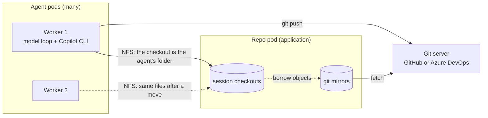
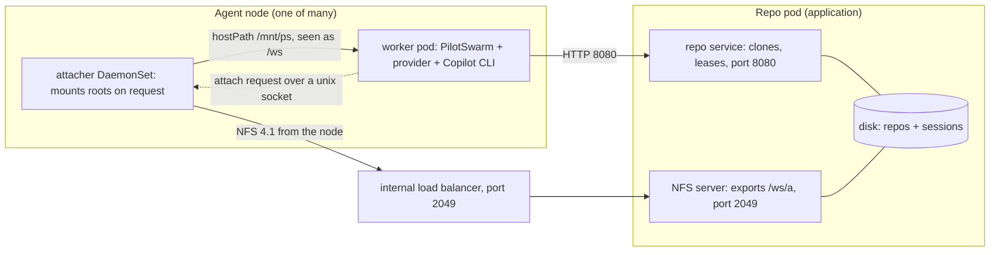
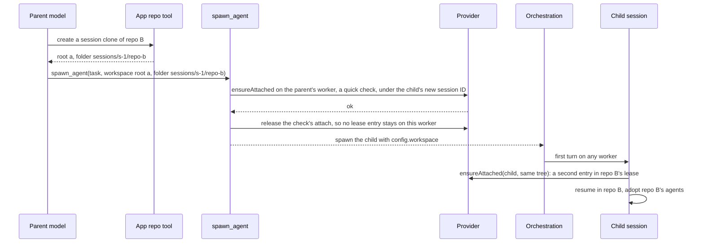

# Session workspaces

**Status:** Proposal, reviewed, not implemented. **Date:** 2026-09-26, revision 3.
Revision 3 folds in review feedback and live checks against the real Copilot
CLI. It replaces the earlier drafts.

An agent works in a real git checkout that lives on a separate repo pod. It
uses its native tools and native git as if it were on a developer's machine.
The session can move between workers and keep both its conversation and its
files. Sub-agents can work in the same checkout or in another repo.

## High-level design

**The problem.** A PilotSwarm session does not stay on one machine. Each
turn runs on a worker: the PilotSwarm process in one agent pod. A later turn
may run on a different worker. PilotSwarm carries the conversation from
worker to worker, but not a working folder, and workers share no disk. So an
agent cannot keep a git checkout and work in it with its native tools, the
way a developer does on a dev box.

**The solution.** Keep each session's checkout on a repo pod. Every worker
reaches it over NFS, a network file system. Just before each turn, the
worker that runs the turn makes sure the folder is mounted.



The main ideas:

- **A workspace** is a session's folder on the NFS export: a root (one
  exported directory, such as `/ws/a`) plus a folder inside it.
- **One checkout per session tree.** A session tree is a root session and
  its children. The repo pod keeps a mirror of each repo and makes one
  `git clone --shared` per tree. The clone has its own branches, index and
  stash. It borrows git objects from the mirror, so it uses little disk.
- **Mount on demand.** Before each turn, PilotSwarm calls the application's
  workspace provider, a module loaded into the worker, and asks it to make
  the folder ready on this worker (`ensureAttached`).
- **One copy of the files.** The files live only on the repo pod. A session
  that moves to another worker, and back, always sees the latest files.
- **Dev-box git.** The agent uses its native tools and real git. It pushes
  with the deployment's git identity. The git servers enforce the rules,
  such as protected branches.
- **Repo agents.** If the provider allows it, the session also uses the
  agents, skills and instructions the repo ships. Repo hooks and repo MCP
  servers never run.
- **Scale.** One repo pod serves many repos and sessions. The target is
  about 100 sessions at once. A deployment may run several repo pods.

**One turn**

```text
On the worker that runs the turn:
1. Load the newest conversation from the database (as today).
2. Call ensureAttached. The provider makes sure the export is mounted on
   this node, checks the folder, and records that this worker now holds the
   session.
3. Check the path: it exists, it is a folder, and it stays inside the export.
4. If the provider allows it, add the repo's agents, skills and
   instructions to the session.
5. Start or resume the Copilot CLI with the folder as its working directory.
6. The model runs the turn.

If step 2 or 3 fails, the model is not called. The prompt is held, the
session shows "waiting", and PilotSwarm retries later. After two failures
on one worker, the retry may go to another worker.
```

**A move to another worker, and back**

```text
The session is pinned to worker 1. The pin ends, for example, after 30
minutes with no turn, or when a long wait starts.
1. Worker 1 stops the session's background shells and tasks, drops the
   session from memory, and tells the provider it left (release).
2. PilotSwarm removes the pin. Any worker may run the next turn.
3. Worker 2 runs the next turn with the steps above. It sees the same
   files, because there is only one copy.
4. A later turn back on worker 1 works the same way. Its mount is still
   there, and it sees every change made on worker 2.
```

Step 1 matters. Without it, a shell left running on worker 1 would keep
writing to the checkout after the session moved.

**Setting a workspace**

| Who | How |
|---|---|
| Whoever creates the session | `createSession({ workspace })` |
| The agent | The tool `set_session_workspace`. The new folder takes effect in a new turn that starts at once. Every other tool call in the current turn is refused, so nothing runs in the old folder by mistake. |
| The owner, an admin or the app | `setSessionWorkspace`, through the client, the Web API or MCP |
| A parent agent | `spawn_agent({ workspace })`. Leave it out to share the parent's checkout. Pass another folder to work in another repo. Pass `null` for no workspace. |

**Who owns what**

| Owner | Owns |
|---|---|
| PilotSwarm core | The session's workspace. The turn steps above. The release when a session leaves a worker. Held prompts. Merging repo agents and skills into the session. The tools, APIs, portal and TUI. It has no git, NFS, Kubernetes or cloud code. |
| The application | The repo service on the repo pod: mirrors, fetches, session checkouts, cleanup, and leases (which session and worker hold each checkout). The provider module: mount requests, checks, and which repo content to adopt. |
| The deployment | The repo pod's NFS server and internal load balancer. The attacher, a helper on each agent node that mounts the export. Git and a git credential helper in the worker image. The rules on the git servers. |

**What does not change**

- A session without a workspace gets the same tools and prompt, and runs
  the same orchestration steps, as today. Only sessions that have a
  workspace, or whose agent asks for the workspace tool, see anything new.
  Tests C1 to C6 prove this, so there is no feature flag.
- Existing repo tools and repo caches keep working as they are. Workspaces
  use their own repo pod.

**Main choices**

| Chosen | Instead of | Why |
|---|---|---|
| Mount on demand, through the provider | Mounts at pod start, plus routing each session to a worker that has its mount | Any worker can run any session. The application keeps its own mount and lease logic. |
| A clone per session tree | Git worktrees of one shared repo | Worktrees share branches and stash. Two sessions could not both check out `main`, and one could pop the other's stash. |
| Rules on the git servers | A guard in the agent's tools | Real git in a shell goes around any tool-level guard. |

The work ships in four phases (section 12): test tools, PilotSwarm core, a
reference deployment in the release environment that uses the public
PilotSwarm repo, and adoption by a downstream deployment.

For details, see section 3 (the parts), 4 (PilotSwarm), 5 (the repo pod,
NFS, leases and git credentials), 6 (step-by-step diagrams) and 7 (what
still differs from a dev box).

## Contents

1. [Goal and scenarios](#1-goal-and-scenarios)
2. [Terms](#2-terms)
3. [Architecture](#3-architecture)
4. [PilotSwarm design](#4-pilotswarm-design)
5. [Reference deployment](#5-reference-deployment)
6. [Walkthroughs](#6-walkthroughs)
7. [Dev-box parity](#7-dev-box-parity)
8. [Corner cases](#8-corner-cases)
9. [Test plan](#9-test-plan)
10. [Decisions, verified facts and open items](#10-decisions-verified-facts-and-open-items)
11. [Implementation map](#11-implementation-map)
12. [Delivery plan](#12-delivery-plan)

## 1. Goal and scenarios

| # | Scenario |
|---|---|
| S1 | An agent works in one repo checkout, as on a dev box. It reads, edits, searches, runs small builds, and uses local and remote git. Section 7 lists the git commands. |
| S2 | About 100 sessions work at the same time, each in its own checkout. |
| S3 | A session moves between workers, and may move back. After any move it sees every change made elsewhere. |
| S4 | A child session works in the parent's checkout, or in a checkout of another repo (multi-repo work). |
| S5 | One repo pod holds many repos. A deployment may run several repo pods. |
| S6 | The session adopts the agents, skills and instructions the repo ships. |
| S7 | Anything the deployment's git identity may do is allowed. The git servers enforce the rules. |
| S8 | Existing sessions and existing repo tools keep working unchanged. |

Not in scope: sandboxing, per-user isolation between session checkouts, high
availability for the repo pod, and provisioning inside PilotSwarm core.

Accepted, and stated here so nobody expects otherwise:

- Every session on an agent pod can read and write every session checkout on
  the export. Only the shared mirrors are protected (section 5.1).
- The agent's shell can print the deployment's git token, and that output
  lands in the transcript. The server-side rules are the guard.
- The agent shell already runs with the worker pod's environment: its
  database URL, provider keys and workload-identity settings. Workspaces add
  the git identity to this; they do not narrow it.
- Repo-native agents and instructions are untrusted text in the prompt. The
  application decides per repo whether to adopt them.

## 2. Terms

| Term | Meaning |
|---|---|
| Agent pod | A pod that runs the PilotSwarm worker: the model loop, the Copilot CLI, and native tools (`bash`, `view`, `edit`, `create`, `grep`, `glob`). Also called a worker pod. |
| Worker | The PilotSwarm process in one agent pod, W1 in the diagrams. Its ID is `workerNodeId` (the pod name, the existing worker option set from `POD_NAME`). It is not the Kubernetes node, N1 in the diagrams. |
| Repo pod | An application pod that keeps git mirrors and session checkouts on its own disk, and exports them over NFS. The reference deployment names it `repo-cache`. |
| Repo service | The HTTP service inside the repo pod. It creates and removes session clones and holds their leases. |
| Existing repo cache | An application's current pod for its repo tools, reached through exec. It does not export NFS, and this proposal does not touch it. |
| Root | One exported directory, mounted at the same path on the repo pod and the agent pods. Example: `/ws/a`. |
| Workspace | The folder a session uses as its working directory (cwd): `{ root, folder }`. |
| Session clone | One `git clone --shared` of a mirror per session tree, shared by parent and children unless a child is given its own folder. It has its own branches, index, stash, config and hooks, and borrows objects from the mirror. Also called the checkout. |
| Session tree | A root session and all of its child sessions. `rootSessionId` names the tree. |
| Workspace provider | Application code that PilotSwarm calls to make a workspace ready on a worker: `listRoots`, `ensureAttached`, `release`. Called "the provider" below. |
| Turn | One model run: prompt in, tool calls, answer out. It ends when the model stops calling tools and the CLI reports `session.idle`. |
| System-only turn | A turn PilotSwarm starts itself, with a `[SYSTEM: ...]` prompt instead of a user message. |
| `<system_context>` note | Text PilotSwarm appends to a prompt to tell the model what changed. It is not in the system message, so the prompt cache is kept. This document names three: the changed-cwd note (4.3), the partial-changes note (4.7) and the agents-changed note (4.6). |
| Native tasks | The CLI's `task` tool, which runs custom agents inside the CLI process. Gated per user by the `copilot.native_tasks` feature flag. |
| Folder-text check | The text rules in 4.1. Every caller runs them in process. |
| Attach | The `provider.ensureAttached` call, with a 30 s deadline. It includes the provider's own steps in 5.3. |
| Path check | PilotSwarm's own out-of-process check of the attach path, with a 5 s deadline. Its timeout error is `WORKSPACE_CHECK_TIMEOUT`. |
| Duroxide | The durable orchestration engine PilotSwarm runs on. It owns the per-session work-item lock and the affinity key. |
| Affinity key | The ID Duroxide uses to keep a session on one worker. A new key lets any worker take the session. |
| Hold window | The 30 minutes a session stays pinned to its worker after its last turn (`idleTimeout`). A wait or cron longer than that releases the worker when the timer is armed. |
| Lossy handoff | A move where the worker's local conversation copy was not saved before the session left it. |
| Eviction sweep | A worker-side clock that drops a session's local copy. It runs every 5 minutes and evicts sessions idle for 35 minutes (the default of `PILOTSWARM_SESSION_EVICT_MS`), so a copy can live up to about 40 minutes. |
| Snapshot store | The database copy of a session's conversation, written after each turn. Store-wins reads it. |
| Store-wins | Before each turn, the worker compares its local copy of the conversation with the snapshot store. If the store is newer, the store copy wins. |
| CMS | The session catalog database (`packages/sdk/src/cms.ts`): sessions, events, `creation_config`. The portal and the list APIs read it. |
| Continue-as-new | The orchestration restarts itself with a fresh history and a carried input. Anything not in that input is lost. |
| Session fingerprint | The key PilotSwarm compares to decide whether a warm CLI session can be reused. A change drops the warm session and resumes the conversation from disk. |
| Warm / cold | Warm: the CLI process still holds the session in memory. Cold: the session is resumed from disk, possibly in a new CLI process. |
| Revision | A counter on the session's workspace. It goes up by one on every set or clear. |
| Budget gate | The existing code path that holds a prompt when a model provider's token budget is exhausted (`budgetStash` in `orchestration/turn.ts`) and replays it later. |

## 3. Architecture



| Part | Owner |
|---|---|
| Mirrors, session clones, fetch, cleanup, leases | Application (repo service) |
| NFS export, internal load balancer, attacher, credential helper, worker image contents | Deployment |
| `listRoots`, `ensureAttached`, `release`, which repo content to adopt | Application provider |
| The session's workspace, revision and status | PilotSwarm |
| Calling the provider, checking the path, pointing the CLI at it | PilotSwarm |
| Repo agents and skills merged into the session | PilotSwarm |
| Workspace for sub-agents; APIs, MCP, portal and TUI | PilotSwarm |

PilotSwarm core has no git, NFS, Kubernetes or cloud code.

## 4. PilotSwarm design

### 4.1 Roots and the workspace record

```ts
interface SessionWorkspace {
    schema: 1;         // record version; v1 = one folder
    root: string;      // a root name
    folder?: string;   // relative to the root; omitted = the root itself
}
```

- **Where roots come from.** A registered provider supplies the root list
  (`listRoots`). PilotSwarm calls it on every set, create and spawn, and
  before each `ensureAttached`. It does not cache the list across turns. A
  deployment without a provider may set `workspaceRoots` on the worker, and
  the built-in provider serves them with `path = root path + folder` and
  adopts nothing.
- **Where the workspace is stored.** `config.workspace` in the session config,
  so continue-as-new and child sessions carry it. The revision, status, retry
  state and pending note are orchestration state (section 4.7).
- **Relation to `config.workingDirectory`.** That field exists today, is
  passed to the CLI for every session, and children inherit it. The workspace
  does not touch it. The attach path is per-turn data: it is handed to the
  CLI as `workingDirectory` for that turn and never written to config.
  Precedence: attach path, else `config.workingDirectory`, else the worker
  process cwd. Clearing the workspace, or a child spawned with
  `workspace: null`, returns to the last two.
- **Folder rules.** The folder-text check runs in every caller (client, Web
  API, MCP, the agent tool): relative only, no leading `/`, no NUL, no `..`
  after normalizing. The filesystem rules run only on a worker, because only
  workers see the roots: `realpath` stays inside the root
  (`WORKSPACE_PATH_INVALID` otherwise), and the target is a directory
  (`WORKSPACE_FOLDER_MISSING` for an absent path, a file, a FIFO or a symlink
  to a file). Only workers know the root list, so `WORKSPACE_ROOT_UNKNOWN` is
  raised only by the worker. The client, Web API and MCP do not validate
  root names. The agent tool and `spawn_agent` do, because they run on a
  worker. A session created with an unknown root is held with
  `WORKSPACE_ROOT_UNKNOWN` on its first turn.
- **v1 has one workspace per session.** The `schema` field lets a later
  version hold several named folders.

### 4.2 The provider hook

```ts
interface WorkspaceProvider {
    listRoots(): Promise<Array<{ name: string; path: string }>>;
    ensureAttached(req: WorkspaceAttachRequest): Promise<WorkspaceAttachResult>;
    release?(req: WorkspaceAttachRequest): Promise<void>;          // best effort
}

interface WorkspaceAttachRequest {
    sessionId: string;
    rootSessionId: string;      // the session tree, for leases
    workspace: SessionWorkspace;
    revision: number;
    workerNodeId: string;       // the worker's own ID (its pod name), not the Kubernetes node
    turnIndex: number;          // rises every turn
}

type WorkspaceAttachResult =
    | { ok: true; path: string;
        adopt?: { agents: boolean; skills: boolean; instructions: boolean } }
    | { ok: false; code: string; message: string; retryAfterMs?: number };
```

Rules for provider implementations:

- **Stable paths.** The same workspace must get the same path on every
  worker. A changed cwd misses the prompt cache and changes the session
  fingerprint (section 4.4).
- **No synchronous file calls on the mount inside the hook.** PilotSwarm
  enforces a deadline (30 s), but it cannot stop a blocked event loop. Use
  child processes.
- **An empty mount point is not proof of a mount.** Check the real mount,
  for example with a marker file on the export.
- **`adopt` omitted means adopt nothing.**

### 4.3 Setting a workspace

| Who | How |
|---|---|
| Whoever creates the session | `createSession({ workspace })` |
| The agent | `set_session_workspace({ root, folder })` or `({ clear: true })` |
| Owner, admin or app controller | `setSessionWorkspace(sessionId, { expectedRevision, workspace })` |
| A parent spawning a child | `spawn_agent({ task, workspace })`. `workspace` is a full `{ root, folder }` record. Omitted: the child inherits the parent's workspace. A record: the child gets that workspace. `null`: the child gets none. A record is checked on the parent's worker at spawn time: a bad folder fails the `spawn_agent` call and no child is created. The tool description tells the model: give the child its own folder when it will switch branches, stash, reset or commit while you keep working; two sessions in one clone share one HEAD, index and stash (K15). |

**Which sessions get the tools.** The two workspace tools and the
`spawn_agent` `workspace` parameter are declared in a session when it has a
workspace, or when its agent definition lists `set_session_workspace` in
`tools`. Every other session keeps its current tool list and prompt, byte for
byte. Test C1 uses a session whose agent lists no workspace tool.

**Agent tool flow**

```text
1. The handler runs the folder-text check, the attach on this worker, and the
   path check.
     invalid folder or root            -> error text; the turn goes on
     same workspace as now             -> "no change" text; the turn goes on
     a task or shell is running        -> WORKSPACE_BUSY text; the turn goes on
        (rpc.tasks.list(): any row of type agent or shell, status running or idle)
2. Otherwise the handler records the change as a pending action of type
   set_workspace and returns the acknowledgement:
     Workspace change accepted: root "a", folder "sessions/s-1/lib".
     [SYSTEM: set_session_workspace acknowledged. You are still in <old path>.
      The working directory becomes <new path> only after this turn ends.
      Do not edit or run anything now. Stop and end your turn.]
3. From that point, every further tool call in the same turn is refused:
     every tool        -> the session's onPreToolUse hook returns
                          permissionDecision "deny" with the reason
                          "The working directory is changing. This turn is ending.
                           Stop; continue in the next turn."
                          (verified: the hook also sees PilotSwarm tools)
     PilotSwarm tools  -> as a backstop, the existing blockedAfterTurnBoundary text
                          (set_workspace joins TERMINAL_TURN_BOUNDARY_ACTIONS)
   The hook is installed for every session that has the workspace tools, also
   when native tasks are off.
4. The model stops. The CLI fires session.idle. The turn result carries the action.
5. Orchestration stores the workspace, revision + 1, emits session.workspace_changed,
   and starts one system-only turn at once. That turn resumes the same conversation
   in the new folder, with the changed-cwd note in <system_context>:
     "Working directory changed from <old> to <new>. Repo agents adopted: <names or none>.
      Repo skills adopted: <names or none>. Continue your task."
```

Why step 3 exists: the turn ends only when the model yields. PilotSwarm never
aborts the CLI for a control tool. Live runs (section 10) showed that after
today's acknowledgement text some models keep calling `bash` and `edit`. One
started a background shell after the busy check had passed. The explicit text
fixed one model; the deny fixes the rest.

**External flow**

```text
1. The API layer runs the folder-text check and the access check, then enqueues
   a command on the same channel as set_model.
2. The command handler in the orchestration compares expectedRevision with the
   stored revision. Stale -> WORKSPACE_REVISION_CONFLICT; nothing changes.
3. It runs the attach activity (checkWorkspace: attach plus the path check) on
   runtime.session, the affinity-pinned proxy, so it lands on the worker that
   holds the session. It uses the same code as the turn preamble.
     fails -> the command is rejected; the old workspace stays
4. It stores the new workspace and revision + 1, emits the event, and stores the
   changed-cwd note for the next turn (workspaceNotice, section 4.7).
5. It does NOT continue-as-new with a bootstrap prompt and does NOT clear the idle
   timer. Both are what set_model does, and both would force a model turn.
6. Busy session: the command waits for the running turn, then runs steps 2-5.
7. The external path runs no busy check. If a background shell is still running
   at that boundary, releaseWorkspace (section 4.5) cancels it before the new
   resume. The old folder gets no further writes.
```

### 4.4 Every turn of a workspace session

```text
1. Store-wins preamble (as today)
2. Attach: provider.ensureAttached, with a 30 s deadline
3. Path check, out of process, 5 s: inside the root, a directory
4. If adopted: read the repo's agents and skills (section 4.6)
5. Create or resume the Copilot session with:
     workingDirectory       = attach path
     customAgents           = PilotSwarm agents + repo agents
     skillDirectories       = PilotSwarm folders + <clone root>/.github/skills
     skipCustomInstructions = !(adopt && adopt.instructions)
     custom_instructions    = PilotSwarm's base prepended, not replaced,
                              when instructions are adopted (see 4.6)
     enableFileHooks        = false     (repo hooks never run)
   The path, the three adopt flags and the repo-agent hash join the session
   fingerprint. A change to any of them drops the warm session and resumes the
   same conversation from disk.
6. Run the turn
```

- **The clone root** is the nearest ancestor of the attach path, including
  the path itself, that contains `.git`. If there is none, nothing is adopted.
- **One CLI process per credential and root.** One CLI process serves every
  workspace session that shares a credential and a root. Sessions on
  different roots get different processes, so a hung mount freezes only its
  own root. The client pool is already keyed by credential; the root becomes
  a second part of the key. With per-user credentials this multiplies
  processes (about 150–300 MB each, to be measured). Alternative: one process
  per root, with the per-user key passed as `SessionConfig.gitHubToken` per
  session. It avoids the multiplication but changes how GitHub-provider
  sessions authenticate today; verify on CLI 1.0.83 before choosing it.
- **One path check per root at a time.** A queued check waits up to 5 s for
  the running one. If the running check has already timed out, the queued
  check fails at once with `WORKSPACE_CHECK_TIMEOUT` and the session is held.
  Sessions on other roots, and sessions with no workspace, are not affected.
- **Wall-clock cap.** If a turn hits the turn timeout, the worker aborts the
  turn, then stops every running shell before it returns the error, so no
  shell outlives the turn (test F10). After an abort the CLI refuses
  `rpc.tasks.cancel` (it answers `cancelled: false`), so the worker kills the
  shell's process tree by the pid the CLI reports (`process-tree.ts`). The
  abort comes first so the model cannot start a new shell after the stop.
  Risk, not tested: the next turn on that warm session may hang; the
  fingerprint-driven cold resume is the fallback.

### 4.5 Leaving a worker: `releaseWorkspace`

What it does, for a session that has a workspace, on the worker that holds
the session:

```text
1. rpc.tasks.list() -> rpc.tasks.cancel({ id }) for every task with status running
   or idle, of type shell (attached or detached) or agent. A shell the CLI will
   not cancel is killed with every process below it, by its pid
2. rpc.tasks.list() again; stop when none remain. A shell whose pid is dead
   counts as done, although the CLI still lists it as running
3. ManagedSession.destroy(), which is the SDK's disconnect(): it releases the
   in-memory handle and never deletes the session directory
4. provider.release(req)
```

Step 1 is required. Live check on CLI 1.0.83: `disconnect()`, `client.stop()`,
`abort()`, `forceStop()` and `rpc.shutdown()` all left a background shell
running. Only `rpc.tasks.cancel` killed it, within 2 s, for attached and
detached shells alike, and only while the session had not been aborted.
After an abort (a stopped turn, the wall-clock cap, the inactivity
watchdog), `rpc.tasks.cancel` answers `cancelled: false` and the shell keeps
running; the pid kill in step 1 covers that case.

When it runs:

| Trigger | How |
|---|---|
| Every affinity release: the hold window ends, a wait or cron longer than the hold window is armed, a turn error, a lossy handoff, two failed attempts on one worker (4.7) | One call inside `releaseAffinity()`, taken only when `config.workspace` is set, so every present and future release site gets it. Sessions without a workspace schedule nothing new. |
| Complete, cancel, delete | The existing session-pinned `destroySession` activity, extended to run steps 1–4 when the session has a workspace. No new yield. |
| The workspace changes or is cleared | Steps 1–4 for the old folder, on the worker, before the new resume |
| Graceful worker shutdown | Worker-side, after the drain, for idle workspace sessions still in memory |

Rules:

- The orchestration always races the activity against a timer
  (`ctx.race(activity, ctx.scheduleTimer(cap))`), at every site. The cap is
  10 s, under the 15 s retry floor. A session-pinned activity has no timeout
  of its own, so this race is the only bound.
- When the timer wins, the orchestration releases affinity anyway. The old
  worker still runs the activity when it recovers. Until then its copy can
  live, and its shells can write. That is why the provider must handle a
  stale holder (section 5.3).
- If the worker is dead, another worker may run the activity after the 30 s
  lock expires. It has no in-memory copy, so steps 1–3 do nothing and it
  skips step 4. The provider learns about the dead holder at the next
  `ensureAttached`.
- The worker's eviction sweep also runs steps 1–4, as a backstop.

Why this is needed: today PilotSwarm tells the old worker nothing when a
session moves. The old copy lives until that worker's eviction sweep, up to
about 40 minutes. With a shared checkout, a shell left running there would
keep writing.

### 4.6 Repo-native agents, skills and instructions

| Repo files | Adopted when `adopt` allows |
|---|---|
| `.github/agents/*.agent.md` | Merged into `customAgents`. Limits: 30 agents, 64 KB each. Agents past the 30th, and any file over 64 KB, are skipped and listed in `session.workspace_adopted.skipped`. |
| `.github/skills/<name>/SKILL.md` | `.github/skills` is added to `skillDirectories` |
| `AGENTS.md`, `.github/copilot-instructions.md` and similar instruction files | Loaded by the CLI when `skipCustomInstructions` is false. The CLI puts them in its `custom_instructions` section, which PilotSwarm otherwise replaces with its base prompt; for a session that adopts instructions, PilotSwarm prepends its base to that section instead, so the repo's files follow it. |
| `.mcp.json`, `.github/mcp.json`, `.vscode/mcp.json`, an agent's `mcp-servers` | Never. The CLI starts repo MCP servers only with discovery on and a trusted folder; PilotSwarm sets neither. |
| `.github/hooks/*` | Never. `enableFileHooks: false` on every create and resume. Verified: without it the CLI runs repo hook commands on every prompt. |

The out-of-process path check reads these files, inside its deadline, only
when `adopt` asks for agents or skills (`workspace-check.ts`). A file or
folder whose real path leaves the workspace is never read and is reported
as skipped. The CLI reads the skills folder itself, so one skill that
leaves the workspace skips every repo skill.

Filters on each repo agent (`workspace-repo-agents.ts`):

- **Tools:** pass the names through as written. The CLI resolves its own
  alias names (`read` → `view`; on 1.0.83 `search` resolves to nothing).
  MCP-qualified names (`server/tool`) are dropped. PilotSwarm tool names are
  dropped too: a native child cannot call a PilotSwarm tool. An agent left
  with no tools is skipped, because the CLI reads `[]` as "no tools". A file
  with no `tools` key passes none, and the CLI gives the agent every tool.
- **MCP servers:** dropped.
- **Model:** the agent runs on the session's model. The child guard pins the
  model on every `task` call anyway. A different model in the file is
  reported.
- **Name collision:** a PilotSwarm agent with the same name wins (the two
  native profiles, the CLI's built-in agents, and the worker's loaded
  agents), and so does an earlier repo file with the same name. The skipped
  file is reported.
- Every drop is listed in `session.workspace_adopted.skipped`, with the
  agent's name when it was still adopted.

PilotSwarm reads these files itself instead of turning on CLI discovery. Two
verified reasons: a discovered repo agent cannot launch through `task` in the
SDK runtime PilotSwarm uses (section 10), and an explicit `customAgents` list
replaces the agents the CLI would discover. PilotSwarm passes such a list
whenever native tasks are on, and also whenever the worker has any loaded
agents (from plugins, agent packages, bundled agents or inline config), even
with native tasks off. With discovery on and a trusted folder, the CLI also
starts repo MCP servers.

How agents are used:

- The CLI lists custom agents in its `task` tool, so the model runs a repo
  agent the way it would on a laptop. A user can also ask for one by name.
- The native child guard in `native-subagents.ts` knows the adopted agents.
  Its `onPreToolUse` hook denies every `task` call whose `agent_type` is not
  `swarm-explore`, `swarm-task` or an adopted agent, and denies a child tool
  that is not in `childTools`. The CLI already limits each child to its
  agent's resolved tool list, so for a child of an adopted agent the guard
  allows any CLI tool, and still denies PilotSwarm tools, `task` (no
  nesting) and detached shells. `RepoAgentAccess` maps each child to its
  agent from the runtime's `subagent.started` events, never from model
  arguments, for that session only.
- Sessions that adopt repo agents need native tasks on for the owner
  (`copilot.native_tasks`). If it is off, agents are reported as skipped.
- `get_session_workspace` and the portal inspector name the adopted agents
  and skills, from the `session.workspace_adopted` event. The worker writes
  it when a turn's adopted set is new or differs from the last event. That
  turn's prompt gets a note in its system-context block:

  ```
  First adoption:  Repo agents available through the task tool: <names>.
                   Repo skills available: <names>.
  A later change:  Repo agents changed: added <names>, removed <names>.
                   Repo skills changed: added <names>, removed <names>.
  ```

  A change is a branch switch that edits the agent files, a flip of an
  `adopt` flag, or a new folder. The fingerprint carries a hash of the
  adopted content (`repoAgentHash`), so a changed set resumes the session
  even when the path and `adopt` stay the same.
- The CLI's on-demand instruction discovery stays off (its default).

### 4.7 Failures and held prompts

**The wait result.** A failed attach or path check does not call the model.
The worker returns the same `wait` turn result that the budget gate uses
(section 2), with one typed field that names the gate:

```ts
{ type: "wait", gate: "workspace", code: "WORKSPACE_FOLDER_MISSING",
  reason: "workspace unavailable: folder missing",
  workerNodeId: "<this worker>", retryAfterMs?: <from the provider> }
```

The orchestration computes the wait seconds from `workspaceRetry.step` and
`retryAfterMs`; the worker does not pick them. `workerNodeId` feeds
`workspaceRetry.failures`.

The budget gate today keys on a literal `budget: true` flag in the drain
interrupt, the post-turn drop, the continue-as-new carry, the restore and the
model-switch capture. All five read `gate`, and fall back to `budget: true`.
The worker keeps emitting `budget: true` for budget waits, so frozen 1.0.79
still works. Without this, a workspace wait is re-armed after recovery and
the session goes back to sleep.

**Status.** No new session status. The session shows `waiting`, with the
reason and the gate flag, like a budget pause. `getSessionWorkspace` reports
`status: "unavailable"` as a field of the workspace view. Events:
`session.workspace_unavailable` on each failure, `session.workspace_available`
on recovery.

**Held prompts.** The prompt is kept and runs later, the same way a prompt
the budget gate refuses is kept today. The code calls that store the stash
(not git stash). The stash entry is extended with the attachment references
and the sender, both also written on the stash-time `user.message`. On
recovery the held references ride the turn input as `attachments`, so images
reach the model. Attachment blobs must stay until the held prompt runs. That
can be hours or days, not the 30-minute hold window.

**Retry wake.** The retry timer has its own type, `workspace_retry`. When it
fires, the worker runs only the attach and the path check. If they pass, the
held prompts run as one normal turn. If they fail, no model call happens.
Nothing from the retry is stashed as a user message. The budget gate has this
defect today: its wait timer is the generic type and wakes with the plain
text "The N second wait is now complete. Continue with your task."
(`turn.ts:1432`), and the stash filter (`turn.ts:985`) does not skip that
text. 1.0.80 fixes it the same way: the budget wake becomes a `[SYSTEM: ...]`
prompt, and the filter also skips the `^The \d+ second wait is now complete\.`
shape for older histories.

**Schedule and state.** The orchestration owns the schedule: 30 s, 2 min,
5 min, then every 15 min, or the provider's `retryAfterMs` when larger. The
workspace wait does not use the budget clamp (`MIN_BUDGET_WAIT_SECONDS`, 5 s):
`seconds` carries the schedule value as computed, so the test override can
be milliseconds. New orchestration input fields, each carried through
continue-as-new only when set and normalized from absent:

| Field | Holds |
|---|---|
| `workspaceRevision` | The revision |
| `workspaceStatus` | `ready` or `unavailable`, with the last code |
| `workspaceNotice` | The pending changed-cwd or agents-changed note. Consumed by the next turn of any kind, including a system-only turn such as the retry wake or a cron turn. Never stored in `pendingSystemPrompt`, which would force a model turn. |
| `workspaceRetry` | `{ step, failures: { workerNodeId, count } }`. Reset on `workspace_available`. Task progress never resets it early. |

**Two failures on one worker.** Two attempts in a row on one worker where
the attach or the path check fails: the orchestration releases affinity so
another worker can take the next retry. The 30 s retry runs on the same
worker, because a wait inside the hold window keeps affinity. Its failure is
the second one, so affinity is released before the 2-minute retry, and that
retry may run on any worker. Without routing, the new key may land on the
same worker again. The release does not reset the count for that worker;
every further failure there releases affinity again, until a check passes.

**Lost or retried turn.** The next turn of a workspace session gets the
partial-changes note: "An earlier attempt may have changed files. Check
`git status` first." The worker adds it when either signal is true:

```
retryCount > 0                    the orchestration is retrying a failed turn
row.activeTurnIndex == turnIndex  an earlier attempt of this turn reached the
                                  model call and was lost; a worker crash
                                  sends the same input again, retryCount 0
```

The worker reads the session row at the top of the activity, before this
attempt writes `activeTurnIndex`. A gate refusal returns before that write,
so a held prompt does not count as an attempt.

**The owner acts.** Retry now (interrupts the wait, like a message), clear,
or pick another folder. Stop, cancel, complete and delete work as usual.

### 4.8 APIs, events, errors

Add each operation in every one of these places: the management client, the
Web API (the `OPERATIONS` table), `HttpApiTransport`, MCP, then the portal
and TUI. A method missing from `HttpApiTransport` shows in the portal as
"not available on this transport".

| Operation | Client, Web API, MCP | Agent tool |
|---|---|---|
| Read | `getSessionWorkspace` | `get_session_workspace` |
| Set or clear | `setSessionWorkspace` | `set_session_workspace` |
| Retry now | `retrySessionWorkspace` | none |
| At creation, or for a child | `createSession({ workspace })` | `spawn_agent({ workspace })` |

`getSessionWorkspace` returns the workspace, revision, path, status, last
error, held-prompt count, and the adopted agents and skills. It reads them
from the latest workspace events, so no CMS migration is needed in v1.

**Events**

| Event | Payload |
|---|---|
| `session.workspace_changed` | `{ workspace \| null, revision, path \| null, source: "create" \| "agent" \| "external" }`. Emitted with revision 1 on the first turn of a session created with a workspace, and on every set and clear. |
| `session.workspace_unavailable` | `{ revision, code, message, workerNodeId }` |
| `session.workspace_available` | `{ revision }` |
| `session.workspace_adopted` | `{ revision, agents, skills, skipped }` |

**Errors:** `WORKSPACE_ROOT_UNKNOWN`, `WORKSPACE_PATH_INVALID` (also a
symlink that leaves the root, and a folder that fails the text check),
`WORKSPACE_FOLDER_MISSING` (also a file, a FIFO or a symlink to a file),
`WORKSPACE_CHECK_TIMEOUT`, `WORKSPACE_ATTACH_TIMEOUT` (the 30 s attach
deadline passed), `WORKSPACE_ATTACH_FAILED` (the provider threw or returned
no path), `WORKSPACE_REVISION_CONFLICT`, `WORKSPACE_BUSY`. Provider codes,
such as `WORKSPACE_IN_USE`, pass through unchanged.

### 4.9 Compatibility: additive by construction

There is no feature flag. Every change is triggered by "this session has a
workspace", or, for the tool declarations only, by the agent definition
listing `set_session_workspace` (section 4.3). Tests C1–C6 prove that nothing
else changes.

| Shared place | Rule |
|---|---|
| Tool declarations | New tools and the `spawn_agent` parameter appear only under the rule in section 4.3 |
| Session fingerprint (`session-manager.ts`) | Add keys only when a workspace is set |
| `workingDirectory` | Passed for every session today. A workspace session overrides the value for that turn (section 4.1). |
| Child config (`session-proxy.ts`, `orchestration/agents.ts`), `projectSerializableSessionConfig` | Add `workspace` only when it is set |
| CLI client pool, `skipCustomInstructions`, `enableFileHooks`, `customAgents`, the native deny hook | Change only for workspace sessions |
| Orchestration | 1.0.80; freeze 1.0.79. Sessions without a workspace schedule the same activities and timers. The orchestration reacts to `config.workspace`, which is recorded data. Frozen 1.0.79 imports the live `session-proxy.ts`, `wait-affinity.ts` and `provider-budgets.ts`, so any change to a shared type must stay backward compatible: new fields on the runTurn input (`turnMeta`), on `TurnResult` and on the `spawn_agent` action are optional and omitted when unset. The new activities (`releaseWorkspace`, `checkWorkspace`) are scheduled only from the 1.0.80 folder. C4 checks this. |
| CMS | No migration in v1. The Web API, MCP and the portal read the current workspace from the latest `session.workspace_changed` event. The orchestration reads `config.workspace`. `sessions.creation_config` holds the creation-time workspace only and is never read as current. Session lists do not show or filter by workspace in v1. |

## 5. Reference deployment

This is the application side, for guidance. PilotSwarm does not enforce it.
Phase 3 of the delivery plan (section 12) builds it in the release
environment, so downstream deployments can copy a working example.

### 5.1 Repo pod layout and ownership

```text
/ws/a/                              uid 2000  0755   root of the export
  .pilotswarm-export                uid 2000  0644   marker; sessions can stat it, not delete it
  repos/<repo>.git                  uid 2000  0755   mirror; an object cache; sessions read only
  remotes/<name>.git                uid 2000  0755   sandbox remote (reference deployment only);
                                                     sessions reach it over HTTP, never through the mount
  sessions/                         uid 1000  0755
    <rootSessionId>/<repo>/         uid 1000         session clone = the session's cwd
      .git/objects/info/alternates -> ../../../../../repos/<repo>.git/objects
      .git/refs, config, hooks, index, stash   <- the session's own
      origin = the real remote URL
```

```text
Who runs as what:
  repo service (fetch, mirror maintenance)             uid 2000
  clone creation (git clone --shared into sessions/)   uid 1000, spawned by the repo service
  worker, Copilot CLI, agent bash                      uid 1000
```

- **Why two uids.** Deleting a file needs write permission on its parent
  directory. With `repos/` owned by 2000 and mode 0755, a session cannot
  delete, rename or add anything under a mirror. A clone only reads the
  mirror; new commits go into the clone's own `.git/objects`. Verified: a
  clone commits normally with a read-only object store. Git's "dubious
  ownership" check looks at the clone's own `.git`, owned by 1000, so it
  passes. `root_squash` alone is not isolation: it only remaps root.
- **Clone per session tree, not a git worktree.** Worktrees share branches,
  stash, config and hooks through the mirror. Two sessions cannot both check
  out `main`, and one can pop another's stash. The same holds for a parent
  and a child that share one clone (K15).
- **Mirror maintenance.** Only the repo service runs git on a mirror. Set
  `gc.auto=0`, `maintenance.auto=false`, `gc.pruneExpire=never`. Allowed:
  `git gc`, `git maintenance run`, `git repack -A -d`, `git repack --cruft -d`,
  `git repack -a -d -k`. Forbidden, because each one drops unreachable
  objects that a clone may still borrow: `git prune`, `git gc --prune=<time>`,
  `git repack -a -d` without `-A` or `-k`. Verified: each forbidden command
  broke a clone (`fsck`: invalid sha1 pointer); each allowed one left it
  clean. To reclaim space, first run `git repack -a -d` (no `-l`; `git gc`
  inside a clone passes `-l` and copies nothing) inside every live clone and
  remove its alternates file, then prune the mirror. This copies the whole
  object store into each clone. Or prune only when the mirror has no live
  clones.
- **Each root has one unique path, the same on the repo pod and the agent
  pods.** `git clone --shared` writes the alternates entry and
  `remote.origin.url` as absolute mirror paths. The repo service rewrites
  both when it creates the clone: alternates to the relative form shown
  above, origin to the real remote URL. Only reflog messages still name the
  mirror path, and git does not use them for object lookup. The same-path
  rule still holds for the prompt cache and the session fingerprint
  (section 4.2).
- **Use a separate repo pod for workspaces.** An existing repo cache reached
  through exec stays untouched. Nothing there changes: no restart, no new
  container, no uid or gc change, no shared CPU or disk.

### 5.2 Export and attach

- **NFS server** in the repo pod, NFS 4.1 only. Export options:
  `rw,sync,no_subtree_check,root_squash,fsid=1`. The fixed `fsid` keeps file
  handles valid across restarts. Client tracking must survive restarts too:
  run `nfsdcld` in the pod, with `rpc_pipefs` mounted and its storage
  directory `/var/lib/nfs/nfsdcld` on the same persistent volume as `/ws/a`,
  so it also follows the pod in K7. Otherwise the server ends its grace
  period early and clients lose their locks (opens recover anyway). These
  export options are kernel-nfsd `exports(5)` syntax. NFS-Ganesha uses an
  `EXPORT` block (`Squash`, `Filesystem_Id`, `Protocols`), so the fallback is
  a config rewrite, not a drop-in.
- **Mount source:** with `fsid=1` the attacher mounts `<ilb-ip>:/ws/a`. Only
  `fsid=0` would make the export the v4 root and the source `<ilb-ip>:/`.
- **Internal load balancer** with a static private IP, port 2049,
  `externalTrafficPolicy: Local`. Annotations:
  `service.beta.kubernetes.io/azure-load-balancer-internal: "true"` and
  `service.beta.kubernetes.io/azure-load-balancer-ipv4: <ip>` (add
  `azure-load-balancer-internal-subnet` if the IP is in another subnet). It
  is the address the node kernel mounts. Inside one cluster, kube-proxy
  rewrites the load balancer IP to the repo pod IP on the node itself. The
  Azure load balancer carries traffic only when the repo pod is in another
  cluster (section 12.2). When the repo pod restarts or moves, clients keep
  the same IP, reconnect by themselves, and reclaim state in the grace period
  (section 6.4).
- **Same uid and gid** for session clones on both sides: 1000. If the uids
  differ, every git command run from the checkout fails with `fatal: detected
  dubious ownership in repository`, and git does not read the clone's
  `.git/config` (credential helper, identity, hooks). Fix the uid. Do not add
  `safe.directory`: with a different uid the agent usually cannot write to the
  clone's files anyway.
- **Attacher DaemonSet** on every agent node:
  - `privileged: true`, `hostNetwork: true`, `dnsPolicy:
    ClusterFirstWithHostNet`. The kernel ties an NFS mount to the mounting
    process's network namespace. A mount made from a pod network hangs
    forever when that pod restarts.
  - `hostPath /mnt/ps` (`DirectoryOrCreate`) mounted with
    `mountPropagation: Bidirectional`, and an image with `mount.nfs4`.
  - Never unmounts, not on SIGTERM either. A restart leaves mounts in place.
  - Listens on a unix socket on a hostPath (`/run/pilotswarm-attacher`),
    mounted into worker pods. Any process in a worker pod can call it,
    including the agent's shell. It accepts only root names from its
    configured list, mounts each at `/mnt/ps/<root>`, and has no unmount call.
  - Remounts a root when the provider reports `ESTALE` (section 5.3).
- **Worker pods** mount `hostPath /mnt/ps` at `/ws` with `HostToContainer`
  propagation, so a mount made later shows up in running pods. Kubelet never
  deletes through a hostPath. Do not mount NFS inside an `emptyDir` from a
  sidecar: when the pod ends, kubelet cleans the emptyDir and could delete
  files on the export.
- **Mount options:**
  `nfsvers=4.1,hard,timeo=600,retrans=2,actimeo=3,lookupcache=positive,nconnect=4`.
  Data is rechecked on every open (close-to-open). Attributes are cached for
  at most 3 s. "Does not exist" is never cached.
- **NetworkPolicy.** NFS traffic comes from node IPs, never from pod IPs, so
  the 2049 rule is an `ipBlock` for the agent node subnet. The 8080 rule is a
  `podSelector` for worker pods.

### 5.3 Provider behavior

```text
ensureAttached(req):
  1. root not in /proc/self/mountinfo -> ask the attacher over the socket (20 s limit)
  2. child process: stat <root>/.pilotswarm-export      (ESTALE -> remount, below)
  3. child process: stat <root>/<folder>                (must be a directory)
  4. POST <repo service>/v1/leases
       { checkout: "sessions/<rootSessionId>/<repo>", sessionId, rootSessionId, workerNodeId, turnIndex }
       the checkout's clone record names another tree -> { ok: false, code: "WORKSPACE_IN_USE" },
                                                         whether or not any entry is live
       a dead entry of the same tree, no live entry    -> the service removes stale git lock files,
                                                         then continues
       a dead entry of the same tree, a live entry     -> the service continues; lock files stay
       otherwise                                       -> the service adds or refreshes this
                                                         session's entry
  5. return { ok: true, path, adopt }                   (adopt comes from per-repo config)
release(req): DELETE the caller's entry. The clone stays owned by its tree until it is deleted.
```

Lease rules, kept by the repo service and not on the export:

- One lease per checkout, keyed by the clone's folder
  (`sessions/<rootSessionId>/<repo>`), with one entry per session
  `{ sessionId, rootSessionId, workerNodeId, turnIndex, time }`. A parent and
  its children hold separate entries in one lease.
- An entry is dead when its worker is absent from the worker registry, or
  its time is older than the hold window plus the eviction margin (about 40
  minutes, or longer if the deployment raises `PILOTSWARM_SESSION_EVICT_MS`).
  Git lock files are removed only when no live entry remains.
- "Released" means "not on a worker". It does not free the checkout for
  another tree. Only cleanup, after the tree ends, does that.
- The lease is metadata for cleanup and stale-lock removal. PilotSwarm does
  not serialize the sessions of one tree in one checkout; git's `index.lock`
  prevents file corruption only (K15).

Remount of root `a` on one node:

```text
1. Every workspace session on that node that uses root a runs releaseWorkspace
   (section 4.5), which cancels its shells and native tasks.
2. The attacher runs `umount -l /mnt/ps/a`. A plain umount hangs on an
   unreachable server, or returns EBUSY while a process is inside.
3. The attacher mounts root a again at the same path. Processes still inside
   the old mount keep the old instance until they exit. With the default
   `sharecache`, a lingering old mount of the same export can make the new
   mount reuse the stale instance, so step 1 must finish first (or mount with
   `nosharecache`).
```

### 5.4 Git credentials and protections

- **A git credential helper**, set in each session clone's own `.git/config`:
  first `credential.helper=` (empty, which clears any global helper,
  including URL-scoped ones a shared `HOME` may hold), then the deployment's
  helper. It mints short-lived tokens (minutes) with the deployment identity
  and caches them until near expiry. It answers only for the hosts and paths
  of the clone's configured remotes (`credential.useHttpPath=true` in the
  clone) and returns nothing for any other host, so a prompt-injected push to
  another host cannot carry the token out. Any session on the pod can still
  invoke the helper; the helper itself limits what it mints. Git sends HTTP
  Basic with the token as the password; git 2.46 or later can send a Bearer
  header if the server needs one. A transcript of a workspace session may
  hold a short-lived token, and every user who can open a shared session can
  read it. PilotSwarm has no output redaction today; adding one is a later
  item.
- **`gh` and `az` wrappers**, on `PATH`, mint tokens the same way. They make
  PR creation work. The wrappers never run `gh auth setup-git` and never
  write `~/.gitconfig`. `HOME` is shared by every session in the pod
  (section 7), so a global helper written there would shadow every clone's
  helper.
- **The worker image** must contain git (2.46 or later), the helper and the
  wrappers. Today it has none of them.
- **The git servers are the guard.** Before a repo is listed for workspaces,
  the deployment must prove on the server that the identity is denied what
  any old tool-level guard denied: a push to a read-only repo fails, a push
  outside the allowed branch namespace fails, and a push to a protected
  branch fails. A tool-level guard does not apply to native git.

| Rule | Azure DevOps | GitHub |
|---|---|---|
| Read-only repos | The identity has Read only | The app has no contents write on these repos |
| Protected branches | Branch policies (a PR and reviewers), plus deny force push and delete | Rulesets: require a PR, block force pushes and deletions |
| Optional branch namespace | Branch folder permissions, for example create only under `agent/` | A ruleset that restricts other branches, with humans on the bypass list |
| Existing agents | The rules must still allow their current pushes and PR operations | Same |

### 5.5 Capacity

These numbers are estimates. The load tests in section 9 must confirm them.

| Item | Guidance |
|---|---|
| Repo pod disk | Premium SSD class. About 500 IOPS is far too low for 100 sessions. |
| Repo pod node | Dedicated, with a lot of RAM. The NFS server caches files in node memory. Mark the pod `cluster-autoscaler.kubernetes.io/safe-to-evict: "false"`. |
| Large repos (100k+ files) | `git status` takes seconds over NFS. Use sparse checkout and `feature.manyFiles=true`. That setting also turns on the untracked cache, index version 4 and `index.skipHash`. Git 2.13 to 2.39 can still use such a clone, but its `git fsck` reports a bad index, so install git 2.40 or later in the repo-cache image and 2.46 or later in the worker image (Debian bookworm ships 2.39; build both on trixie or newer). fsmonitor does not work over NFS. |
| Several repo pods | Each one is a root, at its own path (`/ws/<name>`). The application maps each repo to a root. Spread repos across pods to split load and limit outages. Every agent node must reach every repo pod on 2049. |

## 6. Walkthroughs

### 6.1 Set a workspace, then the first turn in the checkout

The session has no workspace yet. Its agent (`repo-coder`, section 12.1)
lists `set_session_workspace` in `tools`, so the tool is declared.

```mermaid
sequenceDiagram
  participant M as Model
  participant T as set_session_workspace
  participant P as Provider
  participant A as Attacher on node N1
  participant O as Orchestration
  participant C as Copilot CLI on W1
  M->>T: set_session_workspace(root a, folder sessions/s-1/app)
  T->>P: ensureAttached(s-1, W1, turn 1)
  P->>A: mount root a (first use on N1)
  A-->>P: mounted
  P-->>T: ok, path, adopt agents and skills
  T->>T: path check in a child process; tasks.list shows nothing running
  T-->>M: acknowledgement: still in <old>, <new> after this turn, stop now
  M->>C: bash "npm test"
  C-->>M: denied: the working directory is changing; this turn is ending
  M-->>C: stops; session.idle
  C-->>O: turn result with the set_workspace action
  O->>O: store workspace and revision 1, emit workspace_changed
  O->>C: system-only turn 2 with the changed-cwd note
  C->>C: resume with cwd, repo agents, repo skills, hooks off
  C->>C: grep, edit, git commit, git push through the credential helper
```

### 6.2 Move to another worker, then back

```mermaid
sequenceDiagram
  participant O as Orchestration
  participant W1 as Worker W1 on N1
  participant W5 as Worker W5 on N3
  participant P as Provider
  participant S as Snapshot store
  O->>O: hold window ends
  O->>W1: releaseWorkspace on key K1, raced with a 10 s timer
  W1->>W1: tasks.list, cancel each, list again, disconnect
  W1->>P: release
  O->>O: releaseAffinity, new key K2
  Note over O: the user sends a message
  O->>W5: runTurn on K2
  W5->>S: store-wins: load the conversation
  W5->>P: ensureAttached(W5, turn 3); N3 mounts root a; lease entry moves to W5
  W5->>W5: resume with cwd, sees every file through NFS
  Note over O,W1: later the session lands on W1 again
  O->>W1: runTurn; store-wins loads the newer conversation
  W1->>P: ensureAttached; N1 is already mounted
  Note over W1: NFS caches last at most 3 s, so W1 sees all changes made on W5
```

### 6.3 A child works in another repo



### 6.4 The repo pod restarts

```text
NFS server gone -> file calls on the root hang on every node (hard mount)
  running turn: the tool blocks; a stop still returns at once, the process is reaped later
  next turn:    attach or the path check times out -> wait result, prompt held, retry timer
Repo pod back -> NFS 4 grace period (~90 s), clients reconnect by themselves
  the next retry passes -> held prompts run once
```

## 7. Dev-box parity

| Works like a dev box | Works differently |
|---|---|
| Files: view, edit, grep, find, symlinks, file modes | `HOME` is shared by the sessions in one pod. The CLI process, and so `bash`, gets the worker's environment. It is per pod, not per session. Keep identity in each clone's config. |
| Local git: status, diff, log, blame, commit, amend, reset, rebase, merge, cherry-pick, bisect, stash, branches, `git checkout main` | No `sudo` or `apt`. Toolchains must be in the worker image. |
| Remote git: fetch, pull, push, as the identity allows | Heavy builds share agent-pod CPU and read over NFS. Run them in application work pods that mount the same root. |
| PRs through `gh` or `az` wrappers | No Docker daemon |
| Parent and children in different repos, or in one clone with care (K15) | Background processes are cancelled when the session releases its worker: at a move, when it ends or changes folder, and when a wait, cron or `cron_at` longer than the hold window is armed. Ports are shared within a pod. The `bash` tool description says shells are terminated at session shutdown. On CLI 1.0.83 they are not; only `rpc.tasks.cancel` kills them. Do not rely on that text. |
| Nothing is lost when the session moves | NFS is slower than local disk. `inotify` misses changes made from other nodes. Keep SQLite files under `/tmp`. |

## 8. Corner cases

| # | Case | Handling |
|---|---|---|
| K1 | Worker crashes mid-turn | The turn is redelivered and store-wins replays it. The partial-changes note warns about half-written files. The repo service clears stale git locks once no live lease entry remains. |
| K2 | Worker rollout or drain | The drain waits up to the drain budget (`PILOTSWARM_WORKER_SHUTDOWN_TIMEOUT_MS`, 60 s by default) for running turns. Turns still running are cut and take K1. Then the worker-side release runs for workspace sessions that are idle on this worker. Sessions whose turn was cut are skipped; the provider sees the dead holder at the next attach. The pod's termination grace period (90 s, section 12.1) must exceed the drain budget; the Kubernetes default of 30 s would kill the pod mid-drain. |
| K3 | Agent node dies | Its pods move. Unflushed buffered writes are lost. Closed files are already on the repo pod. |
| K4 | Attacher restarts | The kernel mount stays, because the attacher uses the host network and never unmounts. |
| K5 | One node's mount goes bad | Attach or the path check fails for every session on that root on that node. After two failures the session releases affinity, and the attacher remounts on report (section 5.3). |
| K6 | Repo pod restarts | Section 6.4 |
| K7 | Repo pod node dies, or the autoscaler removes it | Disk detach and reattach takes minutes. Sessions on that root wait. No HA in v1. The `safe-to-evict` annotation stops the autoscaler case. |
| K8 | Zombie turn: a worker cut off from the database but still reaching NFS | PilotSwarm aborts the turn when it sees the Duroxide work-item lock was taken. A fully cut-off worker can write until it is killed. Accepted in v1. |
| K9 | A task or shell is running when the agent changes the workspace | `WORKSPACE_BUSY`, from `rpc.tasks.list()` |
| K10 | Another session tree sets its workspace to the same checkout | `WORKSPACE_IN_USE` from the repo service lease |
| K11 | Checkout deleted while the session exists | `WORKSPACE_FOLDER_MISSING` and held. Cleanup must refuse a checkout with a live lease entry. |
| K12 | Many clones created at once | Per-repo fetch lock on the repo pod; sparse checkout for big repos |
| K13 | Branch switch changes the repo agents | The next turn resumes with the new set and gets the agents-changed note |
| K14 | A command walks the whole root, such as `find /` | Pulls a lot of data over NFS. Advise against it in the agent prompt. A live run showed a model doing exactly this. |
| K15 | Parent and child run git in one clone at the same time | One `.git`: one branch, one index, one stash. The second writer fails at once with `index.lock: File exists`. For parallel git work, give the child its own clone. |
| K16 | The model keeps calling tools after `set_session_workspace` | Refused, section 4.3 step 3 |

## 9. Test plan

Levels:

| Level | What runs |
|---|---|
| U | Unit tests, no CLI |
| L | Local integration: the real Copilot CLI with a fake model endpoint, local folders, PostgreSQL |
| W | Two local worker runtimes sharing one local folder that stands in for NFS |
| Q | Qualification in the release environment (section 12, phase 3) |
| P | Performance and load, in Q |
| D | A downstream deployment, phase 4 (section 12.2) |

Every test must be able to fail. Break the behavior on purpose once, and
check that the test turns red. For C1, declaring the `spawn_agent`
`workspace` parameter for every session on purpose must make C1 fail. Do
this once before merging, not in the suite. The two fixture checks (G1, G5)
are kept but marked as such.

**Coverage.** Levels U, L and W run locally, with no credentials and no
tokens, except C5, which runs the existing suite and needs its usual model
credential. They cover C, B, F, M, A, R, G2, G6 and G7, plus the two
fixture checks G1 and G5. The release environment runs Q1–Q5, Q8, G3, G4
and P. Q6 and Q7 run downstream. F8 covers the worker side of
S2 (one CLI process per root, one path check per root at a time). The repo
pod and NFS side of S2 is P3. G1 is git-only; it does not test runtime cwd
isolation.

### Test infrastructure (built first)

Today's full-stack local tests (`withClient`, multi-worker, the kill harness)
call a real model. The scripted fake endpoint
(`packages/sdk/test/helpers/native-copilot-provider.mjs`) is used only in
tests that drive `SessionManager` directly. These helpers close that gap:

| Helper | What it does | File (under `packages/sdk/`) |
|---|---|---|
| Scripted-model harness | Registers the fake endpoint as the model provider for one or two full workers with PostgreSQL. Details below. | `test/helpers/scripted-model.mjs`, `test/helpers/scripted-workers.js` |
| Request normalizer | For C1. Compares the system message and the tools array only, after masking the CLI-owned lines. | `test/helpers/request-normalizer.mjs` |
| Differential capture | For C1 and C3. Captures at the merge-base and on the branch in one run, then diffs. Details below. | `scripts/differential-capture.mjs` (`npm run test:differential`), `test/local/request-capture.test.js`, `test/helpers/fingerprint-capture.mjs` |
| C1 mutation patch | Proves that C1 and C3 can fail. `npm run test:differential:mutate` compares the merge-base with a copy of it where `spawn_agent` declares a `workspace` parameter for every session, and passes only if every capture differs. The patch lives only in the script. | `scripts/differential-capture.mjs --mutate` |
| Pinned-version start | For C4. Wraps the raw Duroxide client's `startOrchestrationVersioned` so the next session starts at a given frozen version, because PilotSwarm's client hard-codes the latest version. The frozen handler is still registered by `worker.ts`, so no recorded history is needed and nothing goes stale. | `test/helpers/pinned-start.mjs` |
| `createGitFixture()` | Builds a small git setup in a temp folder. Details below. | `test/helpers/git-fixture.mjs` |
| Token-protected git server | A small Node HTTP server in front of `git http-backend`. It answers 401 with `WWW-Authenticate: Basic` and accepts only the fake minter's token as the password. | `test/helpers/git-token-server.mjs` |
| Fake `WorkspaceProvider` | Records every call with its order. Plays back scripted outcomes: ok, fail N times, hang, or a given error code. | `test/helpers/fake-workspace-provider.mjs` |
| Hung-check hook | A test-only switch that makes PilotSwarm's path-check process sleep. A local `stat` never hangs, so this is the only way to test F3 and F5. | Phase 2, in `workspace-check.ts` |
| Schedule override | A test-only orchestration input that shortens the retry schedule, so F2 and F4 run in seconds. | Phase 2, in orchestration 1.0.80 |

The last two switch code that does not exist yet, so they are built in phase 2
with that code.

**Scripted-model harness**

- Each test supplies the tool calls the fake model returns, per turn.
- The real Copilot CLI runs the real tools.
- It passes a fixed `sessionId` and state directory to every session.
- It captures every model request.

**Request normalizer and differential capture**

- The normalizer replaces the CLI-owned lines (`Current working directory`,
  `Git repository root`, `Available tools`, `Session folder`) with fixed
  tokens. It never sorts or reformats the tools array. Two runs of the same
  code, in two different folders, differ only in those four lines.
- The differential script checks out `git merge-base HEAD origin/main` in a
  worktree, copies the branch's capture files into it so both sides capture
  the same way, builds it, and runs the same capture there and on the branch
  in one run. No checked-in golden. It prints a unified diff on failure.
- Each capture runs once with native tasks off and once with them on, and
  checks that the CLI's `task` tool is present only in the second run.
- `GOLDEN_SURFACE` in `test/local/orchestration-schedule-fingerprint.test.js`
  changes with the 1.0.80 bump (release and check activities) and is
  regenerated after the freeze. C2 compares drive sequences, not that surface.

**`createGitFixture()`**

- A bare remote with a `pre-receive` hook. It rejects pushes to `main` and
  `release/*`, force pushes and deletions.
- A mirror with the production fetch and gc settings, built twice when a test
  needs it: once with unreachable objects loose, once packed.
- Session clones made with `clone --shared`, with the alternates rewritten to
  a relative path.
- Fixture content: `.github/agents`, `.github/skills`, `.github/hooks`,
  `AGENTS.md`, and an MCP server in each of `.mcp.json`, `.github/mcp.json`
  and `.vscode/mcp.json`. Each hook and each MCP server appends its name to a
  marker file, so a test can tell which one ran. The fixture's own tests run
  every command once to prove it can create its marker.
- When a test needs an upstream rewrite, it runs
  `git -C remote.git update-ref refs/heads/<branch> <old-commit>`, which runs
  no `pre-receive` hook. The token-protected HTTP path never bypasses the
  hook: `http-backend` takes its environment from the server process.

Moves in level W:

1. Two workers share PostgreSQL and one root.
2. A short idle timeout forces a release.
3. Stop worker 1. Worker 2 takes the session.
4. Restart worker 1. The session moves back.

The existing kill harness covers crashes mid-turn (M3).

### Compatibility (runs first)

| ID | Level | Required result |
|---|---|---|
| C1 | L | A session without a workspace, whose agent lists no workspace tool, sends the same normalized model request on the branch as at the merge-base. One run per native-task mode. |
| C2 | U | Driven with one scripted context from the same non-workspace input, through first turn, wait timer, cron fire, child spawn and idle-hold release, the frozen 1.0.79 handler and the 1.0.80 handler yield the same activity and timer sequence, segment by segment across continue-as-new. The scripted context must answer `spawnChildSession` and `computeCronAtNextFire` effects, which today's harnesses do not. |
| C3 | U | With `ensureClient` stubbed (the `session-agent-binding-lifecycle` unit pattern), the fingerprint input for a config without `workspace` has no workspace, path, adopt or repo-agent-hash keys, and its digest equals the merge-base value computed in the same differential run as C1. The same config with `workspace` set adds those keys and produces a new `ManagedSession`. Adding `workspace: null` to the input must turn the test red. |
| C4 | U, L | U: `test/local/orchestration-version-upgrade.test.js` gets "1.0.79" as a source (its `loadHandler` learns to import `orchestration_<v>/index.ts`) and asserts model and iteration survive continue-as-new into 1.0.80 with `config.workspace` absent. L: a session started pinned at 1.0.79 runs one turn, the worker restarts so the history replays, then a command makes the frozen handler continue-as-new into 1.0.80; `readExecutionHistory` shows no nondeterminism failure and the state survives. |
| C5 | L | The full existing suite passes |
| C6 | U | Build the tool declarations (`session-manager.ts`, the `systemToolDefs` and `subAgentToolDefs` assembly) for a session without a workspace and for one with. `spawn_agent` has a `workspace` property, and `set_session_workspace` and `get_session_workspace` appear, only in the second. |

### Setting a workspace and the API

| ID | Level | Required result |
|---|---|---|
| B1 | L | Setting `repo-x`: the next turn's `bash pwd` and file writes happen in `repo-x`. The transcript and turn index are kept. |
| B2 | L | Change `repo-x` to `repo-y` while warm. A cold resume in a new CLI process lands in `repo-y`. |
| B3 | U, L | The folder-text check rejects the same inputs the same way in the client, Web API, MCP and agent tool. Symlink escapes are rejected by the worker with `WORKSPACE_PATH_INVALID`, and non-directories with `WORKSPACE_FOLDER_MISSING`, whichever entry point set the workspace. |
| B4 | L | An unchanged request returns "no change", and the turn goes on |
| B5 | L | A stale `expectedRevision` changes nothing |
| B6 | L | An external change on an idle session makes zero model calls and leaves the idle timer armed |
| B7 | L | An agent change returns the acknowledgement, PilotSwarm tools and native tools are refused after it, and exactly one continuation turn follows with the changed-cwd note |
| B8 | L | `WORKSPACE_BUSY` while a native task, an attached shell or a detached shell runs |
| B9 | L | Clearing returns to `config.workingDirectory`, else the process cwd, and deletes no files |
| B10 | L | `spawn_agent` workspace: omitted inherits, a record is used, `null` gives none and the child lands in the default cwd, a bad folder fails at spawn |
| B11 | L | The client, Web API, `HttpApiTransport` and MCP give the same results |
| B12 | U, L | U: build a store and `PilotSwarmUiController` (`packages/app/ui/core`) with a fake transport whose `getSessionWorkspace` returns a held workspace, and assert the shared selector (`selectSessionWorkspace`) reports root, folder, status, revision, adopted agents and which actions apply; that set, clear and retry send the revision the view was read at; that the portal's Manage dialog (`web-app.js`) and the TUI keys (`tui/src/app.js`: `W` set or clear, `Y` retry) reach the same three commands; and that the stats tab's Workspace block and the set dialog render in `app-render-smoke.test.mjs`. L: the portal reads the workspace through `HttpApiTransport.getSessionWorkspace`, which B11 checks against the other clients. |
| B13 | L | A session created with a workspace emits `workspace_changed` with revision 1 on its first turn; `getSessionWorkspace` returns it |
| B14 | L | `setSessionWorkspace` sent during a running turn: that turn's `pwd` stays the old folder until it ends; `session.workspace_changed` is emitted after `turn.complete`; a detached shell started in that turn is cancelled; the next turn runs in the new folder with the changed-cwd note |

### Turns and failures

| ID | Level | Required result |
|---|---|---|
| F1 | U | The provider runs before resume. Its deadline is enforced. A timeout returns the `wait` result with `gate: "workspace"` and no model call. |
| F2 | L | A failing provider: the prompt, message IDs, attachments and sender are held; the event is emitted; the shortened schedule is followed; the recovery turn runs the held prompts once; after N failed retries the transcript holds exactly the original held `user.message` events and the recovery model request contains only the held prompts. |
| F3 | L | A hung path check, forced with the hook, times out with `WORKSPACE_CHECK_TIMEOUT`. Sessions on the same root are held. Sessions on other roots and sessions without a workspace keep running turns. |
| F4 | W | Worker A's fake provider always fails and worker B's succeeds. After two failed attempts on A, `releaseWorkspace` runs on A and the orchestration releases affinity; the session runs on B within at most three release cycles (the new key may land on A again). Alternative shape: fail twice on A, then stop A, and B runs the turn promptly. Without the release the session would stay on A's key, which is what makes this test able to fail. |
| F5 | L | A hung root does not block sessions on other roots or sessions with no workspace |
| F6 | L | A retried turn in a workspace session gets the partial-changes note |
| F7 | U, L | A FIFO, a regular file or a symlink to a file at the folder path is rejected at once as not a directory with `WORKSPACE_FOLDER_MISSING`, with no timeout |
| F8 | L | Ten sessions bound to ten folders of one root on one worker run turns concurrently; each `pwd` matches its own folder; they share one CLI process; with the hung-check hook armed for one, the other nine get `WORKSPACE_CHECK_TIMEOUT` within about 5 s and are held. With a slow but live check (the hook sleeps 2 s) for one session, the other nine wait and pass; none gets `WORKSPACE_CHECK_TIMEOUT`. |
| F9 | L | A workspace wait interrupted by a message is not re-armed after the recovery turn, also across a continue-as-new and across a `set_model` command |
| F10 | L | The wall-clock cap cancels a running shell before the turn returns |
| F11 | L | A budget wait whose timer fires while the gate still refuses records no queued `user.message` for the timer text, and the recovery model request holds only the held prompts |
| F12 | U | Driving the orchestration handler with the fake-context pattern from `orchestration-budget-resume.test.js`, the `scheduleTimer` durations follow 30 s, 2 min, 5 min, 15 min, or the provider's larger `retryAfterMs` |

### Moves

| ID | Level | Required result |
|---|---|---|
| M1 | W | Idle release: `releaseWorkspace` runs on the old worker, cancels a detached shell left by the last turn, disconnects, and calls `release`. A wait longer than the hold window runs `releaseWorkspace` on the current worker before the timer is set; the wake-up on another worker runs no release. |
| M2 | W | The workspace survives a move. W1's turn writes a file with `bash` using a relative path. After the move, W2's turn reads it back with `bash cat <relative path>` and `pwd` matches the path the fake provider returned for W2 (same `{ root, folder }`, `workerNodeId` = W2). W2's turn edits the file. After the move back, W1's turn reads the edit the same way. Cross-node NFS visibility is Q5, not this test. |
| M3 | W | Killing W1 mid-turn: the turn is redelivered and replayed, the partial-changes note appears, no release runs, and the fake provider sees a dead holder at the next attach |
| M4 | W | A graceful worker shutdown finishes turns within the drain budget, cuts the rest, then releases idle workspace sessions. A turn longer than the budget gets no release, and the fake provider sees a dead holder at the next attach. Level W does not exercise the platform grace period; Q4 covers that in a rollout. |
| M5 | L | Complete, cancel and delete run `release` through `destroySession`, and the files remain |
| M6 | W | A hanging `release` neither blocks the affinity release beyond the cap nor delays the next turn |
| M7 | L | A hold survives a continue-as-new, and the held prompts still run exactly once |

### Repo agents

| ID | Level | Required result |
|---|---|---|
| A1 | L | A repo agent appears in the agent list and the `task` tool only when `adopt.agents` is set and native tasks are on |
| A2 | L | Names pass through; a `read`/`search` agent ends up with `view`; MCP-qualified and PilotSwarm names are dropped; a different `model` is reported and the session model is used; an agent with no usable tools is skipped, never passed `[]`; a name collision is reported. A `task` call with an adopted agent's name is allowed by the child guard, and that child can use a listed tool that swarm children may not (`create`); a non-adopted name is still denied. |
| A3 | L | Repo skills load through `skillDirectories`. Instructions load only when `adopt.instructions` is set. |
| A4 | L | A branch switch, or a flip of any `adopt` flag between turns (the fake provider returns all three true, then all false), gives the next turn one resume with the new set: repo agents gone from the `task` tool list, no repo skills, `AGENTS.md` not loaded, and the agents-changed note. A third turn with the same adopt causes no resume. |
| A5 | L | Neither the repo MCP config nor a repo hook starts a process: no marker files after a full turn |
| A6 | L | A child in another repo adopts that repo's agents |

### Reference provider and leases

| ID | Level | Required result |
|---|---|---|
| R1 | L | A second tree calling `ensureAttached` on tree A's checkout gets `WORKSPACE_IN_USE` while A holds a live entry and after A's idle release removed every entry; a child of tree A attaches; after tree A ends and `DELETE /v1/clones` runs, the second tree succeeds |
| R2 | L | Deleting the bound folder makes the next turn fail its path check with `WORKSPACE_FOLDER_MISSING`: no model call, the prompt is held, `session.workspace_unavailable` is emitted. Recreating the folder and calling `retrySessionWorkspace` runs the held prompt exactly once. Cleanup refuses a checkout with a live lease entry. |
| R3 | L | Two external setters racing on one `expectedRevision`: one wins, one gets `WORKSPACE_REVISION_CONFLICT`. The revision rises by exactly one. |
| R4 | L | The fake provider drops root B after start-up: `set_session_workspace` and `spawn_agent` reject B with `WORKSPACE_ROOT_UNKNOWN`; a session created with root B is held with `WORKSPACE_ROOT_UNKNOWN` on its first turn; a session already on B is held with `WORKSPACE_ROOT_UNKNOWN` and its held prompt runs once when B returns. A root C added after start-up is usable without a worker restart. |
| R5 | W | A parent on W1 and its child on W2 run turns at the same time in one checkout; the child's attach does not remove the parent's `.git/index.lock`, and locks are removed only after both entries are dead |

### Git dev-box

| ID | Level | Required result |
|---|---|---|
| G1 | L | Two session clones of one mirror can both check out `main`, stash, and create same-named branches without interfering (fixture check) |
| G2 | L | After an upstream force push and a mirror `fetch --prune`, with the mirror built twice (unreachable objects loose, then packed), each allowed maintenance command leaves the clones `fsck`-clean in both layouts, and each forbidden command is refused by the repo service. Run with the refusal removed, `git prune` breaks the loose layout and `git repack -a -d` breaks the packed one. |
| G3 | Q | A commit made on the agent pod shows the same bytes and commit ID on the repo pod |
| G4 | Q | A push from the agent pod through the credential helper works; a push to a protected branch is rejected by the server; a credential fill request for an unknown host returns no token |
| G5 | L | After the mirror has fetched new upstream commits, a fetch in a session clone downloads zero objects; a clone without alternates downloads them all (fixture check) |
| G6 | L | A clone without the per-clone helper cannot push, even with a global helper present; the per-clone helper wins over a global one. Checked with a real push, not a config read: `git config --get-all credential.helper` does not list URL-scoped helpers. |
| G7 | L | From a session's shell, deleting a mirror fails with `EACCES`, a fetch inside the mirror fails, and a commit in the clone still works |

### Qualification

| ID | Level | Required result |
|---|---|---|
| Q1 | Q | An attacher mount appears inside worker pods that are already running, on two nodes |
| Q2 | Q | The repo pod's NFS server exports, survives a restart without `ESTALE`, a worker that holds an `flock` on a file across the restart writes through it with no `EIO`, and the repo pod log after the restart shows neither "Unable to initialize client recovery tracking" nor "no clients to reclaim, skipping NFSv4 grace period" |
| Q3 | Q | During a repo pod restart, agent file calls wait and resume, held turns resume, and no data is lost |
| Q4 | Q | Delete the attacher pod (a rollout, not a container restart) and roll the worker Deployment; afterwards a worker pod on that node reads and writes a file through `/ws/a` within 5 s. A mount that is listed but hangs fails this test. |
| Q5 | Q | A write on node 1 is visible on node 2 within 3 s |
| Q6 | D | Existing repo tools and agents run their read and write flows unchanged |
| Q7 | D | For each repo listed for workspaces, the real server allows existing agents' pushes and PR operations, and rejects from the agent pod what the deployment's policy forbids. Probes through the credential helper: `git push --dry-run` for the read-only case; for branch-namespace and protected-branch rules push a throwaway ref to the forbidden target, require rejection, and delete it if it lands; or read the identity's effective permissions and rulesets from the server API instead. |
| Q8 | Q | A remount of one root on one node succeeds while sessions on other nodes keep using the export, and the remounted node passes the marker check afterwards |

### Performance

| ID | Level | Required result |
|---|---|---|
| P1 | P | Added `runTurn` time: under 50 ms p95 in steady state, under 500 ms p95 cold, plus a one-time mount per node |
| P2 | P | Baselines for `git status` and `grep` on a 100k-file repo, for the chosen disk. Run `git update-index --test-untracked-cache` once on the NFS mount before turning the cache on. |
| P3 | P | 100 sessions running search, edit, status and commit: repo pod CPU, disk and NFS latency within budget, with no turn stalls |
| P4 | P | 20 session clones created at once |

## 10. Decisions, verified facts and open items

**Decided on 2026-09-26**

| Decision | Instead of |
|---|---|
| Lazy attach through an application provider hook | Fixed mounts at pod start, plus worker tags for routing |
| NFS served from a repo pod, mounted per node by a DaemonSet on the host network | A sidecar per pod, or Azure Files |
| A session clone per session tree (`clone --shared`) | Git worktrees in a shared mirror |
| Two uids on the export: mirrors read-only for sessions | One uid everywhere |
| Leases held by the repo service | Lease files on the export |
| Git protections enforced by the git servers; the agent may do anything the identity can | A client-side branch guard |
| Children take a `workspace` parameter | Always inheriting |
| Repo agents read from the checkout on each turn (section 4.4 step 4), per repo `adopt` policy | Copying repo agents into PilotSwarm's own agent store (not planned) |
| After `set_session_workspace`: explicit acknowledgement text plus a deny of every further tool call | Text alone |
| Status `waiting` plus a `gate` flag | A new `unavailable` session status |
| No feature flag: additive by construction, proven by tests C1–C6 | A flag |
| A separate repo pod for workspace sessions | Changing an existing repo cache |
| The reference provider loads through a module hook in the stock worker | A separate worker image |
| A reference deployment in the release environment, using the public PilotSwarm repo | Each downstream deployment designing its own |
| C1 is a differential test against the merge-base | A checked-in golden |
| Local tests use a scripted model and simulated git | Real models and real git servers |

**Verified with the real CLI 1.0.83 and a fake model endpoint**

| Check | Result |
|---|---|
| `resumeSession` with a new cwd, warm or in a new CLI process | Honored |
| `resumeSession` without a cwd | Falls back to the creation-time cwd, so always pass it |
| `AGENTS.md` in the cwd | Loaded, unless `skipCustomInstructions` is set |
| `AGENTS.md` in a PilotSwarm session's cwd | Not loaded, even without `skipCustomInstructions`: PilotSwarm replaces the `custom_instructions` section, where the CLI puts it. With the base prepended instead, it loads (test A3). |
| `.github/hooks/*` in the cwd | Commands run on every prompt unless `enableFileHooks: false` |
| Git edits, commits and branch switches | System prompt unchanged, so the prompt cache holds |
| Discovery on | Repo agents and skills found; with a trusted folder, repo MCP servers also start |
| Repo MCP config files | The CLI reads `.mcp.json`, or `.github/mcp.json` when there is no `.mcp.json`. It no longer reads `.vscode/mcp.json`. It starts those servers only when discovery is on and the folder is trusted (`COPILOT_ALLOW_ALL=true` or a saved trust entry). With either missing, none start. |
| `.github/hooks/*.json` format | `{ "version": 1, "hooks": { "<event>": [ { "type": "command", "bash": "...", "timeoutSec": 10 } ] } }`. `sessionStart` and `userPromptSubmitted` both fire. Version 2, or `cmd` in place of `bash`, runs nothing. |
| Discovery on, `task(agent_type=<repo agent>)` with the SDK's bundled runtime (`RuntimeConnection.forStdio()` in `copilot-client.ts`) | The agent is listed but fails to launch: `Standalone server does not support session effect custom_agent_prompt`. The same agent passed through `customAgents` launches. The full CLI binary as the runtime does launch discovered agents. |
| Explicit `customAgents` plus discovery | Discovered agents are dropped |
| `skillDirectories` pointing at the repo | Skills found, with discovery off |
| A repo agent with `tools: ["read", "search"]` | Gets `view` only; `search` resolves to nothing; `[]` means no tools |
| `disconnect()`, `stop()`, `abort()`, `forceStop()`, `shutdown()` with a background shell | The shell survives all five |
| `rpc.tasks.cancel` on a shell task | Killed within 2 s, attached or detached, if the session was not aborted |
| `rpc.tasks.cancel` on a detached shell after `abort()` | Answers `{ cancelled: false }`; the shell keeps running (test F10) |
| The pid the CLI reports for a detached shell | Not a process-group leader, so a group kill misses its children; PilotSwarm kills the process tree instead |
| A shell task after its process dies | Still listed as running |
| An attached async shell | Keeps the turn open until it exits |
| A stop while a shell is blocked | Returns to PilotSwarm in about 10 ms |
| Two captures of one fixed session | Differ only in the CLI-owned cwd, git root, tools and session-folder lines |

**Verified with real models: what happens after the acknowledgement**

Task: "switch to the lib clone, then fix the typo". Counted: native tool
calls after the acknowledgement, in the same turn.

| Model | Acknowledgement | Runs | Kept calling native tools |
|---|---|---|---|
| GPT-5.4 | today's text | 3 | 0 |
| GPT-5.6 | today's text | 3 | 0 |
| Sonnet 5 | today's text | 7 | 4 (one started a background shell after the busy check; one ran `find /`) |
| Sonnet 5 | explicit "still in old, stop now" | 4 | 0 |
| A small, fast code model | either text | 6 | 6 |

**Verified with local git (2.50)**

| Check | Result |
|---|---|
| Forbidden mirror commands after an upstream force push | Clone `fsck` broken: `git prune --expire=now` when the unreachable objects are loose, `git repack -a -d` when they are packed, `git gc --prune=now` in both cases |
| Allowed mirror commands | `git gc`, `git maintenance run`, `git repack -A -d`, `git repack --cruft -d`, `git repack -a -d -k`: clone clean, loose or packed |
| Commit in a clone whose alternates store is read-only | Works, `fsck` clean |

**Still to verify**

| ID | Item |
|---|---|
| V1 | On the repo pod's node image: the node kernel ships the `nfsd` module; a privileged container can `mount -t nfsd nfsd /proc/fs/nfsd`; `rpc.nfsd` and `rpc.mountd` from nfs-utils start with `-N 2 -N 3`, so no rpcbind, lockd or statd; `nfsdcld` runs with its state directory on the PV; the PV is an exportable block filesystem (ext4 or xfs), not overlayfs or an emptyDir. Fallback: NFS-Ganesha, which needs no kernel module but needs root or `CAP_DAC_READ_SEARCH` + `CAP_DAC_OVERRIDE` for FSAL_VFS, `NFS_CORE_PARAM { Protocols = 4; Enable_NLM = false; Enable_RQUOTA = false; }`, a fixed `Filesystem_Id` per export, and its recovery directory (`/var/lib/nfs/ganesha`) on the PV. (Q2) |
| V2 | DaemonSet mounts made on the host network propagate into running pods (Q1) |
| V3 | Git and `grep` speed over NFS on a large repo (P2) |
| V4 | The credential helper works end to end against real servers (G4) |
| V5 | Memory cost of one CLI process per credential and root |

**Open decisions**

1. The default `adopt` policy in the application's per-repo config. Proposed:
   all three on for listed repos.
2. The retry schedule numbers. Section 4.7 proposes 30 s, 2 min, 5 min, then
   every 15 min; the orchestration owns them either way.
3. Per-user CLI processes already exist for users with their own GitHub
   Copilot key. Open: whether each such process also gets its own `HOME`.

## 11. Implementation map

Paths are relative to `packages/sdk/src` unless stated; `test/helpers/` is
`packages/sdk/test/helpers/`.

| File | Change |
|---|---|
| `types.ts` | `SessionWorkspace`, `WorkspaceProvider`, `config.workspace`, the `set_workspace` turn action, `gate` on the wait result and timer state, `spawn_agent.workspace`, the new orchestration input fields |
| `worker.ts` | `setWorkspaceProvider`, the built-in provider, `workspaceRoots`, graceful-shutdown release after the drain |
| New `workspace-check.ts` | The folder-text check and the path check; out-of-process checks, one per root at a time; the hung-check hook |
| New `workspace-repo-agents.ts` | Read, filter and hash repo agents and skills |
| `session-manager.ts` | Provider call; path, adopt flags and agent hash in the fingerprint; the fingerprint input builder exported as a pure function for C3; pool key = (credential, root) for workspace sessions (`ensureClientForKey` parses the key back into a token, so the root part needs its own separator and a parser change; record the composite key in `sessionClientKeys` so the existing key-change teardown recycles the warm session); `customAgents` and `skillDirectories` merge; `enableFileHooks: false`; the native deny hook |
| `managed-session.ts` | `get_session_workspace`, `set_session_workspace`, busy check through `rpc.tasks.list`, the acknowledgement, `set_workspace` in the terminal actions, cancel on the wall-clock cap. The `spawn_agent` `workspace` parameter goes in both declarations: the model sees only the `subAgentToolDefs()` one, and the `runTurn()` one supplies the handler (checked with the differential run) |
| `native-subagents.ts`, `native-task-observer.ts` | Allowed `agent_type` set and per-agent tool allowlist extended for adopted repo agents; shell rows no longer filtered out where the busy check and release need them |
| `session-proxy.ts` | `releaseWorkspace` activity, `checkWorkspace` activity, `destroySession` extension, child workspace, attachments and sender in the held-prompt wire |
| `orchestration/` (1.0.80) | Set and clear commands, results, held prompts with `gate`, `workspace_retry` timer, the budget wake as a `[SYSTEM: ...]` prompt, release inside `releaseAffinity` (workspace sessions only), notes, events, the new input fields in `buildContinueInput` |
| `client.ts`, `management-client.ts`, Web API, `HttpApiTransport`, MCP | Create option, three operations |
| Shared UI, portal, TUI | Inspector section: state, adopted agents, actions |
| `packages/sdk/examples/worker.js`, `deploy/Dockerfile.worker` | `PILOTSWARM_EXTENSION_MODULES`; git, the credential helper and the wrappers; `COPY examples/repo-workspaces/` |
| `deploy/providers/azure/...`, `deploy/scripts/...` | Section 12.1 |
| Docs and builder templates | Canonical docs once shipped |
| `test/helpers/` | The test infrastructure in section 9 |

## 12. Delivery plan

| Phase | Scope | Done when |
|---|---|---|
| 1. Test infrastructure | The helpers in section 9, except the hung-check hook and the schedule override | The helpers run in the local suite; C1 shows an empty diff on unchanged code and a non-empty diff under the mutation patch |
| 2. PilotSwarm core | Section 4, orchestration 1.0.80, APIs, portal and TUI, the module hook, the hung-check hook and the schedule override | C, B, F, M, A, R and the local G tests pass. C1–C6 prove that sessions without a workspace are unchanged. |
| 3. Reference deployment | Section 12.1, in the release environment | Q1–Q5, Q8, G3, G4 and P1–P4 pass there, on a user pool of at least two nodes |
| 4. Downstream adoption | A downstream deployment copies phase 3 (section 12.2) | Its own Q6 and Q7 pass |

### 12.1 Reference deployment in the release environment

A working copy of section 5 that downstream deployments can copy. It uses
the public PilotSwarm repository as its test repo, so reading needs no git
credentials.

```text
deploy/Dockerfile.repo-cache                     git (2.40 or later), node, NFS server, nfsdcld
deploy/Dockerfile.worker                         + git (2.46 or later, apt), the credential helper,
                                                   thin gh/az wrappers that call the repo service's
                                                   POST /v1/token (the real gh and az CLIs are not
                                                   installed in v1), COPY examples/repo-workspaces/;
                                                   update docs/developer/deploy/aks.md ("builds a minimal image")
deploy/providers/azure/services/deploy-manifest.json      services += repo-cache
deploy/providers/azure/services/repo-cache/deploy.json    kind app, image, rollout.statefulset
deploy/providers/azure/services/repo-cache/bicep/         blob container + flux config, copied from worker
deploy/providers/azure/services/deploy.schema.json        rollout accepts statefulset
deploy/providers/azure/gitops/repo-cache/base + overlays/default/.env
    StatefulSet, 1 replica: repo service + NFS server container (privileged for kernel nfsd,
      or CAP_DAC_READ_SEARCH + CAP_DAC_OVERRIDE for Ganesha), one Premium SSD volume
      (ext4 or xfs) at /ws/a, safe-to-evict false, uids 2000 and 1000 as in 5.1
    Service: internal load balancer, port 2049
    Service: ClusterIP, port 8080 (repo service API)
    NetworkPolicy: 2049 from the node subnet (ipBlock); 8080 from worker pods
deploy/providers/azure/gitops/worker/components/workspaces/
    attacher DaemonSet (privileged, hostNetwork, Bidirectional hostPath /mnt/ps)
    worker patch: hostPath /mnt/ps at /ws (HostToContainer), the attacher socket,
      terminationGracePeriodSeconds 90,
      PILOTSWARM_EXTENSION_MODULES=/app/examples/repo-workspaces/index.js
        (comma-separated module paths; worker.js imports each before worker.start()
         and calls its register(worker)),
      REPO_SERVICE_URL, ATTACHER_SOCKET=/run/pilotswarm-attacher/sock
deploy/providers/azure/gitops/worker/overlays/workspaces/  the default overlay plus components/workspaces
deploy/providers/azure/services/worker/bicep/main.bicep   kustomizationPath becomes a param:
                                                            overlays/default or overlays/workspaces
deploy/scripts/deploy.mjs, lib/stage-manifests.mjs, lib/wait-rollout.mjs,
deploy/scripts/test/services-manifest.test.mjs
    WORKSPACES_ENABLED (like HORIZONDB_ENABLED): resolveOverlayName picks the workspaces
    overlay for the worker, runAll skips the repo-cache service when false, and the worker
    bicep param follows the same key; rollout waits on a StatefulSet; the allSequence
    assertion gains repo-cache
examples/repo-workspaces/                        maintained sample
    index.js    register(worker): setWorkspaceProvider + registerTools
    provider/   attach through the socket, marker check, leases through the repo service, adopt policy
    tools/      create, list and remove session clones through the repo service
    agents/     repo-coder.agent.md, loaded through PLUGIN_DIRS
    README.md   how to copy the pattern
```

A Kustomize component is an optional folder of manifests that an overlay can
include.

The repo service, inside the repo pod:

| Part | What it does |
|---|---|
| Start-up | Mirrors the public PilotSwarm repo at `/ws/a/repos/pilotswarm.git` if it isn't there yet. Fetches every few minutes, following the mirror rules in section 5.1. |
| `POST /v1/clones` | `{ repo, ref, rootSessionId }` creates a session clone as uid 1000 and returns `{ root, folder }` |
| `GET /v1/clones` | Lists the clones of a session tree, with their lease entries |
| `DELETE /v1/clones/{rootSessionId}/{repo}` | Removes a clone after its tree ends and no live lease entry remains |
| `POST` / `DELETE /v1/leases` | Lease entries, section 5.3 |
| Sandbox remote | A bare repo at `/ws/a/remotes/pilotswarm-sandbox.git`, owned by uid 2000 with mode 0755 like a mirror, so a session cannot edit its refs or hooks through the mount. Served over HTTP with Basic auth. It has the same `pre-receive` rules as the test fixture and no bypass of any kind. Session clones push here, never to GitHub. |
| `POST /v1/token` | Mints short-lived sandbox tokens for the credential helper. It stands in for a real identity. Any session can call it; that is the accepted model (S7). |

How it is deployed and tested:

- **Target:** the release environment (a "stamp": one deployed copy of the
  Azure templates under `deploy/providers/azure/`), which the Create release
  workflow deploys after publishing. Changes reach it through that workflow
  or the Deploy Azure stamp workflow (`.github/DEPLOYMENT.md`), never through
  local changes.
- **What phase 3 needs from the cluster:** Flux (the tool that applies
  manifests from git to the cluster) managing the worker and portal
  kustomizations (a kustomization is a folder of manifests that Kustomize
  builds and Flux applies); a policy that allows privileged containers and
  `hostPath`; images in a registry the policy add-on accepts; and a user
  pool of at least two agent nodes for Q1, Q5 and the P tests, because
  worker pods on one node share one NFS mount. The bicep default count is 2,
  but the autoscaler minimum is 1, so a count alone does not hold two nodes.
  Before phase 3, raise the user pool minimum to 2 (expose `minCount`
  through `main.bicep` or set it on the stamp), or run Q5 while the load
  tests have scaled the pool out.
- **Switching it on:** `WORKSPACES_ENABLED=true` in the environment settings.
  The three places that read it must move together: the worker bicep param,
  `resolveOverlayName`, and the `runAll` filter.
- **Who runs the Q, G3, G4 and P tests:** a new post-deploy job in the deploy
  workflow; today the pipeline has no test step (its steps are build, bicep,
  seed-secrets, push, manifests, rollout). The job reaches the pods with
  `kubectl exec` through the per-environment kubeconfig the rollout step
  already writes. It creates the smoke session through the Web API on the
  portal ingress, with a PilotSwarm session token stored as an environment
  secret. The real-model credential is already in the stamp's model-provider
  settings, so the job carries none.
- **Load tests** (P3, P4) use the scripted model endpoint, deployed as a pod.
  100 sessions then cost no tokens and repeat exactly.
- **A smoke test** uses a `repo-coder` session with a real model. It clones,
  edits, commits, pushes to the sandbox, and has a push to `main` rejected.

### 12.2 What a downstream deployment changes when it copies phase 3

| Reference | Downstream |
|---|---|
| The public PilotSwarm repo | Its own repo list, repo-to-root mapping, and per-repo `adopt` policy |
| The sandbox remote and `/v1/token` | Real remotes, and a credential helper that mints tokens with the deployment identity |
| Sandbox `pre-receive` rules | Server-side rules in its git servers, proven per repo before listing (section 5.4) |
| Repo pod and workers in one cluster | The repo pod may be in another cluster. Port 2049 must be open from the agent node subnet (NFS traffic comes from node IPs, section 5.2), and port 8080 from the worker pods. |
| Zones off (`availabilityZones: []`) | If the copy turns zones on, the repo pod's Azure Disk is zonal: the pod can only return to a node in that zone, and a multi-zone pool may not scale up there. Run the repo pod in a single-zone node pool. |
| A new repo pod | A separate repo pod for workspaces, so existing repo tools stay untouched (section 5.1) |
| Environment settings | Its own settings |
