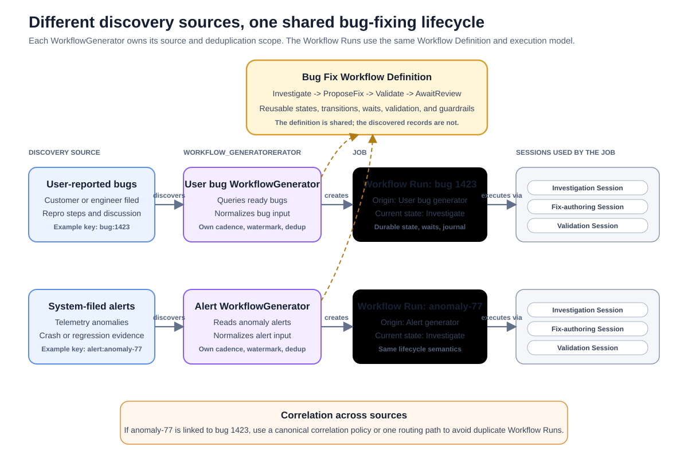

# Workflow Runs and Workflow Generators

> **Status:** Workflow Runs and Workflow Generators exist today. Creating a Workflow Run directly,
> without a Workflow Generator, is proposed and may not yet be available in every
> PilotSwarm client.

PilotSwarm provides three ways to run agent work:

| Start with | Use it when | Example |
|---|---|---|
| **Session** | You want one agent conversation or task. | Ask an agent to explain a bug report. |
| **Workflow Run** | You know the exact work item and want it to follow a durable, multi-step process. | Investigate and fix bug `1423`. |
| **Workflow Generator** | PilotSwarm should repeatedly discover work and create one Workflow Run for each item. | Find every bug ready for automated investigation. |

Use a Session when the conversation is the work. Use a Workflow Run when a durable
process is the work. Add a Workflow Generator when discovering the work should also
be automated.

## The concepts

| Concept | What it does | Bug-fixing example |
|---|---|---|
| **Workflow Generator** *(optional)* | Checks a source on a schedule and creates Workflow Runs for new items. | Find bugs tagged `AgentReady`. |
| **Workflow Definition** | Describes the reusable process a Workflow Run follows. | Investigate, propose a fix, validate it, and await review. |
| **Workflow Run** | Tracks one durable instance of that process for one input. | The bug-fixing Workflow Run for bug `1423`. |
| **Session** | Performs one agent conversation or execution within a Workflow Run. | The Session that investigates bug `1423`. |

A Workflow Run can use several Sessions as it moves through its lifecycle. Sessions may
finish or be replaced, but the Workflow Run retains the current state, waits, history,
and final outcome.

## Workflow Definition and state machine

These terms are related but not identical:

- A **state machine** is the graph of states and allowed transitions.
- A **Workflow Definition** contains that state machine plus the instructions
  for what the agent should accomplish in each state.
- **Workflow Definition** is the proposed new name for Workflow Definition,
  not another object.

For a bug-fixing agent, the Workflow Definition might describe:

```text
Investigate -> ProposeFix -> Validate -> AwaitReview -> Completed
```

It can also describe alternate outcomes, such as waiting for more details,
returning to investigation after failed validation, or ending without a fix.

## Create one Workflow Run directly

Suppose a developer is already looking at bug `1423`. They can select the Bug
Fix Workflow Definition and create one Workflow Run for that bug:

```text
Bug Fix Workflow Run: bug 1423
Current state: Investigate
Origin: Direct
```

The Workflow Run can wait for information, resume on another worker, retry a failed
step, and retain the results from earlier Sessions.

Direct Workflow Run creation is useful when the caller already knows the work. It does
not search for more bugs.

## Discover Workflow Runs with a Workflow Generator

Suppose a team wants PilotSwarm to find every bug ready for automated
investigation. The team registers a Workflow Generator that:

1. checks the bug tracker on a schedule;
2. identifies each bug by a stable key, such as its bug ID;
3. creates a Workflow Run when one does not already exist; and
4. applies the Bug Fix Workflow Definition to that Workflow Run.

If the source returns bugs `1423` and `1424`, and `1423` already has a Workflow Run, the
Workflow Generator creates only the Workflow Run for `1424`.

Repeating the check does not create another Workflow Run for the same source item.

## Multiple Workflow Generators can share one lifecycle

Different sources can produce Workflow Runs that follow the same lifecycle:

- A **user-reported bug Workflow Generator** discovers customer- or engineer-filed
  bugs that are ready for investigation.
- A **system-filed alert Workflow Generator** discovers alerts created from telemetry
  anomalies, crash signatures, or regression detection.

The inputs differ, but both can create Workflow Runs that follow the same Bug Fix
Workflow Definition:

```text
Investigate -> ProposeFix -> Validate -> AwaitReview
```

A user-reported bug may begin with repro steps and discussion. A system-filed
alert may begin with telemetry evidence and an anomaly signature. After that
initial context is normalized, both follow the same durable process.



If an alert is later linked to a user-reported bug, the application should
correlate them so it does not create two Workflow Runs for the same underlying issue.

## How Sessions fit inside a Workflow Run

A Workflow Run for bug `1423` might use:

| Session | Purpose |
|---|---|
| Investigation Session | Find and summarize the root cause. |
| Fix-authoring Session | Create a candidate change. |
| Validation Session | Run tests and record the result. |

The Sessions perform the work. The Workflow Run remains the durable record of where the
work is in the lifecycle.

## Common questions

### Is a Workflow Run just a long Session?

No. A Session is one conversation or execution. A Workflow Run owns a durable process
and may use many Sessions.

### Is a Workflow Generator required?

No. Create a Workflow Run directly when the input is already known. Use a Workflow Generator
when PilotSwarm must repeatedly discover work.

### Does a Workflow Generator execute the agent work?

No. It discovers items and creates Workflow Runs. Workers execute the Sessions used by
those Workflow Runs.

## TODO: proposed terminology rename

This guide uses the names implemented by PilotSwarm today. A proposed rename
would use:

| Current term | Proposed term |
|---|---|
| Workflow Generator | Workflow Generator |
| Workflow Definition | Workflow Definition |
| Workflow Run | Workflow Run |
| Session | Session |

The portal, APIs, SDKs, implementation names, and documentation should be
updated together after the compatibility and migration approach is defined.
